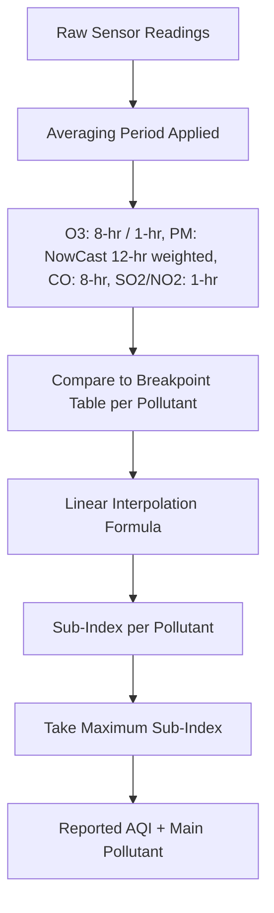

## Air Quality Indices and Standards

### Overview

Air quality indices translate concentrations of ambient pollutants into a standardized numerical or categorical scale that communicates health risk to the public. Air quality standards, by contrast, are legally binding regulatory limits on pollutant concentrations set by governments to protect public health and welfare. Indices are communication tools; standards are enforceable thresholds — but indices are typically constructed using standards as their reference breakpoints.

### Criteria Pollutants

Most national air quality frameworks are built around a core set of regulated pollutants, most directly modeled on the U.S. Clean Air Act's six "criteria pollutants":

| Pollutant | Symbol | Primary Sources | Primary Health Concern |
| --- | --- | --- | --- |
| Ground-level ozone | $O_3$ | Photochemical reaction of NOₓ + VOCs in sunlight | Respiratory irritation, reduced lung function |
| Particulate matter (fine) | $PM_{2.5}$ | Combustion, wildfire smoke, secondary aerosol formation | Cardiovascular/respiratory disease, deep lung penetration |
| Particulate matter (coarse) | $PM_{10}$ | Dust, construction, agriculture | Respiratory irritation |
| Carbon monoxide | $CO$ | Incomplete combustion (vehicles, heating) | Reduces blood oxygen-carrying capacity |
| Sulfur dioxide | $SO_2$ | Fossil fuel combustion (especially coal), industrial processes | Respiratory irritation, contributes to acid deposition |
| Nitrogen dioxide | $NO_2$ | Combustion (vehicles, power plants) | Respiratory irritation, ozone/PM precursor |
| Lead | $Pb$ | Industrial emissions, legacy sources | Neurological/developmental toxicity |

$PM_{2.5}$ refers to particles with aerodynamic diameter ≤ 2.5 micrometers; $PM_{10}$ refers to particles ≤ 10 micrometers. The subscript denotes the size cutoff, not concentration.

### U.S. Air Quality Index (AQI) Structure

The U.S. AQI, administered by the EPA, is a piecewise-linear scale from 0 to 500, divided into six categories:

| AQI Range | Category | Color | General Health Implication |
| --- | --- | --- | --- |
| 0–50 | Good | Green | Minimal risk |
| 51–100 | Moderate | Yellow | Acceptable; unusually sensitive individuals may experience minor effects |
| 101–150 | Unhealthy for Sensitive Groups | Orange | General public unlikely affected; sensitive groups may experience effects |
| 151–200 | Unhealthy | Red | Everyone may begin to experience effects; sensitive groups more seriously affected |
| 201–300 | Very Unhealthy | Purple | Health alert; increased risk for everyone |
| 301–500 | Hazardous | Maroon | Health emergency; entire population likely affected |

**AQI Calculation Formula**

For a given pollutant concentration $C_p$, the index value $I_p$ is computed by linear interpolation between the breakpoints bracketing that concentration:

$$I_p = \frac{I_{Hi} - I_{Lo}}{BP_{Hi} - BP_{Lo}} (C_p - BP_{Lo}) + I_{Lo}$$

where $BP_{Hi}$ and $BP_{Lo}$ are the concentration breakpoints just above and below $C_p$, and $I_{Hi}$, $I_{Lo}$ are the corresponding AQI values at those breakpoints. The reported overall AQI for a location is the maximum $I_p$ across all measured pollutants — this is termed the "responsible" or "main" pollutant.

**Current PM2.5 breakpoints (post-2024 revision)**

The EPA finalized a revision to the annual $PM_{2.5}$ NAAQS in February 2024, lowering the primary annual standard from 12.0 to 9.0 µg/m³, and correspondingly revised the AQI breakpoints for PM2.5:

| AQI Category | AQI Value | PM2.5 (24-hr, µg/m³) — current |
| --- | --- | --- |
| Good | 0–50 | 0.0–9.0 |
| Moderate | 51–100 | 9.1–35.4 |
| Unhealthy for Sensitive Groups | 101–150 | 35.5–55.4 |
| Unhealthy | 151–200 | 55.5–125.4 |
| Very Unhealthy | 201–300 | 125.5–225.4 |
| Hazardous | 301–500 | 225.5–500.4 |

The updated breakpoint between Good and Moderate was set to reflect the updated annual PM2.5 standard of 9 micrograms per cubic meter, while the Unhealthy for Sensitive Groups category breakpoints were unchanged because EPA retained the existing 24-hour fine PM standard. This 9.0 µg/m³ annual standard was upheld by the D.C. Circuit Court in June 2026, and the 8-hour ozone standard remains 0.070 ppm, unchanged since 2015. [pm naaqs air quality index fact sheet +3](https://www.epa.gov/system/files/documents/2024-02/pm-naaqs-air-quality-index-fact-sheet.pdf)

**PM2.5 NowCast Algorithm**

Because $PM_{2.5}$ and $PM_{10}$ AQI values are conventionally based on 24-hour averages, but real-time reporting requires more responsive data (especially during wildfire smoke events), EPA uses the NowCast algorithm — a weighted average of the most recent 12 hourly concentration readings, with weights determined by the rate of change in concentration (more weight to recent hours when air quality is changing rapidly). The PM NowCast method was updated by EPA for PM2.5 on August 1, 2013, and for PM10 on December 9, 2014, designed to be more responsive than the previous method in rapidly changing air quality conditions such as fire events. [Airnow](https://document.airnow.gov/technical-assistance-document-for-the-reporting-of-daily-air-quailty.pdf)

### Diagram: AQI Calculation Pipeline (svg_diagram)

### National Ambient Air Quality Standards (NAAQS) vs. AQI

**Key Points**

- NAAQS are the legal, enforceable concentration limits set under the Clean Air Act (40 CFR Part 50), applying to outdoor/ambient air only — the NAAQS apply only to ambient air, defined in the Clean Air Act as air external to buildings, and no federal standard sets enforceable limits for indoor air in a private home. [Filterbuy](https://filterbuy.com/resources/air-quality-aqi/epa-naaqs-air-quality-standards-explained/)
- NAAQS exist in two forms: **primary standards** (protecting public health, including sensitive populations) and **secondary standards** (protecting public welfare — visibility, crops, buildings, ecosystems).
- Each NAAQS pollutant has both a **level** (concentration limit) and a **form** (statistical basis — e.g., annual mean, 3-year average of 98th percentile of daily maximum), which together determine compliance.
- AQI breakpoints are *derived from* NAAQS levels but are a separate communication construct; a location can be in "attainment" of a NAAQS while still reporting Moderate or higher AQI values on individual days, since NAAQS attainment is generally based on multi-year statistical averages rather than single-day readings.
- Since the PM2.5 annual standard is based on a three-year average, a single day above 9.0 µg/m³ registers as a data point rather than a compliance violation. [Filterbuy](https://filterbuy.com/resources/air-quality-aqi/epa-naaqs-air-quality-standards-explained/)

### Attainment and Designation Process

**Example**

Following a NAAQS revision, EPA follows a defined regulatory sequence: state/tribal agencies submit initial area designation recommendations, EPA holds public comment and hearing processes, and EPA then issues final area designations classifying regions as attainment, nonattainment, or unclassifiable relative to the new standard. Areas designated nonattainment have a planning obligation to demonstrate attainment and meet the new standard within six years of the nonattainment designation, though the Clean Air Act includes a pathway for states to request additional time. [CA](https://ww2.arb.ca.gov/our-work/programs/state-and-federal-area-designations/federal-area-designations/pm2-5)[American Public Power Association](https://www.publicpower.org/periodical/article/epa-issues-final-rule-addressing-particulate-matter-national-ambient-air-quality-standards)

### International Air Quality Index Systems

Air quality indices are not globally standardized — each major framework uses its own pollutant set, averaging periods, and breakpoint scale, meaning numerically identical AQI values from different countries are **not directly comparable**.

| System | Region | Scale | Notes |
| --- | --- | --- | --- |
| U.S. AQI | United States | 0–500 | EPA; NowCast-based real-time reporting |
| CAQI (Common Air Quality Index) | Europe | 0–100+ (banded) | Developed for cross-city European comparison |
| CAI (Comprehensive/China AQI) | China | 0–500 | MEE; includes O3, PM2.5, PM10, SO2, NO2, CO |
| National AQI | India | 0–500 | CPCB; category-based sub-index maximum approach similar to U.S. |
| AQHI (Air Quality Health Index) | Canada | 1–10+ | Risk-based rather than concentration-based; derived from a health-risk regression model rather than pollutant breakpoints |

The **AQHI** approach differs structurally from breakpoint-based indices: rather than interpolating between fixed pollutant concentration thresholds, it is derived from an epidemiologically-fitted excess mortality risk function combining $O_3$, $PM_{2.5}$, and $NO_2$. [Inference — this structural distinction is well documented in comparative air-quality-index literature, though the specific regression coefficients are jurisdiction-maintained and not independently verified here]

### WHO Air Quality Guidelines

The World Health Organization publishes non-binding global guideline values (most recently substantially revised in 2021) that are generally more stringent than most national regulatory standards, including the current U.S. NAAQS. WHO guidelines function as a health-based reference point for national standard-setting rather than an enforceable limit themselves. [Unverified — current WHO guideline numeric values should be checked against the latest WHO Global Air Quality Guidelines document, as this response does not independently confirm 2026-current figures]

### Health Risk Communication Considerations

- **Sensitive groups** commonly referenced across index systems include children, older adults, individuals with asthma or cardiovascular/respiratory disease, and pregnant individuals.
- Behavior guidance is typically tied to category thresholds (e.g., "reduce prolonged outdoor exertion" at Unhealthy for Sensitive Groups), though exact recommended actions vary by issuing agency.
- Wildfire smoke events are a significant driver of index revisions and real-time algorithm design (e.g., NowCast), because smoke events produce rapid, large PM2.5 concentration swings that slower-averaging methods handle poorly.

### Related Topics

- Clean Air Act Regulatory Structure and State Implementation Plans (SIPs)
- Ground-Level Ozone Formation Chemistry (NOₓ–VOC–Sunlight Photochemistry)
- Particulate Matter Sources, Composition, and Health Pathways
- Wildfire Smoke and Real-Time Air Quality Monitoring
- WHO Global Air Quality Guidelines (2021 Revision)
- Environmental Justice and Air Quality Monitoring Network Design
- Indoor Air Quality Standards and Ventilation Guidelines