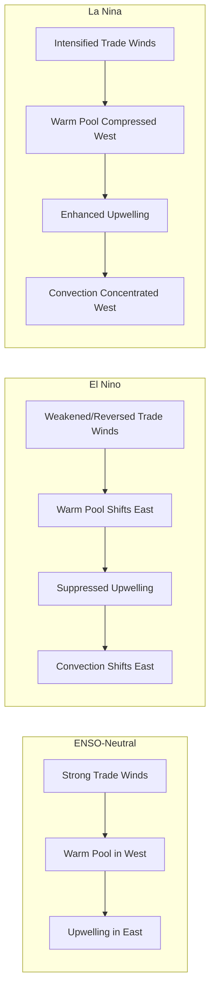

## El Niño, La Niña, and Climate Oscillations

### Overview

Climate oscillations are quasi-periodic, coupled ocean-atmosphere patterns that redistribute heat and moisture across the globe on interannual to multidecadal timescales. Unlike random weather variability, these oscillations exhibit recurring, physically coherent phases with predictable (though not perfectly regular) transitions. The most significant and best-studied of these is the El Niño-Southern Oscillation (ENSO), though several other major oscillations influence regional and global climate.

### El Niño-Southern Oscillation (ENSO)

ENSO is a coupled ocean-atmosphere phenomenon centered in the tropical Pacific, consisting of two linked components:

- **El Niño / La Niña** — the *oceanic* component: alternating warm (El Niño) and cool (La Niña) sea surface temperature (SST) anomalies in the east-central equatorial Pacific.
- **Southern Oscillation** — the *atmospheric* component: an alternating pattern of sea-level pressure between the eastern and western tropical Pacific (specifically, the pressure seesaw between Tahiti and Darwin, Australia).

These two components are mechanistically coupled via the Bjerknes feedback: warmer eastern Pacific SSTs weaken the east-west pressure gradient, which weakens the trade winds, which further reduces upwelling of cold water in the east, which further warms SSTs — a positive feedback loop that amplifies and sustains an event once triggered.

### Neutral (Baseline) State Mechanics

Under normal (ENSO-neutral) conditions, easterly trade winds push warm surface water westward, causing it to pile up near Indonesia (the "warm pool") while cold, nutrient-rich water upwells along the South American coast (driven by Ekman transport and the resulting thermocline tilt). This creates:

- A steep east-west sea surface temperature gradient (warm west, cool east)
- Rising air and convection over the western Pacific warm pool
- Sinking air over the cooler eastern Pacific
- The Walker Circulation — a zonal (east-west) atmospheric overturning loop connecting these regions

### El Niño Phase

During El Niño, trade winds weaken (sometimes reverse), allowing the warm pool to migrate eastward and suppressing coastal upwelling off South America. Consequences include:

- Eastward shift of the Walker Circulation's convective (rising-air) branch, moving heavy rainfall from the western Pacific/Indonesia toward the central/eastern Pacific
- Warmer-than-average SSTs across the central and eastern equatorial Pacific
- Suppressed upwelling, reducing marine productivity off Peru/Ecuador (the phenomenon's namesake — "El Niño," referring to the Christ child, was coined by Peruvian fishermen who noticed warm-water intrusions typically arriving around Christmas)
- Global teleconnections: wetter conditions in the southern U.S. and parts of South America; drought risk in Indonesia, Australia, and parts of southern Africa; typically weaker Atlantic hurricane activity due to increased vertical wind shear

### La Niña Phase

La Niña is the opposite phase: an intensification of normal conditions rather than a reversal.

- Stronger-than-normal trade winds
- Enhanced upwelling and cooler-than-average eastern Pacific SSTs
- Intensified Walker Circulation, with convection concentrated further west
- Global teleconnections largely opposite to El Niño: drought risk in the southern U.S.; wetter conditions in Indonesia/Australia; typically more active Atlantic hurricane seasons due to reduced wind shear

### Diagram: ENSO Phase Comparison (svg_diagram)

### Measurement: The Oceanic Niño Index (ONI)

ENSO phase is officially tracked using the Oceanic Niño Index (ONI), a 3-month running mean of sea surface temperature anomalies in the Niño 3.4 region (5°N–5°S, 170°W–120°W), relative to a rolling 30-year climatological baseline.

**Official classification thresholds:**

- **El Niño**: ONI ≥ +0.5°C for at least 5 consecutive overlapping 3-month periods
- **La Niña**: ONI ≤ −0.5°C for at least 5 consecutive overlapping 3-month periods
- **ENSO-neutral**: ONI between −0.5°C and +0.5°C
- **"Super" El Niño**: peak ONI reaching approximately +2.0°C

Related indices used alongside ONI include the Southern Oscillation Index (SOI, based on the Tahiti-Darwin pressure difference), subsurface heat content (depth of the 20°C isotherm across the equatorial Pacific), and outgoing longwave radiation (OLR) anomalies, which track convective activity.

**Current Conditions (as of this writing)**

As of the August 2026 CPC ENSO Diagnostic Discussion, the ENSO Alert System Status was El Niño Advisory, with El Niño strengthening and a greater than 90% chance of a very strong ("Super") event during the Northern Hemisphere fall and winter of 2026–27. This event is developing on top of an elevated global warming baseline (~1.3°C), which some analyses note may alter how the event interacts with land temperatures and extreme precipitation statistics. [Unverified — ENSO status is updated monthly by CPC/NOAA and should be reconfirmed against the latest discussion for any time-sensitive application, since conditions and forecasts change on a monthly cadence.]

### Other Major Climate Oscillations

**Pacific Decadal Oscillation (PDO)**

A longer-period (multidecadal, roughly 20–30 year phases) pattern of North Pacific SST variability, sometimes described as "ENSO-like" in its spatial pattern but operating on a much longer timescale. PDO phase modulates the strength and frequency of ENSO teleconnection impacts, particularly over North America.

**Atlantic Multidecadal Oscillation (AMO)**

A multidecadal (~60–80 year) pattern of North Atlantic SST variability, associated with variations in Atlantic hurricane activity, Sahel drought/rainfall patterns, and North American summer climate.

**North Atlantic Oscillation (NAO)**

A shorter-timescale (weeks to seasons, though with persistent phases) atmospheric pressure oscillation between the Icelandic Low and the Azores High, strongly influencing winter weather patterns across Europe and eastern North America. Positive NAO phase is associated with a stronger, more northward-displaced jet stream (milder, wetter northern Europe); negative NAO phase with a weaker, more variable jet stream (increased cold-air outbreak risk in Europe/eastern North America).

**Indian Ocean Dipole (IOD)**

An east-west SST gradient across the tropical Indian Ocean, analogous in structure to ENSO but operating independently (though it can interact with and be modulated by ENSO phase). Positive IOD phase is associated with increased rainfall in East Africa and drought risk in Indonesia/Australia.

**Madden-Julian Oscillation (MJO)**

Distinct from the above in that it operates on a much shorter (30–60 day) intraseasonal timescale rather than interannual/multidecadal. The MJO is an eastward-propagating pulse of enhanced and suppressed tropical convection that circles the globe, modulating monsoon onset timing, tropical cyclone genesis likelihood, and can interact constructively or destructively with ENSO-driven convective patterns.

### Comparative Timescale Summary

| Oscillation | Typical Period | Primary Region | Timescale Class |
| --- | --- | --- | --- |
| MJO | 30–60 days | Tropics (global propagation) | Intraseasonal |
| ENSO | 2–7 years (irregular) | Tropical Pacific | Interannual |
| IOD | ~1 year (event-based) | Tropical Indian Ocean | Interannual |
| NAO | Variable, persistent phases | North Atlantic/Europe | Seasonal–interannual |
| PDO | ~20–30 year phases | North Pacific | Decadal |
| AMO | ~60–80 year phases | North Atlantic | Multidecadal |

### Applied Example: Teleconnection Reasoning

**Example**

Given: strong El Niño conditions with ONI near +2.0°C forecast to peak in Northern Hemisphere winter.//

Expected teleconnection reasoning: eastward-shifted Walker Circulation convection → wetter-than-average conditions likely across the southern tier of the United States → drought risk elevated over Indonesia and northern Australia → increased vertical wind shear over the tropical Atlantic → below-average Atlantic hurricane season activity more likely. These are probabilistic historical composite relationships, not deterministic outcomes for any single season. [Inference — this reasoning chain reflects well-established ENSO teleconnection composites, but any individual season's actual outcome depends on many interacting factors beyond ENSO phase alone]

### Key Points

- ENSO is a *coupled* ocean-atmosphere system; the oceanic (El Niño/La Niña) and atmospheric (Southern Oscillation) components are mechanistically linked via the Bjerknes feedback, not independently occurring phenomena.
- ENSO phase is classified using a statistical threshold (ONI ≥/≤ 0.5°C for 5 consecutive overlapping seasons), not a single-month reading — this prevents transient anomalies from being misclassified as full events.
- Different oscillations operate on very different characteristic timescales (intraseasonal to multidecadal) and can constructively or destructively interact, complicating seasonal forecasting.
- Teleconnection impacts are regional and probabilistic composites derived from historical events, not guaranteed outcomes for any specific year.

### Related Topics

- Walker Circulation and Zonal Atmospheric Overturning
- Bjerknes Feedback and Ocean-Atmosphere Coupling Theory
- Tropical Cyclone Genesis and Vertical Wind Shear
- Monsoon Systems and Interannual Variability
- Paleoclimate Reconstruction of Historical ENSO Events
- Seasonal Climate Forecasting Methods (CPC, IRI, ECMWF Ensemble Systems)
- Climate Change Interaction with ENSO Frequency/Intensity (Open Research Question)