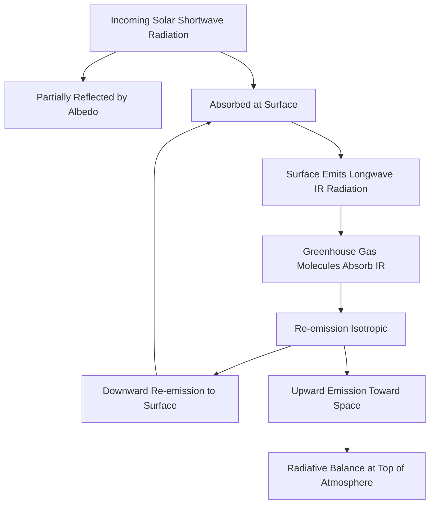
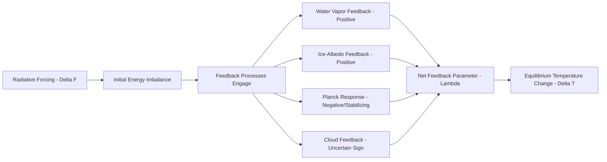

## The Greenhouse Effect and Radiative Forcing

### Overview

The greenhouse effect is the process by which certain atmospheric gases absorb and re-emit infrared radiation, warming a planet's surface above the temperature it would have from solar heating alone. Radiative forcing is the quantitative framework used to measure how much a given change (in gas concentration, aerosol loading, solar output, etc.) perturbs Earth's energy balance, expressed in watts per square meter (W/m²).

### Radiative Energy Balance Fundamentals

Earth's surface temperature is fundamentally governed by the balance between incoming shortwave solar radiation and outgoing longwave (infrared) radiation. In a simple energy-balance model with no atmosphere:

$$T_e = \left[\frac{S_0(1-\alpha)}{4\sigma}\right]^{1/4}$$

where $T_e$ is the effective radiating temperature, $S_0$ is the solar constant (~1361 W/m²), $\alpha$ is Earth's albedo (~0.30), and $\sigma$ is the Stefan-Boltzmann constant ($5.67 \times 10^{-8}$ W/m²K⁴). This calculation yields an effective temperature of approximately −18°C — well below Earth's actual observed global mean surface temperature of roughly +15°C. The ~33°C discrepancy between this simple calculation and observed temperature is attributed to the natural greenhouse effect. [Inference — the 33°C figure is a commonly cited standard result derived directly from the equation above using standard textbook parameter values; exact figures vary slightly depending on the albedo and solar constant values used]

### Mechanism: Why Greenhouse Gases Absorb Infrared

Greenhouse gases (GHGs) are asymmetric or polyatomic molecules whose vibrational and rotational modes have energy transitions matching the infrared portion of the electromagnetic spectrum. Symmetric diatomic molecules (N₂, O₂ — which together make up ~99% of the atmosphere) have no net dipole moment change during vibration and are therefore essentially transparent to infrared radiation, which is why they contribute negligibly to the greenhouse effect despite their abundance.

**Sequence:**

1. Solar shortwave radiation passes largely unimpeded through the atmosphere and is absorbed at Earth's surface.
2. The surface re-radiates energy as longwave (infrared) radiation, per the Stefan-Boltzmann law ($E = \sigma T^4$).
3. Greenhouse gas molecules in the atmosphere absorb specific infrared wavelengths corresponding to their vibrational-rotational transition energies.
4. Absorbed energy is re-emitted isotropically (in all directions) — meaning roughly half is redirected back toward the surface rather than escaping to space.
5. This downward re-emission adds to the surface energy budget, raising equilibrium surface temperature above what solar heating alone would produce.

### Diagram: Greenhouse Effect Energy Flow (svg_diagram)

### Major Greenhouse Gases and Absorption Bands

| Gas | Approx. Atmospheric Concentration (2026) | Key Absorption Bands | Primary Source |
| --- | --- | --- | --- |
| Water vapor ($H_2O$) | Variable (0–4%) | Broad, multiple bands | Evaporation; strongest natural GHG by mass effect |
| Carbon dioxide ($CO_2$) | ~420–430 ppm | 15 µm band (strong) | Fossil fuel combustion, deforestation, cement production |
| Methane ($CH_4$) | ~1.9 ppm | 7.7 µm band | Agriculture, livestock, natural gas systems, wetlands |
| Nitrous oxide ($N_2O$) | ~0.335 ppm | 7.8, 8.6, 17 µm bands | Agricultural soil management, industrial processes |
| Ozone ($O_3$) | Trace, stratified | 9.6 µm band | Photochemical formation (stratospheric and tropospheric) |
| CFCs/HFCs | Trace (ppt-ppb) | Various, strong per-molecule | Industrial refrigerants, historically aerosol propellants |

Exact current concentrations should be checked against NOAA/Mauna Loa Observatory or Global Carbon Project data for the most current reading, as $CO_2$ concentration rises measurably year-over-year. [Unverified — precise 2026 concentration figures were not independently confirmed via search for this response and should be validated against current monitoring data]

**Water vapor feedback** is distinct from the other listed gases in that it is primarily a *feedback* rather than a *forcing* — its atmospheric concentration is governed by temperature (via the Clausius-Clapeyron relation) rather than being an independent driver, meaning it amplifies warming initiated by other forcings rather than initiating warming itself.

### Radiative Forcing: Definition and Formalism

Radiative forcing (RF) is defined as the change in net (downward minus upward) radiative flux at the top of the atmosphere (or tropopause), measured in W/m², resulting from an imposed change to the climate system, calculated with surface and tropospheric temperatures held fixed (allowing stratospheric temperatures to adjust) — a convention chosen to isolate the direct radiative perturbation from subsequent climate feedback responses.

**Simplified CO₂ radiative forcing formula** (commonly used approximation, valid for the range of concentrations relevant to industrial-era changes):

$$\Delta F = \alpha \ln\left(\frac{C}{C_0}\right)$$

where $\Delta F$ is the radiative forcing (W/m²), $C$ is the new $CO_2$ concentration, $C_0$ is the reference (baseline) concentration, and $\alpha$ is an empirically derived constant (commonly cited value ≈ 5.35). This logarithmic relationship reflects $CO_2$'s absorption band saturation behavior — as concentration increases, the marginal radiative effect of additional $CO_2$ diminishes, though it does not approach zero because absorption band *wings* continue to widen with added concentration. [Inference — the logarithmic form and saturation-with-wing-broadening explanation are standard results in atmospheric radiative transfer theory; the exact coefficient value is a widely cited approximation from Myhre et al. and comparable studies rather than an exact physical constant]

### Distinguishing Forcing, Feedback, and Climate Sensitivity

**Key Points**

- **Radiative forcing** is the *initial* perturbation to the energy balance (e.g., from added $CO_2$), calculated before the climate system has time to respond and re-equilibrate.
- **Climate feedbacks** are subsequent responses that amplify (positive feedback) or dampen (negative feedback) the initial forcing — examples include water vapor feedback (positive), ice-albedo feedback (positive), and Planck/blackbody response (negative — a warmer surface radiates more energy, which is the fundamental stabilizing feedback in any energy-balance system).
- **Equilibrium Climate Sensitivity (ECS)** is the eventual global mean surface temperature change resulting from a sustained doubling of atmospheric $CO_2$, after the full climate system (including slow feedbacks) reaches a new equilibrium — this combines the direct forcing with all feedback effects.
- **Transient Climate Response (TCR)** is a related but distinct metric — the temperature change at the time of $CO_2$ doubling under a scenario of gradual (1%/year) concentration increase, capturing the climate system's response before full equilibration, and is generally smaller than ECS due to ocean thermal inertia.

### Forcing Comparison Across Agents

Radiative forcing values allow direct comparison of the relative influence of different climate drivers, both anthropogenic and natural:

| Forcing Agent | Typical Sign | Relative Magnitude Context |
| --- | --- | --- |
| $CO_2$ (industrial era cumulative) | Positive (warming) | Largest single anthropogenic forcing term |
| $CH_4$ | Positive (warming) | Smaller total concentration but much higher per-molecule radiative efficiency than $CO_2$ |
| Tropospheric aerosols (sulfates, etc.) | Negative (cooling) | Partially offsets GHG warming; large uncertainty range |
| Land-use albedo change | Typically negative (cooling), regionally variable | Smaller magnitude, spatially heterogeneous |
| Solar irradiance variation | Small, cyclical | Minor compared to industrial-era GHG forcing |
| Stratospheric volcanic aerosols | Negative (cooling), transient | Large but short-lived (1–3 years) |

Aerosol forcing carries substantially larger scientific uncertainty than well-mixed greenhouse gas forcing, because aerosol effects depend on complex factors including particle composition, atmospheric residence time (days to weeks, versus years to centuries for $CO_2$), and interactions with cloud formation (indirect aerosol effects). [Inference — this relative-uncertainty characterization is a standard finding repeated across IPCC assessment reports, though exact uncertainty bounds are periodically revised between assessment cycles]

### Diagram: Forcing-to-Temperature-Response Pathway (svg_diagram)

The equilibrium temperature response relates to forcing and the net feedback parameter via:

$$\Delta T = \frac{\Delta F}{\lambda}$$

where $\lambda$ is the net climate feedback parameter (W/m²/K), incorporating the Planck response and all feedback contributions; a smaller $\lambda$ (weaker net stabilizing feedback) corresponds to higher climate sensitivity for a given forcing.

### Applied Example: Doubling CO₂

**Example**

Given: pre-industrial baseline $C_0$ = 280 ppm, doubled concentration $C$ = 560 ppm, using $\alpha \approx 5.35$.//

$$\Delta F = 5.35 \times \ln\left(\frac{560}{280}\right) = 5.35 \times \ln(2) \approx 5.35 \times 0.693 \approx 3.7 \text{ W/m}^2$$

This ≈3.7 W/m² figure is the commonly cited direct radiative forcing from CO₂ doubling alone, before feedbacks are applied — it is *not* the same as ECS, which incorporates feedback amplification and is typically estimated in the range of roughly 2.5–4°C per doubling in recent assessment literature, reflecting substantial remaining scientific uncertainty in cloud feedback processes. [Unverified — the specific ECS range should be checked against the most current IPCC assessment report, as this figure is periodically revised as feedback process understanding improves]

### Related Topics

- Carbon Cycle and Anthropogenic Emission Sources/Sinks
- Cloud Feedback Mechanisms and Remaining Scientific Uncertainty
- Global Warming Potential (GWP) and Cross-Gas Comparison Metrics
- Paleoclimate Proxy Evidence for Past CO₂-Temperature Relationships
- IPCC Assessment Report Structure and Confidence Language
- Ocean Heat Uptake and Thermal Inertia in Climate Response
- Mitigation Pathways and Emission Scenario Modeling (RCP/SSP Frameworks)