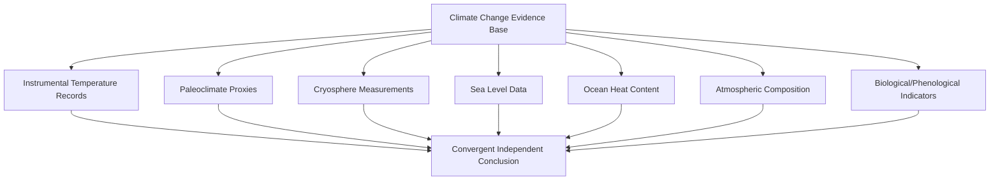

## Evidence and Indicators of Climate Change

### Overview

Climate change evidence draws on multiple independent lines of observation — instrumental temperature records, paleoclimate proxies, cryosphere measurements, sea level data, ocean heat content, atmospheric composition monitoring, and biological/phenological indicators. The strength of the overall scientific conclusion rests on the *convergence* of these independent datasets, collected using different methods by different institutions, rather than on any single measurement series.

### Instrumental Temperature Record

Direct thermometer-based global surface temperature records extend back to approximately 1880, maintained independently by multiple institutions: NASA GISTEMP, NOAA GlobalTemp, the UK's HadCRUT5 (Met Office Hadley Centre/University of East Anglia), Berkeley Earth, and the EU's Copernicus/ECMWF ERA5 reanalysis. These independent series, using different methodologies and station networks, show close agreement in their long-term trends.

**Current record status**: Earth's global surface temperature in 2024 was the warmest on record since recordkeeping began in 1880, at approximately 1.28°C above the 1951–1980 baseline (NASA GISS), or about 1.47°C above the 1850–1900 pre-industrial baseline. 2025 was slightly cooler than 2024, at approximately 1.19°C above the 1951–1980 baseline — the two years are considered effectively tied within measurement uncertainty, and both rank among the warmest years on record, continuing a pattern in which the ten most recent years are the warmest in the instrumental record. With a strong El Niño developing through 2026, current tracking places 2026 on pace for one of the warmest years on record, though final annual figures are confirmed only after year-end compilation by the relevant agencies. [Unverified — 2026 is not yet complete at the time of this writing; the final annual ranking should be confirmed against year-end NASA/NOAA/Copernicus releases rather than mid-year tracking data]

**Methodological note**: Temperature analyses account for changing station distribution over time and correct for urban heat island effects that could otherwise skew long-term trend calculations — a standard homogenization step applied across major surface temperature datasets. [Inference — this describes a standard, well-documented methodological practice used across major temperature-record institutions]

### Diagram: Independent Lines of Climate Evidence (svg_diagram)

### Paleoclimate Proxy Evidence

Since direct instrumental records only extend to ~1880, longer-term climate reconstruction relies on indirect proxy indicators:

- **Ice cores** (Antarctica, Greenland) — trapped air bubbles preserve direct historical atmospheric $CO_2$ and $CH_4$ concentrations; oxygen isotope ratios ($\delta^{18}O$) in the ice itself serve as a temperature proxy. Antarctic ice cores extend the direct greenhouse gas record back roughly 800,000 years.
- **Tree rings (dendroclimatology)** — ring width and density correlate with temperature and precipitation conditions during growth, providing annual-resolution records extending centuries to millennia depending on species and location.
- **Ocean and lake sediment cores** — foraminifera shell isotope ratios and sediment composition provide proxies for sea surface temperature and broader paleoclimate conditions over much longer (glacial-interglacial) timescales.
- **Coral records** — banding patterns analogous to tree rings, useful for tropical sea surface temperature reconstruction.
- **Speleothems (cave formations)** — isotopic composition of stalagmites/stalactites provides regional precipitation and temperature proxies.

The consistent finding across these independent proxy methods is that current atmospheric $CO_2$ concentrations (>420 ppm) substantially exceed the range observed in the ice-core record over at least the past 800,000 years, during which concentrations fluctuated within a roughly 180–300 ppm glacial-interglacial range. [Inference — this comparison is a standard, frequently cited result from ice-core CO2 reconstruction studies; exact bounds vary slightly by specific ice-core dataset]

### Cryosphere Indicators

| Indicator | Observed Trend | Measurement Method |
| --- | --- | --- |
| Arctic sea ice extent | Declining, particularly in September (summer minimum) | Satellite passive microwave imagery (continuous record since 1979) |
| Antarctic ice sheet mass | Net mass loss in recent decades, with regional variability | GRACE/GRACE-FO satellite gravimetry |
| Greenland ice sheet mass | Net mass loss, accelerating since the 1990s–2000s | GRACE/GRACE-FO gravimetry, altimetry |
| Mountain glaciers (global) | Widespread retreat across nearly all monitored regions | Ground-based mass balance surveys, satellite altimetry |
| Permafrost | Warming and thawing in many monitored regions | Borehole temperature monitoring networks |
| Snow cover extent | Declining Northern Hemisphere spring snow cover | Satellite and ground station observation |

The 1979-onward satellite record for Arctic sea ice is particularly significant because it provides a continuous, methodologically consistent dataset uninterrupted by the instrumentation changes that complicate earlier or ground-based-only records.

### Sea Level Rise

Global mean sea level rise results from two primary physical mechanisms:

1. **Thermal expansion** — seawater expands as it warms (a direct consequence of water's thermal expansion coefficient), contributing to sea level rise independent of any ice melt.
2. **Land ice mass addition** — meltwater runoff from glaciers and ice sheets adds new water mass to the ocean system (distinct from the melting of already-floating sea ice, which does not itself raise sea level due to Archimedes' principle).

Measurement combines tide gauge records (long historical baseline, but geographically sparse and subject to local land subsidence/uplift effects) with satellite altimetry (near-global coverage since the early 1990s, e.g., TOPEX/Poseidon and successor missions), which together show an accelerating rate of global mean sea level rise compared to the earlier 20th century. [Inference — the acceleration finding is a well-established result in the sea-level literature; the exact acceleration rate is periodically revised as the satellite record lengthens]

### Ocean Heat Content

Since the ocean has absorbed the substantial majority of excess heat trapped by the enhanced greenhouse effect (rather than the atmosphere, due to water's much higher heat capacity), ocean heat content (OHC) is considered by many climate scientists to be one of the most robust indicators of overall Earth energy imbalance, because it is less subject to the year-to-year variability that affects atmospheric surface temperature records (e.g., ENSO-driven fluctuations). OHC is measured primarily via the global Argo float network — an array of autonomous profiling floats that has provided consistent global ocean temperature/salinity depth-profile coverage since the mid-2000s. [Inference — the relative-robustness characterization reflects a widely stated view in oceanographic and climate literature regarding OHC as an integrator of Earth's energy imbalance]

### Diagram: Earth's Energy Imbalance Partitioning (svg_diagram)

<svg xmlns="http://www.w3.org/2000/svg" viewBox="0 0 640 220">
<text x="20" y="24" font-size="14" font-weight="bold" fill="#222">Approximate Distribution of Excess Heat Uptake (svg_diagram)</text>
<rect x="20" y="50" width="500" height="30" fill="#2980b9" />
<text x="30" y="70" font-size="12" fill="#fff">Ocean (majority share) — dominant heat sink</text>
<rect x="20" y="90" width="90" height="30" fill="#7f8c8d" />
<text x="25" y="110" font-size="11" fill="#fff">Land/Ice</text>
<rect x="120" y="90" width="60" height="30" fill="#e67e22" />
<text x="122" y="110" font-size="11" fill="#fff">Atmos.</text>
<text x="20" y="150" font-size="11" fill="#555">Relative proportions are approximate and vary slightly across studies;</text>
<text x="20" y="166" font-size="11" fill="#555">the ocean component is consistently reported as the dominant reservoir.</text>
</svg>

### Atmospheric Composition Monitoring

Direct, continuous atmospheric $CO_2$ measurement began at the Mauna Loa Observatory (Hawaii) in 1958 under Charles David Keeling, producing the "Keeling Curve" — the longest continuous direct atmospheric $CO_2$ record. This record shows both the long-term upward trend and a superimposed seasonal oscillation driven by Northern Hemisphere vegetation's growing-season $CO_2$ drawdown (since the Northern Hemisphere contains substantially more land area and vegetation than the Southern Hemisphere). Multiple additional global monitoring stations (operated by NOAA and international partners) now complement the Mauna Loa record.

### Biological and Phenological Indicators

- **Species range shifts** — poleward and upslope migration of species' geographic ranges, consistent with tracking of shifting temperature zones
- **Phenological timing shifts** — earlier spring events (flowering, leaf-out, migration arrival, breeding timing) observed across many monitored species and regions
- **Coral bleaching frequency** — increased frequency and geographic extent of mass bleaching events, associated with sustained ocean heat stress exceeding coral thermal tolerance thresholds
- **Growing season length** — measurable lengthening in many mid-to-high latitude regions, corroborated by both direct observation and satellite vegetation greenness indices

### Attribution Science

**Key Points**

- Evidence of *warming* (observational fact) is distinct from *attribution* (the science of determining warming's cause) — attribution science uses climate models run with and without anthropogenic forcings to statistically evaluate which combination of natural and human factors best explains observed patterns.
- Attribution studies commonly separate forcing categories into natural (solar variability, volcanic aerosols, internal variability such as ENSO) and anthropogenic (greenhouse gases, aerosols, land-use change) to isolate each component's contribution to observed trends.
- A key attribution technique involves comparing model simulations forced only by natural factors against simulations including anthropogenic forcings, then assessing which better reproduces the observed instrumental temperature record.
- Modern "extreme event attribution" is a related, increasingly used sub-field that estimates how climate change altered the probability or intensity of specific individual extreme weather events, rather than only long-term trends. [Inference — this describes a well-established and rapidly growing methodological area in climate science, though specific event-attribution study conclusions require case-by-case review of the underlying study]

### Applied Example: Cross-Referencing Independent Indicators

**Example**

A student is asked to evaluate whether observed 21st-century warming is consistent across independent evidence streams.//

Cross-check approach: compare the instrumental surface temperature trend (rising) against Arctic sea ice extent trend (declining), global mean sea level trend (rising), ocean heat content trend (rising), atmospheric $CO_2$ concentration trend (rising, tracked directly since 1958), and glacier mass balance trend (net loss globally). Because these are collected via entirely independent measurement systems (thermometers, satellite radar/microwave imagery, tide gauges/altimetry, Argo floats, and gas chromatography, respectively) yet show mutually consistent, physically coherent trends, the convergence itself constitutes stronger evidence than any single dataset could provide in isolation. [Inference — this "convergent independent lines of evidence" reasoning is a standard epistemic argument used throughout climate science communication, though it is a methodological/logical point rather than a specific measured value]

### Related Topics

- Attribution Science and Extreme Event Analysis Methods
- Ice Core Chronology and Paleoclimate Proxy Calibration
- Argo Float Network and Ocean Observing Systems
- Satellite Climate Monitoring Missions (GRACE, altimetry, passive microwave)
- Sea Level Rise Projections and Coastal Vulnerability Assessment
- Climate Model Validation Against Observational Records
- IPCC Assessment Report Confidence and Likelihood Language