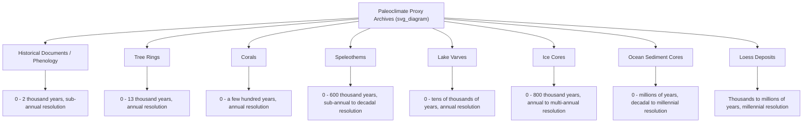

## Paleoclimatology and Historical Climate Records

### Definition and Scope

Paleoclimatology is the scientific study of climate conditions and climatic variation over Earth's history, extending beyond the instrumental record (roughly the last 150–170 years) into geological, biological, and chemical archives that span thousands to billions of years. Because direct thermometer and precipitation records are too short to capture the full range of natural climate variability, paleoclimatology reconstructs past temperature, precipitation, atmospheric composition, ice volume, and ocean circulation using **proxy data** — physical, chemical, or biological materials that respond measurably and predictably to climatic conditions.

The discipline underpins modern climate science by providing:

- A baseline of natural climate variability against which recent (anthropogenic) change can be compared
- Empirical tests of climate model sensitivity (how much warming results from a given radiative forcing)
- Evidence for the timing, rate, and drivers of past abrupt climate transitions
- Long records of atmospheric greenhouse gas concentrations, sea level, and ice sheet extent

### Core Concept: Proxy Data

A **climate proxy** is a preserved physical characteristic that substitutes for direct meteorological measurement. Proxies work because organisms, minerals, and sediments incorporate signals from their environment at the time of formation, and that signal survives (with some alteration) in a datable archive.

Key requirements for a useful proxy:

1. **Preservation** — the material must survive geologically without complete degradation
2. **Dateable context** — the archive must permit chronological placement (see Dating Methods below)
3. **Calibrated relationship** — the proxy signal must have a known, quantifiable, and ideally linear relationship to a climate variable, established via modern analog studies
4. **Resolution** — the archive should record climate signals at a temporal resolution appropriate to the question (annual, decadal, centennial, millennial)

Proxies are generally destructive to sample and interpretation is probabilistic rather than exact, so paleoclimatologists report reconstructions with uncertainty envelopes rather than single precise values.

### Major Proxy Archives

#### Ice Cores

Ice cores extracted from polar ice sheets (Antarctica, Greenland) and high-altitude glaciers are among the highest-resolution and most information-dense paleoclimate archives.

**What they record:**

- **Oxygen and hydrogen isotope ratios** ($\delta^{18}O$ and $\delta D$) in the ice itself, which serve as a temperature proxy. Because $^{16}O$-bearing water evaporates and precipitates more readily than heavier $^{18}O$-bearing water, the isotopic composition of snowfall varies systematically with condensation temperature.
- **Trapped air bubbles**, which contain literal samples of ancient atmosphere, allowing direct measurement of past $CO_2$, $CH_4$, and $N_2O$ concentrations rather than inference.
- **Dust and aerosol content**, indicating atmospheric circulation intensity, aridity, and volcanic activity (via sulfate spikes).
- **Annual layering** (visible in accumulation-rich sites), enabling direct year-by-year counting analogous to tree rings.

**Notable records:**

- The Vostok and EPICA Dome C cores from Antarctica extend the continuous greenhouse gas and temperature record back roughly 800,000 years, capturing eight full glacial-interglacial cycles.
- Greenland cores (GISP2, NGRIP) provide higher-resolution but shorter records (~123,000 years), valuable for documenting abrupt events like Dansgaard-Oeschger cycles.

**[Inference]** Deep ice near the bed of an ice sheet can experience flow-induced deformation that compresses or disturbs the age-depth relationship, so the oldest sections of very deep cores carry greater dating uncertainty than shallower sections.

#### Ocean and Lake Sediment Cores

Sediments accumulate continuously on ocean and lake floors, preserving a layered chronological record.

**What they record:**

- **Foraminifera shell chemistry** — the ratio of $^{18}O$ to $^{16}O$ in calcite shells of benthic and planktonic foraminifera reflects a combination of ocean temperature and global ice volume (since ice sheets preferentially lock up $^{16}O$). This is the primary tool for reconstructing the marine oxygen isotope stratigraphy that defines glacial-interglacial stages over the last several million years.
- **Magnesium/calcium (Mg/Ca) ratios** in foraminifera shells, used as an independent sea-surface temperature proxy that helps separate the temperature and ice-volume components of the oxygen isotope signal.
- **Alkenone unsaturation ($U^{K'}_{37}$ index)**, derived from lipids produced by certain marine algae (coccolithophores), correlates with sea-surface temperature.
- **Pollen assemblages** in lake sediments reflect regional vegetation composition, which shifts in response to temperature and precipitation, allowing terrestrial climate reconstruction.
- **Varves** — annually laminated sediment layers in glacial lakes, providing exact annual chronologies where preserved undisturbed.

#### Tree Rings (Dendrochronology)

Trees in temperature- or moisture-limited environments produce annual growth rings whose width, density, and isotopic composition vary with climate conditions during the growing season.

**Key metrics:**

- **Ring width** correlates with growing-season temperature or precipitation depending on species and site limitation.
- **Maximum latewood density** is often a stronger temperature signal than ring width, particularly at high-latitude and high-altitude tree line sites.
- **Cross-dating** — matching characteristic ring-width patterns across overlapping living and dead wood samples — allows construction of continuous chronologies extending thousands of years beyond the age of any single tree (e.g., bristlecone pine and oak chronologies extending over 8,000–13,000 years in some regions).

Tree ring records provide exact, annually resolved dating and are central to calibrating radiocarbon dating (see below), but are geographically limited to regions with living or preserved wood and are most sensitive near a species' ecological limiting factor.

#### Corals

Reef-building corals secrete calcium carbonate skeletons with density banding and trace element chemistry that vary seasonally, functioning similarly to tree rings in tropical and subtropical oceans.

**What they record:**

- $Sr/Ca$ ratios correlate inversely with sea-surface temperature.
- $\delta^{18}O$ in coral skeletons reflects a combination of temperature and seawater salinity/isotopic composition.
- Annual density bands allow precise dating, and living coral records can extend several centuries, useful for capturing ENSO (El Niño–Southern Oscillation) variability before instrumental records began.

#### Speleothems (Cave Formations)

Stalagmites and stalactites grow incrementally from mineral-laden dripwater, and their $\delta^{18}O$ and $\delta^{13}C$ composition reflects a combination of temperature, source-water isotopic composition, and regional precipitation patterns (particularly monsoon intensity in Asian and South American records).

**Advantage:** Speleothems can be dated with high precision using uranium-thorium ($^{230}Th/^{234}U$) radiometric methods, often achieving better absolute chronological accuracy than many other archives over the last several hundred thousand years.

#### Other Archives

- **Boreholes** — subsurface temperature-depth profiles record the diffusion of past surface temperature changes into rock and ice, useful for the last several centuries.
- **Historical documents and phenology** — ship logs, harvest records, flowering dates, and river freeze/thaw records provide qualitative to semi-quantitative climate information over the last 1,000–2,000 years in regions with written records.
- **Loess deposits** — wind-blown dust sequences record aridity and atmospheric circulation over glacial-interglacial timescales.

### Dating Methods

Accurate chronology is as critical as the proxy signal itself, since a climate signal is scientifically meaningless without a reliable age.

| Method | Applicable Range | Basis |
| --- | --- | --- |
| Annual layer counting (ice, varves, tree rings, corals) | 0–~50,000 years (ice); millions of years (trees, cumulative via cross-dating) | Direct counting of seasonal/annual depositional cycles |
| Radiocarbon ($^{14}C$) dating | 0–~50,000 years | Radioactive decay of $^{14}C$ (half-life ~5,730 years) in organic material |
| Uranium-series dating | 0–~600,000 years | Decay of $^{234}U$ to $^{230}Th$ in carbonates (speleothems, corals) |
| Argon-argon ($^{40}Ar/^{39}Ar$) dating | Thousands to billions of years | Decay of $^{40}K$ to $^{40}Ar$, used on volcanic ash layers (tephra) that bracket sediment sequences |
| Orbital tuning | Thousands to millions of years | Matching cyclic proxy signals to astronomically calculated orbital cycles (Milankovitch cycles) |
| Paleomagnetic reversal stratigraphy | Thousands to millions of years | Matching sediment magnetic polarity to the known geomagnetic reversal timescale |

Radiocarbon dates require calibration to true calendar years because atmospheric $^{14}C$ production has varied over time due to solar activity and geomagnetic field changes; calibration curves (e.g., IntCal) are built substantially from tree-ring and other independently dated records.

**[Inference]** Combining multiple independent dating methods on the same archive (multi-proxy chronological cross-validation) generally increases confidence in the resulting age model, though it does not eliminate systematic biases specific to a given method.

### Key Findings from the Paleoclimate Record

#### Milankovitch Cycles and Glacial-Interglacial Oscillations

Variations in Earth's orbital geometry — **eccentricity** (~100,000-year cycle), **axial tilt/obliquity** (~41,000-year cycle), and **precession** (~23,000-year cycle) — alter the latitudinal and seasonal distribution of incoming solar radiation without significantly changing the annual global total. Ice core and marine sediment records demonstrate that these orbital cycles pace the timing of glacial-interglacial transitions over at least the last 800,000 years, though the resulting climate response is strongly amplified by feedbacks including ice-albedo changes, carbon cycle shifts, and ocean circulation reorganization.

#### CO2-Temperature Relationship

Ice core records show that atmospheric $CO_2$ and Antarctic temperature have varied in close, tightly coupled fashion through glacial cycles, with $CO_2$ ranging between roughly 180 ppm (glacial maxima) and 280 ppm (interglacial periods) prior to the industrial era. Current atmospheric $CO_2$ (over 420 ppm as of the mid-2020s) substantially exceeds the entire range observed in the 800,000-year ice core record, and the rate of increase over the past century is understood to be faster than reconstructed rates during past natural transitions, including deglaciations.

**[Inference]** The precise lag relationship between $CO_2$ and temperature at glacial terminations (small lags of centuries have been reported in some studies) reflects the fact that orbital forcing initially triggers warming through other mechanisms, after which $CO_2$ release acts as an amplifying feedback rather than the sole initial driver; the exact magnitude of this lag remains an area of active refinement given dating uncertainties in ice cores.

#### Abrupt Climate Change Events

Paleoclimate records document climate shifts of large magnitude occurring over remarkably short intervals (decades), demonstrating that the climate system contains nonlinear thresholds:

- **Younger Dryas** (~12,900–11,700 years ago): An abrupt return to near-glacial conditions in the North Atlantic region during an otherwise warming deglaciation, generally attributed to disruption of Atlantic meridional overturning circulation.
- **Dansgaard-Oeschger events**: Repeated abrupt warmings (several degrees within decades) recorded in Greenland ice cores during the last glacial period, linked to reorganizations of ocean circulation and sea ice extent.
- **Heinrich events**: Episodic large-scale iceberg discharges from the Laurentide ice sheet, identifiable as distinct layers of ice-rafted debris in North Atlantic sediment cores.

#### Past Warm Periods as Analogs

- **Paleocene-Eocene Thermal Maximum (PETM, ~56 million years ago)**: A geologically rapid (by pre-industrial standards) release of carbon into the atmosphere-ocean system, associated with global warming of roughly 5–8°C and ocean acidification, studied as a partial analog for understanding carbon-cycle and ecosystem responses to rapid warming, despite occurring over millennia rather than centuries.
- **Last Interglacial (Eemian, ~125,000 years ago)**: Global temperatures modestly warmer than pre-industrial, associated with higher sea levels, used to constrain estimates of long-term ice sheet sensitivity to warming.
- **Mid-Pliocene Warm Period (~3.3–3.0 million years ago)**: The most recent interval with $CO_2$ levels comparable to today, used as a structural analog for longer-term equilibrium climate response, though continental configuration and biological systems differed from the present.

### Multi-Proxy Reconstruction and Uncertainty

Because no single proxy perfectly isolates one climate variable, robust paleoclimate reconstructions combine multiple independent proxy types from multiple geographic locations. This multi-proxy approach:

- Cross-validates signals, distinguishing a true climate signal from a local or proxy-specific artifact
- Enables statistical reconstruction of large-scale patterns (e.g., hemispheric or global mean temperature) from networks of individual site records
- Requires careful statistical treatment, since proxy networks are unevenly distributed in space and time and each proxy has its own noise characteristics and dating uncertainty

**[Unverified]** The relative skill of specific multi-proxy statistical reconstruction methods (e.g., different regression or composite-plus-scale approaches) in accurately capturing pre-instrumental variance is a subject of ongoing methodological debate within the field, and results can be sensitive to the specific proxy network and method chosen.

### Diagram: Proxy Archive Timescales and Resolution

### Illustration: Ice Core Signal Pathway

<svg xmlns="http://www.w3.org/2000/svg" viewBox="0 0 800 320">
<title>Ice Core Proxy Signal Pathway (svg_diagram)</title>
<rect x="0" y="0" width="800" height="320" fill="#f5f7f5" />
<text x="400" y="28" font-size="18" text-anchor="middle" font-family="sans-serif" fill="#222">Ice Core Proxy Signal Pathway (svg_diagram)</text>
<rect x="20" y="70" width="150" height="70" rx="8" fill="#cfe8ff" stroke="#3a6ea5" />
<text x="95" y="100" font-size="13" text-anchor="middle" font-family="sans-serif">Snowfall</text>
<text x="95" y="118" font-size="11" text-anchor="middle" font-family="sans-serif">δ18O set by condensation temp</text>
<rect x="220" y="70" width="150" height="70" rx="8" fill="#cfe8ff" stroke="#3a6ea5" />
<text x="295" y="100" font-size="13" text-anchor="middle" font-family="sans-serif">Firn Compaction</text>
<text x="295" y="118" font-size="11" text-anchor="middle" font-family="sans-serif">Air trapped as bubbles</text>
<rect x="420" y="70" width="150" height="70" rx="8" fill="#cfe8ff" stroke="#3a6ea5" />
<text x="495" y="100" font-size="13" text-anchor="middle" font-family="sans-serif">Solid Ice Layer</text>
<text x="495" y="118" font-size="11" text-anchor="middle" font-family="sans-serif">Annual layering preserved</text>
<rect x="620" y="70" width="150" height="70" rx="8" fill="#cfe8ff" stroke="#3a6ea5" />
<text x="695" y="100" font-size="13" text-anchor="middle" font-family="sans-serif">Core Extraction</text>
<text x="695" y="118" font-size="11" text-anchor="middle" font-family="sans-serif">Drilling and sampling</text>
<line x1="170" y1="105" x2="220" y2="105" stroke="#555" stroke-width="2" marker-end="url(#arrow)" />
<line x1="370" y1="105" x2="420" y2="105" stroke="#555" stroke-width="2" marker-end="url(#arrow)" />
<line x1="570" y1="105" x2="620" y2="105" stroke="#555" stroke-width="2" marker-end="url(#arrow)" />
<rect x="120" y="200" width="200" height="80" rx="8" fill="#ffe8cf" stroke="#a5703a" />
<text x="220" y="228" font-size="13" text-anchor="middle" font-family="sans-serif">Isotope Analysis</text>
<text x="220" y="246" font-size="11" text-anchor="middle" font-family="sans-serif">δ18O / δD → temperature</text>
<text x="220" y="262" font-size="11" text-anchor="middle" font-family="sans-serif">proxy reconstruction</text>
<rect x="480" y="200" width="200" height="80" rx="8" fill="#ffe8cf" stroke="#a5703a" />
<text x="580" y="228" font-size="13" text-anchor="middle" font-family="sans-serif">Gas Analysis</text>
<text x="580" y="246" font-size="11" text-anchor="middle" font-family="sans-serif">CO2 / CH4 / N2O directly</text>
<text x="580" y="262" font-size="11" text-anchor="middle" font-family="sans-serif">measured from bubbles</text>
<line x1="695" y1="140" x2="580" y2="200" stroke="#555" stroke-width="2" marker-end="url(#arrow)" />
<line x1="695" y1="140" x2="220" y2="200" stroke="#555" stroke-width="2" marker-end="url(#arrow)" />
</svg>

### Applications in Modern Climate Science

- **Model validation**: Climate models (GCMs/ESMs) are tested against paleoclimate reconstructions of past warm and cold periods (paleoclimate model intercomparison, e.g., PMIP) to evaluate whether they correctly reproduce known climate states, providing an independent check beyond present-day calibration.
- **Climate sensitivity estimation**: Combining paleo-temperature and paleo-$CO_2$ records helps constrain equilibrium climate sensitivity (the warming expected from a doubling of atmospheric $CO_2$) using an empirical, geological line of evidence distinct from model-based estimates.
- **Sea-level and ice-sheet stability studies**: Past interglacial sea-level highstands, reconstructed from coral terraces and sediment records, inform projections of ice sheet vulnerability under sustained warming.
- **Extending baseline variability**: Tree-ring, ice-core, and other high-resolution records extend the record of natural variability (e.g., drought, ENSO behavior) far beyond the instrumental era, improving the statistical context for judging whether recent extremes are unusual.

**Key Points**

- Paleoclimatology reconstructs pre-instrumental climate using proxy archives: ice cores, sediment cores, tree rings, corals, speleothems, and others.
- Ice cores uniquely provide direct samples of ancient atmosphere, not just an indirect proxy signal.
- Multiple independent dating methods (layer counting, radiocarbon, uranium-series, orbital tuning, paleomagnetism) are combined to build chronologies.
- Milankovitch orbital cycles pace glacial-interglacial transitions, amplified by feedbacks including greenhouse gas and ice-albedo changes.
- Current atmospheric $CO_2$ concentrations and rate of increase exceed the range documented in the 800,000-year ice core record.
- Multi-proxy synthesis is standard practice to cross-validate signals and quantify uncertainty; single-proxy findings are treated cautiously.

**Related Topics**

- Milankovitch Cycles and Orbital Forcing
- The Carbon Cycle and Geological Carbon Reservoirs
- Ocean-Atmosphere Circulation and Thermohaline Circulation
- Radiometric Dating Techniques in Earth Science
- Climate Model Structure and Validation (GCMs/ESMs)
- Sea-Level Change and Ice Sheet Dynamics
- The Paleocene-Eocene Thermal Maximum as a Deep-Time Analog
- Instrumental Climate Record and Its Limitations
- Statistical Methods in Paleoclimate Reconstruction