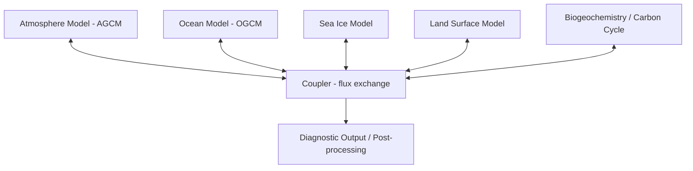
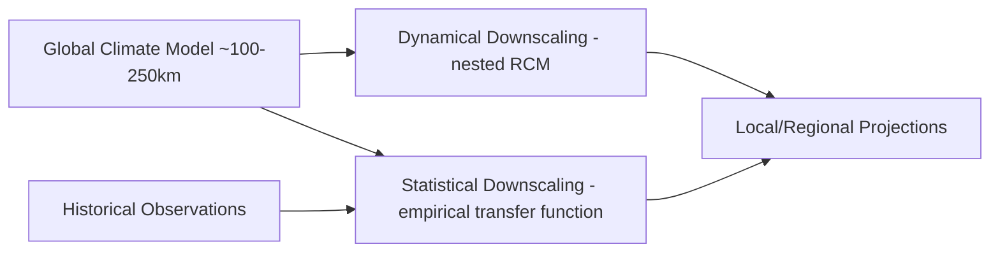

## Climate Models and Future Projections

### Overview

Climate models are numerical representations of the Earth system built from physical laws governing the atmosphere, ocean, land surface, and ice. They translate conservation of mass, energy, and momentum into discretized equations solved on a computational grid, allowing scientists to simulate past climate for validation and project future states under different assumptions about greenhouse gas emissions, land use, and other forcings. Unlike weather models, which predict the specific state of the atmosphere over hours to days, climate models predict statistical properties of the system (means, variability, extremes) over decades to centuries.

### Foundational Physics

**Radiative Transfer**

The core driver of climate is the balance between incoming shortwave solar radiation and outgoing longwave terrestrial radiation. At equilibrium:

$$S(1-\alpha)/4 = \sigma T^4$$

where $S$ is the solar constant, $\alpha$ is planetary albedo, $\sigma$ is the Stefan-Boltzmann constant, and $T$ is the effective emission temperature. Greenhouse gases absorb and re-emit longwave radiation, reducing the efficiency of heat loss to space and raising surface temperature above this simple blackbody estimate. Radiative transfer schemes in models solve the equation of radiative transfer through atmospheric layers, accounting for absorption, scattering, and emission by gases (CO₂, CH₄, N₂O, H₂O vapor, O₃) and aerosols.

**Navier-Stokes Equations and Primitive Equations**

Atmospheric and oceanic circulation are governed by the Navier-Stokes equations, simplified into the "primitive equations" for large-scale flow by applying the hydrostatic approximation (vertical acceleration is negligible compared to gravity) and treating the atmosphere as a thin shell relative to Earth's radius. These equations conserve momentum, mass (continuity), thermodynamic energy, and moisture:

$$\frac{\partial \mathbf{v}}{\partial t} + \mathbf{v}\cdot\nabla\mathbf{v} = -\frac{1}{\rho}\nabla p - 2\boldsymbol{\Omega}\times\mathbf{v} + \mathbf{g} + \mathbf{F}$$

where $\mathbf{v}$ is velocity, $\rho$ density, $p$ pressure, $\boldsymbol{\Omega}$ Earth's rotation vector (producing the Coriolis term), and $\mathbf{F}$ frictional/turbulent forces.

**Conservation Laws**

Every model component enforces conservation of energy, mass, and (for ocean/atmosphere motion) angular momentum across grid cells and time steps, with fluxes exchanged at component boundaries (air-sea, air-land, sea-ice interfaces).

### Model Hierarchy

Climate models exist on a spectrum of complexity, each suited to different questions.

**Energy Balance Models (EBMs)**

The simplest class, treating Earth (or latitude bands) as a system with heat capacity, exchanging energy with space via the equation above. Zero-dimensional EBMs estimate global mean temperature response to forcing; one-dimensional EBMs add latitude-dependent albedo and transport. Useful for conceptual understanding and rapid sensitivity testing, not spatial detail.

**Radiative-Convective Models (RCMs)**

Add a vertical dimension, resolving how radiative heating and convective mixing establish the atmospheric temperature profile (lapse rate). These models were historically important for establishing the theoretical basis of the greenhouse effect and climate sensitivity.

**Earth System Models of Intermediate Complexity (EMICs)**

Simplify spatial resolution or process detail (e.g., statistical-dynamical atmospheres) to allow very long integrations (millennia) or large ensembles, useful for paleoclimate studies and exploring long-term carbon cycle feedbacks.

**General Circulation Models (GCMs) / Global Climate Models**

Full three-dimensional models solving the primitive equations on a global grid for both atmosphere (AGCM) and ocean (OGCM). Coupled AOGCMs exchange heat, moisture, and momentum at the air-sea interface.

**Earth System Models (ESMs)**

The most comprehensive class, extending AOGCMs with interactive biogeochemical cycles: the carbon cycle (vegetation carbon uptake, soil respiration, ocean carbon chemistry), nitrogen cycle, dynamic vegetation, atmospheric chemistry, and interactive ice sheets. ESMs allow feedbacks between climate and biogeochemistry to be simulated prognostically rather than prescribed, which is essential for translating emissions scenarios into atmospheric concentrations.

```mermaid
flowchart LR
    A[Energy Balance Models] --> B[Radiative-Convective Models]
    B --> C[EMICs]
    C --> D[GCMs / AOGCMs]
    D --> E[Earth System Models]
    subgraph Complexity Increasing
    A
    B
    C
    D
    E
    end
```

### Model Architecture and Components

**Grid and Discretization**

The Earth system is divided into a 3D grid: horizontal resolution typically ranges from 100 km to 250 km per cell in CMIP-class models (finer in high-resolution or regional models), with tens of vertical atmospheric layers and dozens of ocean depth layers. Two main discretization approaches are used:

- **Spectral methods**: represent fields as sums of spherical harmonic basis functions, historically common in atmospheric dynamical cores (e.g., older ECHAM, CAM versions), efficient for global smooth fields but prone to Gibbs artifacts near sharp gradients.
- **Grid-point / finite-volume methods**: discretize physical space directly on latitude-longitude or cubed-sphere grids, now dominant (e.g., CAM-FV, GFDL FV3, ICON's icosahedral grid) because they conserve mass locally and scale better on massively parallel hardware.

**Coupled Component Structure**

A modern ESM is built from separate component models exchanging data through a coupler:

The coupler (e.g., CPL7/MOM in CESM, OASIS in EC-Earth) regrids fluxes between component grids of different resolutions, conserving energy and mass across the interpolation.

**Parameterization**

Many physical processes occur at scales smaller than the model grid (cloud formation, turbulence, convection, precipitation microphysics) and cannot be explicitly resolved. These are represented through parameterizations: simplified statistical or empirical relationships that estimate the sub-grid-scale effect on grid-mean quantities. Key parameterized processes include:

- **Cumulus convection**: schemes (e.g., mass-flux schemes) estimate vertical heat/moisture transport by unresolved convective cells.
- **Cloud microphysics**: governs cloud droplet formation, precipitation efficiency, and cloud radiative properties.
- **Boundary layer turbulence**: mixing of heat, moisture, and momentum near the surface.
- **Land surface processes**: soil moisture, evapotranspiration, snow cover, vegetation dynamics.

Parameterization is widely regarded as the largest source of inter-model spread, because different plausible formulations of the same unresolved process produce measurably different climate sensitivity. [Inference: the relative ranking of parameterization uncertainty versus scenario uncertainty shifts with projection timescale, and exact attribution varies by study.]

### Key Points

- Climate models are built from first-principles physics (radiative transfer, fluid dynamics, thermodynamics) rather than purely statistical fits.
- The model hierarchy trades spatial/process detail against computational cost and interpretability.
- Coupling and parameterization are where the largest structural uncertainties enter.
- Resolution constraints mean small-scale processes (clouds, turbulence) must be approximated, not resolved.

### Climate Sensitivity

**Equilibrium Climate Sensitivity (ECS)**

Defined as the equilibrium global mean surface warming resulting from a doubling of atmospheric CO₂ concentration, after the full climate system (including slow ocean feedbacks) reaches a new steady state. The IPCC AR6 assessed likely ECS range as 2.5–4°C, with a best estimate near 3°C, narrowed relative to earlier assessments through better constraint from paleoclimate data, process understanding, and emergent constraints from model ensembles.

**Transient Climate Response (TCR)**

The warming observed at the moment CO₂ concentration doubles under a scenario of gradual 1%/year increase, before the full equilibrium response is realized. TCR is typically lower than ECS (roughly 1.4–2.2°C, AR6 assessment) because ocean heat uptake delays full equilibration; TCR is often considered more policy-relevant since it better reflects near-term, transient warming under realistic emission trajectories.

**Feedback Mechanisms**

$$\lambda = \lambda_{Planck} + \lambda_{WV} + \lambda_{LR} + \lambda_{albedo} + \lambda_{cloud}$$

where $\lambda$ terms represent individual feedback contributions to the total climate feedback parameter:

- **Planck feedback**: the baseline stabilizing feedback from increased blackbody emission with warming (negative/stabilizing).
- **Water vapor feedback**: warmer air holds more water vapor (via Clausius-Clapeyron scaling), amplifying greenhouse trapping (positive/amplifying).
- **Lapse rate feedback**: changes in the vertical temperature profile, generally negative in the tropics due to moist adiabatic adjustment.
- **Surface albedo feedback**: loss of snow and sea ice reduces reflectivity, increasing absorbed solar radiation (positive), most pronounced in polar regions.
- **Cloud feedback**: changes in cloud fraction, altitude, and optical properties; the largest source of inter-model spread in ECS, since cloud response to warming is not fully resolved and depends heavily on parameterization choices.

### Emissions Scenarios and Forcing Pathways

**Representative Concentration Pathways (RCPs)**

Used in CMIP5, RCPs are defined by their approximate 2100 radiative forcing level in W/m²: RCP2.6 (strong mitigation), RCP4.5 and RCP6.0 (intermediate), and RCP8.5 (high-emissions, often mislabeled as "business as usual" though it represents a high-end, less likely trajectory under current policy trends).

**Shared Socioeconomic Pathways (SSPs)**

Used in CMIP6, SSPs combine socioeconomic narratives (population, economic growth, technology, land use) with radiative forcing targets, denoted as SSP[narrative]-[forcing], e.g.:

- **SSP1-2.6**: sustainability-focused development, low forcing, consistent with limiting warming well below 2°C.
- **SSP2-4.5**: "middle of the road" socioeconomic development, moderate forcing.
- **SSP3-7.0**: regional rivalry, high forcing, weak climate policy.
- **SSP5-8.5**: fossil-fueled development, very high forcing, now considered a low-likelihood but high-impact tail scenario rather than a central estimate.

SSPs allow separating the socioeconomic assumption from the forcing outcome, so the same forcing level can arise from different development narratives, and vice versa. [Unverified: precise likelihood weightings assigned to each SSP vary by assessment and are subject to ongoing debate in the scenario literature.]

### CMIP: Coordinated Model Intercomparison

The Coupled Model Intercomparison Project (CMIP) coordinates a standardized set of experiments run by modeling centers worldwide, enabling apples-to-apples comparison of model output. CMIP6 (the phase underlying IPCC AR6) introduced ScenarioMIP (SSP-based future projections), DAMIP (detection and attribution), and dozens of other Model Intercomparison Projects (MIPs) targeting specific processes (e.g., CFMIP for clouds, OMIP for ocean physics). CMIP7 is in preparation as of the current model generation, with updated forcing datasets and scenario designs. [Unverified: exact CMIP7 timeline and final experimental design were still being finalized as of the most recent published protocols, and details may have changed since.]

Model output from CMIP is archived in a standardized format (typically NetCDF with CF-compliant metadata) and distributed through the Earth System Grid Federation (ESGF), allowing researchers to access multi-model ensembles for impact studies, downscaling, and attribution research.

### Downscaling

Global model resolution (~100-250 km) is too coarse for local/regional impact assessment (e.g., a single grid cell may span an entire mountain range or coastline). Downscaling bridges this gap:

- **Dynamical downscaling**: nests a higher-resolution regional climate model (RCM) within the coarse GCM, using the GCM output as boundary conditions. Computationally expensive but physically consistent, capable of resolving local terrain and mesoscale processes. The CORDEX framework coordinates regional downscaling efforts globally.
- **Statistical downscaling**: derives empirical relationships between large-scale model variables and local observed climate (e.g., regression, weather typing, or machine-learning-based methods), then applies these relationships to future GCM output. Computationally cheap and can correct systematic model bias, but assumes historical statistical relationships remain valid under future forcing — an assumption that may break down under novel climate states. [Inference: the stationarity assumption is a well-known limitation discussed extensively in the downscaling literature, though its practical impact varies by region and variable.]

### Validation and Uncertainty Quantification

**Hindcasting and Historical Simulation**

Models are validated by running historical simulations (prescribing observed forcings from a reference period, typically 1850-present) and comparing simulated climate statistics (temperature trends, precipitation patterns, circulation indices) against observational and reanalysis datasets. Skill at reproducing observed historical trends builds confidence in a model's process representation, though good historical performance does not guarantee accurate future projection if compensating errors are present. [Inference: the extent to which historical skill predicts future projection accuracy is an active research question without full consensus.]

**Perturbed Physics and Multi-Model Ensembles**

Two main approaches quantify structural and parametric uncertainty:

- **Multi-model ensembles**: running the same scenario across many independently developed models (as in CMIP), capturing structural uncertainty from different modeling choices, dynamical cores, and parameterization schemes.
- **Perturbed physics ensembles**: running many simulations of a single model with systematically varied parameter values within physically plausible ranges, capturing parametric uncertainty within one model's structure.
- **Initial condition ensembles**: running the same model and scenario multiple times with minutely perturbed initial conditions, isolating internal (chaotic) climate variability from the forced signal.

**Emergent Constraints**

A technique that uses an observable quantity correlated with a model's projected sensitivity across the multi-model ensemble to statistically narrow the projected range using real-world observations, an approach used to help narrow the AR6 ECS assessment. [Unverified: the robustness of specific emergent constraint relationships is debated in the literature, and some proposed constraints have not held up under later scrutiny.]

### Sources of Projection Uncertainty

$$\text{Total Uncertainty} = \text{Scenario Uncertainty} + \text{Model/Structural Uncertainty} + \text{Internal Variability}$$

- **Scenario uncertainty**: dominates at longer timescales (end of century), driven by unknown future emissions/policy choices.
- **Model uncertainty**: dominates at medium timescales (mid-century), driven by differences in physical representation across models.
- **Internal variability**: dominates at short timescales (next 1-2 decades), driven by chaotic, unforced fluctuations (e.g., ENSO, decadal ocean oscillations) that are irreducible regardless of model or scenario accuracy.

This partitioning (widely attributed to the framework popularized by Hawkins and Sutton) explains why near-term regional projections are often less certain in relative terms than long-term global mean projections, since internal variability is proportionally larger at short lead times and small spatial scales.

### Example: Interpreting a Projection Statement

A typical IPCC-style projection statement: "Under SSP2-4.5, global mean surface temperature is likely to reach 2.1–3.5°C above pre-industrial levels by 2100." Deconstructing this:

- **"SSP2-4.5"**: specifies the socioeconomic/forcing assumption — this projection is conditional, not unconditional.
- **"likely"**: IPCC calibrated uncertainty language, meaning 66-100% probability.
- **"2.1–3.5°C"**: the likely range reflects combined model and internal variability uncertainty at this timescale (scenario uncertainty is already fixed by specifying SSP2-4.5).
- **"above pre-industrial levels"**: baseline period matters significantly for absolute values; always check the reference period when comparing figures across reports.

### Computational Considerations

Running a modern ESM at CMIP6-class resolution for a century-long simulation requires large high-performance computing (HPC) allocations, often weeks of wall-clock time on thousands of CPU cores, because the primitive equations must be integrated at time steps of minutes to maintain numerical stability (constrained by the Courant-Friedrichs-Lewy condition relating grid spacing, wave speed, and time step). This computational cost is the primary reason global model resolution has increased only gradually across model generations, and why regional dynamical downscaling remains necessary for local-scale impact studies rather than simply running global models at kilometer-scale resolution everywhere. High-resolution "storm-resolving" or "global cloud-resolving" models (kilometer-scale grid spacing) are an active research frontier, aiming to replace convective parameterization with explicitly resolved convection, but remain computationally prohibitive for multi-century, multi-scenario ensemble production as of current-generation HPC capacity. [Unverified: computational feasibility timelines for routine kilometer-scale ESM ensembles depend on future HPC and algorithmic developments not yet realized.]

### Next Steps

- Radiative forcing and the carbon cycle (sources, sinks, and feedback processes)
- IPCC assessment report structure and calibrated uncertainty language
- Detection and attribution methodology (distinguishing forced trends from natural variability)
- Paleoclimate proxies and their role in constraining climate sensitivity
- Regional climate change impacts and vulnerability assessment
- Sea level rise projections and ice sheet dynamics modeling
- Tipping points and non-linear climate system behavior
- Climate model bias correction techniques for impact assessment