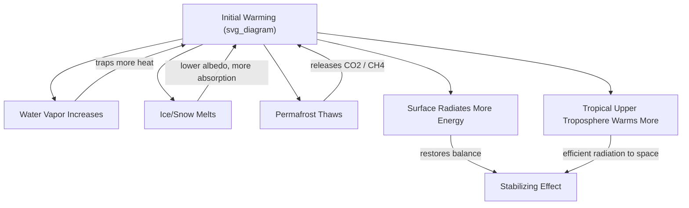

## Climate Feedback Loops and Tipping Points

### Definition and Scope

A **climate feedback loop** is a process within the climate system in which an initial change (a **forcing** or perturbation) triggers a secondary effect that either amplifies (**positive feedback**) or dampens (**negative feedback**) the original change. A **climate tipping point** is a critical threshold beyond which a small additional forcing pushes a component of the climate system into a qualitatively different state, often abruptly and, in some cases, irreversibly on human timescales. These two concepts are closely linked: strong positive feedbacks operating within a system component are frequently the mechanism that produces tipping behavior once a critical threshold is crossed.

Understanding feedbacks and tipping points is central to climate science because they determine the overall sensitivity of the climate system to a given forcing (see Climate Sensitivity) and because they represent the primary source of high-consequence, low-probability risk in future climate projections.

### Feedback Loop Terminology and Sign Convention

- **Positive feedback**: Amplifies the initial perturbation. If warming triggers a process that causes further warming, the feedback is positive, regardless of whether the outcome is judged "good" or "bad."
- **Negative feedback**: Counteracts or dampens the initial perturbation, tending to stabilize the system.
- **Feedback strength/parameter ($\lambda$)**: Quantifies the change in radiative flux (in $W/m^2$) per degree of temperature change resulting from a given feedback mechanism. The sum of all feedback parameters plus the baseline Planck response determines net climate sensitivity.

The overall climate system contains a mix of positive and negative feedbacks; the net effect of the well-established feedbacks combined with the always-present, stabilizing **Planck response** (the tendency of a warmer surface to radiate more energy to space, per the Stefan-Boltzmann relationship) determines whether the system amplifies or damps a given radiative forcing.

$$\Delta T = \frac{\Delta F}{-\lambda_{Planck} - \sum \lambda_{feedbacks}}$$

where $\Delta F$ is radiative forcing and $\lambda_{Planck}$ is negative (stabilizing) by convention.

### Major Positive Feedback Mechanisms

#### Water Vapor Feedback

Warmer air holds more water vapor at saturation (following the Clausius-Clapeyron relationship), and water vapor is itself a potent greenhouse gas. Initial warming from any forcing increases atmospheric water vapor content, which traps additional outgoing longwave radiation, amplifying the initial warming. This is assessed as the single largest positive feedback in the climate system and is well constrained by both theory and observation.

#### Ice-Albedo Feedback

Snow and ice have high **albedo** (reflectivity), reflecting a large fraction of incoming solar radiation back to space. As warming melts snow and sea ice, the darker underlying ocean or land surface is exposed, absorbing more solar radiation and driving further warming and further melt. This feedback is a major contributor to **Arctic amplification** — the observed phenomenon of the Arctic warming at a faster rate than the global average.

#### Cloud Feedback

Changes in cloud cover, altitude, and phase (liquid vs. ice) in response to warming alter both the reflection of incoming shortwave radiation and the trapping of outgoing longwave radiation. The IPCC AR6 assesses net cloud feedback as **likely positive**, driven substantially by a reduction in low-cloud cover in subtropical regions under warming, though the magnitude remains the largest single source of inter-model uncertainty in climate sensitivity estimates.

#### Permafrost Carbon Feedback

Thawing permafrost exposes previously frozen organic carbon to microbial decomposition, releasing $CO_2$ and $CH_4$ (methane) to the atmosphere, which drives further warming and further permafrost thaw. **[Inference]** Because permafrost carbon stocks are large relative to the current atmospheric carbon budget, this feedback is considered by much of the research community to represent a globally significant amplifying mechanism over multi-decadal to centennial timescales, though the precise magnitude and timing of carbon release remain an active area of quantification given uncertainty in thaw rates and the balance between aerobic (CO2-producing) and anaerobic (CH4-producing) decomposition pathways.

#### Methane Hydrate and Wetland Feedbacks

Warming can potentially destabilize methane hydrates (methane trapped in ice-like structures in ocean sediments and permafrost) and increase methane emissions from expanding or warming wetlands, both contributing additional positive feedback, though the hydrate feedback is generally assessed as a lower-probability, longer-timescale risk relative to permafrost carbon release.

### Major Negative Feedback Mechanisms

#### Planck Response (Blackbody Radiation Feedback)

As a surface warms, it emits more outgoing longwave radiation, following the Stefan-Boltzmann law ($E = \sigma T^4$), which acts to restore radiative balance and stabilize temperature. This is the fundamental, always-present stabilizing feedback without which the climate system would be radiatively unstable to any forcing.

#### Lapse Rate Feedback

In the tropics, warming is amplified more in the upper troposphere than at the surface (due to moist convective processes), and because the upper troposphere then radiates more efficiently to space, this creates a stabilizing (negative) feedback in tropical regions. In polar regions, the lapse rate feedback can instead be positive due to a stable, shallow boundary layer that traps warming near the surface, contributing to the polar amplification pattern alongside ice-albedo effects.

#### Carbon Cycle Sink Feedbacks (Partial Buffering)

Ocean and terrestrial ecosystems currently absorb roughly half of anthropogenic $CO_2$ emissions, acting as a partial negative feedback on atmospheric $CO_2$ accumulation. **[Inference]** However, this buffering capacity is understood to weaken under continued warming, since higher ocean temperatures reduce $CO_2$ solubility and terrestrial sinks can saturate or reverse under heat and drought stress, meaning this negative feedback is not expected to remain constant in strength as warming progresses.

### Diagram: Feedback Loop Classification

### Concept of Tipping Points

A tipping point marks a threshold in a system's forcing-response relationship beyond which the system transitions to a different stable state, often through **self-reinforcing (positive) feedback** internal to that subsystem. Key characteristics distinguishing tipping behavior from smooth, gradual change:

- **Nonlinearity**: A disproportionately large response results from a comparatively small additional forcing once the threshold is approached
- **Hysteresis**: The system may not return to its original state even if the forcing is subsequently reduced back below the original threshold — a different (typically higher) reverse threshold is required to "tip back"
- **Abruptness (in some cases)**: Transition can occur over years to decades once triggered, rather than centuries, even though the approach to the threshold may take much longer
- **Potential irreversibility**: On human-relevant timescales, some tipping elements may not recover even under successful long-term climate stabilization

**[Inference]** Not all "tipping points" identified in the literature necessarily share all four characteristics equally; some identified elements exhibit strong nonlinearity without confirmed hysteresis, so the term is applied with somewhat varying rigor across different tipping elements, and confidence levels differ substantially between them.

### Major Climate Tipping Elements

#### Arctic Sea Ice Loss

Summer Arctic sea ice extent has declined substantially since satellite records began (late 1970s), driven by ice-albedo feedback. **[Inference]** While a sea-ice-free Arctic summer is considered a likely outcome under continued warming, most assessments do not classify Arctic summer sea ice loss itself as a true hysteresis-exhibiting tipping point, since modeling studies generally suggest ice extent responds relatively reversibly to temperature (without strong hysteresis) even though the transition to ice-free conditions may still occur rapidly once a threshold in cumulative warming is crossed.

#### Greenland and West Antarctic Ice Sheet Collapse

Ice sheets can exhibit self-reinforcing feedbacks:

- **Surface elevation feedback**: As an ice sheet thins, its surface sits at lower, warmer altitudes, increasing surface melt in a self-reinforcing cycle.
- **Marine ice sheet instability (MISI)**: For ice sheets grounded below sea level (much of West Antarctica), retreat of the grounding line onto a bed that deepens inland can become self-sustaining, as thicker ice at the retreating margin flows and calves faster, independent of further warming.

Both ice sheets are assessed as tipping elements with potential for multi-century to millennial-scale, largely irreversible mass loss and associated sea-level rise once critical thresholds are exceeded, though the precise threshold temperatures carry substantial uncertainty.

#### Atlantic Meridional Overturning Circulation (AMOC) Weakening

AMOC transports warm surface water northward in the Atlantic and returns cold, dense deep water southward, driven by density differences maintained by temperature and salinity gradients. Freshwater input from melting ice and increased high-latitude precipitation can reduce surface water density in the North Atlantic, weakening the overturning circulation. A sufficiently weakened or collapsed AMOC is assessed as a potential tipping element with major regional climate consequences (including disproportionate cooling in the North Atlantic region and Europe, and shifts in tropical rainfall belts), though the IPCC AR6 assessed a full collapse within the 21st century as unlikely, while still noting it cannot be ruled out and would represent a high-impact outcome given substantial abrupt-change evidence in the paleoclimate record (see Paleoclimatology).

#### Amazon Rainforest Dieback

The Amazon generates a substantial fraction of its own rainfall through evapotranspiration and moisture recycling. Combined deforestation and climate-driven drying could push parts of the forest below a critical moisture threshold, triggering a self-reinforcing shift from rainforest to a lower-biomass, savanna-like ecosystem state, which would itself reduce moisture recycling and could accelerate dieback in adjacent areas. **[Unverified]** The precise deforestation and warming thresholds required to trigger a large-scale, self-propagating dieback remain contested in the literature, with some studies estimating a regional forest-loss threshold in the range of 20–25%, though this figure carries substantial structural uncertainty across different modeling approaches.

#### Permafrost Thaw (Regional Abrupt Thaw)

Beyond the gradual permafrost carbon feedback described above, certain ice-rich permafrost landscapes can undergo abrupt, localized collapse (thermokarst formation) once ground ice melts, converting gradual top-down thaw into a much faster, spatially discrete process.

#### Coral Reef Die-off

Sustained ocean warming beyond thermal tolerance thresholds triggers mass **coral bleaching** (expulsion of symbiotic algae), and repeated or prolonged bleaching events can cause large-scale reef die-off. Combined with ocean acidification (which reduces calcification rates), warm-water coral reef systems are assessed as one of the tipping elements with among the lowest temperature thresholds for large-scale transition.

### Diagram: Tipping Element Threshold Comparison (Illustrative Structure)

<svg xmlns="http://www.w3.org/2000/svg" viewBox="0 0 800 380">
<title>Relative Tipping Point Sensitivity Across Climate Subsystems (svg_diagram)</title>
<rect x="0" y="0" width="800" height="380" fill="#f7f7f5" />
<text x="400" y="26" font-size="17" text-anchor="middle" font-family="sans-serif" fill="#222">Relative Tipping Point Sensitivity Across Climate Subsystems (svg_diagram)</text>
<text x="400" y="46" font-size="11" text-anchor="middle" font-family="sans-serif" fill="#555">Illustrative ordering only — exact thresholds carry substantial scientific uncertainty</text>
<line x1="60" y1="330" x2="760" y2="330" stroke="#333" stroke-width="2" />
<text x="410" y="360" font-size="13" text-anchor="middle" font-family="sans-serif">Approximate Global Warming Level Associated with Onset (°C above pre-industrial)</text>

<text x="100" y="320" font-size="10" text-anchor="middle" font-family="sans-serif">1.0</text>

<text x="280" y="320" font-size="10" text-anchor="middle" font-family="sans-serif">1.5</text>

<text x="460" y="320" font-size="10" text-anchor="middle" font-family="sans-serif">2.0</text>

<text x="640" y="320" font-size="10" text-anchor="middle" font-family="sans-serif">3.0+</text>

<rect x="80" y="270" width="180" height="30" fill="#e8a598" stroke="#a5442f" />
<text x="170" y="290" font-size="11" text-anchor="middle" font-family="sans-serif">Warm-Water Coral Reefs</text>
<rect x="200" y="220" width="240" height="30" fill="#f0c98a" stroke="#a5763a" />
<text x="320" y="240" font-size="11" text-anchor="middle" font-family="sans-serif">Greenland Ice Sheet</text>
<rect x="260" y="170" width="260" height="30" fill="#f0c98a" stroke="#a5763a" />
<text x="390" y="190" font-size="11" text-anchor="middle" font-family="sans-serif">West Antarctic Ice Sheet</text>
<rect x="320" y="120" width="260" height="30" fill="#cfe8ff" stroke="#3a6ea5" />
<text x="450" y="140" font-size="11" text-anchor="middle" font-family="sans-serif">Amazon Dieback (regional)</text>
<rect x="420" y="70" width="280" height="30" fill="#d8cfe8" stroke="#6a3aa5" />
<text x="560" y="90" font-size="11" text-anchor="middle" font-family="sans-serif">AMOC Substantial Weakening</text>
</svg>

### Cascading Tipping Points and Tipping Cascades

Because tipping elements are physically interconnected through the broader climate system, triggering one tipping element can alter the forcing conditions relevant to another, potentially producing a **tipping cascade**. For example, Greenland ice sheet melt introduces freshwater into the North Atlantic, which could contribute toward weakening AMOC, which in turn affects tropical rainfall patterns relevant to Amazon forest stability. **[Speculation]** The degree to which realistic cascading interactions would meaningfully accelerate or amplify overall Earth system change beyond the sum of individual tipping elements acting independently is not yet well quantified, and represents a frontier research area rather than an established, well-constrained finding.

### Distinguishing Feedbacks, Tipping Points, and Irreversibility

It is useful to keep the following distinctions clear:

- A **feedback** is a mechanism (a causal loop); a **tipping point** is a threshold behavior in a system's response, which may or may not be driven by an internal feedback loop.
- **Reversibility** refers to whether the system returns to its original state if forcing is removed; a tipping point does not necessarily imply permanent irreversibility on all timescales, but many climate tipping elements (ice sheets, AMOC) are associated with response timescales of centuries to millennia even under forcing reversal, which functions as effective irreversibility on societal planning timescales.

### Applications and Relevance

- **Risk assessment framing**: Tipping points represent a category of high-impact, potentially low-probability (or poorly quantified probability) risk that is treated differently in policy and risk-management contexts than smooth, well-constrained projections.
- **Emissions pathway design**: Awareness of tipping thresholds informs discussion of "guardrail" temperature targets (e.g., limiting warming to well below 2°C) intended to reduce the likelihood of triggering multiple high-consequence tipping elements.
- **Model development priorities**: Because tipping elements often involve processes poorly resolved in standard GCMs (ice sheet dynamics, vegetation-climate coupling, ocean circulation instabilities), they motivate development of specialized coupled ice-sheet models and Earth System Models of Intermediate Complexity capable of long-duration simulation.
- **Early warning signal research**: Statistical indicators such as increasing variance or autocorrelation ("critical slowing down") in observed system time series are being investigated as potential precursor signals of an approaching tipping point, though **[Unverified]** the practical reliability of these statistical indicators for real-world, noisy climate observations at policy-relevant lead times remains an active and unresolved area of research.

**Key Points**

- Feedback loops amplify (positive) or dampen (negative) an initial climate perturbation; net climate sensitivity depends on the balance of all feedbacks plus the stabilizing Planck response.
- Water vapor feedback is the largest positive feedback; cloud feedback is the largest source of model uncertainty.
- Tipping points involve nonlinear thresholds, often with hysteresis and potential long-term irreversibility, frequently driven by feedbacks internal to that specific subsystem.
- Major assessed tipping elements include Arctic sea ice, the Greenland and West Antarctic ice sheets, AMOC, Amazon rainforest dieback, permafrost thaw, and warm-water coral reefs — each with different confidence levels and estimated threshold temperatures.
- Tipping elements are physically interconnected, raising the possibility of cascading transitions, though this remains an active and less-quantified research frontier.

**Related Topics**

- Paleoclimatology and Historical Climate Records (abrupt change evidence)
- Climate Models and Future Projections (climate sensitivity, ESM structure)
- Arctic Amplification and Polar Climate Dynamics
- Ice Sheet Dynamics and Sea-Level Rise
- Ocean Circulation and Thermohaline Systems
- Carbon Cycle Feedbacks and Permafrost Carbon
- Coral Reef Ecology and Ocean Acidification
- Climate Risk Assessment and Policy Thresholds