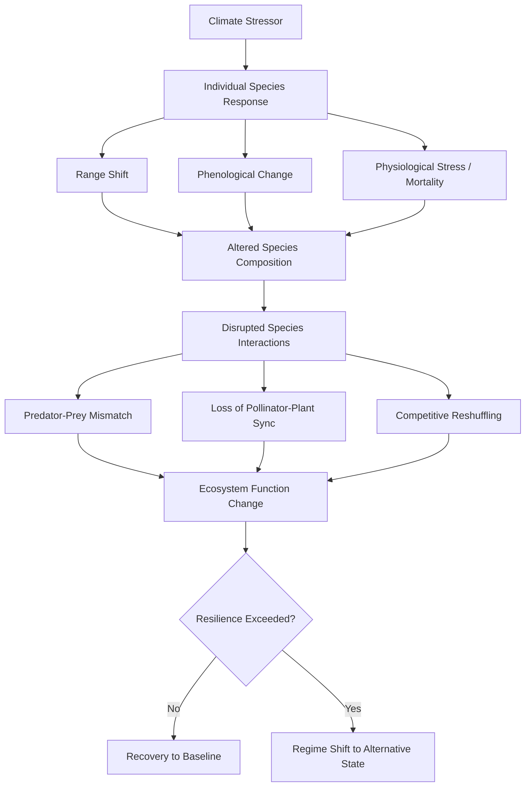

## Impacts on Ecosystems and Biodiversity

### Overview

Climate change alters the physical and chemical conditions that define habitats — temperature, precipitation, ocean chemistry, and disturbance regimes — faster than many species and ecosystems can adapt through evolution or migration. These impacts cascade through food webs, disrupt species interactions, and restructure ecosystems at local, regional, and global scales. Unlike isolated stressors, climate change interacts synergistically with habitat loss, pollution, invasive species, and overexploitation, often amplifying total biodiversity loss beyond what any single factor would cause.

### Core Mechanisms of Ecological Impact

#### Temperature-Driven Range Shifts

As mean temperatures rise, the climatic envelope a species is adapted to shifts geographically — generally poleward in latitude and upward in elevation. Species track these shifts by dispersing into newly suitable areas while their historical range becomes less hospitable.

**Key Points**

- Terrestrial species have shown measurable range shifts toward higher latitudes and higher elevations, correlating with regional warming trends
- Marine species often shift faster than terrestrial ones because ocean temperature gradients are more continuous and marine dispersal barriers are frequently lower
- Range shifts are constrained by dispersal ability, habitat fragmentation, and the availability of climatically suitable habitat at the new location — species with poor dispersal capacity (e.g., many amphibians, understory plants) face elevated extinction risk
- Mountain-top and polar species face "nowhere to go" as their climate envelope shrinks to zero area — a phenomenon termed climate-driven range contraction

#### Phenological Mismatch

Phenology refers to the timing of recurring biological events (flowering, breeding, migration, hibernation emergence). These events are frequently cued by temperature or day length, and different species respond to different cues.

**Example**

A migratory bird species relying on day length (photoperiod) to time its return from wintering grounds may arrive at breeding sites at a fixed calendar date each year. However, the insect prey it depends on may emerge earlier due to warming spring temperatures. Where the insect peak and the bird's arrival no longer coincide, offspring survival can decline sharply — a documented pattern in some pied flycatcher and great tit populations in Europe.

This mismatch occurs because organisms respond to different environmental cues (temperature vs. photoperiod vs. precipitation), and climate change decouples cues that were historically correlated.

#### Ocean Warming and Marine Ecosystem Disruption

Oceans have absorbed the large majority of excess heat trapped by anthropogenic greenhouse gases since the industrial era, making marine systems acutely sensitive to climate change.

**Key Points**

- **Coral bleaching**: Elevated sea surface temperatures cause corals to expel their symbiotic zooxanthellae algae, which provide most of the coral's energy and pigmentation. Prolonged bleaching leads to coral mortality and collapse of reef structure, which supports an estimated quarter of all marine species at some life stage
- **Marine heatwaves**: Discrete periods of anomalously high ocean temperature (e.g., the 2014–2016 "Blob" in the North Pacific) have caused mass mortality events in kelp forests, seabirds, and marine mammals
- **Species distribution shifts**: Commercially important fish stocks are shifting poleward, disrupting fisheries management frameworks built around historical distributions
- **Deoxygenation**: Warmer water holds less dissolved oxygen, and warming increases stratification, reducing vertical mixing that resupplies oxygen to deeper waters — expanding "dead zones" independent of nutrient pollution

#### Ocean Acidification

$$\text{CO}_2 + \text{H}_2\text{O} \rightleftharpoons \text{H}_2\text{CO}_3 \rightleftharpoons \text{H}^+ + \text{HCO}_3^-$$

Approximately a quarter to a third of anthropogenic $CO_2$ emissions are absorbed by the ocean. This shifts the carbonate equilibrium, increasing hydrogen ion concentration (lowering pH) and reducing the availability of carbonate ions ($CO_3^{2-}$) needed for calcification.

**Key Points**

- Organisms that build calcium carbonate shells or skeletons — corals, mollusks, some plankton (e.g., pteropods, coccolithophores), and echinoderms — face increased energetic cost of calcification and, in severe cases, shell/skeleton dissolution
- Larval and juvenile life stages are generally more vulnerable than adults due to higher surface-area-to-volume ratios and less-developed regulatory mechanisms
- Because calcifying plankton form the base of many marine food webs, acidification impacts can propagate upward to fish, marine mammals, and seabirds
- [Inference] The precise ecosystem-level thresholds at which acidification triggers food web collapse remain an active area of research, and impacts vary substantially by taxon and region

#### Altered Precipitation and Hydrological Regimes

Changes in the timing, intensity, and total volume of precipitation restructure freshwater and terrestrial ecosystems.

**Key Points**

- Increased frequency of extreme precipitation events alongside longer dry spells produces a more variable hydrological regime, stressing species adapted to historically stable seasonal patterns
- Reduced snowpack and earlier snowmelt shift the timing of peak river flow, affecting species (e.g., anadromous fish) that time migration or spawning to historical flow patterns
- Wetland ecosystems are sensitive to changes in water table depth driven by altered precipitation and evapotranspiration, with cascading effects on amphibians, waterfowl, and wetland vegetation
- Drought-stressed forests show reduced productivity and increased vulnerability to pest outbreaks (e.g., bark beetle infestations linked to warmer winters failing to suppress beetle populations) and wildfire

#### Increased Disturbance Frequency and Severity

Climate change is altering the frequency, intensity, and seasonality of natural disturbance regimes including wildfire, drought, and storms.

**Key Points**

- Longer fire seasons and increased fuel aridity have been linked to larger and more severe wildfires in many fire-prone biomes, altering post-fire successional trajectories and, in some cases, converting forest to shrubland or grassland when fire return intervals shorten below the time needed for tree regeneration
- Warmer sea surface temperatures provide more energy for tropical cyclones, [Inference] with research indicating a likely increase in the proportion of storms reaching higher intensity categories, though total storm frequency trends are less certain
- Repeated disturbance events can exceed an ecosystem's resilience capacity, triggering a regime shift to an alternative stable state rather than recovery to the prior baseline

### Biodiversity Consequences

#### Extinction Risk

**Key Points**

- Species with narrow climatic tolerances, limited dispersal ability, small population sizes, or specialized habitat/dietary requirements face disproportionately elevated extinction risk
- Endemic species on islands, mountaintops, and polar regions are especially vulnerable due to limited options for range shift
- Interacting stressors compound risk: a species already reduced by habitat fragmentation has less capacity to shift range or maintain genetic diversity needed to adapt
- [Unverified] Precise global extinction rate projections attributable specifically to climate change (as distinct from combined anthropogenic pressures) vary substantially across studies depending on methodology, warming scenario, and taxonomic group modeled

#### Ecosystem Restructuring and Regime Shifts

Climate change does not act on species in isolation; it reshuffles species assemblages, creating novel communities with no historical analog.

**Key Points**

- Because species respond individualistically (different tolerances, different dispersal rates), historical species associations break apart and reform into novel combinations — complicating conservation planning based on preserving existing community structures
- Regime shifts are often difficult to reverse once crossed, exhibiting hysteresis: returning environmental conditions to pre-shift levels does not necessarily restore the original ecosystem state
- Examples of documented or projected regime shifts include coral reef-to-algal-dominated transitions following repeated bleaching, and Arctic tundra-to-shrubland transitions as warming permits woody plant encroachment

#### Loss of Ecosystem Services

**Key Points**

- Pollination services are threatened by phenological mismatch between pollinators and flowering plants, with implications for both wild plant reproduction and agricultural yields
- Coastal protection services provided by coral reefs, mangroves, and salt marshes are degraded as these ecosystems decline under combined warming, acidification, and sea-level rise
- Carbon sequestration capacity of forests can be reduced or reversed when climate-driven disturbance (fire, drought, pest outbreaks) causes forests to shift from carbon sinks to carbon sources
- Fisheries productivity is affected by shifting species distributions, changes in primary productivity, and acidification impacts on the base of marine food webs

### Illustrative Diagram: Feedback Between Ecosystem Degradation and Climate Change

(svg_diagram)

<svg xmlns="http://www.w3.org/2000/svg" viewBox="0 0 800 420">
<text x="400" y="30" font-size="18" font-weight="bold" text-anchor="middle" fill="#111">Ecosystem–Climate Feedback Loop (svg_diagram)</text>
<rect x="40" y="70" width="220" height="70" rx="10" fill="#dceefb" stroke="#2b7bab" stroke-width="2" />
<text x="150" y="100" font-size="14" text-anchor="middle" fill="#111">Rising Global</text>
<text x="150" y="118" font-size="14" text-anchor="middle" fill="#111">Temperature</text>
<rect x="540" y="70" width="220" height="70" rx="10" fill="#fbe0dc" stroke="#ab4a2b" stroke-width="2" />
<text x="650" y="100" font-size="14" text-anchor="middle" fill="#111">Ecosystem</text>
<text x="650" y="118" font-size="14" text-anchor="middle" fill="#111">Degradation</text>
<rect x="290" y="200" width="220" height="70" rx="10" fill="#e8f5d9" stroke="#5a8a2b" stroke-width="2" />
<text x="400" y="230" font-size="14" text-anchor="middle" fill="#111">Reduced Carbon</text>
<text x="400" y="248" font-size="14" text-anchor="middle" fill="#111">Sequestration Capacity</text>
<rect x="290" y="330" width="220" height="70" rx="10" fill="#f9f0c9" stroke="#a88a1f" stroke-width="2" />
<text x="400" y="360" font-size="14" text-anchor="middle" fill="#111">Increased Atmospheric</text>
<text x="400" y="378" font-size="14" text-anchor="middle" fill="#111">Greenhouse Gas Concentration</text>
<line x1="260" y1="105" x2="540" y2="105" stroke="#333" stroke-width="2" marker-end="url(#arrow)" />
<text x="400" y="95" font-size="12" text-anchor="middle" fill="#333">drives bleaching, dieback,</text>
<text x="400" y="108" font-size="12" text-anchor="middle" fill="#333">range loss</text>
<line x1="620" y1="140" x2="450" y2="200" stroke="#333" stroke-width="2" marker-end="url(#arrow)" />
<line x1="400" y1="270" x2="400" y2="330" stroke="#333" stroke-width="2" marker-end="url(#arrow)" />
<line x1="290" y1="365" x2="150" y2="365" stroke="#333" stroke-width="2" />
<line x1="150" y1="365" x2="150" y2="140" stroke="#333" stroke-width="2" marker-end="url(#arrow)" />
<text x="130" y="250" font-size="12" fill="#333" transform="rotate(-90 130 250)">feedback closes loop</text>
</svg>

### Regional and Biome-Specific Impacts

#### Arctic and Polar Systems

**Key Points**

- Arctic surface air temperature has warmed at a rate substantially faster than the global average — a phenomenon known as Arctic amplification, driven partly by sea-ice loss reducing surface albedo (ice-albedo feedback)
- Sea ice loss directly threatens ice-dependent species (e.g., polar bears, ice seals) by reducing hunting platforms and denning habitat
- Permafrost thaw releases previously frozen organic carbon as $CO_2$ and methane, creating a positive feedback that further accelerates warming — while also destabilizing terrestrial habitat structure
- Shrub and treeline encroachment into former tundra alters surface albedo and habitat for tundra-specialist species

#### Coral Reef Systems

**Key Points**

- Mass bleaching events have increased in frequency, reducing the recovery window reefs have between disturbances
- Reef structural complexity loss following coral die-off reduces habitat availability for reef fish and invertebrates, with cascading declines in reef biodiversity
- [Inference] Some coral populations show evidence of thermal acclimatization or adaptive shifts in symbiont composition, but the pace of documented adaptation is generally assessed as too slow relative to projected warming rates under most emissions scenarios

#### Terrestrial Biomes

**Key Points**

- **Tropical forests**: Increased drought frequency and intensity threaten moisture-dependent tropical forest ecosystems, with some models projecting risk of dieback in vulnerable regions such as parts of the Amazon under high-warming scenarios [Inference — model-dependent and contested in the literature]
- **Boreal forests**: Warming, combined with more frequent and severe wildfire and pest outbreaks (e.g., bark beetles), is altering forest composition and, in some areas, net carbon balance
- **Grasslands and savannas**: Altered precipitation patterns and $CO_2$ fertilization effects interact to shift the competitive balance between grasses ($C_4$ photosynthesis) and woody plants, in some cases driving woody encroachment
- **Mediterranean-climate ecosystems**: Increased fire frequency and drought stress threaten fire-adapted but disturbance-sensitive plant communities when fire return intervals shorten excessively

### Compounding and Interacting Stressors

Climate change rarely acts alone. Its interaction with other anthropogenic pressures is a central concept in modern conservation biology.

**Key Points**

- **Habitat fragmentation** limits species' ability to track shifting climate envelopes by blocking dispersal corridors
- **Invasive species** often benefit disproportionately from climate change due to broader environmental tolerances and higher dispersal capacity relative to native specialists, and warming can expand the viable range of invasive species and disease vectors
- **Pollution** (nutrient runoff, plastics, chemical contaminants) can reduce organismal resilience to climate stress, lowering thermal tolerance thresholds
- **Overexploitation** (overfishing, overharvesting) reduces population sizes and genetic diversity, diminishing a species' adaptive capacity to also cope with climate stress
- This multi-stressor interaction is why biodiversity loss attribution is rarely reducible to a single cause, and why conservation strategies increasingly emphasize reducing non-climate stressors to build climate resilience ("stress reduction" or "resilience-based management")

### Conservation and Management Responses

**Key Points**

- **Assisted migration/translocation**: Deliberately moving species or populations to newly suitable habitat outside their historical range — a strategy applied selectively and remaining a subject of debate due to ecological risk of introducing species to novel ecosystems
- **Climate-resilient protected area networks**: Designing reserve systems and habitat corridors that account for projected range shifts rather than only historical species distributions
- **Ecosystem-based adaptation**: Restoring natural systems (e.g., mangroves, wetlands) that provide both biodiversity value and climate resilience services (coastal protection, carbon storage)
- **Assisted evolution/genetic approaches**: For some systems (e.g., selectively breeding heat-tolerant coral strains), active genetic intervention is being trialed to increase thermal tolerance
- **Ex situ conservation**: Seed banks, captive breeding, and cryopreservation as safeguards for species facing imminent habitat loss

### Uncertainty and Research Considerations

**Key Points**

- Ecosystem responses to climate change involve nonlinear dynamics and threshold effects, making precise prediction of tipping points difficult; [Speculation] some proposed tipping points (e.g., large-scale Amazon dieback thresholds) remain contested in the scientific literature regarding exact timing and reversibility
- Attribution of specific local ecological changes to climate change versus other concurrent stressors requires careful statistical and observational study design
- Long-term ecological monitoring datasets are essential for detecting climate-driven trends against natural interannual variability, and data gaps remain significant in many regions, particularly in the tropics and deep ocean

### Related Topics

- Ocean acidification chemistry and calcification thresholds in detail
- Coral reef ecology and bleaching mechanisms
- Phenology and trophic mismatch case studies
- Species distribution modeling and climate envelope methods
- Permafrost carbon feedback dynamics
- Assisted migration ethics and ecological risk assessment
- Ecosystem-based adaptation and nature-based climate solutions
- Tipping points and planetary boundaries framework
- Invasive species range expansion under climate scenarios
- Conservation genetics and adaptive capacity