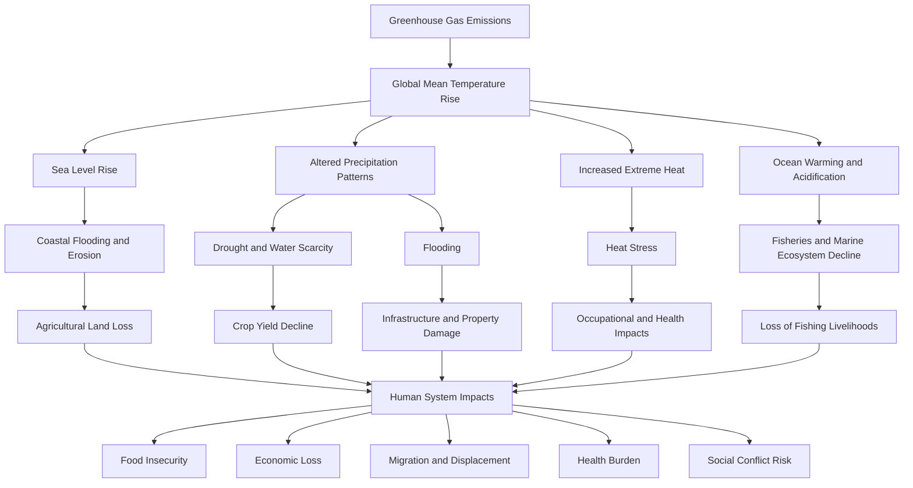

## Impacts on Human Systems and Livelihoods

### Overview

Climate change alters human systems through both gradual (slow-onset) and abrupt (extreme-event-driven) pathways, propagating from biophysical shifts into economic, social, and political outcomes. Human systems most affected include agriculture and food security, water resources, human health, migration and displacement, infrastructure, economic sectors, and social/cultural systems. The IPCC Sixth Assessment Report (AR6, Working Group II) frames these impacts using the concept of climate risk as a function of hazard, exposure, and vulnerability, rather than hazard alone.

$$\text{Risk} = f(\text{Hazard}, \text{Exposure}, \text{Vulnerability})$$

- **Hazard**: the climate-related physical event or trend (e.g., heatwave, drought, sea-level rise)
- **Exposure**: presence of people, livelihoods, assets, or infrastructure in places that could be adversely affected
- **Vulnerability**: propensity to be adversely affected, encompassing sensitivity and adaptive capacity

This framing is central to understanding why identical hazards produce vastly different outcomes across regions and populations — impacts are mediated by socioeconomic conditions, governance, and pre-existing inequality, not by climate hazard magnitude alone.

### Pathways from Climate Hazards to Human Impacts

The causal chain from physical climate change to livelihood disruption typically passes through intermediate biophysical and ecological changes before reaching human systems.

### Impacts on Agriculture and Food Security

**Key Points**

- Crop yields for staple grains (maize, wheat, rice) are projected to decline in many low-latitude regions even under moderate warming, while some high-latitude regions may see near-term gains, a pattern often described as differential impact by latitude.
- Warming reduces yields through heat stress during critical growth phases (flowering, grain fill), accelerated crop development (shorter grain-fill duration), increased evapotranspiration, and elevated pest and pathogen pressure.
- Elevated atmospheric CO2 can partially offset yield losses for C3 crops (wheat, rice, soybeans) through the "CO2 fertilization effect," but this benefit is constrained by nutrient (particularly nitrogen) availability and does not apply meaningfully to C4 crops (maize, sorghum, sugarcane). [Inference: the net balance between CO2 fertilization and heat/water stress is highly region- and crop-specific, and the scientific consensus is that stress effects dominate under higher-emission scenarios.]
- Elevated CO2 is documented to reduce the micronutrient density (zinc, iron) and protein content of staple crops, a mechanism with direct implications for nutritional security independent of caloric yield.
- Livestock systems face compounding stress from heat-related reductions in feed conversion efficiency, reproduction rates, and milk yield, alongside rangeland degradation from drought.

**Example**

A smallholder maize farmer in a semi-arid region (e.g., parts of sub-Saharan Africa) faces a shortened effective growing season as rainfall onset becomes less predictable. Even without an overall change in total annual rainfall, increased intra-seasonal variability can push germination past a viable planting window, causing complete crop failure risk to rise even when the seasonal rainfall total appears statistically unchanged — illustrating why livelihood analysis must examine rainfall *timing and distribution*, not just totals.

### Impacts on Water Resources

**Key Points**

- Climate change intensifies both ends of the hydrological cycle: increased frequency/intensity of drought in already-dry regions and increased frequency/intensity of heavy precipitation and flooding elsewhere — an effect consistent with the Clausius-Clapeyron relationship, which describes increased atmospheric water-holding capacity with warming.
- Glacier and snowpack decline threatens water supply for populations dependent on meltwater-fed river systems (e.g., Indus, Ganges, Amu Darya basins), with near-term flow increases followed by long-term decline as glacial mass is depleted — sometimes termed "peak water."
- Groundwater recharge rates are altered by shifting precipitation patterns, compounding pre-existing over-extraction pressures in many agricultural regions.
- Water scarcity has cascading effects on sanitation, disease transmission, and energy production (hydropower and thermoelectric cooling water).

**Example**

In a river basin fed primarily by seasonal snowmelt, earlier spring melt (due to warming) shifts peak river flow earlier in the year, decoupling water availability from the summer period of peak agricultural and municipal demand. This timing mismatch — rather than a reduction in total annual flow — is frequently the primary driver of water stress in such systems. [Unverified: exact magnitude and timing shift are highly basin-specific and require localized hydrological modeling.]

### Impacts on Human Health

**Key Points**

- Direct impacts: heat-related morbidity and mortality (heat stroke, cardiovascular and renal strain), injury and death from extreme weather events (floods, storms, wildfires).
- Indirect impacts: expanded geographic range and seasonality of vector-borne diseases (malaria, dengue, Lyme disease) as temperature and humidity conditions become suitable for vector survival in previously unsuitable areas; waterborne disease outbreaks following flooding; respiratory illness from wildfire smoke and increased ground-level ozone formation under higher temperatures.
- Nutritional impacts: undernutrition from crop yield decline and reduced micronutrient density, particularly affecting child development outcomes.
- Mental health impacts: documented associations between extreme weather exposure, displacement, and increased rates of anxiety, depression, and post-traumatic stress; a distinct construct termed "eco-anxiety" or "climate anxiety" describes chronic psychological distress related to climate change awareness, most studied in youth populations. [Unverified: causal mechanisms and long-term clinical significance remain an active area of research; findings should not be treated as diagnostic.]
- Occupational heat exposure reduces labor productivity directly, particularly in outdoor sectors (agriculture, construction), with documented reductions in safe working hours during extreme heat events.

**Example**

The Wet-Bulb Globe Temperature (WBGT) and simpler wet-bulb temperature ($T_w$) metrics are used to assess human heat-stress thresholds beyond which the body cannot effectively cool itself via evaporative sweating, even with unlimited hydration and shade. A theoretical wet-bulb temperature of approximately 35°C is often cited in the literature as a survivability limit for prolonged exposure in healthy adults, though empirical research suggests adverse physiological effects (and lower survivability thresholds in vulnerable populations) occur at somewhat lower values. [Inference: exact survivability thresholds vary by individual physiology, acclimatization, and exposure duration; the 35°C figure is a theoretical upper bound from human thermoregulation studies, not a universally observed field threshold.]

### Impacts on Migration and Displacement

**Key Points**

- Climate-related displacement is generally categorized into: sudden-onset displacement (from extreme events like floods, cyclones, wildfires) and slow-onset displacement (from processes like sea-level rise, desertification, and prolonged drought).
- The term "climate refugee" lacks formal legal standing under the 1951 Refugee Convention, which is defined around persecution rather than environmental drivers; the more precise and widely used terms in policy and academic literature are "climate migrant" or "environmentally displaced person."
- Most climate-related displacement is internal (within national borders) rather than international, and disproportionately affects populations already facing socioeconomic vulnerability.
- Migration functions as both a climate impact (displacement due to uninhabitability) and, in some contexts, an adaptation strategy (planned relocation, labor migration diversifying household income against local climate risk).
- Small island developing states (SIDS) and low-lying coastal/delta regions face the most acute long-term relocation pressure from sea-level rise, raising unresolved legal and sovereignty questions regarding statehood and maritime boundaries as land becomes uninhabitable or submerged. [Unverified: legal frameworks for these scenarios remain unsettled and are subject to ongoing international negotiation.]

### Impacts on Economic Systems and Infrastructure

**Key Points**

- Physical risk to infrastructure: coastal and riverine flooding, permafrost thaw (undermining foundations in Arctic regions), and extreme heat degrading transport infrastructure (rail buckling, pavement softening) impose direct damage and maintenance costs.
- Labor productivity loss: reduced safe outdoor working hours during heat extremes affects agriculture, construction, and manufacturing sectors disproportionately, with larger relative effects in tropical and subtropical economies.
- Insurance and financial systems: increasing frequency and severity of climate-related losses is straining private insurance markets in high-risk zones, with documented cases of insurers withdrawing coverage or sharply raising premiums in wildfire- and flood-prone areas. [Inference: this trend is well-documented in specific markets as of recent years, though its trajectory and regulatory response continue to evolve and should not be assumed uniform across all regions.]
- Distributional effects: climate impacts tend to disproportionately burden economies and communities with the least historical responsibility for emissions and the least adaptive capacity — a pattern central to the climate justice and "common but differentiated responsibilities" (CBDR) framework in international climate policy.
- Sectoral variation: tourism, fisheries, and rain-fed agriculture show high direct sensitivity to climate variables; finance and digital services show lower direct sensitivity but face indirect exposure through supply chains and physical asset risk.

### Impacts on Social and Cultural Systems

**Key Points**

- Loss of place-based cultural practices and traditional ecological knowledge occurs when communities are displaced or when local ecosystems (on which cultural practices depend) are altered — particularly significant for many Indigenous communities whose livelihoods, cosmology, and cultural continuity are tied to specific landscapes and species.
- Resource scarcity (water, arable land, grazing land) is documented as a contributing factor in some local and regional conflicts, though the scientific and policy literature treats climate change as a "threat multiplier" that interacts with existing political, ethnic, and economic tensions rather than as a sole or direct cause of conflict. [Inference: the climate-conflict link is an area of active academic debate; effect sizes and causal attribution vary substantially by study and region.]
- Gender-differentiated impacts are well documented: in many agrarian societies, women face compounded burdens from climate impacts due to existing labor divisions (e.g., water and fuel collection), land tenure inequality, and reduced adaptive capacity, though the specific pattern varies significantly by region and social structure.

### Adaptive Capacity and Vulnerability Determinants

**Key Points**

- Adaptive capacity is shaped by: access to financial resources, infrastructure quality, institutional governance strength, social safety nets, education, and technology access.
- The same physical hazard produces markedly different livelihood outcomes depending on these factors — for example, a drought of identical severity may cause famine in a region lacking irrigation infrastructure and social insurance, while causing primarily economic loss (without famine) in a region with robust agricultural insurance and water infrastructure.
- IPCC AR6 identifies "hotspots" of high human vulnerability where exposure, sensitivity, and low adaptive capacity converge, including parts of West, Central, and East Africa; South Asia; Central and South America; and Small Island Developing States.

### Illustrative Risk-Vulnerability Relationship (svg_diagram)

<svg xmlns="http://www.w3.org/2000/svg" viewBox="0 0 700 420">
<text x="350" y="30" text-anchor="middle" font-size="18" font-weight="bold" fill="#1a1a1a">Climate Risk as a Function of Hazard, Exposure, and Vulnerability (svg_diagram)</text>
<circle cx="230" cy="180" r="110" fill="#f4a261" fill-opacity="0.55" stroke="#e76f51" stroke-width="2" />
<text x="230" y="120" text-anchor="middle" font-size="16" font-weight="bold" fill="#7a2e12">Hazard</text>
<text x="230" y="145" text-anchor="middle" font-size="11" fill="#4a2c0f">Heatwaves, drought,</text>
<text x="230" y="160" text-anchor="middle" font-size="11" fill="#4a2c0f">floods, sea-level rise</text>
<circle cx="470" cy="180" r="110" fill="#2a9d8f" fill-opacity="0.55" stroke="#1d6f64" stroke-width="2" />
<text x="470" y="120" text-anchor="middle" font-size="16" font-weight="bold" fill="#0f3a34">Exposure</text>
<text x="470" y="145" text-anchor="middle" font-size="11" fill="#0f3a34">Population, assets,</text>
<text x="470" y="160" text-anchor="middle" font-size="11" fill="#0f3a34">livelihoods in harm's way</text>
<circle cx="350" cy="300" r="110" fill="#e9c46a" fill-opacity="0.55" stroke="#c9942f" stroke-width="2" />
<text x="350" y="360" text-anchor="middle" font-size="16" font-weight="bold" fill="#5c4408">Vulnerability</text>
<text x="350" y="380" text-anchor="middle" font-size="11" fill="#5c4408">Sensitivity, low adaptive</text>
<text x="350" y="395" text-anchor="middle" font-size="11" fill="#5c4408">capacity, poverty</text>

<text x="350" y="230" text-anchor="middle" font-size="15" font-weight="bold" fill="`#1a1a1a`">RISK</text>

<text x="350" y="248" text-anchor="middle" font-size="10" fill="`#333333`">(Human Impact)</text>

</svg>

### Quantitative Framing: Degrees of Warming and Human System Thresholds

| Global Mean Warming | Representative Human System Impact (illustrative, region-dependent) |
| --- | --- |
| +1.0°C to 1.5°C | Increased frequency of extreme heat events; measurable coral reef degradation affecting coastal fisheries livelihoods |
| +1.5°C to 2.0°C | Significant increase in crop yield risk in tropical regions; accelerating water stress in already-arid basins |
| +2.0°C to 3.0°C | Substantial increase in exposure to multi-sector climate risks (food, water, health) simultaneously; increased internal displacement pressure |
| Above 3.0°C | High risk of exceeding adaptive capacity limits in multiple regions; large-scale disruption to agricultural systems in low-latitude breadbasket regions |

[Inference: this table synthesizes qualitative risk trends broadly consistent with IPCC AR6 WGII framing. Specific impact magnitudes at each warming threshold are highly scenario- and region-dependent, and precise quantitative thresholds should be sourced from the primary IPCC report rather than treated as fixed values.]

### Conclusion

Climate change impacts on human systems and livelihoods are not driven by physical hazards in isolation but by the interaction of hazard, exposure, and vulnerability. This means impact severity is substantially shaped by pre-existing socioeconomic conditions, governance capacity, and infrastructure — making adaptive capacity and equity central, rather than peripheral, considerations in both scientific assessment and policy response. Impacts propagate through interconnected pathways (agriculture, water, health, migration, economy, culture), such that a disruption in one system frequently compounds risk in others.

**Related Topics**

- Climate Adaptation Strategies and Planning
- Loss and Damage Finance Mechanisms
- Climate Justice and Common but Differentiated Responsibilities (CBDR)
- Vector-Borne Disease Range Shifts Under Warming
- Sea-Level Rise Projections and Coastal Vulnerability Assessment
- Climate-Resilient Agriculture and Crop Breeding
- Urban Heat Island Effects and City-Level Adaptation
- Climate Risk Modeling and Vulnerability Indices (e.g., ND-GAIN Index)
- Indigenous and Traditional Ecological Knowledge in Climate Adaptation
- Climate-Induced Conflict and Security Studies