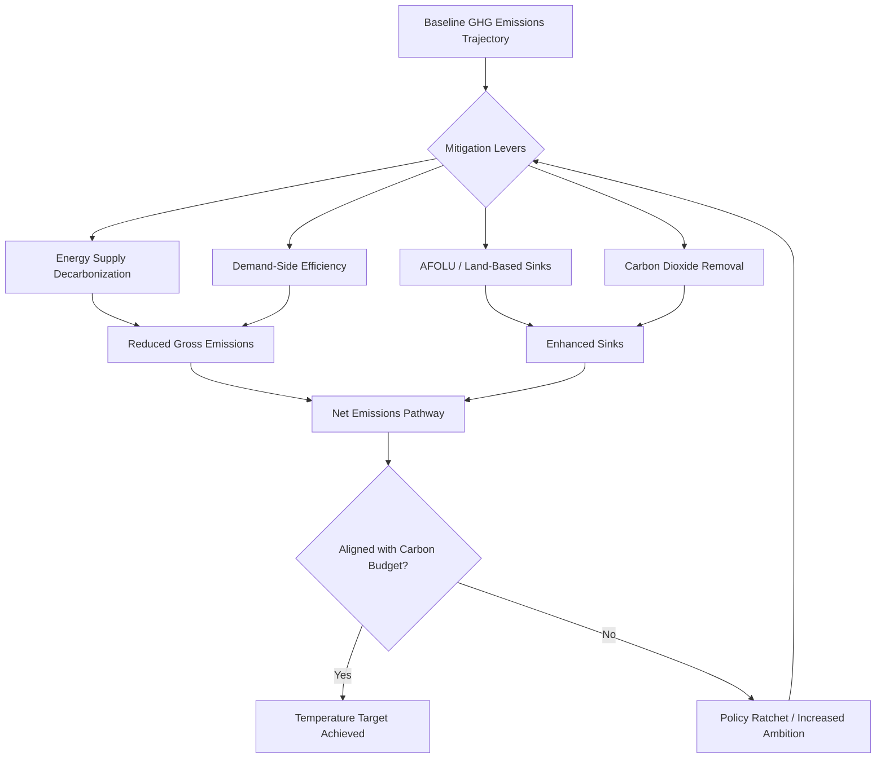

## Climate Change Mitigation Strategies

### Definition and Scope

Climate change mitigation refers to human interventions that reduce the sources of greenhouse gases (GHGs) or enhance the sinks that absorb them, thereby limiting the magnitude and/or rate of long-term climate change. This is distinct from climate adaptation, which addresses adjustments to actual or expected climate impacts. Mitigation targets the root cause (radiative forcing from atmospheric GHG concentrations) rather than the consequences.

**Key Points**

- Mitigation operates on the supply side (decarbonizing energy, industry, transport) and the demand side (reducing consumption, improving efficiency)
- Effectiveness is measured in tonnes of $CO_2$-equivalent ($CO_2e$) avoided or removed, using Global Warming Potential (GWP) factors to compare gases like $CH_4$ and $N_2O$ against $CO_2$
- The IPCC's AR6 mitigation pathways distinguish between emissions reduction and Carbon Dioxide Removal (CDR)/negative emissions

### Physical and Systems Basis

Mitigation strategy design rests on the carbon budget concept: the cumulative amount of $CO_2$ that can be emitted while keeping warming below a given threshold (e.g., 1.5°C or 2°C above pre-industrial levels), following the near-linear relationship known as the Transient Climate Response to Cumulative Emissions (TCRE).

$$\Delta T \approx TCRE \times \sum E_{CO_2}$$

Where $\Delta T$ is global mean temperature increase and $\sum E_{CO_2}$ is cumulative $CO_2$ emissions. This linearity implies that mitigation urgency is not just about annual emission rates but about the total remaining "budget," making early, steep reductions more effective than delayed action for the same cumulative target.

### Sectoral Mitigation Pathways

#### Energy Supply Decarbonization

- **Renewable energy deployment**: solar PV, onshore/offshore wind, hydropower, geothermal — displacing fossil-fuel-based electricity generation
- **Nuclear power**: low-carbon baseload generation; contentious due to waste and cost considerations [Speculation on future cost trajectories]
- **Fuel switching**: coal-to-gas transitions as a bridging strategy, reducing $CO_2$ intensity per unit energy but not eliminating emissions
- **Grid modernization**: smart grids, storage (lithium-ion, pumped hydro, emerging long-duration storage) to manage variable renewable output

#### Industry and Manufacturing

- **Energy efficiency**: process optimization, waste heat recovery, electrification of industrial heat
- **Material substitution**: low-carbon cement (e.g., reduced clinker content), green steel via hydrogen-based direct reduction
- **Carbon Capture, Utilization, and Storage (CCUS)**: capturing $CO_2$ at point sources (cement kilns, steel plants) for geological storage or utilization

#### Transportation

- **Electrification**: battery electric vehicles (BEVs), supported by grid decarbonization to realize full lifecycle benefits
- **Modal shift**: public transit, rail freight over road/air where feasible
- **Alternative fuels**: hydrogen fuel cells for heavy-duty transport, sustainable aviation fuels (SAF) for aviation, given limited near-term electrification options in that sector

#### Buildings

- **Efficiency retrofits**: insulation, high-efficiency HVAC, building envelope improvements
- **Electrification of heating**: heat pumps replacing gas/oil furnaces
- **Passive design**: orientation, glazing, and thermal mass strategies reducing energy demand at the design stage

#### Agriculture, Forestry, and Land Use (AFOLU)

- **Reduced deforestation**: protecting existing carbon sinks (tropical forests store substantial biomass carbon)
- **Afforestation/reforestation**: net carbon sequestration via biomass and soil carbon accumulation
- **Regenerative agriculture**: reduced tillage, cover cropping, improved soil carbon management
- **Methane reduction**: livestock management (feed additives), rice paddy water management targeting $CH_4$, a GHG with GWP roughly 27–30 times $CO_2$ over 100 years

### Carbon Dioxide Removal (CDR) and Negative Emissions Technologies

Distinct from emissions avoidance, CDR actively removes $CO_2$ already in the atmosphere.

| Method | Mechanism | Maturity |
| --- | --- | --- |
| Afforestation/Reforestation | Biological carbon uptake via photosynthesis | Mature, scalable |
| Soil carbon sequestration | Enhanced organic matter storage in agricultural soils | Mature, moderate scale |
| Direct Air Capture (DAC) | Chemical sorbents/solvents extract $CO_2$ from ambient air | Emerging, energy-intensive |
| Bioenergy with Carbon Capture and Storage (BECCS) | Biomass combustion/processing paired with CCS | Emerging |
| Enhanced weathering | Accelerated mineral reactions that bind $CO_2$ | Early-stage [Unverified at scale] |
| Ocean-based CDR | Alkalinity enhancement, macroalgae cultivation | Early-stage, ecological uncertainty |

Most IPCC-modeled 1.5°C pathways rely on some degree of CDR to offset residual emissions from hard-to-abate sectors (aviation, cement, agriculture), though the scale of dependence varies significantly by pathway assumption.

### Policy and Economic Instruments

#### Carbon Pricing

- **Carbon tax**: a fixed price per tonne of $CO_2e$ emitted, providing price certainty but uncertain emissions outcomes
- **Cap-and-trade (Emissions Trading Systems, ETS)**: a fixed emissions cap with tradable allowances, providing emissions certainty but price volatility
- Both internalize the externality of carbon emissions by embedding a cost into the price of carbon-intensive goods and services

$$\text{Marginal Abatement Cost (MAC)} = \frac{\Delta \text{Cost}}{\Delta \text{Emissions Reduced}}$$

Efficient policy design equalizes MAC across sectors, since abatement should occur where it is cheapest first — this underlies the economic rationale for broad-based carbon pricing over sector-specific mandates.

#### Regulatory Approaches

- Renewable Portfolio Standards (RPS) mandating minimum renewable electricity shares
- Fuel economy/emissions standards for vehicles
- Building codes mandating efficiency thresholds
- Methane regulations targeting oil and gas leakage

#### Financial Mechanisms

- Green bonds and climate finance for mitigation project funding
- Subsidies and feed-in tariffs for renewable deployment
- Fossil fuel subsidy reform, redirecting price signals toward low-carbon alternatives

### Mitigation Pathway Visualization

### Worked Example: Marginal Abatement Cost Curve Logic

**Example**

Consider a hypothetical portfolio of four abatement options for a national grid operator:

| Option | Abatement Cost ($/tCO2e) | Potential (MtCO2e/yr) |
| --- | --- | --- |
| Efficient lighting retrofit | -20 (net savings) | 5 |
| Onshore wind expansion | 15 | 40 |
| CCUS retrofit on coal plant | 60 | 20 |
| DAC deployment | 150 | 10 |

A cost-minimizing mitigation strategy sequences these from lowest to highest marginal cost, deploying negative-cost options first (efficiency measures that pay for themselves), then progressively more expensive options as cheaper abatement potential is exhausted. This ordering illustrates why efficiency and near-term renewables typically dominate early mitigation portfolios, while CDR technologies like DAC are deployed later or reserved for residual, hard-to-abate emissions.

### Measurement, Reporting, and Verification (MRV)

Robust mitigation tracking requires:

- **Emissions inventories**: following IPCC guidelines (e.g., the 2006 IPCC Guidelines for National GHG Inventories, refined in 2019) for consistent sector-level accounting
- **Additionality**: demonstrating that a mitigation action would not have occurred under a business-as-usual baseline (critical for carbon offset credibility)
- **Permanence**: particularly relevant for biological carbon storage, which carries reversal risk (e.g., forest fires releasing stored carbon)
- **Leakage**: the risk that emissions reductions in one jurisdiction or sector are offset by increases elsewhere (e.g., carbon-intensive production relocating to unregulated regions)

### Constraints and Trade-offs

- **Stranded assets**: rapid decarbonization risks stranding fossil fuel infrastructure investments, creating economic and political friction
- **Just transition**: mitigation policy design increasingly incorporates labor and community transition support for fossil-fuel-dependent regions
- **Land-use competition**: bioenergy and afforestation strategies compete with food production and biodiversity conservation for finite land
- **Critical mineral demand**: renewable and battery technologies increase demand for lithium, cobalt, and rare earth elements, introducing new supply chain and environmental considerations [Inference: downstream impacts vary by extraction practice and are not intrinsic to the technologies themselves]

### Conclusion

Climate change mitigation is a multi-sectoral portfolio problem requiring simultaneous progress in energy decarbonization, industrial transformation, land-use management, and carbon removal, underpinned by policy instruments that correct the market failure of unpriced carbon externalities. No single technology or policy suffices; pathway modeling consistently shows that meeting stringent temperature targets requires parallel, near-term action across supply-side and demand-side levers, with CDR serving as a complement to, not a substitute for, deep emissions reductions.

**Related Topics**

- Climate Change Adaptation Strategies
- Carbon Capture, Utilization, and Storage (CCUS) Systems
- Renewable Energy Grid Integration
- International Climate Agreements (Paris Agreement, NDCs)
- Life Cycle Assessment (LCA) for Energy Technologies
- Climate Finance and the Green Climate Fund
- Nationally Determined Contributions (NDC) Frameworks
- Carbon Offset Markets and Additionality Standards