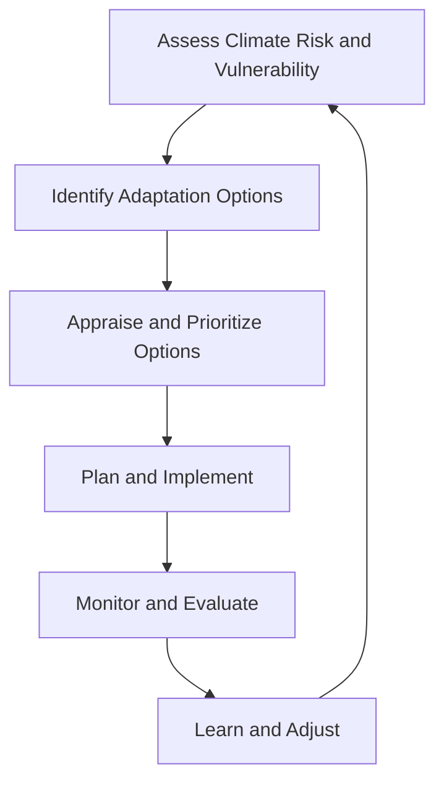

## Climate Change Adaptation Strategies

### Definition and Conceptual Framework

Climate change adaptation refers to the process of adjusting ecological, social, and economic systems in response to actual or expected climatic stimuli and their effects, in order to moderate harm or exploit beneficial opportunities. This is distinct from mitigation, which targets the reduction of greenhouse gas (GHG) emissions at the source.

**Key Points**

- Adaptation operates at multiple scales: individual, community, sectoral, national, and transnational
- The IPCC distinguishes between *incremental adaptation* (small adjustments to existing systems) and *transformational adaptation* (fundamental changes to systems or locations)
- Adaptation is inherently place-specific; a strategy effective in a coastal delta may be irrelevant in a semi-arid highland

### Theoretical Basis: Vulnerability and Risk

Adaptation planning is grounded in the vulnerability framework, commonly expressed as a function of exposure, sensitivity, and adaptive capacity.

$$V = f(E, S, AC)$$

Where $V$ is vulnerability, $E$ is exposure to climate hazards, $S$ is sensitivity of the system to those hazards, and $AC$ is adaptive capacity (the ability to adjust). The IPCC's Fifth and Sixth Assessment Reports reframe this using a risk-based lens:

$$Risk = f(Hazard, Exposure, Vulnerability)$$

This reframing places adaptation squarely within risk management, allowing it to be integrated with disaster risk reduction (DRR) frameworks such as the Sendai Framework.

### Categories of Adaptation Strategies

#### Structural/Physical Adaptation

Engineering and infrastructure interventions designed to withstand or redirect climate hazards.

- Sea walls, levees, and storm surge barriers
- Elevated infrastructure and flood-resistant building codes
- Water storage infrastructure (reservoirs, rainwater harvesting systems)
- Climate-resilient agricultural infrastructure (irrigation efficiency retrofits)

#### Ecosystem-Based Adaptation (EbA)

The use of biodiversity and ecosystem services to help communities adapt.

- Mangrove and wetland restoration for coastal storm buffering
- Reforestation and watershed management to reduce landslide and flood risk
- Agroforestry systems that buffer against drought and temperature extremes
- Urban green infrastructure (green roofs, urban forests) to counter the urban heat island effect

#### Institutional and Policy Adaptation

Governance mechanisms that enable or mandate adaptive action.

- National Adaptation Plans (NAPs) under the UNFCCC process
- Climate-responsive zoning and building codes
- Insurance mechanisms, including parametric/index-based insurance
- Early warning systems and climate services integration into governance

#### Behavioral and Social Adaptation

Changes in individual and community practices.

- Shifts in cropping calendars and crop diversification
- Migration and planned relocation (including managed retreat)
- Community-based adaptation (CBA) planning processes
- Indigenous and traditional ecological knowledge (TEK) integration

#### Technological and Economic Adaptation

- Drought-resistant and flood-tolerant crop varieties (often developed via marker-assisted breeding)
- Climate-indexed financial instruments and social safety nets
- Diversification of livelihoods away from climate-sensitive sectors

### Sectoral Applications

#### Agriculture

- Adjusting planting/harvesting windows in response to shifting precipitation patterns
- Precision agriculture using soil moisture sensors and remote sensing to optimize irrigation
- Development of stress-tolerant cultivars (e.g., submergence-tolerant rice varieties such as Sub1 lines)

#### Water Resources

- Integrated Water Resources Management (IWRM) frameworks
- Aquifer recharge and managed aquifer storage
- Demand-side management (tiered pricing, leak reduction)

#### Coastal Zones

- Managed retreat versus "hold the line" (hard defense) versus accommodation strategies
- Living shorelines combining natural and engineered elements
- Setback zoning to limit development in high-risk zones

#### Urban Systems

- Heat action plans, including cooling centers and reflective/permeable pavement
- Sponge city design principles for stormwater management
- Climate-resilient transportation network redundancy

#### Public Health

- Early warning systems for heatwaves and vector-borne disease outbreaks
- Strengthening health system surge capacity for climate-sensitive disease burdens
- Climate-informed disease surveillance (e.g., for malaria, dengue range shifts)

### The Adaptation Planning Cycle

This cycle is iterative rather than linear, reflecting the "adaptive management" paradigm, where uncertainty in climate projections requires continuous reassessment rather than a single fixed intervention.

### Adaptation Pathways and Decision-Making Under Uncertainty

Because climate projections carry irreducible uncertainty (particularly regarding rates of change and regional precipitation patterns), planners increasingly use **Dynamic Adaptive Policy Pathways (DAPP)** rather than static plans. This approach maps multiple possible sequences of actions ("pathways") that can be triggered depending on how conditions evolve, avoiding lock-in to a single strategy that may fail under a different climate trajectory than assumed.

**Example**

A coastal city's adaptation pathway might specify:

1. Initial action: beach nourishment (effective while sea-level rise remains below a defined threshold)
2. Trigger point: nourishment costs exceed a cost-effectiveness ratio, or sea-level rise crosses 0.3 m above baseline
3. Subsequent action: construction of a storm surge barrier
4. Long-term contingency: managed retreat from the lowest-lying zones if sea-level rise exceeds 1 m

### Adaptation Limits and Maladaptation

Not all adaptive responses are beneficial in the long run. **Maladaptation** occurs when an adaptation action increases vulnerability elsewhere, locks in unsustainable pathways, or disproportionately burdens vulnerable groups.

- Hard coastal defenses can increase erosion at adjacent, undefended shorelines
- Groundwater over-extraction for irrigation during drought can deplete aquifers, worsening long-term water scarcity
- Air conditioning uptake as heat adaptation increases electricity demand and, where grids are fossil-fuel-based, increases emissions — a feedback loop undermining mitigation

[Inference] The IPCC AR6 Working Group II report identifies "soft limits" (currently exceeded due to resource, governance, or knowledge constraints but potentially surmountable) and "hard limits" (adaptation cannot prevent intolerable risk regardless of resources) as an emerging conceptual distinction, though the precise threshold at which a soft limit becomes hard remains an active area of scientific debate.

### Financing Mechanisms

- **Green Climate Fund (GCF)** and **Adaptation Fund** under the UNFCCC architecture
- **Loss and Damage Fund**, operationalized following COP27/COP28 negotiations, addressing impacts beyond adaptive capacity
- National adaptation budgeting via climate-responsive public expenditure reviews
- Private sector instruments: catastrophe bonds, resilience bonds, parametric insurance

### Adaptation Finance Flow (svg_diagram)

<svg xmlns="http://www.w3.org/2000/svg" viewBox="0 0 800 380">
\<style\>
.box { fill: #eef5f0; stroke: #3a7d5c; stroke-width: 2; rx: 8; }
.boxAlt { fill: #f5f0ee; stroke: #a5623a; stroke-width: 2; rx: 8; }
.label { font-family: Arial, sans-serif; font-size: 13px; fill: #222; text-anchor: middle; }
.title { font-family: Arial, sans-serif; font-size: 15px; fill: #222; font-weight: bold; text-anchor: middle; }
.arrow { stroke: #555; stroke-width: 2; marker-end: url(#arrowhead); fill: none; }
.small { font-family: Arial, sans-serif; font-size: 11px; fill: #444; text-anchor: middle; }
\</style\>
<text x="400" y="24" class="title">Climate Adaptation Finance Flow (svg_diagram)</text>

<rect x="40" y="55" width="180" height="55" class="box" />
<text x="130" y="78" class="label">International Funds</text>
<text x="130" y="95" class="small">GCF, Adaptation Fund, L&amp;D Fund</text>
<rect x="320" y="55" width="180" height="55" class="box" />
<text x="410" y="78" class="label">National Governments</text>
<text x="410" y="95" class="small">NAPs, budget allocation</text>
<rect x="600" y="55" width="160" height="55" class="boxAlt" />
<text x="680" y="78" class="label">Private Finance</text>
<text x="680" y="95" class="small">Cat bonds, insurance</text>
<rect x="180" y="170" width="180" height="55" class="box" />
<text x="270" y="193" class="label">Subnational/Local Govt</text>
<text x="270" y="210" class="small">Provincial &amp; municipal plans</text>
<rect x="460" y="170" width="180" height="55" class="boxAlt" />
<text x="550" y="193" class="label">NGOs &amp; Cooperatives</text>
<text x="550" y="210" class="small">Implementation partners</text>
<rect x="300" y="290" width="220" height="60" class="box" />
<text x="410" y="315" class="label">Community-Level Projects</text>
<text x="410" y="333" class="small">Infrastructure, livelihoods, EbA</text>
<path d="M130 110 L130 145 L270 145 L270 170" class="arrow" />
<path d="M410 110 L410 145 L270 145" class="arrow" />
<path d="M410 110 L410 145 L550 145 L550 170" class="arrow" />
<path d="M680 110 L680 145 L550 145" class="arrow" />
<path d="M270 225 L270 260 L370 260 L370 290" class="arrow" />
<path d="M550 225 L550 260 L450 260 L450 290" class="arrow" />
</svg>

### Monitoring and Evaluation (M&E) of Adaptation

Unlike mitigation, where a common metric ($tCO_2e$ reduced) enables straightforward comparison, adaptation M&E lacks a universal metric because success is context-dependent (e.g., reduced crop loss versus reduced heat mortality are not directly comparable).

Common frameworks:

- **Adaptation Fund's** results-based M&E framework using output/outcome indicators
- **Tracking Adaptation and Measuring Development (TAMD)** framework, pairing climate risk management indicators with development outcome indicators
- Vulnerability Reduction Assessment (VRA) methodologies

[Inference] Because adaptation success is often measured as the avoidance of a future negative outcome under uncertain counterfactual conditions, quantifying attribution (i.e., confirming that reduced damage is due to the adaptation measure rather than a milder-than-expected climate event) remains methodologically contested across the literature.

### Equity and Justice Dimensions

- **Distributive justice**: who receives adaptation resources and infrastructure
- **Procedural justice**: whether affected communities participate in adaptation decision-making
- **Recognitional justice**: whether the knowledge systems of marginalized groups (e.g., Indigenous communities) are validated in planning processes

Climate justice literature emphasizes that adaptive capacity correlates strongly with pre-existing socioeconomic inequality, meaning adaptation planning that ignores equity can reinforce existing disparities rather than reduce climate risk broadly.

### Worked Example: Coastal Municipality Adaptation Plan

**Example**

A hypothetical low-lying coastal municipality facing sea-level rise and increased typhoon intensity might sequence its strategy as follows:

1. **Assessment phase**: Hazard mapping combining historical storm surge data with regional sea-level rise projections (e.g., IPCC shared socioeconomic pathway scenarios)
2. **Short-term (0–5 years)**: Early warning system upgrades, mangrove replanting along the most exposed shoreline segments, elevation of critical facilities (hospitals, evacuation centers)
3. **Medium-term (5–15 years)**: Zoning reform restricting new construction in the highest-risk flood zones; retrofitting drainage systems for higher rainfall intensity
4. **Long-term (15+ years)**: Contingent managed retreat plan activated if sea-level rise exceeds a pre-defined threshold, paired with resettlement planning and livelihood transition support

**Output**

The resulting plan is not a single fixed design but a decision tree, where each phase's specific engineering choice depends on monitored climate indicators, consistent with the adaptation pathways approach.

### Common Misconceptions

- Adaptation is *not* a substitute for mitigation; without emissions reduction, adaptation limits will eventually be exceeded ("hard limits") regardless of the sophistication of adaptive measures
- Adaptation is not purely technical/engineering; social and institutional adaptive capacity is frequently the binding constraint, not physical infrastructure
- A single "best practice" rarely transfers directly across regions due to differing hydrology, governance capacity, and socioeconomic context

### Related Topics

- Climate Change Mitigation Strategies and Carbon Sequestration
- IPCC Assessment Report Frameworks (AR6 Working Group II)
- Disaster Risk Reduction and the Sendai Framework
- Ecosystem-Based Adaptation and Nature-Based Solutions
- Climate Justice and Loss and Damage Mechanisms
- Vulnerability and Risk Assessment Methodologies
- National Adaptation Plans (NAPs) and UNFCCC Adaptation Architecture
- Managed Retreat and Planned Relocation Policy