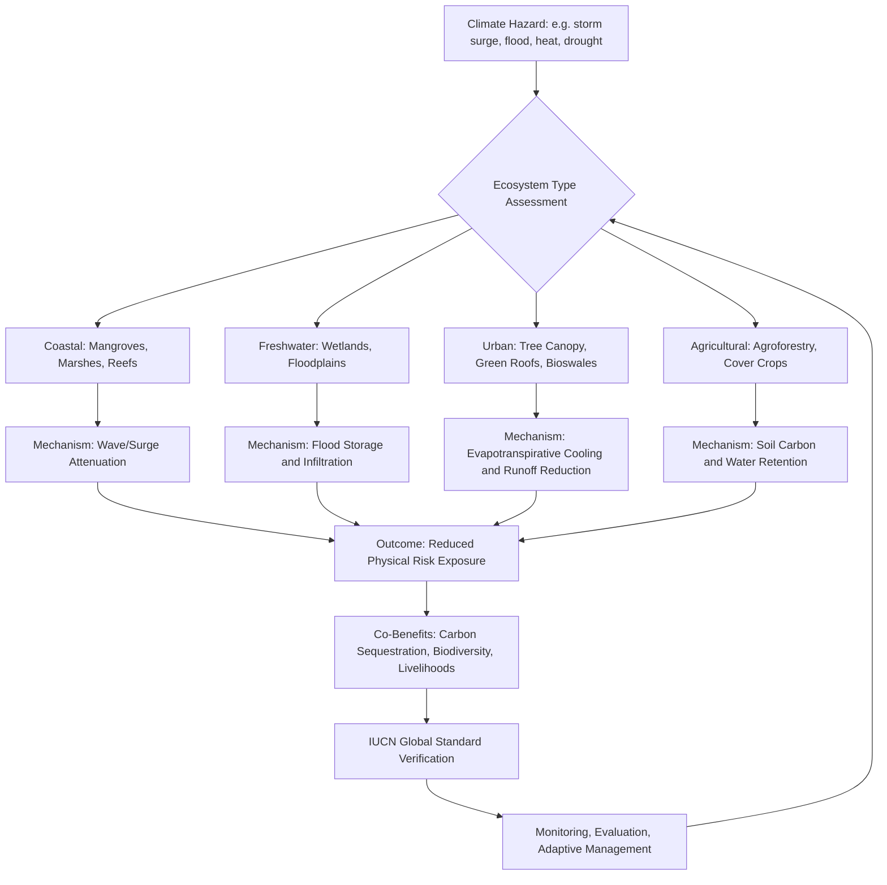

## Nature-Based Solutions for Climate Resilience

### Definition and Conceptual Foundation

Nature-based solutions (NbS) are actions to protect, sustainably manage, and restore natural and modified ecosystems that address societal challenges (including climate change) effectively and adaptively, while simultaneously providing human well-being and biodiversity benefits. This definition, adopted by the International Union for Conservation of Nature (IUCN), positions NbS as an umbrella concept spanning ecosystem restoration, protected area management, green infrastructure, and nature-positive agriculture.

The core premise is that functioning ecosystems perform regulating services — carbon sequestration, flood attenuation, coastal protection, temperature moderation, water filtration — that can substitute for or complement engineered ("grey") infrastructure, often at lower cost and with co-benefits for biodiversity and livelihoods.

**Key Points**

- NbS sit at the intersection of climate mitigation, climate adaptation, and biodiversity conservation
- The IUCN Global Standard for NbS (2020) provides eight criteria for verifying genuine nature-based interventions
- NbS are distinguished from "green infrastructure" (a narrower, often urban-engineering term) and from ecosystem-based adaptation (EbA), which NbS subsumes as a subset focused specifically on adaptation

### Taxonomy of Nature-Based Solutions

NbS interventions are typically classified along a gradient of ecosystem modification:

1. **Protection** — safeguarding intact, functioning ecosystems (e.g., primary forests, peatlands, coral reefs) from degradation or conversion
2. **Restoration** — actively returning degraded ecosystems toward a former or improved state (e.g., reforestation, wetland rehabilitation, mangrove replanting)
3. **Management** — sustainable, adaptive management of ecosystems that are already used for production (e.g., agroforestry, sustainable forestry, regenerative agriculture)
4. **Creation** — constructing new ecosystems where none previously existed to deliver specific services (e.g., constructed wetlands, urban rain gardens, green roofs)

### Domain-Specific Applications

#### Coastal and Marine Resilience

Coastal NbS reduce wave energy, storm surge, and erosion while sequestering carbon in biomass and sediment ("blue carbon").

- **Mangrove restoration**: mangrove forests can reduce wave height significantly over just 100 meters of forest width, depending on stem density and forest structure [Inference — the exact attenuation coefficient is site-specific and depends on bathymetry, species, and storm characteristics]. Mangroves also store large quantities of carbon in below-ground biomass and soil, often exceeding terrestrial forest carbon density per hectare.
- **Salt marsh and seagrass restoration**: marshes dissipate wave energy and trap sediment, allowing vertical accretion that can help keep pace with sea-level rise under moderate scenarios. Seagrass meadows stabilize sediment and sequester carbon, though restoration success rates are historically variable and site-dependent [Unverified — restoration success depends heavily on hydrology, sediment supply, and local stressor management].
- **Coral reef restoration**: living reefs dissipate a substantial proportion of incoming wave energy before it reaches shorelines, though reef restoration (coral gardening, fragment transplantation) is more experimental than mangrove or marsh restoration and thermal stress from ocean warming constrains long-term viability [Speculation on scalability under continued ocean warming].
- **Hybrid ("grey-green") approaches**: combining living shorelines with rock sills, breakwaters, or reef balls to jump-start ecosystem engineering while providing immediate protection.

#### Freshwater and Watershed Management

- **Wetland restoration**: floodplain and riparian wetlands attenuate flood peaks by storing and slowly releasing water, reducing downstream flood magnitude.
- **Floodplain reconnection / "room for the river"**: deliberately removing or setting back levees to restore natural floodplain storage, reducing flood risk for downstream urban areas.
- **Natural water retention measures (NWRM)**: check dams, reforested headwaters, and restored meanders that slow runoff velocity and improve infiltration, reducing peak flow and improving baseflow during droughts.
- **Constructed wetlands**: engineered systems using emergent vegetation and substrate to treat wastewater or stormwater while providing habitat.

#### Urban Climate Resilience (Green and Blue Infrastructure)

- **Urban tree canopy**: reduces the urban heat island effect through evapotranspiration and shading; tree cover can lower local air temperatures by several degrees Celsius under appropriate canopy density [Inference — magnitude depends on species, canopy density, humidity, and urban form].
- **Green roofs and walls**: reduce building cooling loads, attenuate stormwater runoff, and provide insulation.
- **Bioswales and rain gardens**: vegetated conveyance and infiltration features that reduce stormwater volume and peak discharge, decreasing combined sewer overflow events.
- **Permeable pavements paired with vegetation**: reduce impervious surface runoff coefficients.
- **Urban forests and parks as cooling corridors**: strategically placed green space to interrupt heat accumulation across dense built environments.

#### Agricultural and Terrestrial Landscape Resilience

- **Agroforestry**: integrating trees into cropping or grazing systems to diversify income, improve soil structure, increase water infiltration, and sequester carbon in woody biomass.
- **Regenerative/conservation agriculture**: cover cropping, reduced tillage, and crop rotation to build soil organic carbon, improve water-holding capacity, and reduce erosion.
- **Silvopasture**: combining trees, forage, and livestock to improve heat resilience for animals and diversify land productivity.
- **Watershed afforestation/reforestation**: restoring forest cover in upper watersheds to regulate streamflow, reduce sedimentation, and stabilize slopes against landslides.
- **Windbreaks and shelterbelts**: reduce wind erosion and evapotranspiration stress on adjacent croplands.

### Mechanisms of Climate Resilience Delivery

**Carbon Sequestration**

NbS contribute to mitigation via two carbon pools:

- **Biomass carbon**: accumulated in living plant tissue (trunks, roots, leaves)
- **Soil/sediment carbon**: accumulated in soil organic matter or, in blue carbon ecosystems, in anaerobic sediments where decomposition is slow

$$C_{seq} = \sum_{i} (B_i \times CF_i) + \Delta SOC$$

Where $B_i$ is biomass of pool $i$, $CF_i$ is the carbon fraction (commonly approximated as 0.47 for many biomass types), and $\Delta SOC$ is the change in soil organic carbon over the accounting period.

**Physical Risk Reduction**

Vegetation and geomorphic features reduce hazard exposure through:

- Energy dissipation (wave/wind attenuation via drag from stems, roots, canopy)
- Hydrological buffering (interception, infiltration, storage of excess water)
- Slope stabilization (root reinforcement of soil shear strength)
- Microclimate regulation (evapotranspirative cooling, shading)

**Ecosystem Service Co-Benefits**

Beyond direct hazard reduction, NbS typically deliver water quality improvement, habitat provision, pollination services, recreational/cultural value, and local livelihood diversification — making them attractive under cost-benefit and multi-criteria decision frameworks compared to single-purpose grey infrastructure.

### The IUCN Global Standard for NbS

The IUCN Global Standard establishes eight criteria that a genuine NbS intervention should meet:

1. Effectively addresses societal challenges
2. Design informed by scale (interventions designed at the landscape/seascape scale)
3. Results in a net gain to biodiversity and ecosystem integrity
4. Economically viable, considering all costs and benefits
5. Based on inclusive, transparent, and empowering governance processes
6. Equitably balances trade-offs between multiple objectives
7. Managed adaptively, based on evidence
8. Sustainable and mainstreamed within an appropriate jurisdictional context

This standard is used to screen projects against "greenwashing" risks, where tree-planting or offset schemes are labeled NbS without meeting biodiversity, equity, or long-term viability criteria.

### Comparison: Nature-Based vs. Grey (Engineered) Infrastructure

| Dimension | Nature-Based Solutions | Grey Infrastructure |
| --- | --- | --- |
| Initial cost | Often lower, but site-dependent | Typically higher capital cost |
| Adaptive capacity | Can self-repair, grow, and adapt over time | Static; degrades without maintenance |
| Co-benefits | Biodiversity, water quality, livelihoods, carbon | Generally single-purpose |
| Time to full function | Years to decades (establishment lag) | Immediate upon construction |
| Performance under extremes | May be overwhelmed by extreme events; performance data still maturing | Engineered to defined design standards |
| Maintenance | Ecological management (invasive control, replanting) | Structural maintenance (inspection, repair) |
| Land area required | Often larger footprint | Typically smaller footprint |

[Inference] In many contexts, hybrid grey-green approaches outperform either pure strategy alone, combining the reliability of engineered thresholds with the adaptive, co-benefit-rich performance of ecosystems — though the optimal mix is highly site- and hazard-specific.

### System Diagram: NbS Intervention Pathway

### Illustrative Diagram: Mangrove Wave Attenuation (svg_diagram)

<svg xmlns="http://www.w3.org/2000/svg" viewBox="0 0 700 320">
<rect x="0" y="0" width="700" height="320" fill="#eaf6fb" />
<text x="350" y="30" font-size="16" text-anchor="middle" fill="#1a3c40" font-weight="bold">Mangrove Wave Attenuation (svg_diagram)</text>

<rect x="0" y="180" width="180" height="140" fill="#4a90a4" />
<path d="M0,180 Q20,170 40,180 T80,180 T120,180 T160,180 T200,180" stroke="#ffffff" stroke-width="3" fill="none" />
<path d="M0,195 Q20,185 40,195 T80,195 T120,195 T160,195 T200,195" stroke="#ffffff" stroke-width="2" fill="none" opacity="0.7" />

<path d="M40,150 L100,150" stroke="#1a3c40" stroke-width="2" marker-end="url(#arrow)" />
<text x="70" y="140" font-size="11" text-anchor="middle" fill="#1a3c40">Incoming wave (high energy)</text>

<rect x="180" y="140" width="220" height="180" fill="#c9e4b5" />
<g stroke="#3d6b35" stroke-width="4">
<line x1="200" y1="320" x2="205" y2="200" />
<line x1="230" y1="320" x2="233" y2="190" />
<line x1="260" y1="320" x2="258" y2="195" />
<line x1="290" y1="320" x2="292" y2="185" />
<line x1="320" y1="320" x2="318" y2="200" />
<line x1="350" y1="320" x2="352" y2="190" />
<line x1="380" y1="320" x2="378" y2="195" />
</g>
<g fill="#4a8c3f">
<circle cx="205" cy="195" r="18" />
<circle cx="233" cy="185" r="20" />
<circle cx="258" cy="190" r="17" />
<circle cx="292" cy="180" r="21" />
<circle cx="318" cy="195" r="18" />
<circle cx="352" cy="185" r="20" />
<circle cx="378" cy="190" r="17" />
</g>
<text x="290" y="130" font-size="12" text-anchor="middle" fill="#1a3c40" font-weight="bold">Mangrove Forest Belt</text>

<path d="M410,160 L460,160" stroke="#1a3c40" stroke-width="1.5" marker-end="url(#arrow)" />
<text x="435" y="150" font-size="10" text-anchor="middle" fill="#1a3c40">Reduced energy</text>

<rect x="460" y="200" width="240" height="120" fill="#e8dcc4" />
<rect x="500" y="230" width="40" height="35" fill="#b5651d" />
<polygon points="495,230 520,210 545,230" fill="#8b3a1a" />
<rect x="570" y="240" width="35" height="25" fill="#b5651d" />
<polygon points="565,240 587,222 610,240" fill="#8b3a1a" />
<text x="580" y="300" font-size="12" text-anchor="middle" fill="#1a3c40" font-weight="bold">Protected Community</text>
</svg>

### Financing and Governance Mechanisms

- **Payments for Ecosystem Services (PES)**: direct payments to landholders for maintaining services (watershed protection, carbon sequestration)
- **Carbon markets and blue carbon credits**: monetizing sequestration via voluntary or compliance carbon markets, subject to additionality, permanence, and leakage safeguards
- **Insurance-linked mechanisms**: parametric insurance tied to reef or mangrove health (e.g., reef insurance schemes that fund post-storm restoration)
- **Public climate adaptation funds**: multilateral funds (e.g., Green Climate Fund, Adaptation Fund) increasingly channel financing toward NbS-based adaptation projects
- **Blended finance**: combining public concessional capital with private investment to de-risk long-horizon restoration projects

### Common Implementation Barriers

- **Establishment lag**: ecosystems take years to reach full functional capacity, creating a protection gap compared to immediately effective grey infrastructure
- **Land tenure and competing land use**: restoration often competes with agricultural, aquacultural, or urban development pressure
- **Monitoring, Reporting, and Verification (MRV) complexity**: quantifying carbon and risk-reduction benefits requires sustained ecological monitoring, which is resource-intensive
- **Permanence risk**: ecosystems are vulnerable to reversal through disease, fire, storm damage, or human encroachment, complicating long-term carbon accounting
- **Fragmented governance**: NbS often span multiple jurisdictions and sectors (water, agriculture, coastal, urban planning), requiring cross-sectoral coordination that is institutionally difficult

### Example: Comparative Cost-Effectiveness Framing

**Example**

A coastal municipality facing recurring storm surge damage evaluates two options: constructing a concrete seawall versus restoring an adjacent mangrove belt.

- Seawall: high upfront capital cost, immediate and predictable protection, no co-benefits, degrades over time requiring maintenance, may increase erosion at unprotected adjacent shorelines (a hard-engineering externality)
- Mangrove restoration: lower upfront cost per hectare [Inference — highly dependent on land price, labor cost, and site hydrology], multi-year establishment period before full wave-attenuation function, ongoing biodiversity and fisheries co-benefits, carbon sequestration revenue potential, requires sustained community stewardship

A hybrid approach — a lower engineered sill combined with a fronting mangrove belt — is frequently recommended in coastal engineering literature to bridge the establishment-lag protection gap while capturing long-term ecosystem co-benefits [Inference].

### Related Topics

- Ecosystem-based adaptation (EbA) and its distinction from broader NbS
- Blue carbon accounting methodologies and MRV protocols
- IPCC AR6 treatment of NbS in mitigation and adaptation pathways
- Urban heat island mitigation strategies and green infrastructure planning
- REDD+ and forest carbon offset mechanisms
- Coastal squeeze and the limits of NbS under accelerating sea-level rise
- Community-based natural resource management (CBNRM) governance models
- Climate-smart agriculture and soil carbon sequestration
- Disaster risk reduction (DRR) frameworks integrating ecosystem-based approaches
- The Sendai Framework and its intersection with NbS for resilience