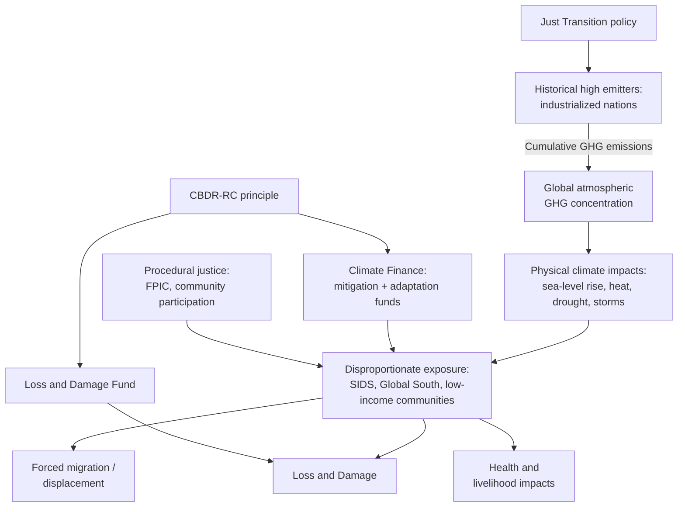

## Climate Justice and Equity

### Definition and Conceptual Foundations

Climate justice is the framing of climate change as an ethical and political issue rather than a purely physical or economic one, centered on the fact that the causes and consequences of climate change are distributed unequally across populations. It draws on frameworks from environmental justice, human rights law, and distributive ethics to ask: who caused the problem, who suffers most from it, and who bears the responsibility for fixing it.

The concept rests on three interlocking dimensions:

- **Distributive justice**: how the burdens (harms, risks) and benefits (resources, adaptation capacity) of climate change and climate policy are allocated across groups.
- **Procedural justice**: whether affected communities have meaningful participation in decisions that shape climate policy, mitigation projects, and adaptation planning.
- **Recognition justice**: whether the distinct vulnerabilities, knowledge systems, and rights of marginalized groups (Indigenous peoples, low-income communities, women, disabled populations) are acknowledged in policy design.

A fourth dimension increasingly discussed in the literature is **restorative justice**, which addresses how to repair harm already done, connecting directly to debates over loss and damage compensation.

### The Core Equity Problem: Emissions vs. Impact Mismatch

The central empirical claim underlying climate justice is a geographic and historical mismatch between who has emitted greenhouse gases and who experiences the worst consequences.

- Wealthy, industrialized nations (historically the US, EU, and other OECD countries) are responsible for the large majority of cumulative $CO_2$ emissions since the Industrial Revolution, since climate change is driven by cumulative atmospheric concentration, not just current-year emissions.
- Low- and middle-income countries, particularly small island developing states (SIDS), Sub-Saharan Africa, and South Asia, contribute a small fraction of cumulative emissions but face disproportionate exposure to sea-level rise, drought, cyclones, and heat stress.
- Within countries, low-income populations, racial and ethnic minorities, Indigenous communities, and outdoor/agricultural workers tend to have higher exposure to climate hazards (flood-prone housing, urban heat islands, poor infrastructure resilience) and fewer resources to adapt or recover.

This mismatch is often summarized by the phrase "those who did the least to cause the problem suffer the most from it," and it underlies most policy debates on climate finance and differentiated responsibility.

### Key Frameworks and Legal Instruments

**Common But Differentiated Responsibilities and Respective Capabilities (CBDR-RC)**

Enshrined in the 1992 UN Framework Convention on Climate Change (UNFCCC) and reaffirmed in the Paris Agreement, CBDR-RC is the foundational legal principle for climate justice at the international level. It holds that all countries share responsibility for addressing climate change, but developed countries — due to their historical emissions and greater financial/technological capacity — bear a greater share of the burden for mitigation and financing.

**The Paris Agreement (2015)**

Operationalizes climate justice through several equity-related mechanisms:

- Nationally Determined Contributions (NDCs) allow differentiated ambition levels.
- Article 9 commits developed countries to provide climate finance to developing countries.
- The global stocktake process is meant to assess collective progress against equity considerations, not just aggregate emissions targets.

**Loss and Damage**

A distinct pillar from mitigation and adaptation, loss and damage refers to the residual harms from climate change that cannot be avoided through either. After decades of resistance from developed nations (who feared this implied liability and legal compensation claims), COP27 (2022) established a Loss and Damage Fund, operationalized at COP28 (2023), to channel finance to vulnerable countries for irreversible climate harms (e.g., loss of land to sea-level rise, loss of cultural heritage sites, permanent displacement).

**Just Transition**

A labor- and equity-focused framework ensuring that the shift away from fossil fuels does not disproportionately harm workers and communities economically dependent on carbon-intensive industries (coal miners, oil refinery workers, auto manufacturing tied to internal combustion engines). Just transition principles typically include retraining programs, income support, regional economic diversification, and worker involvement in transition planning.

### Climate Finance and the North-South Equity Debate

Climate finance is one of the most contentious operational fronts of climate justice.

- Developed countries pledged in 2009 (Copenhagen Accord, reaffirmed in Paris) to mobilize $100 billion per year by 2020 for climate action in developing countries; this target was met late and remains contested in terms of what counts as "new and additional" finance versus repurposed development aid.
- At COP29 (2024), a new collective quantified goal (NCQG) was negotiated, setting a target of at least $300 billion annually by 2035 from developed countries, with a broader aspirational call for $1.3 trillion annually from all sources (public and private, all contributors) — a figure widely criticized by developing-country blocs (e.g., the G77 plus China) as inadequate relative to estimated adaptation and mitigation needs. [Unverified: exact figures and compliance mechanisms remain subject to ongoing negotiation and revision]
- A persistent structural equity criticism is that most climate finance is disbursed as loans rather than grants, which can deepen debt burdens in already highly-indebted developing nations — sometimes termed "climate debt trap" dynamics.

### Vulnerability Differentials: Who Is Most Affected

**Geographic vulnerability**

- Small Island Developing States (SIDS) face existential risk from sea-level rise, with some low-lying nations (e.g., Tuvalu, Kiribati) confronting scenarios of partial or total territorial loss.
- Arctic Indigenous communities face rapid permafrost thaw, loss of traditional hunting grounds, and infrastructure collapse.
- Sub-Saharan African agrarian communities face increased drought frequency and reduced crop yields, threatening food security in regions with limited irrigation infrastructure.

**Socioeconomic vulnerability**

- Low-income urban populations often live in areas with less tree cover and more impervious surface, increasing exposure to the urban heat island effect.
- Outdoor and agricultural workers face direct occupational heat stress risk with limited legal protections in many jurisdictions.
- Populations with pre-existing health burdens have reduced adaptive capacity to heat waves, vector-borne disease range shifts, and air quality degradation.

**Intersectional and gender dimensions**

Women in many developing regions bear a disproportionate share of water and fuel collection labor, which becomes more burdensome as climate change increases resource scarcity. Displacement events (from floods, droughts, or conflict linked to resource stress) have also been documented to increase risks of gender-based violence in displacement settings. [Inference: the magnitude of this relationship varies significantly by region and is difficult to isolate causally from co-occurring conflict and governance factors]

### Climate Migration and Displacement

Climate justice increasingly intersects with migration policy through the concept of climate-induced displacement.

- The Internal Displacement Monitoring Centre and World Bank have produced projections estimating tens of millions of internal climate migrants by mid-century under various scenarios, concentrated in South Asia, Sub-Saharan Africa, and Latin America. [Unverified: projections vary substantially by model, emissions scenario, and adaptation assumptions, and should not be treated as precise forecasts]
- There is presently no binding international legal category of "climate refugee" under the 1951 Refugee Convention, which defines refugee status around persecution rather than environmental hazard — a recognized gap in international law that climate justice advocates argue needs new legal instruments.
- Planned relocation programs (e.g., in Fiji, Alaska) raise procedural justice questions about community consent, cultural continuity, and land rights during resettlement.

### Indigenous Rights and Traditional Ecological Knowledge

Indigenous peoples steward a disproportionately large share of the world's remaining biodiversity and intact forest relative to their population share, despite holding formal land tenure over a much smaller fraction of global land area — a recognition gap central to climate justice claims. Key issues include:

- **Free, Prior, and Informed Consent (FPIC)**: a principle from the UN Declaration on the Rights of Indigenous Peoples (UNDRIP, 2007) requiring that Indigenous communities be consulted and agree before projects (including renewable energy or conservation projects) proceed on their land.
- **Carbon offset and REDD+ controversies**: forest carbon offset programs (Reducing Emissions from Deforestation and Forest Degradation) have faced criticism for displacing or restricting the traditional land use of Indigenous communities in the name of carbon sequestration, illustrating tension between mitigation goals and recognition justice.
- **Traditional ecological knowledge (TEK)**: increasingly incorporated into formal adaptation planning, particularly in fire management, water conservation, and biodiversity monitoring, though integration with Western scientific frameworks remains institutionally uneven.

### Environmental Justice Movement Origins and Domestic Policy

The domestic (US-centric but globally replicated) environmental justice movement predates the modern climate justice framing and provides much of its methodological and moral foundation.

- The movement traces significantly to the 1982 Warren County, North Carolina protests against a PCB landfill sited in a majority Black community, and to the 1987 "Toxic Wastes and Race" report, which documented statistical correlation between race and proximity to hazardous waste facilities in the United States.
- Modern climate policy instruments have incorporated this lineage: the US Justice40 Initiative (established by executive order in 2021) commits 40% of the benefits of certain federal climate, clean energy, and infrastructure investments to disadvantaged communities, using the Climate and Economic Justice Screening Tool (CEJST) to identify eligible census tracts based on indicators like pollution burden, energy cost burden, and health disparities.
- Critics of such programs raise both implementation concerns (whether benefits reach intended communities) and design concerns (how "disadvantaged" is operationally defined and whether screening tools adequately capture cumulative burden). [Inference: effectiveness assessments are still emerging as these programs are relatively recent]

### Equity Considerations in Mitigation Policy Design

Climate justice also shapes critiques and design choices within mitigation policy itself:

- **Carbon pricing regressivity**: carbon taxes and cap-and-trade systems can be regressive, since lower-income households spend a larger share of income on energy and transportation, unless revenue is recycled through rebates or dividends (e.g., carbon fee-and-dividend models) that offset this effect.
- **Siting of renewable infrastructure**: large-scale solar and wind projects have in some cases been sited in ways that displace rural or Indigenous land users, prompting calls for community-benefit agreements and local ownership models.
- **Energy poverty and just access**: an equity-based critique of decarbonization argues that clean energy transitions must simultaneously expand energy access in currently underserved regions, not just decarbonize already-electrified grids — relevant to debates over financing fossil-fuel-based grid extension in developing countries versus leapfrogging directly to renewables.

### Diagram: Climate Justice Causal and Response Framework

### Illustration: Emissions-Impact Equity Gap

<svg xmlns="http://www.w3.org/2000/svg" viewBox="0 0 700 340">
<text x="350" y="25" font-size="16" font-weight="bold" text-anchor="middle" fill="#1a1a1a">Cumulative Emissions vs. Climate Vulnerability (svg_diagram)</text>
<line x1="80" y1="290" x2="650" y2="290" stroke="#333" stroke-width="1.5" />
<line x1="80" y1="60" x2="80" y2="290" stroke="#333" stroke-width="1.5" />

<text x="365" y="320" font-size="12" text-anchor="middle" fill="#333">Region</text>

<text x="30" y="175" font-size="12" text-anchor="middle" fill="#333" transform="rotate(-90 30 175)">Relative Scale</text>

<rect x="130" y="90" width="60" height="200" fill="#2c5f8a" />
<text x="160" y="80" font-size="11" text-anchor="middle" fill="#1a1a1a">High</text>
<text x="160" y="310" font-size="11" text-anchor="middle" fill="#1a1a1a">Industrialized</text>
<text x="160" y="323" font-size="11" text-anchor="middle" fill="#1a1a1a">Nations</text>
<rect x="230" y="230" width="60" height="60" fill="#2c5f8a" />
<text x="260" y="220" font-size="11" text-anchor="middle" fill="#1a1a1a">Low</text>
<text x="260" y="310" font-size="11" text-anchor="middle" fill="#1a1a1a">SIDS /</text>
<text x="260" y="323" font-size="11" text-anchor="middle" fill="#1a1a1a">Low-income</text>

<text x="160" y="60" font-size="12" font-weight="bold" text-anchor="middle" fill="`#2c5f8a`">Cumulative Emissions</text>

<rect x="380" y="230" width="60" height="60" fill="#b83b2f" />
<text x="410" y="220" font-size="11" text-anchor="middle" fill="#1a1a1a">Low</text>
<text x="410" y="310" font-size="11" text-anchor="middle" fill="#1a1a1a">Industrialized</text>
<text x="410" y="323" font-size="11" text-anchor="middle" fill="#1a1a1a">Nations</text>
<rect x="480" y="90" width="60" height="200" fill="#b83b2f" />
<text x="510" y="80" font-size="11" text-anchor="middle" fill="#1a1a1a">High</text>
<text x="510" y="310" font-size="11" text-anchor="middle" fill="#1a1a1a">SIDS /</text>
<text x="510" y="323" font-size="11" text-anchor="middle" fill="#1a1a1a">Low-income</text>

<text x="510" y="60" font-size="12" font-weight="bold" text-anchor="middle" fill="`#b83b2f`">Climate Vulnerability</text>

</svg>

### Worked Example: Applying an Equity Lens to a Coastal Adaptation Project

**Scenario**: A national government plans a $50 million seawall project to protect a coastal capital city from storm surge.

**Distributive justice analysis**: Assess whether protection extends equally to low-income informal settlements often located in the most flood-exposed low-lying areas, or whether the seawall primarily protects higher-value commercial and residential districts.

**Procedural justice analysis**: Determine whether affected communities, including fishers whose livelihoods depend on unobstructed coastal access, were consulted in project design, and whether an FPIC-equivalent process was used if Indigenous or traditional fishing communities are affected.

**Recognition justice analysis**: Evaluate whether the project accounts for differentiated vulnerability, such as elderly or disabled residents' evacuation capacity, and whether informal settlement residents without formal land title are eligible for any compensation or relocation support if displaced by construction.

**Restorative/finance analysis**: If the project is funded through an international adaptation fund, assess whether financing terms are grant-based (equity-consistent) or loan-based (potentially debt-deepening for the recipient nation).

$$\text{Equity-Adjusted Benefit} = \sum_{i} w_i \cdot B_i$$

where $B_i$ is the raw protection benefit to group $i$ and $w_i$ is an equity weight reflecting that group's vulnerability and historical marginalization, a method used in some cost-benefit frameworks to avoid simply maximizing aggregate (often wealth-skewed) protected asset value.

### Key Debates and Critiques

- **Reparative liability vs. forward-looking cooperation**: developed nations have historically resisted framings implying legal liability for historical emissions (fearing open-ended compensation claims), preferring "solidarity"-based finance framings; developing nations and climate justice advocates argue liability framing is necessary for adequate scale of finance.
- **Measurement of vulnerability and finance need**: there is no single agreed methodology for quantifying "climate debt" or precise adaptation finance needs, leading to persistent disputes over whether pledged finance is adequate. [Speculation: some analysts argue true adaptation and loss-and-damage costs may substantially exceed current finance commitments by the 2030s, though such projections depend heavily on emissions trajectory assumptions]
- **Just transition implementation gaps**: critics note that many "just transition" commitments remain aspirational, with actual retraining and economic diversification programs for fossil-fuel-dependent regions often underfunded relative to stated goals. [Inference based on documented implementation patterns; outcomes vary substantially by jurisdiction]

**Related Topics**

- UNFCCC negotiation architecture and the COP process
- Carbon budgets and historical responsibility accounting
- Adaptation finance mechanisms (Green Climate Fund, Adaptation Fund)
- Environmental racism and pollution burden mapping
- REDD+ and forest carbon offset governance
- Climate litigation (e.g., *Urgenda*, *Juliana v. United States*, Torres Strait Islanders petition)
- Just transition case studies (Germany's coal phase-out, South Africa's JETP)
- Sea-level rise projections and statehood/sovereignty under international law
- Intersectionality in climate vulnerability (gender, disability, indigeneity)
- Carbon pricing design and revenue recycling mechanisms