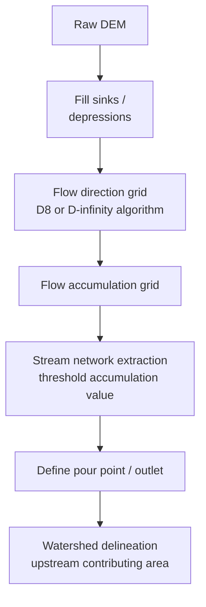

## Surface Water Systems and Watersheds

### Definitions and Core Concepts

A **watershed** (also called a catchment or drainage basin) is the total land area that drains surface water to a common outlet, such as a river mouth, lake, or confluence point. Every point on Earth's land surface belongs to some watershed, and watersheds are hierarchically nested — small sub-watersheds combine into larger ones, ultimately draining to an ocean or an endorheic (closed) basin.

A **surface water system** encompasses all water bodies that exist on the land surface and are hydrologically connected within a watershed: rivers, streams, lakes, ponds, wetlands, and reservoirs, along with the temporary flow paths (overland flow, ephemeral channels) that connect them.

Key defining boundaries:

- **Drainage divide (watershed boundary)**: the topographic high ground separating one watershed from an adjacent one; water on either side flows to different outlets.
- **Stream order**: a classification (Strahler system) describing a stream's position in the branching network — first-order streams are the smallest unbranched headwater tributaries, and order increases only when two streams of equal order merge.
- **Drainage density**: the total length of stream channels per unit area of watershed, an indicator of landscape permeability, climate, and erosion characteristics.

### Watershed Delineation

Watershed boundaries are determined by topography, since surface water flows downhill along the steepest gradient (in the absence of engineered diversion).

**Manual/topographic method**: Draw perpendicular lines to contour lines on a topographic map, connecting ridge lines and high points surrounding the outlet point of interest. The resulting enclosed area is the watershed.

**Digital Elevation Model (DEM) method**: Modern watershed delineation is performed computationally using GIS software (e.g., ArcGIS Hydrology toolset, QGIS with GRASS, or open-source tools like WhiteboxTools) on a DEM, following this general workflow:

The **D8 algorithm** assigns flow from each cell to one of its eight neighboring cells based on steepest descent; the **D-infinity algorithm** allows flow to be split across multiple downslope directions, providing more realistic representation on complex terrain. Flow accumulation grids show, for each cell, the number of upstream cells draining through it — cells above a chosen threshold are classified as stream channels.

### Watershed Hydrologic Components and the Water Balance

Surface water systems are governed by the terrestrial water balance equation:

$$P = ET + Q + \Delta S$$

where $P$ is precipitation, $ET$ is evapotranspiration, $Q$ is runoff (streamflow leaving the watershed), and $\Delta S$ is the change in water storage (soil moisture, groundwater, surface water bodies) over the accounting period.

**Key processes**:

- **Interception**: precipitation captured by vegetation canopy before reaching the ground, later lost to evaporation.
- **Infiltration**: water entering the soil surface, governed by soil texture, saturation state, and land cover; infiltration rate typically follows a Horton-type or Green-Ampt decay curve as soil saturates during a storm.
- **Overland flow (Hortonian flow)**: occurs when rainfall intensity exceeds the soil's infiltration capacity, generating surface runoff directly.
- **Saturation-excess overland flow**: occurs when soil becomes fully saturated (common in wetlands, valley bottoms, and during prolonged rain), causing runoff even at low rainfall intensity.
- **Interflow (subsurface stormflow)**: lateral water movement through shallow soil layers, contributing to streamflow with a delay relative to direct overland flow.
- **Baseflow**: the sustained, slowly-varying component of streamflow derived from groundwater discharge, maintaining stream flow between precipitation events.

### The Hydrograph

A **hydrograph** is a plot of streamflow discharge ($Q$, typically in $m^3/s$) versus time at a given point in a watershed, and is the primary tool for characterizing watershed response to precipitation.

Key hydrograph features:

- **Rising limb**: the increase in discharge following the onset of a storm, reflecting arrival of overland flow and quick interflow.
- **Peak discharge**: the maximum flow rate during the event.
- **Lag time**: the interval between the center of mass of rainfall and the peak of the resulting hydrograph, a key watershed response-time metric.
- **Falling limb (recession curve)**: the decline in discharge after the peak, initially reflecting depletion of quick flow paths, then transitioning to a baseflow recession dominated by groundwater discharge.
- **Baseflow separation**: analytical techniques (straight-line method, master recession curve method, digital filters) used to partition a hydrograph into baseflow and direct runoff components.

Watershed characteristics that shape hydrograph shape include:

- **Watershed size and shape**: larger and more elongated watersheds produce longer lag times and flatter, broader peaks; compact watersheds produce sharper, more concentrated peaks.
- **Drainage density and channel network efficiency**: denser networks route water to the outlet faster, producing flashier hydrographs.
- **Land cover**: urbanized, impervious watersheds produce flashy hydrographs with high, rapid peaks and short lag times due to reduced infiltration; forested watersheds produce more attenuated, delayed responses.
- **Antecedent soil moisture**: wetter initial conditions reduce infiltration capacity and increase runoff generation for a given storm.

### Stream Order and Drainage Patterns

**Strahler stream ordering**:

- Two first-order streams join to form a second-order stream.
- Two second-order streams join to form a third-order stream.
- A lower-order stream joining a higher-order stream does not increase the order (e.g., a first-order stream joining a third-order stream leaves it as third-order).

**Drainage patterns**, which reflect underlying geology and topography:

- **Dendritic**: tree-like branching pattern, typical of homogeneous, gently-sloping bedrock or sediment with uniform resistance to erosion — the most common global pattern.
- **Trellis**: parallel main channels with short right-angle tributaries, typical of alternating hard and soft rock layers in folded terrain (e.g., the Appalachian Ridge and Valley province).
- **Radial**: streams flowing outward from a central high point, typical of volcanic cones or domal uplifts.
- **Rectangular**: right-angle bends controlled by jointed or faulted bedrock.
- **Parallel**: streams flowing in a consistently uniform direction, typical of steep, uniform slopes or strongly-oriented bedrock structure.

### Lakes, Wetlands, and Reservoirs as Watershed Storage

Surface water bodies function as storage elements that modulate the timing and magnitude of watershed discharge.

**Lakes and reservoirs** attenuate flood peaks by temporarily storing inflow and releasing it more gradually, an effect quantified through **flood routing** techniques (e.g., the Muskingum method), which relate storage $S$ to a weighted combination of inflow $I$ and outflow $O$:

$$S = K[xI + (1-x)O]$$

where $K$ is a storage time constant and $x$ is a weighting factor reflecting the relative influence of inflow versus outflow on storage (typically $0 \le x \le 0.5$ for natural channels).

**Wetlands** provide several watershed-scale hydrologic functions:

- Flood attenuation through temporary water storage and slowed conveyance.
- Groundwater recharge (for wetlands hydrologically connected to underlying aquifers) or discharge (groundwater-fed wetlands).
- Water quality improvement through sediment trapping, nutrient uptake (denitrification), and pollutant filtration — often termed the "kidneys" of a watershed.

### Land Use Impacts on Surface Water Systems

**Urbanization** is among the most significant anthropogenic alterations to watershed hydrology:

- Impervious surfaces (pavement, rooftops) reduce infiltration and increase the volume and speed of runoff, elevating peak discharge and reducing lag time — the "urban hydrograph" is characteristically flashier and higher-peaked than the pre-development condition.
- Stormwater infrastructure (storm drains, culverts) further accelerates conveyance to receiving streams, compounding flashiness.
- Reduced baseflow can result from decreased infiltration and groundwater recharge, sometimes causing streams to run dry between storms in heavily urbanized watersheds.

**Deforestation and agricultural conversion**:

- Removal of vegetation reduces interception and evapotranspiration, generally increasing runoff volume and peak flows, though the magnitude depends heavily on soil type, slope, and climate. [Inference: watershed-specific responses vary; some studies show more modest hydrologic change where soils have high infiltration capacity regardless of cover]
- Agricultural drainage (tile drains, ditching) accelerates water routing off fields, increasing peak flows and altering natural wetland storage function.
- Soil compaction from agricultural equipment or grazing can reduce infiltration capacity similarly to urban impervious surfaces, though less severely.

**Channelization and levee construction**:

- Straightening and hardening stream channels increases flow velocity and reduces natural floodplain storage, often increasing downstream flood peaks even while reducing local flooding.
- Levees disconnect rivers from their historic floodplains, eliminating natural flood attenuation and sediment deposition processes, and can increase flood risk downstream of the leveed reach.

### Water Quality in Surface Water Systems

Watershed land use directly governs the pollutant loads reaching surface water bodies through the following primary transport mechanisms:

- **Point source pollution**: discharges from an identifiable single location (wastewater treatment outfalls, industrial discharge pipes), regulated in the US under the National Pollutant Discharge Elimination System (NPDES) permit program.
- **Nonpoint source pollution**: diffuse pollution carried by runoff across the landscape (agricultural nutrient and pesticide runoff, urban stormwater pollutants, atmospheric deposition), generally more difficult to regulate and monitor than point sources.
- **Eutrophication**: nutrient enrichment (particularly nitrogen and phosphorus) from agricultural runoff and wastewater leading to excessive algal growth, subsequent decomposition-driven oxygen depletion, and hypoxic "dead zones" — a well-documented watershed-scale phenomenon in systems such as the Mississippi River-Gulf of Mexico basin.
- **Total Maximum Daily Load (TMDL)**: a regulatory framework under the US Clean Water Act establishing the maximum pollutant load a water body can receive while still meeting water quality standards, allocated across point and nonpoint sources within the watershed.

### Watershed Management Approaches

**Integrated Watershed Management (IWM)** treats the watershed as the fundamental planning unit for water resource and land use decisions, recognizing that actions anywhere in the watershed affect downstream conditions. Core elements typically include:

- Stakeholder collaboration across jurisdictional boundaries (since watersheds rarely align with political boundaries).
- Best Management Practices (BMPs) for agricultural and urban runoff control (buffer strips, cover cropping, detention basins, bioswales, permeable pavement).
- Riparian buffer restoration to stabilize streambanks, filter runoff, and provide shade that moderates stream temperature.
- Monitoring programs tracking streamflow, water quality, and aquatic habitat condition over time.

**Low Impact Development (LID) / Green Infrastructure**: an urban watershed management strategy emphasizing decentralized, small-scale controls that mimic natural hydrology, including:

- Bioretention cells and rain gardens
- Permeable pavement
- Green roofs
- Constructed wetlands and detention/retention ponds

### Worked Example: Estimating Peak Runoff with the Rational Method

**Scenario**: A small urban watershed of 25 hectares has a composite runoff coefficient $C = 0.65$ (reflecting a mix of impervious and pervious surfaces) and experiences a design storm with rainfall intensity $i = 50\ mm/hr$ for a duration equal to the watershed's time of concentration.

The **Rational Method**, widely used for peak flow estimation in small (typically less than a few hundred hectares) urban watersheds, is:

$$Q_p = \frac{C \cdot i \cdot A}{360}$$

where $Q_p$ is peak discharge in $m^3/s$, $C$ is the dimensionless runoff coefficient, $i$ is rainfall intensity in $mm/hr$, $A$ is watershed area in hectares, and 360 is a unit conversion constant for this parameter set.

**Calculation**:

$$Q_p = \frac{0.65 \times 50 \times 25}{360} = \frac{812.5}{360} \approx 2.26\ m^3/s$$

**Interpretation**: This estimated peak discharge would inform the sizing of downstream stormwater conveyance infrastructure (culverts, detention basin outlets) to safely handle the design storm event. The Rational Method assumes uniform rainfall intensity across the watershed and a constant runoff coefficient, assumptions that become less valid as watershed size and land use heterogeneity increase — for larger or more complex watersheds, distributed hydrologic models (e.g., HEC-HMS, SWAT) are generally preferred. [Inference: model choice in practice depends on regulatory requirements, available data, and required accuracy, which vary by jurisdiction and project scale]

### Illustration: Watershed Cross-Section and Drainage Divide

<svg xmlns="http://www.w3.org/2000/svg" viewBox="0 0 700 320">
<text x="350" y="25" font-size="16" font-weight="bold" text-anchor="middle" fill="#1a1a1a">Watershed Cross-Section and Drainage Divide (svg_diagram)</text>
<path d="M 30 260 Q 120 100 220 150 Q 320 190 350 260 Q 380 190 480 150 Q 580 100 670 260 Z" fill="#d9e8d4" stroke="#4a7a3a" stroke-width="2" />
<line x1="220" y1="150" x2="220" y2="280" stroke="#999" stroke-width="1" stroke-dasharray="4,3" />
<line x1="480" y1="150" x2="480" y2="280" stroke="#999" stroke-width="1" stroke-dasharray="4,3" />
<circle cx="220" cy="150" r="5" fill="#b83b2f" />
<circle cx="480" cy="150" r="5" fill="#b83b2f" />
<text x="220" y="135" font-size="11" text-anchor="middle" fill="#b83b2f">Ridge (divide)</text>
<text x="480" y="135" font-size="11" text-anchor="middle" fill="#b83b2f">Ridge (divide)</text>
<path d="M 220 150 Q 280 200 350 255" stroke="#2c5f8a" stroke-width="2.5" fill="none" marker-end="url(#arrow)" />
<path d="M 480 150 Q 420 200 350 255" stroke="#2c5f8a" stroke-width="2.5" fill="none" marker-end="url(#arrow)" />
<ellipse cx="350" cy="262" rx="18" ry="8" fill="#2c5f8a" />
<text x="350" y="295" font-size="12" text-anchor="middle" fill="#1a1a1a">Stream / Outlet</text>

<text x="100" y="200" font-size="12" text-anchor="middle" fill="`#1a1a1a`">Watershed A</text>

<text x="600" y="200" font-size="12" text-anchor="middle" fill="`#1a1a1a`">Watershed B</text>

<line x1="30" y1="280" x2="670" y2="280" stroke="#8a6a4a" stroke-width="3" />
</svg>

### Related Topics

- Groundwater–surface water interaction and hyporheic exchange
- Rainfall-runoff modeling (SWAT, HEC-HMS, TOPMODEL)
- Flood frequency analysis and return period statistics
- River channel morphology and fluvial geomorphology
- Riparian buffer design and stream restoration techniques
- Total Maximum Daily Load (TMDL) implementation
- Stormwater management and green infrastructure design
- Transboundary watershed governance and interstate water compacts
- Snowmelt-driven hydrology and mountain watershed dynamics
- Remote sensing applications in watershed monitoring