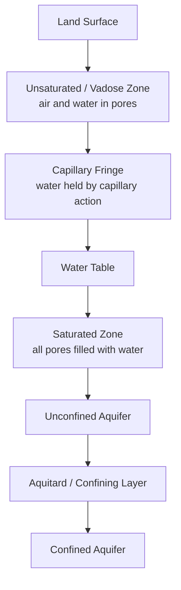

## Groundwater and Aquifer Systems

### Definitions and Core Terminology

**Groundwater** is water stored in and moving through the pore spaces and fractures of subsurface geologic materials (soil, sediment, and rock). It represents the largest accessible freshwater reservoir on Earth, exceeding the combined volume of all surface freshwater lakes and rivers.

**Aquifer**: a geologic formation capable of storing and transmitting usable quantities of groundwater. Key sub-classifications:

- **Unconfined aquifer**: bounded above by the water table (the surface where pore water pressure equals atmospheric pressure) rather than an impermeable layer; directly recharged by infiltration from the overlying land surface.
- **Confined aquifer**: bounded above (and typically below) by a low-permeability layer, causing the water within it to be under pressure greater than atmospheric; also called an artesian aquifer.
- **Perched aquifer**: a localized zone of saturation above the regional water table, formed where a discontinuous low-permeability lens intercepts downward-percolating water.

**Aquitard**: a geologic layer of low permeability that restricts groundwater flow but may still transmit small quantities; **aquiclude** and **aquifuge** describe layers that are effectively or completely impermeable, respectively.

**Water table**: the upper boundary of the saturated zone in an unconfined aquifer, generally following (in subdued form) the overlying land surface topography, and fluctuating seasonally with recharge and discharge.

**Potentiometric surface**: for a confined aquifer, the imaginary surface representing the level to which water would rise in a well penetrating the aquifer, analogous to the water table but reflecting pressure head rather than a physical saturated surface.

### Subsurface Zonation

- **Vadose (unsaturated) zone**: pore spaces contain both air and water; water movement here is governed by both gravity and matric suction, described by the Richards equation in variably-saturated flow theory.
- **Capillary fringe**: a thin zone directly above the water table where pores remain nearly saturated due to capillary forces despite being technically above the water table.
- **Saturated zone**: pore spaces are completely filled with water; this is the zone from which wells extract usable groundwater.

### Aquifer Properties

**Porosity ($n$)**: the fraction of total rock or sediment volume that is void space, expressed as:

$$n = \frac{V_v}{V_t}$$

where $V_v$ is void volume and $V_t$ is total volume. Porosity varies substantially by material — unconsolidated sands and gravels typically exhibit high porosity (25–50%), while dense crystalline rock exhibits very low primary porosity (under 5%) unless secondary fracturing is present.

**Specific yield ($S_y$) and specific retention ($S_r$)**: porosity partitions into water that will drain freely under gravity (specific yield) and water retained against gravity by molecular and surface tension forces (specific retention), such that $n = S_y + S_r$. Specific yield governs the actual usable water volume released from an unconfined aquifer per unit water table decline.

**Hydraulic conductivity ($K$)**: a measure of a material's ability to transmit water, dependent on both the properties of the medium (pore size, connectivity) and the fluid (viscosity, density). Values span many orders of magnitude, from over $10^{-2}\ m/s$ in clean gravel to below $10^{-12}\ m/s$ in unfractured clay or shale.

**Transmissivity ($T$)**: the rate at which water is transmitted through the full saturated thickness of an aquifer, defined as:

$$T = K \cdot b$$

where $K$ is hydraulic conductivity and $b$ is the saturated aquifer thickness.

**Storativity ($S$)**: the volume of water an aquifer releases from or takes into storage per unit surface area per unit change in head. For confined aquifers, storativity is small (typically $10^{-5}$ to $10^{-3}$) because release occurs primarily through minor compression of the aquifer matrix and expansion of water as pressure declines, rather than physical dewatering of pores. For unconfined aquifers, storativity approximates specific yield ($S \approx S_y$), typically 0.01–0.3, because water is physically drained from pore spaces.

### Groundwater Flow: Darcy's Law

Groundwater movement through porous media is governed by **Darcy's Law**, the foundational equation of quantitative hydrogeology:

$$Q = -K \cdot A \cdot \frac{dh}{dl}$$

where $Q$ is volumetric flow rate, $K$ is hydraulic conductivity, $A$ is the cross-sectional area of flow, and $\frac{dh}{dl}$ is the hydraulic gradient (change in head per unit distance along the flow path). The negative sign indicates flow occurs in the direction of decreasing head.

Darcy's Law is empirically valid for laminar flow conditions typical of most granular aquifer materials (low Reynolds number), but breaks down in highly conductive media such as karst conduits or large fractures where flow becomes turbulent. [Inference: the specific Reynolds number threshold at which Darcy's Law becomes invalid varies with grain size and pore geometry, and is typically assessed case-by-case in fractured or karst settings]

**Specific discharge (Darcy velocity)** $q = Q/A$ represents flow per unit total cross-sectional area (including solids), not the actual velocity of water molecules. The **average linear (seepage) velocity** — relevant for contaminant transport time estimates — corrects for the fact that flow only occurs through pore space:

$$v = \frac{q}{n_e}$$

where $n_e$ is effective porosity (interconnected pore space contributing to flow).

### Well Hydraulics and Aquifer Testing

**Cone of depression**: pumping a well lowers the water table or potentiometric surface in a radially symmetric, funnel-shaped depression centered on the well, with drawdown decreasing with distance from the well.

**Theis equation**: the standard analytical solution for transient (time-dependent) drawdown in a confined aquifer under constant pumping rate, based on an analogy to heat conduction:

$$s = \frac{Q}{4\pi T} W(u)$$

where $s$ is drawdown, $Q$ is pumping rate, $T$ is transmissivity, and $W(u)$ is the "well function," a mathematical function of the dimensionless parameter $u$, which itself depends on storativity, distance from the well, transmissivity, and elapsed pumping time.

**Cooper-Jacob approximation**: a simplified, widely-used form of the Theis solution valid for sufficiently large pumping times, allowing transmissivity and storativity to be estimated from a semi-logarithmic plot of drawdown versus the logarithm of time — a standard method in field pumping test analysis.

**Aquifer pumping tests** are the standard field method for characterizing $T$ and $S$: a well is pumped at a controlled, constant rate while drawdown is monitored in the pumping well and nearby observation wells over time, and the resulting drawdown data are fit to the Theis or related analytical solutions (or numerical models for complex geology) to back-calculate aquifer parameters.

### Groundwater Recharge and Discharge

**Recharge mechanisms**:

- **Diffuse recharge**: infiltration of precipitation distributed across the land surface, percolating through the vadose zone to reach the water table; rates depend on precipitation, soil permeability, vegetation, and land use.
- **Focused/localized recharge**: infiltration concentrated in specific landscape features such as streambeds (losing streams), playas, sinkholes, and constructed infiltration basins.
- **Managed Aquifer Recharge (MAR)**: deliberate engineering approaches to enhance recharge, including spreading basins, infiltration galleries, and aquifer storage and recovery (ASR) wells that inject treated surface water directly into aquifers for later extraction.

**Discharge mechanisms**:

- Baseflow contribution to streams, lakes, and wetlands (gaining streams/water bodies).
- Springs, where the water table or a confined aquifer's potentiometric surface intersects the land surface.
- Evapotranspiration directly from shallow water tables (particularly in arid regions with phreatophytic vegetation).
- Submarine groundwater discharge at coastlines.

### Groundwater–Surface Water Interaction

Streams and aquifers exchange water bidirectionally depending on relative head levels:

- **Gaining streams**: the water table is higher than the stream stage, so groundwater flows into the stream, sustaining baseflow.
- **Losing streams**: the stream stage is higher than the local water table, so surface water infiltrates downward to recharge the aquifer; if the water table is disconnected from the streambed by an unsaturated zone, the stream is termed a "disconnected losing stream."
- **Hyporheic zone**: the subsurface region beneath and adjacent to a streambed where surface water and groundwater actively mix, important for nutrient cycling, temperature buffering, and aquatic habitat.

### Land Subsidence and Overdraft

**Groundwater overdraft** occurs when extraction rates exceed natural (or managed) recharge over a sustained period, leading to progressive water table (or potentiometric surface) decline.

**Land subsidence** is a major consequence in unconsolidated, compressible aquifer systems (particularly those with significant clay/silt interbeds): as pore pressure declines during pumping, effective stress on the aquifer skeleton increases, causing compaction of fine-grained sediments. This compaction is frequently permanent (inelastic) once a critical stress threshold is exceeded, meaning subsidence generally cannot be reversed even if water levels later recover — a widely-documented issue in basins such as California's Central Valley and parts of Mexico City and Jakarta.

**Seawater intrusion**: in coastal aquifers, excessive pumping can disturb the natural equilibrium between fresh groundwater and underlying saline water (described by the Ghyben-Herzberg relation, which relates the depth of the freshwater-saltwater interface below sea level to the height of the freshwater table above sea level), drawing saline water landward and contaminating freshwater wells.

### Groundwater Contamination and Vulnerability

Common contamination sources and mechanisms:

- **Point sources**: leaking underground storage tanks, landfills, septic systems, industrial spill sites, and abandoned mines.
- **Nonpoint sources**: agricultural fertilizer and pesticide application, atmospheric deposition, and widespread septic system use in unsewered areas.
- **Contaminant transport**: governed by advection (bulk fluid movement per Darcy's Law), dispersion (mechanical mixing and molecular diffusion causing plume spreading), and retardation (chemical interaction with the aquifer matrix, such as sorption, that slows contaminant movement relative to the bulk groundwater flow).

**Aquifer vulnerability** to contamination depends on the thickness and permeability of the overlying vadose zone (thin, permeable vadose zones over unconfined aquifers are most vulnerable), while confining layers over confined aquifers generally provide substantial (though not absolute) protection.

**DRASTIC** is a widely used index-based method for mapping relative groundwater contamination vulnerability, incorporating **D**epth to water, **R**echarge rate, **A**quifer media, **S**oil media, **T**opography (slope), **I**mpact of the vadose zone, and hydraulic **C**onductivity.

### Karst Aquifer Systems

Karst aquifers form in soluble rock (primarily limestone, dolomite, and gypsum) through chemical dissolution, producing highly heterogeneous flow systems that behave fundamentally differently from granular porous-media aquifers:

- Flow is concentrated in solutionally-enlarged fractures and conduits, which can produce turbulent, pipe-like flow rather than the laminar Darcian flow assumed in standard porous-media analysis.
- Karst systems are characterized by extreme spatial heterogeneity, rapid recharge through sinkholes and swallow holes, and very high vulnerability to contamination due to limited natural filtration.
- Distinctive surface expressions include sinkholes, disappearing streams, and springs with highly variable discharge that responds rapidly to precipitation events.

### Groundwater Management Frameworks

**Sustainable yield**: the extraction rate that can be maintained over the long term without causing undesirable results (chronic water table decline, subsidence, seawater intrusion, streamflow depletion, or ecological harm) — a concept distinct from and generally more conservative than simply matching average annual recharge, since some recharge sustains baseflow and ecosystems that groundwater management must also protect.

**Conjunctive use**: coordinated management of groundwater and surface water supplies, often using groundwater storage during wet periods (via managed recharge) as a buffer against surface water shortages during drought.

**Regulatory frameworks** (illustrative, not exhaustive): the US Sustainable Groundwater Management Act (SGMA, California, 2014) requires local groundwater sustainability agencies to develop plans achieving sustainable yield in designated high- and medium-priority basins over a defined implementation timeline; many other jurisdictions worldwide employ permitting systems, extraction caps, or water rights allocation frameworks with varying degrees of enforcement. [Unverified: implementation effectiveness and enforcement rigor vary substantially by jurisdiction and are subject to ongoing policy change]

### Worked Example: Estimating Well Yield Using the Cooper-Jacob Method

**Scenario**: A confined aquifer pumping test is conducted at a constant rate $Q = 0.05\ m^3/s$. An observation well 100 m away shows the following semi-log relationship: drawdown increases by $\Delta s = 0.6\ m$ per log cycle of time (i.e., per 10-fold increase in elapsed time since pumping began).

The Cooper-Jacob approximation gives transmissivity as:

$$T = \frac{2.3 Q}{4\pi \Delta s}$$

**Calculation**:

$$T = \frac{2.3 \times 0.05}{4\pi \times 0.6} = \frac{0.115}{7.540} \approx 0.0153\ m^2/s$$

**Interpretation**: This transmissivity value (approximately $1.53 \times 10^{-2}\ m^2/s$) falls within the range typical of moderately productive sand and gravel aquifers. Combined with an independently-estimated storativity value (derived from the time-axis intercept of the same semi-log plot), this parameter set could be used to predict drawdown at other distances and pumping durations, informing well spacing and sustainable extraction rate decisions. Field results in practice should be interpreted alongside site-specific geology, since the Theis and Cooper-Jacob methods assume idealized aquifer conditions (homogeneous, isotropic, infinite lateral extent, uniform initial thickness) that real aquifers only approximate. [Inference: the degree of deviation from these idealized assumptions, and thus the reliability of derived parameters, is site-specific and generally assessed through comparison with independent geologic and well-log data]

### Illustration: Confined vs. Unconfined Aquifer System

<svg xmlns="http://www.w3.org/2000/svg" viewBox="0 0 700 340">
<text x="350" y="25" font-size="16" font-weight="bold" text-anchor="middle" fill="#1a1a1a">Confined vs. Unconfined Aquifer System (svg_diagram)</text>
<rect x="40" y="60" width="620" height="30" fill="#c9a876" />
<text x="60" y="80" font-size="11" fill="#1a1a1a">Land Surface</text>
<rect x="40" y="90" width="620" height="50" fill="#e8dcc0" />
<text x="60" y="118" font-size="11" fill="#1a1a1a">Vadose Zone (unsaturated)</text>
<path d="M 40 140 L 660 140" stroke="#2c5f8a" stroke-width="2" stroke-dasharray="6,3" />
<text x="480" y="135" font-size="11" fill="#2c5f8a">Water Table</text>
<rect x="40" y="140" width="620" height="60" fill="#a8c8e0" />
<text x="60" y="175" font-size="11" fill="#1a1a1a">Unconfined Aquifer</text>
<rect x="40" y="200" width="620" height="30" fill="#6b5a45" />
<text x="60" y="220" font-size="11" fill="#fff">Aquitard (confining layer)</text>
<rect x="40" y="230" width="620" height="60" fill="#7fa8cc" />
<text x="60" y="265" font-size="11" fill="#1a1a1a">Confined Aquifer</text>
<line x1="200" y1="60" x2="200" y2="290" stroke="#333" stroke-width="6" />
<text x="205" y="55" font-size="10" fill="#1a1a1a">Unconfined well</text>
<line x1="200" y1="60" x2="200" y2="160" stroke="#fff" stroke-width="2" stroke-dasharray="2,2" />
<line x1="450" y1="30" x2="450" y2="290" stroke="#333" stroke-width="6" />
<text x="455" y="25" font-size="10" fill="#1a1a1a">Artesian well</text>
<path d="M 445 30 Q 435 45 450 60" stroke="#2c5f8a" stroke-width="2" fill="none" />
<text x="415" y="45" font-size="9" fill="#2c5f8a">Potentiometric</text>
<text x="415" y="56" font-size="9" fill="#2c5f8a">surface</text>
<rect x="40" y="290" width="620" height="20" fill="#5a4a38" />
</svg>

### Related Topics

- Darcy's Law derivations and anisotropic hydraulic conductivity
- Aquifer pumping test design and analytical solution selection
- Managed Aquifer Recharge (MAR) and Aquifer Storage and Recovery (ASR)
- Land subsidence monitoring (InSAR remote sensing applications)
- Seawater intrusion modeling and coastal aquifer management
- Contaminant transport modeling (advection-dispersion equation)
- Karst hydrogeology and dye-tracing methods
- Groundwater-dependent ecosystems and environmental flow requirements
- Numerical groundwater modeling (MODFLOW architecture and setup)
- Transboundary aquifer governance and international water law