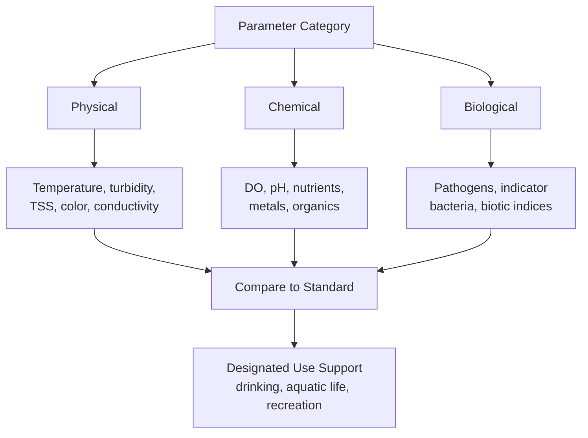

## Water Quality Parameters and Standards

### Conceptual Framework

Water quality is assessed through physical, chemical, and biological parameters, each reflecting different aspects of a water body's condition and its suitability for a designated use (drinking water, aquatic life support, recreation, irrigation, industrial use). Standards translate these parameters into enforceable or advisory numeric or narrative limits, typically set with reference to human health thresholds, aquatic toxicity data, or aesthetic/nuisance considerations.

The overall assessment logic follows a consistent structure:

### Physical Parameters

**Temperature**

Governs dissolved oxygen solubility (inversely related — warmer water holds less oxygen), metabolic and reproductive rates of aquatic organisms, and chemical reaction rates. Thermal standards are often expressed as maximum allowable temperature or maximum permissible increase above ambient/background conditions, since many aquatic species (particularly coldwater fish such as trout and salmon) have narrow thermal tolerance ranges.

**Turbidity**

A measure of water clarity based on light scattering by suspended particles, expressed in Nephelometric Turbidity Units (NTU). High turbidity reduces light penetration (impairing photosynthesis by aquatic plants and algae), can clog fish gills, and interferes with disinfection efficacy in drinking water treatment by shielding pathogens from UV or chemical disinfectants. The US EPA Surface Water Treatment Rule sets turbidity performance standards for filtered drinking water systems (generally requiring treated water turbidity below 1 NTU, with a 0.3 NTU threshold for at least 95% of samples in systems using conventional or direct filtration). [Unverified: exact numeric thresholds and monitoring frequencies are subject to periodic regulatory revision and should be confirmed against current EPA rule text for compliance purposes]

**Total Suspended Solids (TSS)**

The mass of particulate matter suspended in a water sample, measured gravimetrically by filtration and drying, typically reported in mg/L. TSS is closely related to but distinct from turbidity (an optical measurement); both generally increase with erosion, stormwater runoff, and algal biomass.

**Total Dissolved Solids (TDS)**

The mass of dissolved inorganic and organic substances remaining after filtration and evaporation of a water sample, reflecting overall mineral content. TDS correlates with electrical conductivity and is relevant to both drinking water aesthetics (taste) and irrigation suitability (high TDS can contribute to soil salinization).

**Electrical Conductivity (EC)**

A measure of water's capacity to conduct electrical current, which increases with dissolved ion concentration; commonly used as a rapid proxy for salinity and TDS in the field.

### Chemical Parameters

**Dissolved Oxygen (DO)**

The concentration of molecular oxygen dissolved in water, essential for aquatic respiration and a primary indicator of overall ecosystem health. DO solubility decreases with increasing temperature and decreasing atmospheric pressure (elevation). Most regulatory standards for aquatic life protection specify a minimum DO threshold (commonly in the range of 4–6 mg/L for warmwater fisheries and higher for coldwater fisheries, though exact values vary by jurisdiction and designated use). Severe DO depletion (hypoxia, generally below approximately 2 mg/L) causes fish kills and shifts benthic communities toward pollution-tolerant, low-oxygen-adapted organisms.

**Biochemical Oxygen Demand (BOD) and Chemical Oxygen Demand (COD)**

BOD measures the oxygen consumed by microorganisms decomposing organic matter in a water sample over a standardized incubation period (typically 5 days, denoted $BOD_5$), serving as a proxy for organic pollution load and its potential to deplete DO in receiving waters. COD measures the oxygen equivalent of material oxidizable by a strong chemical oxidant, capturing both biodegradable and non-biodegradable organic matter, and is typically higher than BOD for the same sample.

**pH**

A measure of hydrogen ion activity on a logarithmic scale, indicating acidity or alkalinity:

$$pH = -\log_{10}[H^+]$$

Most freshwater aquatic life standards specify a range (commonly approximately 6.5–9.0, though specific values vary by jurisdiction) since both acidic and highly alkaline conditions stress or kill aquatic organisms and affect the solubility and toxicity of other constituents (e.g., ammonia toxicity increases sharply at higher pH).

**Nutrients: Nitrogen and Phosphorus**

Nitrogen occurs in water in multiple forms (ammonia $NH_3/NH_4^+$, nitrite $NO_2^-$, nitrate $NO_3^-$, organic nitrogen), each with distinct toxicity and regulatory significance. Nitrate is regulated in drinking water (US EPA Maximum Contaminant Level of 10 mg/L as nitrogen) primarily due to methemoglobinemia ("blue baby syndrome") risk in infants. Phosphorus (as orthophosphate or total phosphorus) is typically the limiting nutrient for algal growth in freshwater systems, making it a primary regulatory target for eutrophication control, whereas nitrogen is more commonly limiting in estuarine and marine systems.

**Heavy Metals**

Metals of particular regulatory concern include lead, arsenic, mercury, cadmium, and chromium, each with distinct toxicity mechanisms and drinking water standards set at the low parts-per-billion (µg/L) level given their toxicity even at trace concentrations. Lead is notable for having no established safe exposure threshold in current health guidance and for the US EPA's regulatory approach (the Lead and Copper Rule) using an "action level" triggering treatment technique requirements rather than a conventional Maximum Contaminant Level, because lead contamination typically originates from plumbing corrosion rather than the source water itself.

**Synthetic Organic Contaminants**

Includes pesticides, industrial solvents, and per- and polyfluoroalkyl substances (PFAS) — a large class of persistent synthetic compounds ("forever chemicals") that have become a major focus of recent drinking water regulation due to their environmental persistence, bioaccumulation potential, and associations with adverse health effects at very low concentrations. In April 2024, the US EPA finalized the first federal Maximum Contaminant Levels for six PFAS compounds in drinking water, including individual limits of 4.0 parts per trillion for PFOA and PFOS. [Unverified: implementation timelines, compliance deadlines, and the regulatory status of this rule may be subject to legal challenge or administrative revision; verify current status against EPA's official rule page for compliance purposes]

### Biological Parameters

**Indicator Organisms**

Rather than testing directly for the wide range of pathogenic bacteria, viruses, and protozoa that may be present, water quality monitoring commonly uses indicator organisms whose presence signals a risk of fecal contamination:

- **Total coliforms**: a broad bacterial group used as a general indicator, though not fecal-specific.
- **Fecal coliforms and *E. coli***: more specific indicators of fecal contamination, with *E. coli* increasingly preferred in modern standards due to its stronger correlation with actual gastrointestinal illness risk in epidemiological studies.
- **Enterococci**: commonly used for marine recreational water quality standards due to greater persistence in saline environments compared to *E. coli*.

**Biotic Indices**

Biological monitoring using the presence, absence, and relative abundance of indicator taxa (particularly benthic macroinvertebrates) provides an integrated assessment of water quality over time, capturing cumulative and intermittent stressors that periodic chemical sampling may miss.

- Pollution-sensitive taxa (many mayflies, stoneflies, caddisflies — collectively "EPT taxa") indicate high water quality.
- Pollution-tolerant taxa (certain worms, midges, leeches) dominate in degraded conditions.
- Common indices include the Hilsenhoff Biotic Index and various multimetric Indices of Biotic Integrity (IBI), which combine multiple community metrics (taxa richness, tolerance composition, functional feeding groups) into a composite score.

### Regulatory Frameworks

**US Safe Drinking Water Act (SDWA)**

Establishes **Maximum Contaminant Levels (MCLs)** — enforceable limits on contaminant concentration in public drinking water systems — and **Maximum Contaminant Level Goals (MCLGs)**, non-enforceable health-based targets set at the level below which no known or anticipated adverse health effects occur (set to zero for carcinogens with no safe threshold). Where MCLs are not economically or technically feasible to enforce directly (e.g., for lead), the SDWA framework uses **Treatment Technique (TT)** requirements instead.

**US Clean Water Act (CWA)**

Governs the quality of surface waters (rivers, lakes, wetlands, coastal waters) rather than drinking water at the tap, through several key mechanisms:

- **National Pollutant Discharge Elimination System (NPDES)**: permits regulating point source discharges.
- **Water Quality Standards**: states and tribes designate uses for water bodies (aquatic life support, drinking water supply, recreation, agriculture) and set numeric or narrative criteria to protect those uses.
- **Section 303(d) Impaired Waters List and TMDLs**: water bodies failing to meet standards are listed as impaired, triggering development of a Total Maximum Daily Load allocating allowable pollutant loads across contributing sources.

**World Health Organization (WHO) Guidelines for Drinking-water Quality**

Provides internationally referenced health-based guideline values used by many countries (particularly those without independent extensive regulatory capacity) as the basis for national drinking water standards, distinct from the legally binding EPA/EU frameworks but highly influential globally.

**European Union Water Framework Directive (WFD)**

Establishes an integrated water management approach across EU member states based on river basin districts, requiring member states to achieve "good ecological status" and "good chemical status" for surface waters through a combination of biological, hydromorphological, and physicochemical quality elements — a notably more ecosystem-integrated approach than the primarily chemical-parameter-based US frameworks. [Inference: comparative regulatory stringency between frameworks is contested and depends heavily on the specific parameter and use case being compared]

### Water Quality Indices

**Water Quality Index (WQI)** approaches combine multiple parameters into a single composite score to simplify communication of overall water quality status, typically through a weighted aggregation such as:

$$WQI = \sum_{i=1}^{n} w_i \cdot q_i$$

where $q_i$ is a sub-index score (often 0–100) for parameter $i$ derived from its deviation from an ideal or standard value, and $w_i$ is a weighting factor reflecting that parameter's relative importance to overall water quality (weights typically sum to 1). Numerous WQI formulations exist (e.g., the US National Sanitation Foundation WQI, the Canadian Council of Ministers of the Environment WQI), differing in parameter selection, weighting schemes, and aggregation methods, which limits direct comparability of WQI scores calculated under different formulations. [Inference: because weighting and parameter choices are somewhat subjective design decisions, WQI comparisons across studies using different formulations should be treated cautiously]

### Worked Example: Evaluating Compliance Against a Nutrient Standard

**Scenario**: A stream segment is monitored monthly for total phosphorus over one year, with a state-designated numeric nutrient criterion of 0.1 mg/L (a representative regulatory threshold for protection against eutrophication in wadeable streams).

| Month | TP (mg/L) | Exceeds Standard? |
| --- | --- | --- |
| Jan | 0.06 | No |
| Feb | 0.07 | No |
| Mar | 0.12 | Yes |
| Apr | 0.15 | Yes |
| May | 0.18 | Yes |
| Jun | 0.14 | Yes |
| Jul | 0.11 | Yes |
| Aug | 0.09 | No |
| Sep | 0.08 | No |
| Oct | 0.07 | No |
| Nov | 0.06 | No |
| Dec | 0.05 | No |

**Analysis**: 5 of 12 monthly samples (approximately 42%) exceed the 0.1 mg/L threshold, with exceedances concentrated in the March–July period, consistent with a seasonal pattern often associated with spring fertilizer application and agricultural runoff in temperate watersheds. Under a typical CWA assessment framework, this exceedance frequency would likely be sufficient to list the segment as impaired for nutrients on the state's Section 303(d) list, triggering TMDL development. [Inference: actual listing decisions depend on the specific state's assessment methodology, including minimum sample size requirements and statistical exceedance thresholds, which vary by jurisdiction]

$$\text{Exceedance Rate} = \frac{5}{12} \approx 41.7\%$$

### Illustration: Dissolved Oxygen Sag Curve Below a Pollution Source

<svg xmlns="http://www.w3.org/2000/svg" viewBox="0 0 700 320">
<text x="350" y="25" font-size="16" font-weight="bold" text-anchor="middle" fill="#1a1a1a">Dissolved Oxygen Sag Curve (svg_diagram)</text>
<line x1="70" y1="270" x2="650" y2="270" stroke="#333" stroke-width="1.5" />
<line x1="70" y1="60" x2="70" y2="270" stroke="#333" stroke-width="1.5" />
<text x="360" y="300" font-size="12" text-anchor="middle" fill="#333">Distance Downstream</text>
<text x="30" y="165" font-size="12" text-anchor="middle" fill="#333" transform="rotate(-90 30 165)">DO (mg/L)</text>
<line x1="70" y1="90" x2="650" y2="90" stroke="#4a7a3a" stroke-width="1.5" stroke-dasharray="5,4" />
<text x="560" y="85" font-size="11" fill="#4a7a3a">Saturation DO</text>
<path d="M 70 100 L 150 130 Q 250 230 320 245 Q 400 250 480 200 Q 560 140 650 100" stroke="#2c5f8a" stroke-width="3" fill="none" />
<line x1="150" y1="60" x2="150" y2="270" stroke="#b83b2f" stroke-width="1.5" stroke-dasharray="4,3" />
<text x="155" y="55" font-size="11" fill="#b83b2f">Discharge Point</text>
<circle cx="320" cy="245" r="5" fill="#b83b2f" />
<text x="320" y="230" font-size="11" text-anchor="middle" fill="#b83b2f">Critical Point (min DO)</text>

<text x="200" y="150" font-size="11" fill="`#1a1a1a`">Deoxygenation</text>

<text x="500" y="160" font-size="11" fill="`#1a1a1a`">Reaeration /</text>

<text x="500" y="173" font-size="11" fill="`#1a1a1a`">Recovery</text>

</svg>

### Related Topics

- Streeter-Phelps dissolved oxygen sag modeling
- Eutrophication and harmful algal bloom dynamics
- PFAS occurrence, treatment technologies, and regulatory evolution
- Drinking water treatment train design (coagulation, filtration, disinfection)
- Total Maximum Daily Load (TMDL) development process
- Biomonitoring and Index of Biotic Integrity methodology
- Nonpoint source pollution and agricultural best management practices
- Water Framework Directive ecological status classification
- Emerging contaminants and endocrine-disrupting compounds
- Real-time water quality sensor networks and telemetry