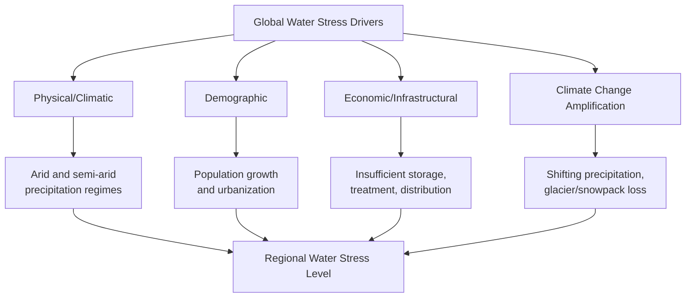

## Global Water Scarcity and Water Stress

### Definitions and Distinctions

**Water scarcity** and **water stress** are related but technically distinct concepts, and conflating them is a common source of imprecision in both media and policy discussion.

- **Physical water scarcity**: a condition where available water resources are insufficient to meet all demands, including environmental flow requirements, even with full infrastructure development. It is fundamentally a supply-side limitation tied to a region's natural hydrology and climate.
- **Economic water scarcity**: a condition where water resources exist in sufficient physical quantity but are inaccessible due to insufficient infrastructure, financial capital, or institutional capacity to capture, treat, and distribute it — common in parts of Sub-Saharan Africa despite relatively higher regional water availability than some water-stressed arid regions.
- **Water stress**: typically operationalized as a ratio measure, most commonly withdrawal-to-availability, expressing the pressure that demand places on renewable water resources regardless of absolute scarcity.

This produces a useful analytical distinction: a region can be water-stressed (high withdrawal relative to supply) without being physically water-scarce in absolute per-capita terms, and vice versa.

### Quantitative Measures

**Falkenmark Water Stress Indicator**

The most widely cited threshold-based measure, expressing water availability per capita per year:

$$WSI = \frac{Q_{renewable}}{P}$$

where $Q_{renewable}$ is total annual renewable freshwater resources (typically in cubic meters) and $P$ is population. Conventional thresholds:

- Above 1,700 m³/person/year: no significant stress
- 1,000–1,700 m³/person/year: water stress
- 500–1,000 m³/person/year: water scarcity
- Below 500 m³/person/year: absolute scarcity

**Criticism of the Falkenmark Indicator**: it uses only supply-side data (population and renewable resources) and does not account for actual usage patterns, infrastructure, storage capacity, or efficiency, meaning two regions with identical per-capita availability can have very different lived experiences of water security. [Inference: this limitation is widely acknowledged in the hydrology literature, though the indicator remains in common use due to its simplicity and low data requirements]

**Water Withdrawal-to-Availability Ratio (Criticality Ratio)**

Used by frameworks such as the WRI Aqueduct Water Risk Atlas and the UN's SDG indicator 6.4.2, this measures the ratio of total freshwater withdrawn to total renewable freshwater available:

$$WS = \frac{\text{Total Freshwater Withdrawal}}{\text{Total Renewable Freshwater Resources}} \times 100$$

Common classification bands (illustrative; exact cutoffs vary slightly by source):

- Below 10%: low stress
- 10–20%: low-to-medium stress
- 20–40%: medium-to-high stress
- 40–80%: high stress
- Above 80%: extremely high stress

**Composite Risk Indices**

Tools such as the WRI Aqueduct framework combine multiple indicators beyond simple withdrawal ratios, including baseline water stress, interannual and seasonal variability, drought risk, flood risk, and groundwater depletion trends, to produce a more holistic water risk assessment for specific basins — increasingly used by corporations and investors for supply chain and asset risk screening. [Unverified: specific current risk classifications for named locations change as underlying data is updated, and should be checked against the live tool rather than assumed static]

### Global Distribution of Water Stress

Regions consistently identified as experiencing high to extremely high baseline water stress include the Middle East and North Africa (MENA), which as a region withdraws water at rates approaching or exceeding renewable supply in several countries; South Asia, particularly the Indus and Ganges basins, driven by very high population density combined with heavy agricultural and municipal demand; and parts of northern China, the western United States, and Central Asia (notably the Aral Sea basin, site of one of the most severe documented cases of anthropogenically-induced water body collapse due to upstream irrigation diversion).

### Drivers of Increasing Water Stress

**Population growth and urbanization**

Rising population directly increases aggregate demand, while urbanization concentrates demand spatially, often outpacing the development of supporting water infrastructure, particularly in rapidly growing cities in the Global South.

**Agricultural demand**

Agriculture accounts for the large majority of global freshwater withdrawal (commonly cited at roughly 70% globally, though this varies significantly by country and economic structure — industrialized economies typically show a lower agricultural share and higher industrial/municipal share). Irrigation efficiency varies widely by method:

- Flood/furrow irrigation: typically 40–50% efficiency (large losses to evaporation, runoff, and deep percolation)
- Sprinkler irrigation: typically 65–75% efficiency
- Drip irrigation: typically 80–90%+ efficiency

**Climate change impacts**

Climate change is projected to intensify water stress through several compounding mechanisms: altered precipitation patterns increasing the frequency and severity of drought in already-vulnerable regions; accelerated melting of glaciers and reduced mountain snowpack, threatening the reliability of downstream flows in glacier- and snowmelt-fed river systems (relevant to major basins including the Indus, Ganges-Brahmaputra, and Colorado River); and increased evapotranspiration rates from higher temperatures, raising crop and ecosystem water demand even where precipitation remains stable. [Inference: the magnitude and timing of these impacts vary substantially by basin and emissions scenario, and specific numeric projections should be treated as scenario-dependent rather than fixed forecasts]

**Groundwater depletion**

Many of the world's major agricultural regions rely on aquifer systems (e.g., the Ogallala Aquifer in the central United States, the North China Plain aquifer system, parts of the Indo-Gangetic aquifer system) that are being depleted faster than natural recharge, a form of resource mining that provides short-term agricultural output at the cost of long-term water security — satellite gravimetric data (GRACE mission) has been used to document significant depletion trends in several of these systems over the past two decades. [Unverified: precise current depletion rates require reference to the most recent published GRACE-derived analyses, as trends can shift with changing extraction and climate patterns]

**Transboundary competition**

A substantial share of global freshwater flows originate in river basins shared by two or more countries, creating governance complexity and, in some cases, geopolitical tension over allocation — prominent examples include the Nile (Egypt, Sudan, Ethiopia, and upstream riparian states, with the Grand Ethiopian Renaissance Dam a recent focal point of dispute), the Indus (India and Pakistan, governed by the 1960 Indus Waters Treaty), and the Mekong (China and downstream Southeast Asian nations, with upstream dam construction raising downstream flow and sediment concerns).

### Water Footprint and Virtual Water

**Water footprint** quantifies the total volume of freshwater used, directly and indirectly, to produce goods and services consumed by an individual, community, or nation, decomposed into:

- **Blue water footprint**: consumption of surface and groundwater resources.
- **Green water footprint**: consumption of rainwater stored in soil moisture, primarily relevant to rain-fed agriculture.
- **Grey water footprint**: the volume of freshwater theoretically required to dilute pollutant loads to meet water quality standards.

**Virtual water trade** describes the water embedded in traded goods (particularly agricultural commodities, which are highly water-intensive to produce); a country's net virtual water trade balance provides a way to conceptualize how global trade effectively transfers water resources between regions, with water-scarce countries frequently importing water-intensive commodities (a strategy sometimes described as importing "virtual water" to conserve domestic water resources).

### Response Strategies

**Supply-side management**

- **Desalination**: increasingly deployed in water-scarce coastal regions (notably in the Middle East, particularly Saudi Arabia and the UAE, and in Israel, which derives a substantial share of its municipal water supply from desalination); reverse osmosis has become the dominant technology due to declining energy costs relative to older thermal distillation methods, though desalination remains energy-intensive and produces a concentrated brine byproduct requiring careful disposal management.
- **Water reuse/recycling**: treating wastewater to a quality suitable for non-potable reuse (irrigation, industrial processes) or, in advanced applications, potable reuse (either indirect, via environmental buffer such as aquifer recharge, or increasingly direct potable reuse in some jurisdictions).
- **Managed aquifer recharge and interbasin transfer**: engineering approaches to redistribute water spatially or temporally, though interbasin transfers in particular raise significant ecological and equity concerns in the donor basin.

**Demand-side management**

- **Irrigation efficiency improvements**: transitioning from flood/furrow to drip or precision sprinkler systems, alongside deficit irrigation strategies calibrated to crop growth stages.
- **Water pricing and allocation reform**: tiered or volumetric pricing structures designed to incentivize conservation, though design must balance efficiency incentives against equity concerns for basic-needs access.
- **Water-efficient technology and behavioral programs**: low-flow fixtures, leak detection and reduction in municipal distribution systems (addressing "non-revenue water" losses, which remain substantial in many aging municipal systems), and public conservation campaigns.

**Institutional and governance approaches**

- **Integrated Water Resources Management (IWRM)**: a planning framework coordinating water allocation across sectors (agriculture, industry, municipal, environmental) and administrative boundaries.
- **Water rights and allocation systems**: ranging from prior appropriation doctrine (common in the western United States) to riparian rights systems to more centrally administered permit systems, each with distinct implications for scarcity response flexibility.
- **Transboundary water treaties and joint basin commissions**: formal agreements and institutions (e.g., the Mekong River Commission, the Nile Basin Initiative) intended to manage shared-basin allocation and reduce conflict potential, with effectiveness varying considerably based on political will and enforcement mechanisms.

### Worked Example: Calculating Water Stress Under the Falkenmark Indicator

**Scenario**: A hypothetical country has total annual renewable freshwater resources of 45 billion m³ and a population of 60 million.

$$WSI = \frac{45{,}000{,}000{,}000\ m^3}{60{,}000{,}000} = 750\ m^3/\text{person/year}$$

**Interpretation**: At 750 m³ per person per year, this country falls within the "water scarcity" band (500–1,000 m³/person/year) under the Falkenmark classification. If population is projected to grow to 75 million over the next two decades with renewable resources held constant (a reasonable simplifying assumption absent significant climate-driven change to precipitation patterns):

$$WSI_{future} = \frac{45{,}000{,}000{,}000}{75{,}000{,}000} = 600\ m^3/\text{person/year}$$

This trajectory shows the country moving deeper into the water scarcity band, illustrating how population growth alone — without any change in absolute resource availability — can drive increasing water stress classification over time. [Inference: this simplified example holds renewable resources constant for illustrative purposes; in practice, climate change and land use change would likely also alter the numerator over the same timeframe, in either direction depending on regional projections]

### Illustration: Water Stress Classification Bands

<svg xmlns="http://www.w3.org/2000/svg" viewBox="0 0 700 260">
<text x="350" y="25" font-size="16" font-weight="bold" text-anchor="middle" fill="#1a1a1a">Falkenmark Water Stress Thresholds (svg_diagram)</text>
<rect x="60" y="80" width="140" height="50" fill="#b83b2f" />
<text x="130" y="110" font-size="11" text-anchor="middle" fill="#fff">Absolute Scarcity</text>
<text x="130" y="150" font-size="10" text-anchor="middle" fill="#1a1a1a">&lt; 500 m³/person/yr</text>
<rect x="200" y="80" width="140" height="50" fill="#d97b3f" />
<text x="270" y="110" font-size="11" text-anchor="middle" fill="#fff">Water Scarcity</text>
<text x="270" y="150" font-size="10" text-anchor="middle" fill="#1a1a1a">500-1,000 m³/person/yr</text>
<rect x="340" y="80" width="140" height="50" fill="#d9b23f" />
<text x="410" y="110" font-size="11" text-anchor="middle" fill="#1a1a1a">Water Stress</text>
<text x="410" y="150" font-size="10" text-anchor="middle" fill="#1a1a1a">1,000-1,700 m³/person/yr</text>
<rect x="480" y="80" width="160" height="50" fill="#4a7a3a" />
<text x="560" y="110" font-size="11" text-anchor="middle" fill="#fff">No Significant Stress</text>
<text x="560" y="150" font-size="10" text-anchor="middle" fill="#1a1a1a">&gt; 1,700 m³/person/yr</text>
<line x1="60" y1="170" x2="640" y2="170" stroke="#333" stroke-width="1.5" />
<text x="350" y="195" font-size="12" text-anchor="middle" fill="#333">Increasing water availability per capita →</text>
</svg>

### Related Topics

- Aqueduct Water Risk Atlas methodology and corporate water risk screening
- Virtual water trade and agricultural commodity flows
- Desalination technology (reverse osmosis architecture, energy demand, brine management)
- Transboundary river basin treaties and conflict/cooperation dynamics
- Groundwater depletion detection via GRACE satellite gravimetry
- Water reuse and potable reuse regulatory frameworks
- Water pricing structures and equity in access
- Drought monitoring indices (SPI, PDSI, US Drought Monitor)
- Climate change impacts on glacier- and snowmelt-fed river systems
- Integrated Water Resources Management (IWRM) implementation