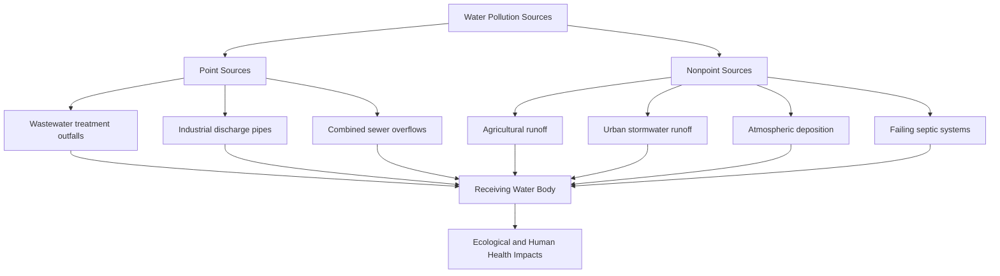

## Water Pollution Sources and Impacts

### Conceptual Framework

Water pollution is the introduction of substances or energy (heat) into a water body at a rate or concentration that degrades its quality relative to a natural or designated-use baseline. Pollution sources are conventionally classified along two primary axes: **point vs. nonpoint** origin, and **source category** (municipal, industrial, agricultural, atmospheric). Understanding source type is central to regulatory strategy, since point and nonpoint sources require fundamentally different management and enforcement approaches.

### Point Source Pollution

**Definition**: pollution discharged from a single, identifiable, discrete location — a pipe, ditch, channel, or conveyance — making it comparatively straightforward to monitor, permit, and regulate.

**Municipal wastewater treatment plant (WWTP) discharges**: Even well-functioning treatment plants discharge treated effluent containing residual nutrients (nitrogen, phosphorus), trace pathogens, and increasingly-scrutinized micropollutants (pharmaceuticals, personal care product residues) not fully removed by conventional treatment processes. Effluent limits are typically established through NPDES permits under the US Clean Water Act (or equivalent frameworks internationally), calibrated to protect the receiving water's designated use.

**Combined Sewer Overflows (CSOs)**: In older urban areas (common in many northeastern and midwestern US cities, as well as many European cities) built with combined sewer systems that carry both sanitary sewage and stormwater in a single pipe network, heavy rainfall can exceed treatment plant capacity, triggering intentional overflow discharge of a mixture of untreated sewage and stormwater directly into receiving waters. CSO remediation (separating combined systems or building large storage/conveyance infrastructure) represents one of the most capital-intensive categories of water infrastructure investment in affected cities.

**Industrial discharges**: Direct process wastewater discharges (chemical manufacturing, pulp and paper, mining, metal finishing, food processing) are regulated under industry-specific effluent guidelines, which set technology-based discharge limits reflecting the best available treatment technology economically achievable for each industrial category.

**Acid Mine Drainage (AMD)**: A distinctive and often severe point-source (or sometimes diffuse) pollution problem arising when sulfide minerals (particularly pyrite, $FeS_2$) exposed during mining are oxidized upon contact with air and water, generating sulfuric acid and dissolved heavy metals:

$$4FeS_2 + 15O_2 + 14H_2O \rightarrow 4Fe(OH)_3 + 8SO_4^{2-} + 16H^+$$

The resulting highly acidic, metal-laden drainage can persist for decades to centuries after mine closure, and is a well-documented long-term legacy pollution challenge in coal and metal mining regions worldwide (e.g., Appalachian coal mining regions in the United States).

### Nonpoint Source Pollution

**Definition**: pollution originating from diffuse sources across the landscape rather than a discrete discharge point, transported to water bodies primarily via runoff and infiltration. Nonpoint sources are collectively the leading cause of water quality impairment in many national water quality assessments (notably identified as such in periodic US EPA National Water Quality Inventory reports), and are inherently more difficult to regulate because there is no single identifiable discharger to permit.

**Agricultural runoff**:

- Nutrient runoff (nitrogen and phosphorus from fertilizer and manure application) is the dominant nonpoint contributor to freshwater and coastal eutrophication.
- Pesticide and herbicide runoff introduces synthetic organic compounds with varying persistence and toxicity profiles.
- Sediment from soil erosion on tilled or overgrazed land increases turbidity, smothers benthic habitat, and transports adsorbed pollutants (many pesticides and phosphorus bind preferentially to soil particles).
- Concentrated Animal Feeding Operations (CAFOs) generate large volumes of manure that, if improperly stored or over-applied to land relative to crop uptake capacity, contribute disproportionately to local nutrient and pathogen loading.

**Urban stormwater runoff**:

- Accumulates and mobilizes a wide range of pollutants from impervious surfaces: motor oil and heavy metals (from vehicle wear and exhaust deposition), de-icing salts, pet waste bacteria, and litter/microplastics.
- The "first flush" phenomenon — a disproportionately high pollutant concentration in the initial portion of stormwater runoff following a dry period — is a well-documented pattern informing stormwater treatment system design.

**Atmospheric deposition**:

- Airborne pollutants (mercury from coal combustion, nitrogen oxides from combustion sources, acidic precursors) settle onto land and water surfaces either as dry deposition or dissolved in precipitation (wet deposition), contributing to water quality impairment even in remote watersheds with no direct local discharge — a key mechanism, for example, in mercury contamination of fish in otherwise pristine lakes far from industrial sources.

**On-site wastewater systems (septic systems)**: Failing or poorly-sited septic systems, particularly in areas with high water tables, unsuitable soils, or high housing density on unsewered land, contribute nutrient and pathogen loading to shallow groundwater and adjacent surface waters.

### Major Pollutant Categories and Their Impacts

**Nutrients and Eutrophication**

Excess nitrogen and phosphorus loading drives eutrophication: accelerated algal and cyanobacterial growth, followed by decomposition of the resulting biomass, which consumes dissolved oxygen and can produce hypoxic or anoxic "dead zones." The Gulf of Mexico hypoxic zone, fed by nutrient loading transported down the Mississippi River watershed, is among the most extensively studied and largest such zones globally, with its areal extent measured annually and varying with precipitation, nutrient management practices, and other conditions in the contributing watershed. **Harmful Algal Blooms (HABs)**, including cyanobacterial blooms capable of producing potent toxins (e.g., microcystins), pose direct risks to drinking water supplies, recreational users, and aquatic/terrestrial wildlife, and have increased in reported frequency in many regions in recent decades. [Inference: the relative contribution of increased monitoring/reporting effort versus a true underlying increase in bloom frequency is debated in the literature and likely varies by region]

**Pathogens**

Bacterial, viral, and protozoan pathogens from human and animal fecal contamination are a primary driver of waterborne disease risk globally, with impacts disproportionately concentrated in regions lacking adequate sanitation infrastructure. Common pathogen categories include bacteria (*E. coli* O157:H7, *Salmonella*, *Vibrio cholerae*), viruses (norovirus, hepatitis A), and protozoan parasites (*Giardia*, *Cryptosporidium*, the latter notable for resistance to standard chlorine disinfection, requiring filtration or UV treatment for reliable removal/inactivation).

**Toxic Substances (Heavy Metals and Synthetic Organics)**

Heavy metals (lead, mercury, cadmium, arsenic, chromium) and persistent synthetic organic pollutants (PCBs, dioxins, certain legacy pesticides such as DDT, and PFAS) share the characteristic of bioaccumulation — increasing tissue concentration in individual organisms over their lifetime — and, for many compounds, biomagnification, in which concentration increases at successive trophic levels, producing the highest exposure risk in top predators (and human consumers of predatory fish). Mercury methylation (conversion to the more bioavailable and toxic methylmercury by anaerobic bacteria, notably in wetland and reservoir sediments) is a key mechanism explaining why mercury contamination in fish tissue can be significant even in water bodies with low measured water-column mercury concentrations.

**Thermal Pollution**

Discharge of heated water (commonly from power plant once-through cooling systems) elevates receiving water temperature, reducing dissolved oxygen solubility and shifting species composition toward warm-tolerant, often less desirable taxa, while potentially disrupting temperature-cued spawning and migration behaviors in temperature-sensitive species.

**Sediment**

Excess sediment loading (from erosion, construction sites, and altered land cover) increases turbidity, reduces light penetration for aquatic photosynthesis, smothers benthic habitat and fish spawning substrate (particularly gravel-bed habitat used by salmonids), and can transport adsorbed contaminants.

**Plastics and Microplastics**

Macroplastic debris and microplastic particles (from fragmentation of larger debris, synthetic textile fiber shedding, and tire wear particles carried in stormwater) are an increasingly studied pollution category, with documented ingestion by aquatic organisms across trophic levels; the long-term ecological and human health significance of microplastic exposure at environmentally relevant concentrations remains an active area of ongoing research. [Speculation: some researchers have raised concern about chronic low-dose human health effects from microplastic ingestion, though a robust, widely-replicated dose-response relationship for typical environmental exposure levels has not been firmly established as of current literature]

### Ecological Impact Pathways

**Bioaccumulation and Biomagnification**

$$BAF = \frac{C_{organism}}{C_{water}}$$

where $BAF$ (bioaccumulation factor) relates the pollutant concentration in organism tissue ($C_{organism}$) to the concentration in the surrounding water ($C_{water}$); values substantially greater than 1 indicate accumulation, a pattern typical of lipophilic (fat-soluble) organic pollutants and certain metals such as methylmercury.

**Trophic cascade effects**: Pollution-driven changes at one trophic level (e.g., loss of sensitive macroinvertebrates due to toxicant exposure) can propagate through a food web, affecting predator populations dependent on that prey base even where the predators themselves are not directly exposed to toxic concentrations.

**Habitat degradation**: Sediment smothering, thermal alteration, and toxic substrate contamination can degrade or eliminate spawning, nursery, and refuge habitat even when water-column concentrations of a given pollutant appear within acceptable limits, illustrating why water quality assessment increasingly incorporates habitat and biological (not just chemical) monitoring.

### Human Health Impacts

- **Waterborne infectious disease**: diarrheal disease from pathogen-contaminated water remains a globally significant cause of morbidity and mortality, particularly among young children in regions with inadequate water, sanitation, and hygiene (WASH) infrastructure.
- **Chronic toxic exposure**: long-term exposure to contaminants such as arsenic (a documented human carcinogen at concentrations found in some naturally-contaminated groundwater, notably in parts of Bangladesh and West Bengal) or lead (associated with neurodevelopmental impacts, particularly in children, with no established safe exposure threshold in current health guidance) illustrates the distinction between acute and chronic water pollution health risk pathways.
- **Fish consumption advisories**: many jurisdictions issue consumption advisories for specific water bodies and species based on measured tissue contaminant levels (commonly mercury or PCBs), reflecting a risk-management response where source remediation is not immediately achievable.

### Regulatory and Management Response

**Point source control**: permit-based regulation (e.g., NPDES) combined with technology-based effluent limits and, where receiving water quality remains impaired despite technology-based controls, water-quality-based effluent limits calibrated to the specific receiving water's assimilative capacity.

**Nonpoint source control**: relies primarily on voluntary or incentive-based Best Management Practices (BMPs) rather than direct permitting, given the diffuse and difficult-to-attribute nature of nonpoint discharges — examples include vegetated buffer strips, cover cropping, nutrient management planning, constructed wetlands treating agricultural drainage, and urban green infrastructure (bioswales, permeable pavement) to reduce stormwater pollutant loading.

**Total Maximum Daily Loads (TMDLs)**: for impaired water bodies, TMDLs allocate an overall allowable pollutant load among contributing point sources (as enforceable "wasteload allocations") and nonpoint sources (as generally non-enforceable "load allocations"), providing a watershed-scale accounting framework even though nonpoint allocations typically lack the direct enforcement mechanism available for point sources.

### Worked Example: Mass Balance Estimate of Nutrient Loading from Mixed Sources

**Scenario**: A watershed's annual phosphorus load to a lake is estimated from three sources: a wastewater treatment plant point source, agricultural nonpoint runoff, and urban stormwater.

| Source | Flow/Area | Concentration or Export Coefficient | Annual Load |
| --- | --- | --- | --- |
| WWTP discharge | 5,000 m³/day | 1.5 mg/L TP | ? |
| Agricultural land | 800 hectares | 1.2 kg P/ha/yr (export coefficient) | ? |
| Urban stormwater | 200 hectares | 0.6 kg P/ha/yr (export coefficient) | ? |

**WWTP point source load**:

$$L_{WWTP} = 5{,}000\ \frac{m^3}{day} \times 365\ \frac{day}{yr} \times 1.5\ \frac{mg}{L} \times 1{,}000\ \frac{L}{m^3} \times \frac{1\ kg}{10^6\ mg}$$

$$L_{WWTP} = 5{,}000 \times 365 \times 1.5 \times 10^{-3} = 2{,}737.5\ kg/yr$$

**Agricultural nonpoint load**:

$$L_{ag} = 800\ ha \times 1.2\ kg/ha/yr = 960\ kg/yr$$

**Urban stormwater load**:

$$L_{urban} = 200\ ha \times 0.6\ kg/ha/yr = 120\ kg/yr$$

**Total annual phosphorus load**:

$$L_{total} = 2{,}737.5 + 960 + 120 = 3{,}817.5\ kg/yr$$

**Interpretation**: Despite representing a single discharge point, the WWTP contributes the largest individual share (approximately 72%) of the estimated total phosphorus load in this scenario, illustrating that point sources can remain a dominant contributor even in watersheds with substantial agricultural land use, particularly where treatment does not include enhanced (tertiary) phosphorus removal. This kind of source apportionment is a standard preliminary step in TMDL development, informing which source category offers the greatest load-reduction potential per unit of management investment. [Inference: relative source contributions in any real watershed depend heavily on site-specific treatment technology, land use intensity, and hydrology, and this illustrative example should not be generalized as a typical proportion across watersheds]

### Illustration: Point vs. Nonpoint Source Pathways to a Receiving Water Body

<svg xmlns="http://www.w3.org/2000/svg" viewBox="0 0 700 320">
<text x="350" y="25" font-size="16" font-weight="bold" text-anchor="middle" fill="#1a1a1a">Point vs. Nonpoint Source Pathways (svg_diagram)</text>
<path d="M 40 250 Q 350 280 660 250 L 660 300 L 40 300 Z" fill="#a8c8e0" />
<text x="350" y="275" font-size="12" text-anchor="middle" fill="#1a1a1a">Receiving Water Body</text>
<rect x="60" y="140" width="30" height="30" fill="#666" />
<line x1="90" y1="155" x2="200" y2="240" stroke="#b83b2f" stroke-width="4" />
<text x="75" y="130" font-size="10" text-anchor="middle" fill="#1a1a1a">WWTP</text>
<text x="130" y="185" font-size="10" fill="#b83b2f">Point Source</text>
<rect x="180" y="140" width="30" height="30" fill="#666" />
<line x1="210" y1="155" x2="250" y2="240" stroke="#b83b2f" stroke-width="4" />
<text x="195" y="130" font-size="10" text-anchor="middle" fill="#1a1a1a">Industrial</text>
<rect x="340" y="90" width="80" height="50" fill="#c9a876" />
<text x="380" y="120" font-size="10" text-anchor="middle" fill="#1a1a1a">Farmland</text>
<path d="M 350 140 Q 380 190 390 240" stroke="#4a7a3a" stroke-width="8" fill="none" opacity="0.6" />
<path d="M 400 140 Q 400 190 420 240" stroke="#4a7a3a" stroke-width="8" fill="none" opacity="0.6" />
<text x="440" y="185" font-size="10" fill="#4a7a3a">Nonpoint</text>
<text x="440" y="198" font-size="10" fill="#4a7a3a">(diffuse runoff)</text>
<rect x="500" y="90" width="80" height="50" fill="#999" />
<text x="540" y="120" font-size="10" text-anchor="middle" fill="#1a1a1a">Urban Area</text>
<path d="M 510 140 Q 530 190 500 240" stroke="#4a7a3a" stroke-width="8" fill="none" opacity="0.6" />
<path d="M 560 140 Q 560 190 560 240" stroke="#4a7a3a" stroke-width="8" fill="none" opacity="0.6" />

<text x="130" y="115" font-size="9" text-anchor="middle" fill="`#1a1a1a`">Discrete pipe/outfall</text>

</svg>

### Related Topics

- Total Maximum Daily Load (TMDL) allocation methodology
- Harmful algal bloom monitoring and toxin detection
- Acid mine drainage treatment and passive remediation systems
- Combined sewer overflow control and green infrastructure retrofits
- PFAS and emerging contaminant source tracking
- Bioaccumulation and biomagnification modeling in food webs
- Nutrient management planning for agricultural operations
- Waterborne pathogen risk assessment and WASH infrastructure
- Microplastic sampling and analytical methods
- Watershed-scale source apportionment modeling