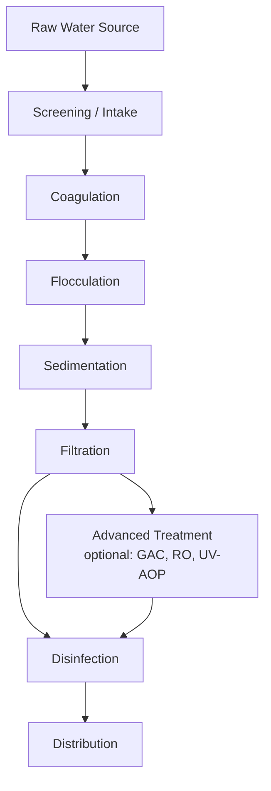

## Water Treatment and Purification Technologies

### Conceptual Framework

Water treatment encompasses the physical, chemical, and biological processes applied to raw water (surface water, groundwater, or wastewater) to render it suitable for a target use — most commonly potable (drinking) supply, but also industrial process water, agricultural reuse, or safe environmental discharge. Treatment trains are designed as a sequence of unit processes, each targeting specific contaminant classes, since no single process removes all contaminant types effectively.

### Conventional Drinking Water Treatment Train

**Screening and Intake**

Raw water intake structures use coarse screens to exclude debris, fish, and large organic matter before water enters the treatment process, protecting downstream mechanical equipment.

**Coagulation**

Chemical coagulants (most commonly aluminum sulfate/alum, or ferric chloride/ferric sulfate) are added to raw water and rapidly mixed. Coagulants neutralize the negative surface charge naturally present on colloidal particles (clay, organic matter, some microorganisms), which otherwise repel each other and remain stably suspended (a colloidal stability phenomenon described by DLVO theory). Charge neutralization allows particles to begin aggregating.

**Flocculation**

Following coagulation, water undergoes slow, gentle mixing (typically in a series of graduated-velocity basins) to promote collision and aggregation of destabilized particles into larger, settleable flocs. Polymer flocculant aids are frequently used to enhance floc size, density, and settling characteristics.

**Sedimentation (Clarification)**

Flocculated water flows through large, low-velocity basins where gravity settling removes the majority of floc mass before filtration, substantially reducing the particulate loading that the subsequent filtration stage must handle. Settling velocity for discrete particles follows Stokes' Law under laminar conditions:

$$v_s = \frac{g(\rho_p - \rho_w)d^2}{18\mu}$$

where $v_s$ is settling velocity, $g$ is gravitational acceleration, $\rho_p$ and $\rho_w$ are particle and water density respectively, $d$ is particle diameter, and $\mu$ is dynamic viscosity of water. This relationship illustrates why floc size (achieved through effective flocculation) so strongly influences sedimentation basin performance — settling velocity scales with the square of particle diameter.

**Filtration**

Water passes through granular media (typically sand, sometimes layered with anthracite coal or garnet in dual/multi-media configurations) to remove remaining particulates, including much of the residual turbidity and a portion of pathogens not removed in sedimentation. Filtration mechanisms include straining, sedimentation within the pore spaces, and adsorption onto media grain surfaces. Periodic backwashing (reversing flow direction at high velocity) is required to dislodge accumulated material and restore filter capacity.

**Disinfection**

The final conventional treatment step, intended to inactivate remaining pathogenic microorganisms before distribution:

- **Chlorination**: the most widely used disinfectant globally, valued for effectiveness, low cost, and the practical advantage of leaving a measurable residual in the distribution system that provides ongoing protection against post-treatment contamination.
- **Chloramination**: using chloramines (formed by combining chlorine and ammonia) as a more stable, longer-lasting residual disinfectant, particularly favored in large distribution systems with long water age, though chloramines are generally weaker primary disinfectants than free chlorine and raise distinct water quality management considerations (e.g., nitrification potential in the distribution system).
- **Ozonation**: a strong oxidant effective against a broad range of pathogens (including some, like *Cryptosporidium*, that are more resistant to chlorine) and effective at controlling taste, odor, and color compounds, but leaves no residual, generally requiring a secondary residual disinfectant downstream.
- **Ultraviolet (UV) disinfection**: inactivates pathogens by damaging microbial DNA/RNA to prevent replication, effective against chlorine-resistant protozoa (*Cryptosporidium*, *Giardia*) without producing halogenated disinfection byproducts, though it likewise leaves no residual and is typically paired with a chemical disinfectant for distribution system protection.

**Disinfection Byproducts (DBPs)**: Chlorination and chloramination can react with natural organic matter in source water to form regulated byproducts such as trihalomethanes (THMs) and haloacetic acids (HAAs), associated with elevated cancer risk at chronic high exposure levels, which is why many drinking water regulatory frameworks (including the US EPA Stage 1 and Stage 2 Disinfectants and Disinfection Byproducts Rules) set specific numeric limits on these compounds, creating an engineering trade-off between adequate pathogen disinfection and DBP formation minimization.

### Membrane Filtration Technologies

Membrane processes are increasingly used both as a replacement for or supplement to conventional media filtration, and as advanced treatment for higher-purity applications, classified by pore size and the separation mechanism:

- **Microfiltration (MF)**: pore size roughly 0.1–10 microns; removes suspended solids, most bacteria, and some larger protozoa; operates primarily by size exclusion under relatively low pressure.
- **Ultrafiltration (UF)**: pore size roughly 0.01–0.1 microns; additionally removes viruses and large dissolved macromolecules; increasingly used as a robust pathogen barrier in modern municipal treatment plants.
- **Nanofiltration (NF)**: pore size roughly 0.001–0.01 microns; removes divalent ions (useful for water softening) and larger dissolved organic molecules; operates at moderate pressure.
- **Reverse Osmosis (RO)**: uses a semi-permeable membrane and applied pressure exceeding the natural osmotic pressure gradient to force water molecules through while rejecting dissolved salts and most other solutes, making it the dominant technology for desalination and highest-purity water applications.

**Reverse osmosis operating principle**: natural osmosis drives water from a low-solute to a high-solute concentration region across a semi-permeable membrane; RO reverses this by applying hydraulic pressure exceeding the osmotic pressure ($\pi$) of the feed solution, described approximately (for dilute solutions) by the Van't Hoff relation:

$$\pi = iMRT$$

where $i$ is the Van't Hoff factor (number of dissociated ionic species per formula unit), $M$ is molar concentration, $R$ is the ideal gas constant, and $T$ is absolute temperature. Seawater's substantially higher osmotic pressure relative to brackish water is precisely why seawater RO desalination requires considerably higher operating pressures and energy input than brackish water RO treatment.

### Advanced and Emerging Treatment Technologies

**Granular Activated Carbon (GAC)**

Highly porous carbon media with very high internal surface area, used to adsorb a broad range of dissolved organic compounds, including taste-and-odor compounds, many synthetic organic contaminants, and — of increasing regulatory relevance — certain PFAS compounds. GAC media requires periodic replacement or thermal regeneration as adsorption capacity is exhausted, tracked through breakthrough monitoring.

**Ion Exchange**

Removes specific dissolved ionic contaminants by exchanging them for a less problematic ion held on a resin bed (commonly sodium or chloride, depending on whether cation or anion exchange is used); applied in water softening (removing calcium and magnesium hardness ions), nitrate removal, and increasingly for certain PFAS compounds using specialized anion exchange resins.

**Advanced Oxidation Processes (AOPs)**

Combine strong oxidants (ozone, hydrogen peroxide) with UV light or catalysts to generate highly reactive hydroxyl radicals capable of breaking down recalcitrant organic contaminants (certain pharmaceuticals, taste-and-odor compounds, some emerging contaminants) that resist conventional treatment; increasingly incorporated into potable reuse treatment trains as a robust barrier against trace organic contaminants.

**PFAS Treatment**

Current best-demonstrated technologies for PFAS removal in drinking water treatment center on GAC adsorption, anion exchange resins, and high-pressure membrane processes (nanofiltration/reverse osmosis); conventional coagulation-sedimentation-filtration processes are generally ineffective at PFAS removal, and treatment selection depends on the specific PFAS compound profile present, since shorter-chain PFAS compounds are generally more difficult to remove via adsorption-based methods than longer-chain compounds. [Unverified: given active regulatory development and rapidly evolving treatment technology performance data in this area, current removal performance figures and cost estimates should be verified against the most recent published technical guidance]

**Potable Reuse**

Treating municipal wastewater to drinking water quality standards, implemented through two general configurations:

- **Indirect Potable Reuse (IPR)**: treated water is introduced into an environmental buffer (a groundwater aquifer via injection, or a surface reservoir) before withdrawal and further treatment for distribution, providing an additional natural attenuation barrier and public acceptance benefit.
- **Direct Potable Reuse (DPR)**: treated water is introduced directly into the drinking water distribution system or a raw water supply immediately upstream of a conventional treatment plant, without an environmental buffer; increasingly implemented in water-scarce regions (with California and Texas among notable US examples of DPR regulatory framework development) using highly robust multi-barrier treatment trains (typically combining membrane filtration, reverse osmosis, and advanced oxidation) to provide redundant pathogen and chemical contaminant barriers. [Unverified: specific regulatory approval status and operational DPR facility counts change as this remains an actively developing regulatory area; verify against current state-level regulatory guidance]

### Desalination

**Reverse Osmosis Desalination**: now the dominant global desalination technology due to substantially lower energy requirements compared to older thermal methods, achieved partly through energy recovery devices (pressure exchangers) that recapture pressure energy from the concentrated reject stream to pre-pressurize incoming feedwater, meaningfully reducing net specific energy consumption.

**Thermal Desalination**: older methods including Multi-Stage Flash (MSF) distillation and Multi-Effect Distillation (MED), which evaporate and condense water in successive pressure/temperature stages; still used in some Middle Eastern facilities (often co-located with power generation to use waste heat) but increasingly displaced by RO in new facility construction due to RO's lower energy intensity.

**Brine Management**: a significant environmental consideration for all desalination approaches, since the concentrated reject stream (containing roughly double the salinity of the feedwater, along with any pretreatment chemical residuals) requires careful disposal — commonly via diffuser-based ocean outfall designed to promote rapid dilution and minimize localized salinity and ecological impact near the discharge point.

### Small-Scale and Point-of-Use Treatment

For household or community-scale application, particularly relevant in low-resource settings lacking centralized treatment infrastructure:

- **Boiling**: highly effective at inactivating pathogens (bringing water to a rolling boil is generally considered sufficient) but energy- and fuel-intensive at scale, with associated cost and, where wood or biomass fuel is used, air quality and deforestation trade-offs.
- **Chlorination tablets/solutions**: low-cost, effective against most bacteria and viruses, though less effective against chlorine-resistant protozoa such as *Cryptosporidium*.
- **Solar Disinfection (SODIS)**: exposing water in transparent containers to direct sunlight, using combined UV radiation and thermal effects to inactivate pathogens over several hours; effective but dependent on adequate sunlight and water clarity (turbid water reduces UV penetration).
- **Ceramic and biosand filters**: low-cost, locally manufacturable filtration media that combine physical straining with (in biosand filters) a biologically active layer (schmutzdecke) that provides additional pathogen removal through predation and adsorption.
- **Household RO and activated carbon units**: increasingly common in regions with poor source water quality or aesthetic concerns, though point-of-use RO units typically have lower water recovery efficiency (higher reject water fraction) than large-scale municipal systems.

### Worked Example: Sizing a Sedimentation Basin Using Surface Loading Rate

**Scenario**: A water treatment plant needs to design a sedimentation basin to treat a flow of 10,000 m³/day, targeting a surface overflow rate (a standard basin sizing parameter, representing the critical settling velocity for particles the basin is designed to capture) of 30 m³/m²/day, a typical design value for conventional sedimentation basins treating coagulated/flocculated water.

The required surface area is found from the surface overflow rate relationship:

$$SOR = \frac{Q}{A_s}$$

where $SOR$ is surface overflow rate, $Q$ is flow rate, and $A_s$ is required surface area.

**Calculation**:

$$A_s = \frac{Q}{SOR} = \frac{10{,}000\ m^3/day}{30\ m^3/m^2/day} \approx 333\ m^2$$

**Interpretation**: A basin surface area of approximately 333 m² is theoretically required to achieve the target overflow rate for this flow — for example, a rectangular basin roughly 20 m long by 16.7 m wide, though actual basin dimensioning would additionally account for depth (typically 3–4.5 m for conventional basins), inlet/outlet configuration to minimize short-circuiting, and sludge storage/removal considerations. This overflow rate design approach reflects the physical principle that any particle with a settling velocity equal to or greater than the overflow rate will be fully captured, regardless of basin depth, provided flow remains sufficiently laminar and free of short-circuiting. [Inference: actual full-scale design would incorporate additional safety factors and site-specific considerations beyond this simplified sizing calculation]

### Illustration: Conventional Water Treatment Train

<svg xmlns="http://www.w3.org/2000/svg" viewBox="0 0 700 260">
<text x="350" y="25" font-size="16" font-weight="bold" text-anchor="middle" fill="#1a1a1a">Conventional Water Treatment Train (svg_diagram)</text>
<rect x="20" y="80" width="80" height="60" fill="#a8c8e0" stroke="#2c5f8a" stroke-width="1.5" />
<text x="60" y="115" font-size="10" text-anchor="middle" fill="#1a1a1a">Raw Water</text>
<rect x="130" y="80" width="80" height="60" fill="#d9e8d4" stroke="#4a7a3a" stroke-width="1.5" />
<text x="170" y="105" font-size="10" text-anchor="middle" fill="#1a1a1a">Coagulation/</text>
<text x="170" y="118" font-size="10" text-anchor="middle" fill="#1a1a1a">Flocculation</text>
<rect x="240" y="80" width="80" height="60" fill="#e8dcc0" stroke="#8a6a4a" stroke-width="1.5" />
<text x="280" y="115" font-size="10" text-anchor="middle" fill="#1a1a1a">Sedimentation</text>
<rect x="350" y="80" width="80" height="60" fill="#f0e8d0" stroke="#c9a876" stroke-width="1.5" />
<text x="390" y="115" font-size="10" text-anchor="middle" fill="#1a1a1a">Filtration</text>
<rect x="460" y="80" width="80" height="60" fill="#e0c8d8" stroke="#8a4a6a" stroke-width="1.5" />
<text x="500" y="115" font-size="10" text-anchor="middle" fill="#1a1a1a">Disinfection</text>
<rect x="570" y="80" width="90" height="60" fill="#c9d9e8" stroke="#2c5f8a" stroke-width="1.5" />
<text x="615" y="105" font-size="10" text-anchor="middle" fill="#1a1a1a">Distribution</text>
<text x="615" y="118" font-size="10" text-anchor="middle" fill="#1a1a1a">System</text>
<path d="M 100 110 L 130 110" stroke="#333" stroke-width="2" marker-end="url(#arrow2)" />
<path d="M 210 110 L 240 110" stroke="#333" stroke-width="2" marker-end="url(#arrow2)" />
<path d="M 320 110 L 350 110" stroke="#333" stroke-width="2" marker-end="url(#arrow2)" />
<path d="M 430 110 L 460 110" stroke="#333" stroke-width="2" marker-end="url(#arrow2)" />
<path d="M 540 110 L 570 110" stroke="#333" stroke-width="2" marker-end="url(#arrow2)" />
<text x="170" y="165" font-size="9" text-anchor="middle" fill="`#1a1a1a`">Charge neutralization</text>

<text x="170" y="177" font-size="9" text-anchor="middle" fill="`#1a1a1a`">and floc growth</text>

<text x="500" y="165" font-size="9" text-anchor="middle" fill="`#1a1a1a`">Cl₂, UV, or ozone</text>

</svg>

### Related Topics

- Coagulant chemistry and jar testing methodology
- Membrane fouling mechanisms and cleaning protocols
- Disinfection byproduct formation and regulatory limits
- PFAS treatment technology performance and cost comparison
- Direct and indirect potable reuse regulatory frameworks
- Desalination energy recovery device design
- Point-of-use treatment technology for low-resource settings
- Distribution system water age and residual disinfectant decay
- Advanced oxidation process design for emerging contaminants
- Sludge and residuals management from treatment plant operations