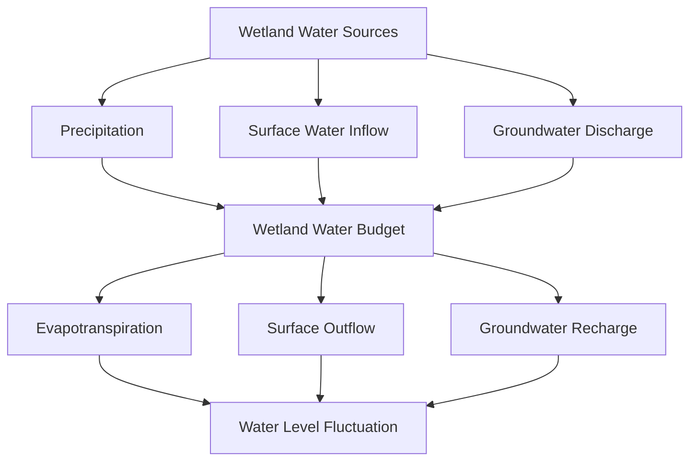

## Wetlands and Their Ecological Functions

### Definition and Classification Criteria

A **wetland** is a transitional ecosystem between terrestrial and aquatic systems, characterized by three defining criteria used in most regulatory and scientific classification systems (notably the US Army Corps of Engineers wetland delineation methodology):

- **Hydrology**: periodic or permanent saturation or inundation sufficient to create anaerobic (low-oxygen) conditions in the root zone during at least part of the growing season.
- **Hydric soils**: soils that developed under conditions of saturation, flooding, or ponding long enough to produce anaerobic conditions, typically identifiable by characteristic gleying (gray/blue-gray color from iron reduction) or redoximorphic features (mottling from iron oxidation-reduction cycling).
- **Hydrophytic vegetation**: plant communities adapted to survive in saturated, low-oxygen soil conditions, often exhibiting specialized adaptations such as aerenchyma tissue (internal air channels facilitating oxygen transport to submerged roots) or pneumatophores (specialized above-ground root structures, as in mangroves).

All three indicators are generally required for formal wetland delineation under most regulatory frameworks, though the specific methodology and evidentiary weighting vary by jurisdiction.

### Wetland Classification Systems

**By hydrologic setting** (Cowardin classification system, widely used in the United States):

- **Marine and estuarine wetlands**: tidally influenced coastal wetlands, including salt marshes and mangrove forests.
- **Riverine wetlands**: associated with river and stream channels, including riparian wetlands.
- **Lacustrine wetlands**: associated with lakes, typically the shallow-water fringe.
- **Palustrine wetlands**: non-tidal wetlands dominated by vegetation, including marshes, swamps, bogs, and fens — the most extensive wetland category by area in most inland regions.

**By dominant vegetation and hydrologic source**:

- **Marshes**: dominated by herbaceous emergent vegetation (cattails, reeds, sedges), typically with mineral soils and relatively nutrient-rich conditions; freshwater marshes and salt marshes represent distinct hydrologic and vegetative subtypes.
- **Swamps**: dominated by woody vegetation (trees and shrubs), including forested swamps (e.g., bottomland hardwood forests, cypress swamps) and shrub swamps.
- **Bogs**: peat-accumulating wetlands fed primarily by precipitation (ombrotrophic), characteristically acidic, nutrient-poor, and dominated by sphagnum moss and specially adapted vegetation (including carnivorous plants that supplement nutrient uptake given the nutrient-poor substrate).
- **Fens**: peat-accumulating wetlands, but fed by groundwater or surface water (minerotrophic) rather than precipitation alone, generally less acidic and more nutrient-rich than bogs, supporting a different and often more diverse plant community.

**By tidal influence**:

- **Salt marshes**: temperate and high-latitude coastal wetlands dominated by salt-tolerant grasses (notably *Spartina* species in North American systems), structured by a distinct zonation gradient reflecting tidal inundation frequency.
- **Mangrove forests**: tropical and subtropical coastal wetlands dominated by salt-tolerant tree species with specialized root adaptations (prop roots, pneumatophores) for anchoring in soft substrate and facilitating gas exchange in saturated, saline soils.

### Wetland Hydrology

Wetland water balance follows the same fundamental equation structure as general hydrology, but with a critical distinction: wetlands are defined by relatively small net storage changes maintaining periodic saturation, rather than large net outflow characteristic of well-drained uplands. A wetland's specific hydroperiod — the seasonal pattern, depth, and duration of inundation or saturation — is the single most important factor structuring its plant and animal community composition, since different species exhibit distinct tolerances to flooding depth and duration.

Wetlands can function hydrologically as:

- **Groundwater discharge wetlands**: fed by groundwater emerging at the surface, often maintaining relatively stable water levels and supporting distinct plant communities adapted to consistent saturation.
- **Groundwater recharge wetlands**: situated where surface water infiltrates to recharge underlying aquifers, contributing to regional groundwater supply.
- **Flow-through wetlands**: both receiving and contributing to groundwater flow depending on seasonal conditions.
- **Isolated/depressional wetlands**: hydrologically disconnected from permanent surface water bodies (e.g., prairie potholes, vernal pools), filled primarily by precipitation and snowmelt, and often exhibiting pronounced seasonal or interannual water level variability.

### Ecological Functions

**Flood Attenuation and Water Storage**

Wetlands provide temporary water storage during high-flow events, reducing peak discharge and attenuating flood timing downstream — a function especially valuable in floodplain wetlands directly connected to river systems, where wetland loss has been repeatedly linked to increased downstream flood severity in watershed-scale hydrologic studies. [Inference: the magnitude of flood attenuation benefit from any specific wetland depends on its size, position in the watershed, and connectivity to the flood-generating flow path, so generalized attenuation estimates should not be applied uncritically to a specific wetland without local hydrologic assessment]

**Water Quality Improvement**

Wetlands function as natural water treatment systems through several interacting mechanisms:

- **Sediment trapping**: reduced flow velocity through dense wetland vegetation promotes settling of suspended sediment and associated adsorbed pollutants.
- **Nutrient cycling and removal**: wetland soils, particularly under alternating aerobic-anaerobic conditions, support denitrification (microbial conversion of nitrate to nitrogen gas, permanently removing nitrogen from the aquatic system) and phosphorus retention through sorption to iron and aluminum-rich sediments (though phosphorus retention capacity can saturate over time and, under certain conditions, wetlands can become net phosphorus sources rather than sinks).
- **Pollutant and pathogen removal**: wetland vegetation and associated microbial communities can degrade or immobilize certain organic pollutants and reduce pathogen loads through settling, UV exposure in shallow water, and predation.

This water quality function has led to widespread use of **constructed wetlands** as engineered treatment systems for municipal wastewater polishing, stormwater treatment, and agricultural drainage treatment, deliberately replicating natural wetland processes in a controlled setting.

**Habitat Provision and Biodiversity Support**

Wetlands support disproportionately high biodiversity relative to their global land area, providing critical habitat functions including:

- Breeding, nursery, and nesting habitat for waterfowl, wading birds, and numerous fish and amphibian species.
- Critical stopover habitat for migratory bird species along major flyways.
- Nursery habitat for many economically important fish and shellfish species, particularly in estuarine and coastal wetland systems, where juvenile fish find both food resources and refuge from predation among dense vegetation structure.

**Carbon Sequestration and Storage**

Certain wetland types, particularly peat-accumulating bogs and fens, and coastal "blue carbon" ecosystems (salt marshes, mangroves, and seagrass beds, the latter technically not a wetland under strict definitions but often grouped with blue carbon systems), sequester and store disproportionately large amounts of carbon relative to their area, due to slow decomposition rates under waterlogged, low-oxygen soil conditions. Peatlands globally are estimated to store a very large share of total soil organic carbon despite covering a comparatively small fraction of global land area, making peatland drainage and degradation a significant source of greenhouse gas emissions when previously waterlogged, anaerobic organic matter is exposed to oxygen and decomposes. [Unverified: specific global peatland carbon stock estimates vary across studies depending on methodology and mapped extent, and figures should be checked against current published estimates rather than treated as a single fixed value]

**Shoreline Stabilization and Storm Protection**

Coastal wetlands (salt marshes, mangroves) provide substantial wave energy attenuation and shoreline stabilization through dense root systems and above-ground vegetation structure, reducing erosion and providing measurable storm surge attenuation — mangrove forests in particular have been documented in multiple post-storm damage assessments to reduce property damage and loss of life in coastal communities compared to otherwise similar unprotected coastlines. [Inference: the degree of protection benefit is highly dependent on wetland width, vegetation density and health, and storm characteristics, and should not be assumed uniform across all mangrove or marsh systems]

### Global Wetland Loss and Threats

Global wetland extent has declined substantially since pre-industrial times, driven primarily by:

- **Drainage for agricultural conversion**: historically the dominant driver of wetland loss in many temperate regions, where wetlands were viewed as unproductive land requiring drainage for crop production.
- **Urban and coastal development**: filling and conversion of wetlands for residential, commercial, and infrastructure development, particularly acute in rapidly urbanizing coastal zones.
- **Hydrologic alteration**: dam construction, channelization, and water diversion upstream of wetlands can disrupt the natural hydroperiod essential for wetland persistence, even without direct physical conversion of the wetland itself.
- **Climate change**: sea-level rise threatens coastal wetlands both through direct inundation and through "coastal squeeze," where a wetland's landward migration in response to rising sea level is blocked by hardened infrastructure (levees, seawalls, development), preventing the natural landward retreat that allows coastal wetlands to persist under a rising sea level.
- **Pollution and eutrophication**: excess nutrient loading can alter wetland plant community composition, sometimes favoring invasive or lower-diversity vegetation over native, more diverse hydrophytic communities.
- **Invasive species**: numerous wetland systems face significant ecological alteration from invasive plant species (e.g., *Phragmites australis* in many North American wetlands) that can outcompete native vegetation and alter habitat structure and function.

### Wetland Regulation and Policy

**Ramsar Convention on Wetlands** (1971): the primary international treaty focused specifically on wetland conservation, establishing a framework for national action and international cooperation on the conservation and wise use of wetlands, and maintaining a List of Wetlands of International Importance ("Ramsar sites").

**US Clean Water Act Section 404**: regulates the discharge of dredged or fill material into "waters of the United States," which has historically included many wetlands, requiring permits (administered by the US Army Corps of Engineers, with US EPA oversight) for activities that would fill or substantially alter regulated wetlands. The precise jurisdictional scope of which wetlands qualify as federally regulated "waters of the United States" has been subject to significant legal and regulatory change over time, including the US Supreme Court's 2023 *Sackett v. EPA* decision, which narrowed federal wetland jurisdiction to wetlands with a "continuous surface connection" to a relatively permanent body of water. [Unverified: given the significance and recency of this legal shift, current jurisdictional scope and any subsequent regulatory implementation should be verified against current EPA/Army Corps guidance, as this area remains subject to ongoing interpretation and potential further legal or regulatory change]

**No Net Loss policy** (US, adopted as a general federal wetland policy goal since the late 1980s): aims to offset unavoidable wetland losses from permitted development through wetland mitigation, typically implemented via compensatory mitigation banking (restoring, creating, enhancing, or preserving wetlands elsewhere, often at a specified mitigation ratio greater than 1:1 to account for functional uncertainty and time lag between impact and successful mitigation establishment).

### Wetland Restoration and Constructed Wetlands

**Restoration approaches**:

- **Hydrologic restoration**: often the single most critical intervention, involving removal of drainage infrastructure (tile drains, ditches) or breaching of levees to restore natural water regime, since hydrology is the fundamental driver of wetland ecosystem structure and function.
- **Revegetation**: planting native hydrophytic species following hydrologic restoration, sometimes requiring active intervention where natural recolonization is slow or where invasive species require active management to prevent dominance.
- **Living shorelines**: an increasingly used coastal restoration approach using natural materials (marsh vegetation, oyster reefs, sometimes combined with limited structural elements) rather than hardened infrastructure (seawalls, bulkheads) to stabilize shorelines while preserving or restoring wetland ecological function.

**Constructed treatment wetlands** are engineered systems designed primarily for water quality treatment rather than habitat replication, though they often provide secondary habitat value, classified as:

- **Surface flow (free water surface) wetlands**: water flows above the soil/substrate surface through emergent vegetation, closely resembling natural marsh hydrology and habitat structure.
- **Subsurface flow wetlands**: water flows through a gravel or sand substrate below the surface, reducing odor and vector (mosquito) concerns and generally achieving more efficient treatment per unit area for certain pollutant types, though at generally higher construction cost than surface flow systems.

### Worked Example: Estimating Nitrogen Removal in a Constructed Treatment Wetland

**Scenario**: A constructed surface-flow treatment wetland receives agricultural drainage water with an inflow nitrate-nitrogen concentration of 15 mg/L at a flow rate of 500 m³/day. Based on published performance data for similar systems, the wetland achieves a nitrogen removal rate of approximately 60% under typical operating conditions. [Inference: actual removal performance in any specific constructed wetland depends on hydraulic residence time, temperature, vegetation maturity, and loading rate, so this 60% figure is illustrative of a plausible representative value rather than a universal constant]

**Calculation**:

$$\text{Inflow N Load} = 500\ \frac{m^3}{day} \times 15\ \frac{mg}{L} \times 1{,}000\ \frac{L}{m^3} \times \frac{1\ kg}{10^6\ mg} = 7.5\ kg\ N/day$$

$$\text{N Removed} = 7.5\ kg/day \times 0.60 = 4.5\ kg\ N/day$$

$$\text{Outflow N Load} = 7.5 - 4.5 = 3.0\ kg\ N/day$$

**Interpretation**: The corresponding outflow nitrate-nitrogen concentration would be approximately 6 mg/L (calculated as $3.0\ kg/day$ divided by the daily flow volume, applying the reverse of the unit conversion above), a substantial reduction that could meaningfully reduce downstream nutrient loading to a receiving water body, though whether this outflow concentration meets a specific regulatory or ecological target depends on the receiving water's assimilative capacity and applicable water quality standards.

### Illustration: Wetland Zonation Along a Hydrologic Gradient

<svg xmlns="http://www.w3.org/2000/svg" viewBox="0 0 700 300">
<text x="350" y="25" font-size="16" font-weight="bold" text-anchor="middle" fill="#1a1a1a">Wetland Zonation Along a Hydrologic Gradient (svg_diagram)</text>
<path d="M 40 250 L 660 250" stroke="#333" stroke-width="1.5" />
<rect x="40" y="200" width="620" height="50" fill="#a8c8e0" />
<text x="90" y="230" font-size="11" text-anchor="middle" fill="#1a1a1a">Open Water</text>
<path d="M 150 200 L 150 260" stroke="#4a7a3a" stroke-width="1" stroke-dasharray="3,2" />
<rect x="150" y="180" width="140" height="70" fill="#7fae6a" opacity="0.85" />
<text x="220" y="215" font-size="11" text-anchor="middle" fill="#1a1a1a">Emergent Marsh</text>
<text x="220" y="228" font-size="9" text-anchor="middle" fill="#1a1a1a">(cattails, reeds)</text>
<path d="M 290 180 L 290 260" stroke="#4a7a3a" stroke-width="1" stroke-dasharray="3,2" />
<rect x="290" y="150" width="140" height="100" fill="#5a8a4a" opacity="0.85" />
<text x="360" y="195" font-size="11" text-anchor="middle" fill="#fff">Shrub Swamp</text>
<path d="M 430 150 L 430 260" stroke="#4a7a3a" stroke-width="1" stroke-dasharray="3,2" />
<rect x="430" y="110" width="140" height="140" fill="#3a6a3a" opacity="0.85" />
<text x="500" y="165" font-size="11" text-anchor="middle" fill="#fff">Forested Swamp</text>
<path d="M 570 110 L 570 260" stroke="#4a7a3a" stroke-width="1" stroke-dasharray="3,2" />
<rect x="570" y="90" width="90" height="160" fill="#8a6a4a" opacity="0.85" />
<text x="615" y="140" font-size="11" text-anchor="middle" fill="#fff">Upland</text>

<text x="350" y="285" font-size="12" text-anchor="middle" fill="`#1a1a1a`">Increasing elevation / decreasing inundation duration →</text>

</svg>

### Related Topics

- Wetland delineation methodology and field indicators
- Blue carbon accounting for coastal wetland ecosystems
- Constructed treatment wetland design (surface flow vs. subsurface flow)
- Ramsar Convention implementation and site designation
- Compensatory wetland mitigation banking
- Coastal squeeze and sea-level rise adaptation for tidal wetlands
- Peatland degradation and greenhouse gas emissions
- Living shoreline design and coastal restoration techniques
- Waters of the United States (WOTUS) jurisdictional history
- Invasive species management in wetland ecosystems