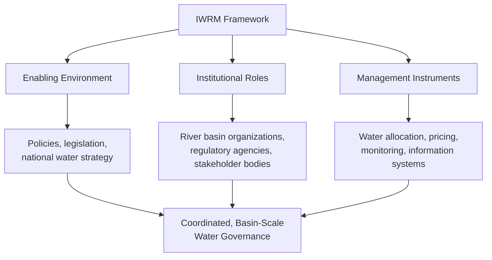

## Integrated Water Resource Management

### Definition and Core Philosophy

**Integrated Water Resource Management (IWRM)** is a planning and governance framework defined by the Global Water Partnership as a process that promotes the coordinated development and management of water, land, and related resources to maximize resulting economic and social welfare equitably, without compromising the sustainability of vital ecosystems. IWRM emerged in response to the recognized limitations of fragmented, single-sector water management approaches (separate agricultural, municipal, industrial, and environmental water agencies operating with limited coordination), which historically produced inefficient allocation, unaddressed cross-sector conflicts, and cumulative environmental degradation that no single sector's management approach could resolve alone.

The framework rests on four foundational principles articulated in the 1992 **Dublin Principles**, which remain the conceptual bedrock of most subsequent IWRM policy frameworks:

1. Freshwater is a finite and vulnerable resource, essential to sustain life, development, and the environment.
2. Water development and management should be based on a participatory approach, involving users, planners, and policymakers at all levels.
3. Women play a central role in the provision, management, and safeguarding of water.
4. Water has an economic value in all its competing uses and should be recognized as an economic good.

### The Three Pillars of IWRM

**Enabling Environment**: the overarching policy, legal, and strategic framework establishing water management goals and the rules governing water use — including national water policy, water law defining rights and priorities, and financing structures that determine how water infrastructure and management activities are funded.

**Institutional Roles**: the organizational architecture through which IWRM is implemented, typically requiring coordination across multiple government levels (national ministries, regional/state agencies, local governments) and across sectors (agriculture, energy, urban water supply, environment). **River Basin Organizations (RBOs)** are a particularly important institutional innovation in IWRM practice, since they organize management around hydrologic (basin) boundaries rather than administrative/political boundaries, directly addressing the mismatch between where water flows and where governance authority conventionally resides.

**Management Instruments**: the practical tools used to implement IWRM objectives, including water resource assessment and monitoring systems, demand management and water use efficiency programs, social and economic instruments (water pricing, tradeable water rights, subsidies), and conflict resolution mechanisms for competing water users.

### Basin-Scale Planning as the Organizing Unit

A defining feature distinguishing IWRM from earlier sectoral water management approaches is its emphasis on the **river basin (or watershed)** as the fundamental planning unit, based on the hydrologic reality that actions anywhere within a basin — upstream water withdrawal, land use change, pollutant discharge — affect water availability and quality for all downstream users within that same basin.

This basin-scale orientation requires management structures capable of operating across administrative and political boundaries, which rarely align with hydrologic boundaries. Notable institutional examples include:

- **River basin commissions/authorities**: dedicated organizations with jurisdiction (of varying strength) over an entire basin, examples including the Tennessee Valley Authority (US, historically significant as an early large-scale integrated basin development model, though originally created with a broader economic development mandate rather than a strict IWRM framing), the Murray-Darling Basin Authority (Australia), and the Mekong River Commission (spanning multiple Southeast Asian nations).
- **Transboundary basin agreements**: formal treaties governing shared basins that cross national boundaries, such as the Indus Waters Treaty (India-Pakistan) and various Nile Basin cooperative frameworks, which represent IWRM principles operating at the most institutionally complex scale, given the absence of a single sovereign authority over the entire basin.

### Stakeholder Participation and Governance

IWRM places substantial emphasis on participatory governance, reflecting the second Dublin Principle, based on the premise that water management decisions affecting multiple user groups (irrigators, municipal utilities, industry, environmental interests, Indigenous communities) achieve greater legitimacy, compliance, and conflict-resolution capacity when those groups have meaningful input into planning processes rather than having decisions imposed by a single central authority.

Common participatory mechanisms include:

- **Multi-stakeholder river basin councils/committees**: formal bodies bringing together government agencies, water user representatives, and civil society organizations to inform basin management plans.
- **Water user associations**: particularly common in irrigation management, where farmer-managed associations take on responsibility for local-level water distribution and infrastructure maintenance, often under a broader basin or district authority.
- **Public consultation processes**: formal comment periods and hearings incorporated into basin plan development, environmental flow determinations, and major infrastructure decisions.

**Gender considerations** (reflecting the third Dublin Principle) increasingly inform IWRM implementation, particularly in regions where women bear primary responsibility for household water collection and management, recognizing that water governance structures excluding women's participation and knowledge may produce less effective or equitable outcomes. [Inference: the specific mechanisms and effectiveness of gender-inclusive water governance provisions vary substantially across implementing contexts and are an active area of both practice and evaluation research]

### Water as an Economic Good

The fourth Dublin Principle — recognizing water's economic value — has been among the most debated aspects of the IWRM framework, since it raises tension between efficiency-oriented economic instruments and equity concerns around basic water access as a human right or need.

**Economic instruments used in IWRM implementation**:

- **Volumetric water pricing**: charging for water based on actual consumption (rather than flat fees), intended to create direct incentives for conservation and efficient use, though implementation requires metering infrastructure that is costly or absent in many settings, particularly for agricultural water use.
- **Tiered/increasing block pricing**: pricing structures where per-unit cost increases with consumption level, designed to keep basic-needs water affordable (lower tier) while discouraging excessive use (higher tiers priced closer to or above full cost recovery).
- **Tradeable water rights/water markets**: formal systems (most extensively developed in Australia's Murray-Darling Basin and in the western United States under prior appropriation doctrine) allowing water rights holders to buy, sell, or lease their allocation, intended to move water toward higher-value uses through market mechanisms, though such systems raise significant equity and third-party impact considerations (particularly for water-dependent ecosystems and communities without formalized, tradeable rights).
- **Full-cost pricing vs. subsidized pricing debates**: a persistent tension in IWRM economic instrument design between charging prices that reflect the true cost of water supply and treatment infrastructure (supporting long-term financial sustainability of water utilities) versus maintaining affordability for low-income users and meeting basic human needs, particularly in developing-country contexts. [Inference: the appropriate balance between these objectives is fundamentally a policy and values choice rather than a purely technical determination, and reasonable frameworks differ in how they resolve this tension]

### Environmental Flows

A central IWRM concept, **environmental flows** (e-flows) refer to the quantity, timing, and quality of water flows required to sustain freshwater and estuarine ecosystems and the human livelihoods and well-being that depend on them, explicitly incorporating ecosystem water needs as a legitimate competing use alongside agricultural, municipal, and industrial demand — a significant conceptual shift from earlier water management paradigms that treated water not consumed by human uses as simply "unused" surplus.

**Environmental flow assessment methods** range in complexity:

- **Hydrological methods** (e.g., the Tennant/Montana method): use historical flow statistics (percentage of mean annual flow) as a simplified proxy for ecologically adequate flow levels, valued for low data requirements but criticized for limited ecological specificity.
- **Hydraulic rating methods**: relate flow to physical habitat parameters (wetted perimeter, depth) at critical channel cross-sections.
- **Habitat simulation methods** (e.g., the Instream Flow Incremental Methodology, IFIM): model the relationship between flow level and physical habitat availability for target species, providing more ecologically detailed but data- and resource-intensive assessment.
- **Holistic methods** (e.g., the Building Block Methodology): incorporate the full natural flow regime (not just minimum flow thresholds), recognizing that natural flow variability — including periodic high-flow events that maintain channel form, trigger fish spawning cues, and redistribute sediment — is itself ecologically important, not merely a constraint to be minimized.

### Water-Energy-Food Nexus

IWRM increasingly incorporates explicit recognition of the **water-energy-food nexus**: the interconnected dependencies among water, energy, and food production systems, where decisions in one sector create direct resource implications for the others.

- Agriculture is both the dominant global water consumer and a major energy consumer (pumping, processing, fertilizer production), while energy production (particularly thermoelectric power generation and hydropower) is itself highly water-dependent.
- Hydropower development illustrates nexus tension directly: dam construction can provide substantial energy benefits while altering downstream flow regimes in ways that conflict with both environmental flow requirements and downstream agricultural or municipal water needs.
- Nexus-oriented planning approaches attempt to evaluate trade-offs across all three sectors simultaneously rather than optimizing water, energy, or food policy in isolation, though integrating nexus considerations into practical basin-level planning remains methodologically and institutionally challenging. [Inference: the degree to which nexus-integrated planning has been operationally achieved, as opposed to conceptually endorsed, varies considerably across implementing institutions and is an area of ongoing practical development]

### Climate Change Adaptation Integration

Modern IWRM frameworks increasingly incorporate climate adaptation as a core planning consideration, given that climate change directly alters the hydrologic assumptions (precipitation patterns, snowmelt timing, extreme event frequency) underlying historical water allocation and infrastructure planning.

**Adaptive management** — an iterative planning approach that treats water management decisions as provisional hypotheses to be tested, monitored, and revised as new information (including changing climate conditions) becomes available — has become a widely recommended complement to traditional IWRM planning, replacing the assumption of hydrologic stationarity (the historically standard assumption that past hydrologic records adequately represent future conditions) with planning approaches explicitly designed to accommodate a changing and uncertain future hydrologic baseline.

**Robust decision-making** approaches, which evaluate infrastructure and policy choices across a wide range of plausible future climate scenarios rather than optimizing for a single "most likely" future, have gained increasing adoption in major basin planning efforts (e.g., aspects of Colorado River Basin planning in the western United States) as a response to this deep uncertainty. [Unverified: the specific methodologies and current status of any named basin planning process are subject to ongoing revision, and current details should be verified against the relevant basin authority's current published planning documents]

### Implementation Challenges and Critiques

**Institutional fragmentation**: despite IWRM's coordination goal, many countries retain water governance structures split across multiple ministries and agencies with overlapping or unclear authority, creating persistent coordination challenges even where IWRM is formally adopted as national policy.

**Data and capacity limitations**: effective IWRM implementation requires substantial hydrologic monitoring data, technical capacity, and institutional resources that are unevenly available globally, particularly limiting effective implementation in lower-income countries and basins with sparse historical monitoring networks.

**Gap between policy adoption and implementation**: numerous assessments (including UN-Water's periodic global IWRM implementation status reporting under SDG indicator 6.5.1) have documented that many countries have formally adopted IWRM-aligned national policies without achieving corresponding on-the-ground institutional and operational change, a persistent "implementation gap" widely discussed in the IWRM literature. [Unverified: specific current global implementation statistics should be checked against the most recent UN-Water SDG 6.5.1 progress reporting, as these figures are updated periodically]

**Critique of the "integration" concept itself**: some scholars have questioned whether the comprehensive, all-encompassing coordination envisioned by classical IWRM is practically achievable or even conceptually well-defined, given the genuine complexity and number of interacting sectors, scales, and stakeholder interests involved — leading to proposals for more pragmatic, context-specific "adaptive" or "polycentric" governance approaches as alternatives or complements to comprehensive basin-wide integration. [Inference: this remains an active and unresolved debate within the water governance scholarly literature rather than a settled methodological consensus]

### Worked Example: Basin-Scale Water Allocation Trade-off Analysis

**Scenario**: A river basin has an average annual renewable water supply of 2,000 million m³ (MCM). Current and projected demands from three sectors are being evaluated for a basin water allocation plan:

| Sector | Current Demand (MCM/yr) | Projected Demand in 20 Years (MCM/yr) |
| --- | --- | --- |
| Agricultural irrigation | 1,100 | 1,300 |
| Municipal/domestic | 350 | 550 |
| Environmental flow requirement | 450 | 450 |

**Current total demand**:

$$D_{current} = 1{,}100 + 350 + 450 = 1{,}900\ MCM/yr$$

This leaves a current basin surplus of $2{,}000 - 1{,}900 = 100\ MCM/yr$ — a relatively narrow margin.

**Projected total demand in 20 years**:

$$D_{future} = 1{,}300 + 550 + 450 = 2{,}300\ MCM/yr$$

**Projected deficit**:

$$\text{Deficit} = 2{,}300 - 2{,}000 = 300\ MCM/yr$$

**Interpretation**: This simplified allocation analysis (holding supply constant, which in practice would also need to account for potential climate-driven changes to renewable supply) reveals a projected 300 MCM/yr basin-scale deficit within two decades, driven primarily by growing municipal demand alongside continued agricultural demand growth, even while holding the environmental flow requirement fixed at its current level. Addressing this projected gap through an IWRM framework would typically involve evaluating a portfolio of responses — irrigation efficiency improvements, municipal demand management and reuse, supply augmentation (reservoir storage, groundwater conjunctive use), and potentially reallocation between sectors — rather than assuming any single measure alone. [Inference: the specific optimal mix of responses is a basin-specific determination depending on economic, social, and physical factors and cannot be generalized from this illustrative example]

### Illustration: IWRM Institutional Architecture

<svg xmlns="http://www.w3.org/2000/svg" viewBox="0 0 700 320">
<text x="350" y="25" font-size="16" font-weight="bold" text-anchor="middle" fill="#1a1a1a">IWRM Institutional Architecture (svg_diagram)</text>
<rect x="250" y="50" width="200" height="50" fill="#2c5f8a" rx="4" />
<text x="350" y="80" font-size="12" text-anchor="middle" fill="#fff">National Water Policy</text>
<rect x="250" y="130" width="200" height="50" fill="#4a7a3a" rx="4" />
<text x="350" y="160" font-size="12" text-anchor="middle" fill="#fff">River Basin Organization</text>
<rect x="60" y="230" width="140" height="50" fill="#8a6a4a" rx="4" />
<text x="130" y="255" font-size="11" text-anchor="middle" fill="#fff">Agricultural</text>
<text x="130" y="268" font-size="11" text-anchor="middle" fill="#fff">Water Users</text>
<rect x="220" y="230" width="140" height="50" fill="#8a6a4a" rx="4" />
<text x="290" y="255" font-size="11" text-anchor="middle" fill="#fff">Municipal</text>
<text x="290" y="268" font-size="11" text-anchor="middle" fill="#fff">Utilities</text>
<rect x="380" y="230" width="140" height="50" fill="#8a6a4a" rx="4" />
<text x="450" y="255" font-size="11" text-anchor="middle" fill="#fff">Industrial</text>
<text x="450" y="268" font-size="11" text-anchor="middle" fill="#fff">Users</text>
<rect x="540" y="230" width="140" height="50" fill="#8a6a4a" rx="4" />
<text x="610" y="255" font-size="11" text-anchor="middle" fill="#fff">Environmental</text>
<text x="610" y="268" font-size="11" text-anchor="middle" fill="#fff">Interests</text>
<line x1="350" y1="100" x2="350" y2="130" stroke="#333" stroke-width="2" />
<line x1="350" y1="180" x2="130" y2="230" stroke="#333" stroke-width="1.5" />
<line x1="350" y1="180" x2="290" y2="230" stroke="#333" stroke-width="1.5" />
<line x1="350" y1="180" x2="450" y2="230" stroke="#333" stroke-width="1.5" />
<line x1="350" y1="180" x2="610" y2="230" stroke="#333" stroke-width="1.5" />

<text x="360" y="300" font-size="10" fill="#333">Stakeholder participation flows both directions:</text>

<text x="360" y="312" font-size="10" fill="#333">input to planning, allocation decisions downward</text>

</svg>

### Related Topics

- Environmental flow assessment methodologies (IFIM, Building Block Method)
- Transboundary river basin treaty design and dispute resolution
- Water-energy-food nexus quantitative modeling
- Tradeable water rights and water market design
- River basin organization institutional models
- Climate adaptive water management and robust decision-making
- SDG 6.5.1 IWRM implementation monitoring
- Water pricing structures and cost recovery frameworks
- Stakeholder engagement methods in basin planning
- Conjunctive use of surface water and groundwater resources