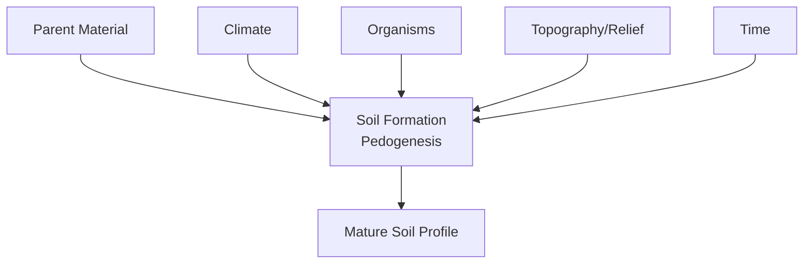

## Soil Formation and Composition

### Definition and Significance

Soil is a dynamic, structured, three-dimensional natural body formed at the interface of the lithosphere, atmosphere, hydrosphere, and biosphere, consisting of mineral and organic constituents, water, and air in varying proportions. It functions simultaneously as a medium for plant growth, a habitat for an immense diversity of organisms, a water storage and filtration system, a carbon reservoir, and the physical foundation for terrestrial ecosystems and human infrastructure. Soil formation (pedogenesis) is a slow process, typically requiring centuries to millennia to develop a mature soil profile, which is a central reason soil is generally classified as a non-renewable or only very slowly renewable resource on human timescales.

### The Five Factors of Soil Formation (CLORPT)

Soil formation is classically explained through the CLORPT framework, articulated by Hans Jenny in 1941, expressing soil properties as a function of five independent state factors:

$$S = f(cl, o, r, p, t)$$

where $S$ represents soil properties, and the function depends on climate ($cl$), organisms ($o$), relief/topography ($r$), parent material ($p$), and time ($t$).

**Parent Material**: the geologic or organic substrate from which soil develops, either **residual** (weathered in place from underlying bedrock) or **transported** (deposited by wind — loess, water — alluvium, ice — glacial till, or gravity — colluvium). Parent material strongly influences initial soil texture, mineralogy, and nutrient content.

**Climate**: temperature and precipitation regime govern the rate and type of weathering, the rate of organic matter decomposition, and dominant vegetation type, making climate arguably the most influential single factor over broad geographic soil pattern formation.

**Organisms**: encompasses vegetation type, soil fauna, microorganisms, and, increasingly recognized, human activity as an anthropogenic soil-forming factor.

**Topography/Relief**: influences soil formation through control on water movement and erosion/deposition patterns — steep slopes tend toward thinner, less-developed soils, while depressions accumulate transported material and moisture.

**Time**: soil properties evolve progressively; young soils exhibit minimal profile development, while soils forming under stable conditions for extended periods develop pronounced, well-differentiated horizons.

### Weathering Processes

**Physical (mechanical) weathering** breaks rock into smaller fragments without altering mineral chemical composition: freeze-thaw weathering, thermal expansion/contraction, exfoliation, and biological physical weathering (root wedging).

**Chemical weathering** alters mineral composition, generally accelerating with temperature and moisture:

- **Hydrolysis**: reaction of minerals with water, dominant for silicate minerals.
- **Oxidation**: reaction of iron-bearing minerals with oxygen, producing characteristic reddish/yellowish colors.
- **Dissolution**: dissolving of soluble minerals, notably carbonates, dominant in karst development.
- **Carbonation**: reaction of dissolved $CO_2$ with carbonate and silicate minerals.

**Biological weathering** includes root wedging and organic acid production by roots, fungi, and lichens attacking mineral surfaces.

### Soil Profile and Horizon Development

- **O horizon**: organic surface layer of litter and humus.
- **A horizon (topsoil)**: humus-enriched mineral horizon, most biologically active.
- **E horizon**: zone of maximum leaching, pale in color, pronounced in strongly leached soils.
- **B horizon (subsoil)**: zone of illuviation, enriched in translocated clay, iron, aluminum, or carbonate.
- **C horizon**: weathered parent material, minimally altered by pedogenic processes.
- **R horizon**: unweathered bedrock.

### Soil Composition: The Four Major Components

A well-developed, agriculturally productive soil is conventionally described as approximately 45% mineral matter, 25% water, 25% air, and 5% organic matter by volume — though proportions fluctuate with moisture, management, and soil type. [Inference: this "ideal soil" figure is a pedagogical illustration rather than a fixed target]

**Mineral Matter**: classified by particle size into sand (0.05–2.0 mm), silt (0.002–0.05 mm), and clay (under 0.002 mm), with relative proportions determining soil texture via the USDA textural triangle.

**Soil Organic Matter (SOM)**: decomposing residues and humus, exerting disproportionate influence on cation exchange capacity, structure, water-holding capacity, and microbial activity relative to its typically small mass fraction.

**Soil Water**: exists as gravitational water (drains freely, largely unavailable to plants), capillary water (the primary plant-available reservoir), and hygroscopic water (tightly bound, unavailable). Field capacity and permanent wilting point bound the plant-available water range.

**Soil Air**: occupies pore space not filled with water; typically elevated in $CO_2$ and reduced in $O_2$ relative to the atmosphere due to root and microbial respiration.

### Soil Structure and Aggregation

Soil structure describes the arrangement of particles into aggregates (peds) — granular, blocky, prismatic, or platy — a property strongly influenced by organic matter and management, distinct from the more slowly-changing property of texture.

### Cation Exchange Capacity (CEC)

$$CEC = \sum \text{exchangeable cations (cmol}_c\text{/kg)}$$

CEC quantifies a soil's capacity to retain exchangeable cations (Ca²⁺, Mg²⁺, K⁺, NH₄⁺), strongly influenced by clay content, clay mineralogy, and organic matter content, and widely used as an indicator of inherent fertility potential.

### Soil pH and Nutrient Availability

Most nutrients show maximum availability in the moderately acidic to neutral range (approximately pH 6.0–7.0); phosphorus availability declines at both low and high pH extremes for distinct chemical reasons, while micronutrient metal availability generally declines under alkaline conditions.

### Major World Soil Orders (Brief Overview)

Selected USDA Soil Taxonomy orders: **Entisols** (minimal development), **Inceptisols** (weak development), **Mollisols** (dark, fertile grassland soils), **Alfisols** (moderately weathered forest soils), **Ultisols** (highly weathered, humid climate), **Oxisols** (extremely weathered tropical soils), **Aridisols** (arid-region soils), **Spodosols** (leached coniferous forest soils), **Histosols** (organic/peat soils), **Vertisols** (shrink-swell clay soils).

### Worked Example: Calculating Plant-Available Water Capacity

**Scenario**: A soil has field capacity of 28% and permanent wilting point of 12% (gravimetric), bulk density 1.3 g/cm³, root zone depth 60 cm.

$$AWC_{\%} = (\theta_{FC} - \theta_{PWP}) \times \rho_b = (0.28 - 0.12) \times 1.3 = 0.208 = 20.8\%$$

$$AW_{total} = 0.208 \times 600\ mm = 124.8\ mm$$

**Interpretation**: This root zone stores approximately 125 mm of plant-available water, informing irrigation scheduling decisions such as application depth and interval. [Inference: practical scheduling would additionally incorporate an allowable depletion fraction rather than depleting fully to the wilting point]

### Illustration: Generalized Soil Profile

<svg xmlns="http://www.w3.org/2000/svg" viewBox="0 0 500 380">
<text x="250" y="25" font-size="16" font-weight="bold" text-anchor="middle" fill="#1a1a1a">Generalized Soil Profile (svg_diagram)</text>
<rect x="100" y="50" width="300" height="25" fill="#4a3520" />
<text x="410" y="67" font-size="12" fill="#1a1a1a">O horizon</text>
<rect x="100" y="75" width="300" height="50" fill="#6b4a2a" />
<text x="410" y="105" font-size="12" fill="#1a1a1a">A horizon</text>
<rect x="100" y="125" width="300" height="35" fill="#c9b896" />
<text x="410" y="147" font-size="12" fill="#1a1a1a">E horizon</text>
<rect x="100" y="160" width="300" height="90" fill="#a8703a" />
<text x="410" y="210" font-size="12" fill="#1a1a1a">B horizon</text>
<rect x="100" y="250" width="300" height="70" fill="#c9a876" />
<text x="410" y="290" font-size="12" fill="#1a1a1a">C horizon</text>
<rect x="100" y="320" width="300" height="40" fill="#888888" />
<text x="410" y="345" font-size="12" fill="#1a1a1a">R horizon</text>

<text x="60" y="65" font-size="9" text-anchor="end" fill="`#1a1a1a`">Organic litter</text>

<text x="60" y="100" font-size="9" text-anchor="end" fill="`#1a1a1a`">Topsoil, humus</text>

<text x="60" y="145" font-size="9" text-anchor="end" fill="`#1a1a1a`">Leached zone</text>

<text x="60" y="205" font-size="9" text-anchor="end" fill="`#1a1a1a`">Illuviation zone</text>

<text x="60" y="285" font-size="9" text-anchor="end" fill="`#1a1a1a`">Weathered parent</text>

<text x="60" y="342" font-size="9" text-anchor="end" fill="`#1a1a1a`">Bedrock</text>

</svg>

### Related Topics

- Soil texture analysis and the USDA soil textural triangle
- Cation exchange capacity measurement and interpretation
- Soil taxonomy classification systems (USDA and WRB)
- Soil organic carbon dynamics and sequestration potential
- Weathering rate modeling and mineral stability sequences
- Soil water retention curves and irrigation scheduling
- Soil microbial ecology and nutrient cycling
- Soil erosion processes and control practices
- Pedometric mapping and digital soil survey methods
- Anthropogenic soils and urban soil formation processes