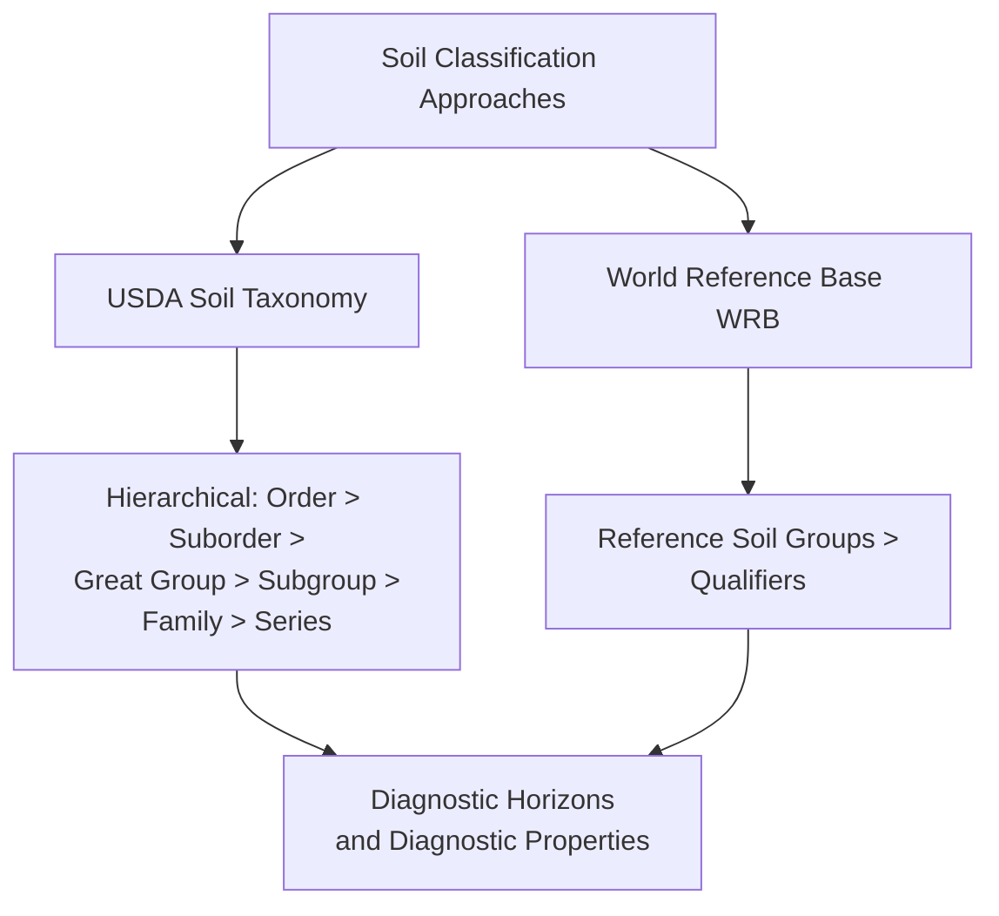

## Soil Classification Systems

### Purpose and Conceptual Basis

Soil classification systems organize the immense natural variability of soils into a structured hierarchy of categories, enabling consistent communication among soil scientists, land managers, and agricultural practitioners; supporting soil mapping and survey; and facilitating prediction of soil behavior and management needs based on classification placement. Modern systems are generally **morphogenetic** in orientation — classifying soils based on observable, measurable properties (diagnostic horizons and features) that are themselves the product of specific soil-forming processes, rather than relying solely on inferred formation history that cannot be directly verified in the field.

Two systems dominate global soil science practice and are frequently cross-referenced: **USDA Soil Taxonomy**, developed primarily for use in the United States but applied and adapted internationally, and the **World Reference Base for Soil Resources (WRB)**, maintained by the International Union of Soil Sciences and increasingly used as an international standard, particularly outside North America.

### USDA Soil Taxonomy: Hierarchical Structure

USDA Soil Taxonomy, first published in 1975 and periodically updated, organizes soils into six hierarchical categories, from most general to most specific:

1. **Order** (12 total): the broadest category, based on the presence or absence of major diagnostic horizons and dominant soil-forming processes.
2. **Suborder**: subdivides orders based on properties reflecting differences in moisture regime, temperature regime, or dominant parent material influence.
3. **Great Group**: further subdivides suborders based on the presence, absence, or arrangement of specific diagnostic horizons.
4. **Subgroup**: identifies whether a soil is a "typic" (central, representative) example of its great group, or exhibits transitional characteristics toward another great group or order.
5. **Family**: groups soils with similar physical and chemical properties relevant to plant growth (particle-size class, mineralogy class, temperature regime), important for practical land-use interpretation.
6. **Series**: the most specific category, essentially the basic mapping unit of detailed soil surveys, defined by a narrow, specific range of soil properties and typically named after a geographic locality where the series was first identified (e.g., the "Miami series" in the US Midwest).

### Diagnostic Horizons in USDA Soil Taxonomy

Soil Taxonomy classification hinges on identifying specific **diagnostic horizons**, precisely defined based on measurable morphological and chemical criteria (not simply the general master horizon designations O, A, E, B, C used in general soil description):

**Diagnostic surface horizons (epipedons)**:

- **Mollic epipedon**: a thick, dark-colored, organic-matter-rich surface horizon with high base saturation, characteristic of Mollisols and generally indicating high natural fertility.
- **Umbric epipedon**: similar to mollic in thickness, color, and organic matter content, but with low base saturation, generally reflecting more acidic, leached conditions.
- **Ochric epipedon**: a light-colored surface horizon with low organic matter content, either because it is naturally low in organic matter or because it has been disturbed (e.g., by cultivation) sufficiently to alter its natural properties.

**Diagnostic subsurface horizons**:

- **Argillic horizon**: a subsurface horizon showing clear evidence of clay accumulation via illuviation, a key diagnostic feature distinguishing Alfisols and Ultisols.
- **Spodic horizon**: a subsurface horizon enriched in illuvial organic matter combined with aluminum (with or without iron), characteristic of Spodosols and typically underlying a distinctly pale, leached E horizon.
- **Oxic horizon**: a highly weathered subsurface horizon dominated by iron and aluminum oxide clay minerals with very low content of weatherable primary minerals, diagnostic of Oxisols.
- **Cambic horizon**: a horizon showing some evidence of alteration (structural development, weak color or texture change) beyond the unaltered parent material, but insufficient development to qualify as a more strongly differentiated diagnostic horizon — diagnostic of Inceptisols.
- **Calcic horizon**: a subsurface horizon with significant secondary accumulation of calcium carbonate, common in Aridisols and some Mollisols formed under lower rainfall.

### The Twelve Soil Orders

| Order | Key Diagnostic Feature | Typical Environment |
| --- | --- | --- |
| Entisols | Minimal profile development | Recent deposits, steep eroding slopes |
| Inceptisols | Weak horizon development (cambic horizon) | Wide range of climates, moderately young soils |
| Andisols | Dominated by volcanic ash-derived materials | Volcanic regions |
| Gelisols | Presence of permafrost within a shallow depth | Arctic and high-alpine regions |
| Histosols | Predominantly organic material | Peatlands, bogs, poorly drained wetlands |
| Aridisols | Limited leaching, low organic matter, arid moisture regime | Deserts and semi-arid regions |
| Vertisols | High shrink-swell clay content | Seasonally wet-dry climates with expansive clay parent material |
| Mollisols | Mollic epipedon, high base saturation | Grasslands and prairies |
| Alfisols | Argillic horizon, moderate-to-high base saturation | Temperate forests |
| Ultisols | Argillic horizon, low base saturation | Warm, humid climates with long weathering history |
| Spodosols | Spodic horizon | Cool, humid climates under coniferous forest |
| Oxisols | Oxic horizon, extreme weathering | Humid tropical regions |

### Soil Moisture and Temperature Regimes

USDA Soil Taxonomy incorporates standardized **soil moisture regimes** and **soil temperature regimes** as key classification criteria at the suborder and lower categorical levels, since these strongly govern soil-forming processes and agricultural suitability:

**Moisture regimes** (illustrative, not exhaustive): **aquic** (saturated long enough to produce anaerobic conditions), **udic** (generally moist, characteristic of humid climates with reliable precipitation), **ustic** (intermediate, with limited but biologically significant moisture availability, characteristic of semi-arid to subhumid climates), and **aridic** (insufficient moisture for plant growth during most of the year).

**Temperature regimes** are defined by mean annual soil temperature at a standardized depth, ranging from **pergelic** (perennially frozen) through **cryic**, **frigid**, **mesic**, **thermic**, to **hyperthermic** (consistently warm), providing a standardized basis for comparing soils across different climatic zones independent of local air temperature measurement conventions.

### World Reference Base for Soil Resources (WRB)

The WRB, maintained under the auspices of the International Union of Soil Sciences and used as the basis for the UN Food and Agriculture Organization's international soil correlation efforts, employs a different structural philosophy from USDA Soil Taxonomy, though it draws on many of the same diagnostic horizon and property concepts.

**Structure**: WRB classifies soils into 32 **Reference Soil Groups (RSGs)** at the highest level (analogous in role, though not in specific boundary definitions, to USDA orders), with each soil name further refined through **prefix and suffix qualifiers** that describe specific soil properties, providing considerable descriptive flexibility without requiring the extended hierarchical nomenclature of Soil Taxonomy.

**Notable naming differences**: WRB names are generally intended to be more directly descriptive and often draw on established international or vernacular soil science terminology, in some cases converging with or directly adopting terms with long histories in regional soil science traditions (for example, "Chernozem," a term of Russian origin long used to describe dark, organic-rich steppe soils, is retained as a WRB Reference Soil Group name, whereas USDA Soil Taxonomy classifies equivalent soils within the broader Mollisol order using its own systematic nomenclature).

**Comparative note**: while USDA Soil Taxonomy and WRB share substantial conceptual overlap (both rely heavily on diagnostic horizon concepts, and correlation tables exist mapping approximate equivalencies between systems), they are not fully interchangeable, since category boundaries, diagnostic criteria thresholds, and overall structural philosophy differ in numerous specific respects. [Inference: exact cross-system correlation requires case-by-case comparison of specific diagnostic criteria rather than a simple one-to-one name substitution, and users working across both systems should consult official correlation guidance for the specific soils in question]

### Soil Survey and Mapping Application

Soil classification systems underpin practical **soil survey** programs (in the US, historically conducted by the USDA Natural Resources Conservation Service, formerly the Soil Conservation Service), which map soil series distribution across the landscape and compile corresponding interpretive data on agricultural suitability, engineering properties, and environmental management considerations for each mapped soil unit.

**Soil map units** typically represent either a single dominant soil series (a "consociation") or a defined combination of multiple series occurring together in a characteristic, mappable pattern (a "complex" or "association"), reflecting the practical reality that soil boundaries in the field are rarely as sharply and uniformly defined as a single-series map unit would imply.

**Digital soil mapping**, an increasingly important complement to traditional field-based soil survey, applies statistical and machine-learning methods (relating soil properties to remotely-sensed and terrain-derived covariates such as elevation, slope, vegetation indices, and geology) to predict soil class or property distribution at fine spatial resolution across large areas, often substantially reducing the field sampling intensity required relative to conventional survey methods, though the reliability of digital soil mapping predictions depends heavily on the quality and density of the underlying calibration (ground-truth) data used to train the predictive model. [Inference: the relative accuracy of digital soil mapping compared to traditional survey varies by landscape complexity, covariate data quality, and calibration sample density, and is not uniformly superior or inferior across all applications]

### Practical Land-Use Interpretations from Classification

Soil classification, once established for a given site, supports numerous derived land management interpretations without requiring re-investigation of basic soil properties for each new application:

- **Agricultural capability classification** (e.g., the USDA Land Capability Classification system, using Roman numerals I through VIII) rates land suitability for cultivation and the degree of management limitation, drawing on underlying soil taxonomic and property data.
- **Septic system suitability**: soil permeability, depth to water table, and depth to bedrock (all reflected in soil series characteristics) directly determine whether a given soil is suitable for on-site wastewater disposal via soil absorption fields.
- **Engineering interpretations**: shrink-swell potential (particularly relevant for Vertisols and other high-clay-content soils), depth to bedrock, and drainage class inform foundation design and construction suitability assessments.
- **Erosion hazard ratings**: derived from soil texture, structure, slope, and organic matter content, informing conservation practice recommendations.

### Worked Example: Diagnostic Horizon Identification Exercise

**Scenario**: A soil profile description from a field survey includes the following observations: a thick (35 cm), very dark grayish-brown surface horizon with granular structure and high measured base saturation (greater than 50%), directly overlying a horizon with blocky structure and no significant clay accumulation, transitioning to relatively unaltered parent material at approximately 90 cm depth.

**Classification reasoning**:

1. The thick, dark, high-base-saturation surface horizon meets the criteria for a **mollic epipedon**.
2. The absence of significant clay accumulation in the subsurface horizon rules out an argillic horizon, and the described structural development without strong horizon differentiation is consistent with a **cambic horizon** (or the surface and subsurface together may not require a distinct diagnostic subsurface horizon at all, depending on additional criteria not specified here).
3. The presence of a mollic epipedon is the defining diagnostic feature of the **Mollisol** order.

**Interpretation**: Based on the mollic epipedon alone, this profile would be classified at the order level as a Mollisol; further classification to suborder, great group, subgroup, family, and series would require additional information on moisture regime, temperature regime, particle-size class, and mineralogy not provided in this simplified field description. [Inference: this worked example is deliberately simplified for illustrative purposes — actual field classification requires laboratory-verified base saturation and organic carbon measurements alongside the full suite of diagnostic criteria specified in the current Keys to Soil Taxonomy reference]

### Illustration: USDA Soil Taxonomy Hierarchical Structure

<svg xmlns="http://www.w3.org/2000/svg" viewBox="0 0 700 320">
<text x="350" y="25" font-size="16" font-weight="bold" text-anchor="middle" fill="#1a1a1a">USDA Soil Taxonomy Hierarchy (svg_diagram)</text>
<rect x="270" y="50" width="160" height="35" fill="#2c5f8a" rx="3" />
<text x="350" y="72" font-size="12" text-anchor="middle" fill="#fff">Order (12 total)</text>
<rect x="270" y="100" width="160" height="35" fill="#3a6f9a" rx="3" />
<text x="350" y="122" font-size="12" text-anchor="middle" fill="#fff">Suborder</text>
<rect x="270" y="150" width="160" height="35" fill="#4a7faa" rx="3" />
<text x="350" y="172" font-size="12" text-anchor="middle" fill="#fff">Great Group</text>
<rect x="270" y="200" width="160" height="35" fill="#5a8fba" rx="3" />
<text x="350" y="222" font-size="12" text-anchor="middle" fill="#fff">Subgroup</text>
<rect x="270" y="250" width="160" height="35" fill="#6a9fca" rx="3" />
<text x="350" y="272" font-size="12" text-anchor="middle" fill="#fff">Family</text>
<rect x="270" y="300" width="160" height="1" fill="none" />
<line x1="350" y1="85" x2="350" y2="100" stroke="#333" stroke-width="1.5" />
<line x1="350" y1="135" x2="350" y2="150" stroke="#333" stroke-width="1.5" />
<line x1="350" y1="185" x2="350" y2="200" stroke="#333" stroke-width="1.5" />
<line x1="350" y1="235" x2="350" y2="250" stroke="#333" stroke-width="1.5" />

<text x="460" y="72" font-size="10" fill="`#1a1a1a`">e.g., Mollisol</text>

<text x="460" y="122" font-size="10" fill="`#1a1a1a`">e.g., Udoll</text>

<text x="460" y="172" font-size="10" fill="`#1a1a1a`">e.g., Hapludoll</text>

<text x="460" y="222" font-size="10" fill="`#1a1a1a`">e.g., Typic Hapludoll</text>

<text x="460" y="272" font-size="10" fill="`#1a1a1a`">e.g., fine-silty, mixed</text>

<text x="200" y="285" font-size="11" text-anchor="middle" fill="`#1a1a1a`">Series</text>

<text x="200" y="298" font-size="9" text-anchor="middle" fill="`#1a1a1a`">(most specific;</text>

<text x="200" y="309" font-size="9" text-anchor="middle" fill="`#1a1a1a`">e.g., Miami series)</text>

<line x1="270" y1="267" x2="230" y2="285" stroke="#333" stroke-width="1.5" />

</svg>

### Related Topics

- Diagnostic horizon field identification methods
- Soil-landscape relationships and catena concepts
- Digital soil mapping and machine learning applications
- Land Capability Classification and land-use planning
- USDA-WRB soil classification correlation tables
- Soil survey field methodology and profile description standards
- Paleopedology and buried soil interpretation
- Soil taxonomy revisions and Keys to Soil Taxonomy updates
- Great Group and Subgroup naming conventions
- Soil series establishment and correlation procedures