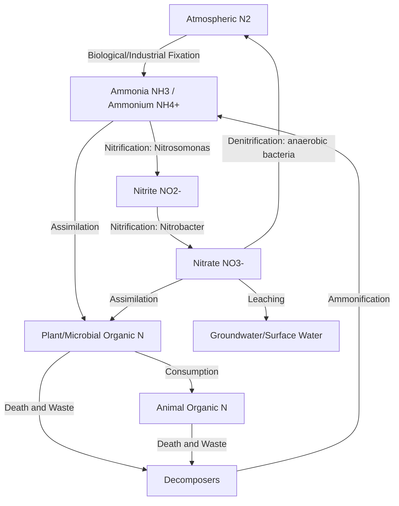
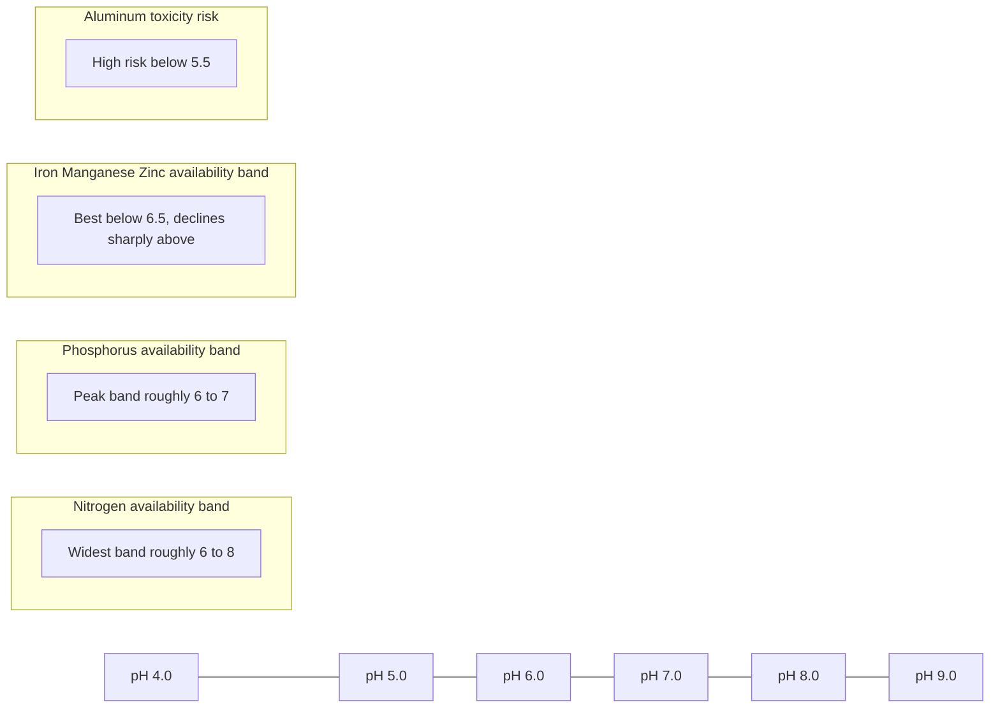

## Soil Fertility and Nutrient Cycling

### Definition and Scope

Soil fertility is the capacity of a soil to sustain plant growth by supplying essential nutrients in adequate amounts and proper balance, while nutrient cycling refers to the continuous movement and transformation of nutrients between soil, organisms, water, and atmosphere. These two concepts are inseparable: fertility is a static-seeming property (a soil's condition at a point in time), while nutrient cycling describes the dynamic biogeochemical processes that create, maintain, deplete, or restore that condition.

Soil fertility encompasses three interacting dimensions:

- **Physical fertility** — structure, texture, porosity, and water-holding capacity that govern root penetration and aeration
- **Chemical fertility** — nutrient availability, cation exchange capacity (CEC), pH, and absence of toxic element concentrations
- **Biological fertility** — the activity and diversity of soil organisms (bacteria, fungi, fauna) driving decomposition and nutrient transformation

### Essential Plant Nutrients

Plants require 17 essential elements, classified by the quantity needed.

**Macronutrients (Primary)**

- Nitrogen (N) — proteins, chlorophyll, nucleic acids
- Phosphorus (P) — ATP, DNA/RNA, root development
- Potassium (K) — enzyme activation, stomatal regulation, osmotic balance

**Macronutrients (Secondary)**

- Calcium (Ca) — cell wall structure, membrane stability
- Magnesium (Mg) — central atom of chlorophyll
- Sulfur (S) — amino acids (cysteine, methionine), enzyme cofactors

**Micronutrients (Trace elements)**

- Iron (Fe), Manganese (Mn), Zinc (Zn), Copper (Cu), Boron (B), Molybdenum (Mo), Chlorine (Cl), Nickel (Ni)

**Structural elements** (from air and water, not soil)

- Carbon (C), Hydrogen (H), Oxygen (O)

Nutrient deficiency symptoms often follow diagnostic patterns — mobile nutrients (N, P, K, Mg) show deficiency in older leaves first because the plant translocates them to new growth, while immobile nutrients (Ca, Fe, B) show deficiency in younger leaves and growing points first.

### The Nitrogen Cycle

Nitrogen is the most commonly limiting nutrient in terrestrial ecosystems despite constituting about 78% of the atmosphere, because atmospheric N₂ is chemically inert (a triple bond) and unusable by most organisms directly.

**Key transformations:**

1. **Nitrogen fixation** — conversion of N₂ gas to ammonia (NH₃) by:
   - Biological fixation: symbiotic bacteria (*Rhizobium* in legume root nodules) and free-living bacteria (*Azotobacter*, cyanobacteria)
   - Industrial fixation: the Haber-Bosch process (synthetic fertilizer)
   - Atmospheric fixation: lightning providing enough energy to break the N≡N bond
2. **Ammonification (Mineralization)** — decomposers convert organic nitrogen (in dead organisms, waste) into ammonium (NH₄⁺)
3. **Nitrification** — a two-step chemoautotrophic oxidation:

   $$NH_4^+ + 1.5O_2 \rightarrow NO_2^- + H_2O + 2H^+ \text{ (by } \textit{Nitrosomonas} \text{)}$$

   $$NO_2^- + 0.5O_2 \rightarrow NO_3^- \text{ (by } \textit{Nitrobacter} \text{)}$$
4. **Assimilation** — plant uptake of NH₄⁺ or NO₃⁻ into organic compounds
5. **Denitrification** — anaerobic bacteria (*Pseudomonas*) reduce NO₃⁻ back to N₂ or N₂O gas, returning nitrogen to the atmosphere; this occurs predominantly in waterlogged, oxygen-poor soils

### The Phosphorus Cycle

Unlike nitrogen and sulfur, phosphorus has no significant atmospheric gas phase and cycles primarily through rock weathering, making it a sedimentary cycle rather than a gaseous one. This makes phosphorus availability highly dependent on parent material and soil chemistry rather than atmospheric exchange.

**Key steps:**

1. **Weathering** — apatite and other phosphate-bearing rocks slowly release phosphate ions (PO₄³⁻) into soil solution
2. **Plant uptake** — roots absorb dissolved orthophosphate (H₂PO₄⁻ or HPO₄²⁻, pH-dependent)
3. **Immobilization/mineralization** — microbes and organic matter cycle organic phosphorus
4. **Fixation** — a major limiting process: phosphate readily binds with aluminum and iron oxides in acidic soils, or with calcium in alkaline soils, forming insoluble compounds unavailable to plants
5. **Erosion and runoff** — particulate and dissolved phosphorus moves to aquatic systems, often driving eutrophication

Phosphorus availability peaks near pH 6.0–7.0; strongly acidic soils favor Fe/Al-phosphate precipitation, while strongly alkaline soils favor calcium-phosphate precipitation, both of which reduce plant-available P.

### The Potassium, Sulfur, and Carbon Cycles (Brief)

- **Potassium** does not undergo valence changes (remains K⁺); its cycle is governed by weathering of K-bearing minerals (feldspars, micas), clay mineral fixation/release, and plant uptake/return via residues. Unlike N and P, K is not incorporated into organic molecules, so its cycling is largely physical rather than biochemical.
- **Sulfur** cycles similarly to nitrogen, with mineralization of organic S to sulfate (SO₄²⁻), immobilization, and microbial oxidation/reduction (including anaerobic sulfate reduction to H₂S in waterlogged soils).
- **Carbon** cycling in soil centers on organic matter decomposition, humus formation, and CO₂ respiration; it underlies soil structure, water retention, and microbial energy supply, and directly influences all other nutrient cycles because decomposers require carbon as an energy source alongside the nutrients they mineralize.

### Soil Organic Matter and the Biological Engine

Soil organic matter (SOM) is the central hub linking nutrient cycling, physical structure, and biological activity.

**Components:**

- Fresh residues (undecomposed plant/animal material)
- Active/labile fraction (readily decomposable, short turnover — weeks to years)
- Stable humus (highly decomposed, resistant, long turnover — decades to centuries)

**Functions:**

- Nutrient reservoir and slow-release source through mineralization
- Improves aggregate stability, porosity, and water infiltration
- Increases cation exchange capacity (humus CEC can exceed 200 cmol/kg, far higher than most clays)
- Buffers soil pH and adsorbs potential toxins

**The soil food web** drives decomposition through trophic layers:

- Primary decomposers: bacteria and fungi break down organic matter
- Microbial grazers: protozoa and nematodes consume bacteria/fungi, releasing mineralized nutrients (the "microbial loop")
- Ecosystem engineers: earthworms and arthropods fragment residues and mix soil layers (bioturbation)
- Mycorrhizal fungi: form symbiotic associations with roughly 80–90% of plant species, extending effective root surface area and enhancing phosphorus and micronutrient uptake in exchange for photosynthate carbon

### Cation Exchange Capacity (CEC) and Nutrient Availability

CEC measures a soil's capacity to hold and exchange positively charged nutrient ions (Ca²⁺, Mg²⁺, K⁺, NH₄⁺) on negatively charged surfaces of clay minerals and organic matter, expressed in cmol(+)/kg or meq/100g.

$$CEC = \frac{\text{sum of exchangeable cations (cmol}_c\text{)}}{\text{mass of soil (kg)}}$$

**Base saturation** is the percentage of CEC occupied by base cations (Ca, Mg, K, Na) rather than acidic cations (H⁺, Al³⁺):

$$\%BS = \frac{\text{exchangeable bases}}{\text{CEC}} \times 100$$

Higher base saturation generally correlates with higher pH and greater nutrient availability, though optimal ranges vary by crop and soil type. Sandy soils with low clay and organic matter content typically have low CEC (2–8 cmol/kg) and poor nutrient retention, while clay-rich or organic soils can exceed 30–50 cmol/kg.

### Soil pH and Nutrient Availability

Soil pH regulates nutrient solubility and microbial activity, making it one of the most influential single factors in fertility management.

- **Below pH 5.5**: Al and Mn can reach toxic solubility; P, Ca, Mg, and Mo availability decline
- **pH 6.0–7.5 (near-neutral)**: broadest range of nutrient availability for most crops
- **Above pH 7.5 (alkaline)**: Fe, Mn, Zn, Cu, and P availability decline due to precipitation reactions; sodic soils may also develop structural problems

### Nutrient Cycling Diagram — Integrated System

<svg xmlns="http://www.w3.org/2000/svg" viewBox="0 0 800 480">
<text x="400" y="24" text-anchor="middle" font-size="16" font-weight="bold" fill="#1a1a1a">Integrated Soil Nutrient Cycle (svg_diagram)</text>

<rect x="300" y="45" width="200" height="45" rx="6" fill="#dbeafe" stroke="#1e40af" stroke-width="1.5" />
<text x="400" y="72" text-anchor="middle" font-size="13" fill="#1e3a8a">Atmosphere (N2, CO2)</text>

<rect x="320" y="140" width="160" height="45" rx="6" fill="#dcfce7" stroke="#166534" stroke-width="1.5" />
<text x="400" y="167" text-anchor="middle" font-size="13" fill="#14532d">Plants (uptake)</text>

<rect x="320" y="230" width="160" height="45" rx="6" fill="#fef9c3" stroke="#854d0e" stroke-width="1.5" />
<text x="400" y="257" text-anchor="middle" font-size="13" fill="#713f12">Soil Solution (ions)</text>

<rect x="70" y="230" width="180" height="55" rx="6" fill="#e7e5e4" stroke="#44403c" stroke-width="1.5" />
<text x="160" y="253" text-anchor="middle" font-size="13" fill="#292524">Soil Organic Matter</text>
<text x="160" y="270" text-anchor="middle" font-size="11" fill="#57534e">(humus, residues)</text>

<rect x="550" y="230" width="180" height="55" rx="6" fill="#fee2e2" stroke="#991b1b" stroke-width="1.5" />
<text x="640" y="253" text-anchor="middle" font-size="13" fill="#7f1d1d">Mineral Weathering</text>
<text x="640" y="270" text-anchor="middle" font-size="11" fill="#991b1b">(rock, parent material)</text>

<rect x="200" y="330" width="200" height="55" rx="6" fill="#f3e8ff" stroke="#6b21a8" stroke-width="1.5" />
<text x="300" y="353" text-anchor="middle" font-size="13" fill="#581c87">Soil Food Web</text>
<text x="300" y="370" text-anchor="middle" font-size="11" fill="#6b21a8">(bacteria, fungi, fauna)</text>

<rect x="450" y="330" width="180" height="55" rx="6" fill="#ffedd5" stroke="#9a3412" stroke-width="1.5" />
<text x="540" y="358" text-anchor="middle" font-size="13" fill="#7c2d12">Consumers / Litter</text>

<rect x="320" y="420" width="160" height="40" rx="6" fill="#e0f2fe" stroke="#0369a1" stroke-width="1.5" />
<text x="400" y="445" text-anchor="middle" font-size="12" fill="#075985">Leaching / Runoff</text>

<line x1="400" y1="90" x2="400" y2="138" stroke="#374151" stroke-width="1.5" marker-end="url(#arrow)" />
<text x="415" y="115" font-size="10" fill="#374151">fixation</text>
<line x1="400" y1="185" x2="400" y2="228" stroke="#374151" stroke-width="1.5" marker-end="url(#arrow)" />
<text x="415" y="210" font-size="10" fill="#374151">uptake</text>
<line x1="318" y1="255" x2="252" y2="255" stroke="#374151" stroke-width="1.5" marker-end="url(#arrow)" />
<text x="270" y="245" font-size="10" fill="#374151">release</text>
<line x1="550" y1="255" x2="482" y2="255" stroke="#374151" stroke-width="1.5" marker-end="url(#arrow)" />
<text x="490" y="245" font-size="10" fill="#374151">weathering</text>
<line x1="400" y1="185" x2="540" y2="330" stroke="#374151" stroke-width="1.5" marker-end="url(#arrow)" />
<line x1="450" y1="357" x2="400" y2="357" stroke="#374151" stroke-width="1.5" marker-end="url(#arrow)" />
<line x1="300" y1="330" x2="200" y2="285" stroke="#374151" stroke-width="1.5" marker-end="url(#arrow)" />
<text x="230" y="310" font-size="10" fill="#374151">mineralization</text>
<line x1="350" y1="275" x2="330" y2="330" stroke="#374151" stroke-width="1.5" marker-end="url(#arrow)" />
<line x1="400" y1="275" x2="400" y2="418" stroke="#374151" stroke-width="1.5" marker-end="url(#arrow)" />
<text x="415" y="400" font-size="10" fill="#374151">loss</text>
<line x1="400" y1="230" x2="400" y2="92" stroke="#9ca3af" stroke-width="1.2" stroke-dasharray="4,3" marker-end="url(#arrow)" />
<text x="200" y="120" font-size="10" fill="#6b7280">denitrification / respiration (CO2, N2)</text>
</svg>

### Assessing Soil Fertility: Testing and Indicators

**Chemical indicators**

- Soil pH (measured in water or 0.01M CaCl₂ suspension)
- Extractable macronutrients (Olsen or Bray P, exchangeable K, total/mineral N)
- CEC and base saturation
- Electrical conductivity (EC) — indicates salinity

**Biological indicators**

- Soil organic carbon (SOC) or organic matter percentage (typically via loss-on-ignition or Walkley-Black method)
- Microbial biomass carbon
- Soil respiration rate (CO₂ evolution as a proxy for microbial activity)
- Earthworm counts and macrofauna diversity

**Physical indicators**

- Bulk density (g/cm³) — lower values generally indicate better structure and porosity
- Aggregate stability (resistance to slaking when wetted)
- Infiltration rate

### Nutrient Budgets and the Law of the Minimum

Liebig's Law of the Minimum states that plant growth is constrained not by the total resources available but by the scarcest resource relative to plant needs — often visualized as a barrel with staves of unequal height, where the shortest stave determines the water level (yield).

**Nutrient balance concept:**

$$\text{Nutrient Balance} = \text{Inputs} - \text{Outputs}$$

- **Inputs**: fertilizer application, atmospheric deposition, biological fixation, irrigation water, organic amendments
- **Outputs**: crop removal (harvest), leaching, erosion, volatilization (e.g., ammonia loss), denitrification

A persistently negative balance for any nutrient leads to progressive soil mining and declining fertility, a common issue in continuous cropping without adequate replenishment.

### Management Practices for Fertility and Nutrient Cycling

**Organic approaches**

- Composting and manure application to rebuild SOM and provide slow-release nutrients
- Cover cropping and green manures, particularly legumes, to add biologically fixed nitrogen
- Crop rotation to break pest cycles and diversify nutrient demand/return patterns
- Reduced/no-tillage to preserve soil structure and minimize organic matter oxidation

**Mineral/inorganic approaches**

- Synthetic fertilizers (N-P-K formulations) for rapid, precise nutrient correction
- Lime application to correct acidity and improve base saturation
- Gypsum application to address sodic soils or supply calcium/sulfur without altering pH significantly

**Integrated Nutrient Management (INM)**

Combines organic and inorganic sources to optimize both immediate nutrient supply and long-term soil health, reducing dependency on synthetic inputs while maintaining productivity. [Inference: The optimal organic-to-inorganic ratio is highly context-dependent on soil type, climate, and crop, and cannot be generalized as a fixed formula.]

**Precision agriculture**

- Variable-rate fertilizer application guided by soil sensors, satellite/drone imagery (NDVI), and yield mapping
- Site-specific nutrient management (SSNM) tailoring inputs to spatial variability within a single field

### Worked Example: Interpreting a Soil Test Report

**Scenario**: A soil test returns pH 5.2, Olsen P = 8 ppm (low), exchangeable K = 90 ppm (medium), CEC = 12 cmol/kg, base saturation = 45%, organic matter = 2.1%.

**Interpretation:**

1. pH 5.2 is moderately acidic — likely reducing P availability and risking Al toxicity in sensitive crops; lime application is indicated to raise pH toward 6.0–6.5
2. Low Olsen P combined with acidic pH suggests P fixation by Fe/Al oxides — a starter P fertilizer band placement (rather than broadcast) would improve uptake efficiency by limiting soil contact
3. Medium K is likely adequate for most crops short-term but should be monitored under high-demand crops (e.g., potatoes, bananas)
4. CEC of 12 cmol/kg with 45% base saturation indicates moderate nutrient retention capacity but a significant acidic cation fraction (H⁺/Al³⁺), reinforcing the liming recommendation
5. Organic matter at 2.1% is moderate; incorporating cover crops or compost would improve both CEC and microbial activity over time

**Recommended action sequence**: Apply agricultural lime based on buffer pH test → incorporate composted organic matter → apply banded starter phosphorus → retest after one growing season.

### Common Fertility Disorders

| Disorder | Cause | Typical Symptom |
| --- | --- | --- |
| Nitrogen deficiency | Low mineral N, leaching, poor SOM | Uniform chlorosis, older leaves first |
| Phosphorus deficiency | Fixation, low pH, cold soils | Purplish leaf discoloration, stunted roots |
| Potassium deficiency | Sandy soils, leaching, high crop removal | Marginal leaf scorch/necrosis |
| Iron chlorosis | High pH, calcareous soils | Interveinal yellowing, young leaves |
| Aluminum toxicity | pH below 5.0–5.2 | Stubby, damaged root systems |
| Salinity/sodicity | Poor irrigation drainage, arid climates | Leaf burn, poor germination, crusting |

### Key Points

- Soil fertility integrates physical, chemical, and biological properties, while nutrient cycling describes the dynamic transformations sustaining that fertility
- Nitrogen and phosphorus cycles differ fundamentally: nitrogen has a dominant atmospheric/gaseous phase, phosphorus is primarily sedimentary/mineral-based
- CEC and pH jointly govern nutrient availability and are typically the first parameters assessed in fertility diagnostics
- Soil organic matter functions as the central biological and chemical engine of fertility, influencing nutrient retention, structure, and microbial activity simultaneously
- Sustainable fertility management requires balancing nutrient inputs and outputs over time rather than only correcting acute deficiencies

### Related Topics

- Soil formation processes and pedogenesis
- Soil classification systems (USDA Soil Taxonomy, WRB)
- Soil erosion and conservation practices
- Mycorrhizal symbiosis and rhizosphere ecology
- Eutrophication and nutrient runoff in aquatic ecosystems
- Composting chemistry and carbon-to-nitrogen (C:N) ratios
- Precision agriculture and remote sensing for soil management
- Salinity, sodicity, and soil reclamation techniques
- Biochar and soil carbon sequestration
- Regenerative agriculture and cover cropping systems