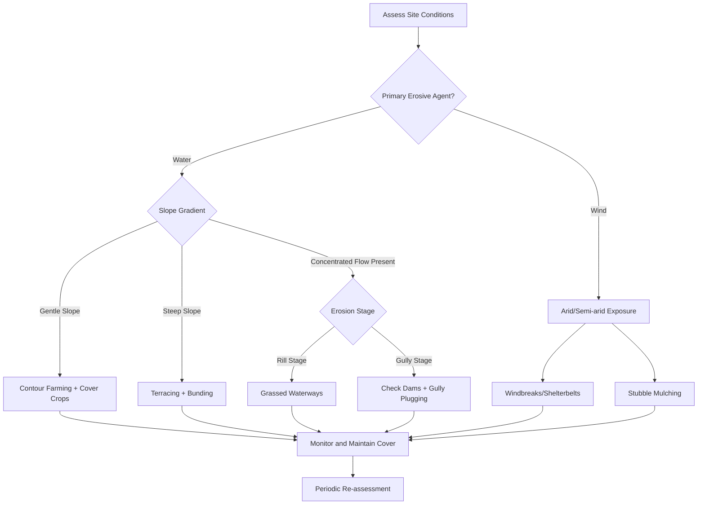

## Soil Erosion Causes and Control Methods

### Definition and Overview

Soil erosion is the process by which soil particles are detached, transported, and deposited elsewhere by the action of erosive agents, primarily water, wind, ice, and gravity. It is a naturally occurring process (geologic erosion) that becomes an environmental and agricultural problem when anthropogenic activities accelerate it far beyond natural rates of soil formation, resulting in a net loss of topsoil, the most fertile and biologically active layer of the soil profile.

Soil formation (pedogenesis) occurs at extremely slow rates, generally estimated at approximately 1 mm per 100 to 400 years depending on climate, parent material, and vegetation. Accelerated erosion can remove soil at rates thousands of times faster than it can regenerate, making it a functionally non-renewable resource loss on human timescales.

### Types of Soil Erosion by Agent

**Water Erosion**

Water erosion is the most widespread form of soil erosion globally and proceeds through several recognizable stages of increasing severity:

- **Splash erosion**: The initial stage, caused by the direct impact of raindrops on bare soil. Kinetic energy from raindrop impact detaches soil aggregates and can throw particles up to a meter away, breaking down soil structure and forming a surface crust that reduces infiltration.
- **Sheet erosion**: A relatively uniform removal of thin layers of soil across a slope by overland flow. Because it removes soil evenly, it is often the least visually detectable form, yet cumulatively it can be the most damaging over time.
- **Rill erosion**: Occurs when concentrated surface runoff carves small, well-defined channels (rills) into the soil surface, typically a few centimeters deep. Rills are shallow enough to be removed by normal tillage.
- **Gully erosion**: An advanced stage where concentrated flow enlarges rills into deep channels (gullies) that cannot be removed by tillage and can eventually make land unworkable.
- **Streambank and channel erosion**: Lateral cutting of stream banks and channel beds by flowing water, often intensified by increased peak flows from upstream land-use changes.

**Wind Erosion**

Predominant in arid, semi-arid, and unvegetated sandy regions. Wind erosion involves three particle movement mechanisms:

- **Suspension**: Fine particles (<0.1 mm, silts and clays) lifted high into the air and transported over long distances, sometimes across continents.
- **Saltation**: Medium-sized particles (0.1–0.5 mm) that bounce along the surface in a series of short hops, accounting for the majority (50–90%) of total wind-transported material and the primary mechanism that dislodges additional particles on impact.
- **Surface creep**: Larger particles (0.5–2 mm) rolled or pushed along the ground surface by the impact of saltating grains, too heavy to be lifted.

**Other Agents**

- **Tillage erosion**: The progressive downslope movement of soil caused by the mechanical action of tillage implements, which is often overlooked but can be a dominant erosion process on steep, intensively cultivated slopes.
- **Gravity-driven erosion (mass wasting)**: Includes landslides, slumps, and soil creep, typically triggered or worsened by saturation, slope destabilization from deforestation, or undercutting.

### Causes of Accelerated Soil Erosion

**Natural/Predisposing Factors**

- **Climate**: Rainfall intensity and duration, and wind velocity and frequency, are primary drivers. High-intensity, short-duration storms cause disproportionately more erosion than the same total rainfall spread over gentle, prolonged events.
- **Topography**: Slope steepness (gradient) and slope length are directly correlated with erosion potential; steeper and longer slopes increase runoff velocity and volume.
- **Soil properties**: Soil erodibility (often quantified as the K-factor in erosion models) depends on texture, structure, organic matter content, and permeability. Soils high in silt and low in organic matter and clay tend to be most erodible.
- **Vegetative cover**: Natural vegetation cover intercepts rainfall, slows runoff, and binds soil with root systems; its absence or removal is a primary predisposing condition.

**Anthropogenic (Human-Induced) Factors**

- **Deforestation and land clearing**: Removal of forest and natural vegetation cover eliminates canopy interception, litter layers, and root reinforcement, dramatically increasing runoff and raindrop impact energy at the soil surface.
- **Unsustainable agricultural practices**:
  - Monocropping and continuous cultivation without cover crops or crop rotation
  - Cultivation along slopes rather than along the contour (up-and-down-slope tillage)
  - Overgrazing by livestock, which removes vegetative cover and compacts soil, reducing infiltration
  - Excessive or improperly timed tillage that pulverizes soil structure and leaves it bare during erosive periods
  - Removal of crop residues and hedgerows
- **Urbanization and construction**: Land clearing for infrastructure, roads, and buildings exposes large areas of bare soil and increases impervious surface area, which concentrates and accelerates runoff.
- **Mining and quarrying**: Large-scale removal of vegetation and topsoil, and creation of unstable spoil heaps.
- **Improper irrigation**: Excessive irrigation, particularly furrow irrigation, can cause significant soil detachment and transport (irrigation-induced erosion).
- **Wildfires**: Whether natural or human-caused, fires remove protective vegetation and can create hydrophobic (water-repellent) soil layers that dramatically increase runoff.

### The Universal Soil Loss Equation (USLE/RUSLE)

A widely used empirical model for estimating average annual soil loss from sheet and rill erosion on agricultural land is expressed as:

$$A = R \times K \times LS \times C \times P$$

Where:

- $A$ = computed average annual soil loss (typically in tons/hectare/year)
- $R$ = rainfall-runoff erosivity factor
- $K$ = soil erodibility factor
- $LS$ = slope length and steepness factor
- $C$ = cover-management factor
- $P$ = support practice factor (e.g., contouring, terracing)

The Revised Universal Soil Loss Equation (RUSLE) refines the computation of these factors using updated empirical relationships and is widely used in conservation planning. [Inference: The exact coefficients and sub-equations for each factor vary by regional calibration and RUSLE version, so site-specific agricultural extension guidance should be consulted for applied calculations.]

### Consequences of Soil Erosion

**On-Site (Local) Impacts**

- Loss of fertile topsoil and associated organic matter and nutrients (nitrogen, phosphorus, potassium)
- Reduced water-holding capacity and infiltration, worsening drought vulnerability
- Decline in soil structure, biological activity, and long-term agricultural productivity
- Exposure of less fertile subsoil, often with poorer physical and chemical properties

**Off-Site (Downstream) Impacts**

- **Sedimentation**: Deposition of eroded material in rivers, reservoirs, and irrigation canals, reducing water storage capacity and channel conveyance
- **Water quality degradation**: Sediment-bound transport of nutrients (notably phosphorus) and agrochemicals (pesticides, herbicides) into water bodies, contributing to eutrophication
- **Increased flooding risk**: Reduced infiltration and channel capacity from sedimentation elevate flood peaks and frequency
- **Damage to aquatic ecosystems**: Turbidity increases reduce light penetration for aquatic photosynthesis and can smother benthic habitats and fish spawning grounds
- **Air quality impacts**: Wind-eroded dust contributes to particulate matter pollution and can affect respiratory health

### Soil Erosion Control Methods

**Agronomic (Biological) Measures**

These methods use vegetation and cropping strategies to protect the soil surface and improve structure.

- **Cover cropping**: Planting non-cash crops (e.g., legumes, grasses) during fallow periods to maintain continuous ground cover
- **Crop rotation**: Alternating crop types to maintain organic matter and structural diversity, reducing continuous exposure associated with monocropping
- **Mulching**: Applying organic (straw, crop residue) or inorganic material to the soil surface to reduce raindrop impact and evaporation
- **Strip cropping**: Alternating strips of erosion-resistant crops (e.g., grasses) with more erosion-prone row crops along the contour
- **Agroforestry and reforestation**: Integrating trees and shrubs into agricultural systems or restoring forest cover to increase canopy interception and root binding
- **Conservation tillage / no-till farming**: Minimizing soil disturbance and retaining crop residue on the surface, which reduces structural breakdown and maintains infiltration

**Mechanical (Structural) Measures**

These methods involve physical modification of land surfaces to reduce runoff velocity and redirect water safely.

- **Contour farming**: Plowing and planting along the natural contour lines of a slope rather than up-and-down, creating small ridges that slow runoff
- **Terracing**: Constructing stepped, level platforms on steep slopes to reduce effective slope length and gradient, commonly used in mountainous agricultural regions
- **Bunds and check dams**: Small earthen or stone barriers constructed across slopes or gullies to slow water flow and trap sediment
- **Waterways and grassed drainage channels**: Engineered, vegetated channels designed to safely convey concentrated runoff without erosive velocities
- **Windbreaks and shelterbelts**: Rows of trees or shrubs planted perpendicular to prevailing wind direction to reduce wind velocity at the soil surface and trap saltating particles
- **Riprap and gabions**: Rock or wire-mesh structures used to stabilize streambanks and channel edges against water erosion

**Management and Policy Measures**

- **Land-use planning and zoning**: Restricting cultivation or construction on highly erodible or steep lands
- **Grazing management**: Implementing rotational grazing and stocking rate limits to prevent overgrazing
- **Erosion control regulations**: Sediment and erosion control permitting for construction sites (e.g., silt fencing, sediment basins during land development)
- **Watershed management programs**: Coordinated, catchment-scale planning integrating multiple control measures across land ownership boundaries
- **Extension and farmer education programs**: Training programs to promote adoption of sustainable land management practices

### Comparative Overview: Method Selection by Erosion Context

| Erosion Type/Context | Primary Recommended Controls |
| --- | --- |
| Sheet/rill erosion on cropland | Cover cropping, conservation tillage, contour farming |
| Gully erosion | Check dams, gully plugging, revegetation of gully walls |
| Steep slope cultivation | Terracing, contour bunding, agroforestry |
| Wind erosion in arid regions | Windbreaks/shelterbelts, stubble mulching, shelter cropping |
| Streambank erosion | Riparian buffer strips, riprap, gabions |
| Construction site erosion | Silt fencing, sediment basins, temporary mulching |
| Overgrazed rangeland | Rotational grazing, reseeding, exclusion fencing |

### Illustration: Soil Erosion Process and Control Points (svg_diagram)

<svg xmlns="http://www.w3.org/2000/svg" viewBox="0 0 900 500">
<title>Soil Erosion Process and Control Points (svg_diagram)</title>
<rect x="0" y="0" width="900" height="500" fill="#f7f5ef" />

<rect x="0" y="0" width="900" height="180" fill="#dceaf5" />

<line x1="120" y1="30" x2="110" y2="70" stroke="#5a9bd5" stroke-width="3" />
<line x1="150" y1="20" x2="140" y2="65" stroke="#5a9bd5" stroke-width="3" />
<line x1="180" y1="35" x2="170" y2="75" stroke="#5a9bd5" stroke-width="3" />
<line x1="210" y1="15" x2="200" y2="60" stroke="#5a9bd5" stroke-width="3" />

<polygon points="0,180 900,180 900,500 0,500" fill="#e8dcc0" />
<polygon points="0,180 350,220 900,320 900,500 0,500" fill="#c9a876" />
<polygon points="0,180 350,220 350,180" fill="#7fae5c" />

<polygon points="0,180 350,220 900,320 900,340 0,220" fill="#8b6f47" />

<circle cx="130" cy="200" r="4" fill="#5a4a30" />
<circle cx="180" cy="205" r="3" fill="#5a4a30" />
<circle cx="220" cy="210" r="4" fill="#5a4a30" />

<path d="M 350 220 Q 450 260 550 260 T 750 300" stroke="#5a4a30" stroke-width="4" fill="none" />
<path d="M 400 225 Q 500 270 600 270 T 800 310" stroke="#5a4a30" stroke-width="3" fill="none" />

<polygon points="600,270 640,270 660,340 610,340" fill="#3d3020" />

<rect x="0" y="420" width="900" height="80" fill="#8fa8b8" />
<ellipse cx="500" cy="440" rx="200" ry="15" fill="#a68a5f" opacity="0.7" />
<ellipse cx="650" cy="450" rx="150" ry="12" fill="#a68a5f" opacity="0.6" />

<path d="M 20 250 Q 175 235 340 225" stroke="#2f5e2f" stroke-width="3" fill="none" stroke-dasharray="6,3" />
<path d="M 20 290 Q 175 275 330 265" stroke="#2f5e2f" stroke-width="3" fill="none" stroke-dasharray="6,3" />
<path d="M 20 330 Q 175 315 320 305" stroke="#2f5e2f" stroke-width="3" fill="none" stroke-dasharray="6,3" />
<text x="30" y="240" font-family="Arial" font-size="14" fill="#1f3d1f" font-weight="bold">Contour Farming</text>

<rect x="380" y="290" width="80" height="12" fill="#556b2f" />
<rect x="470" y="310" width="80" height="12" fill="#556b2f" />
<rect x="560" y="330" width="80" height="12" fill="#556b2f" />
<text x="420" y="285" font-family="Arial" font-size="13" fill="#1f3d1f" font-weight="bold">Terracing</text>

<rect x="600" y="335" width="65" height="10" fill="#6b4f2a" />
<text x="560" y="365" font-family="Arial" font-size="13" fill="#3d2b12" font-weight="bold">Check Dam</text>

<circle cx="750" cy="405" r="12" fill="#3f7a3f" />
<circle cx="775" cy="410" r="10" fill="#3f7a3f" />
<circle cx="800" cy="405" r="12" fill="#3f7a3f" />
<text x="700" y="390" font-family="Arial" font-size="13" fill="#1f3d1f" font-weight="bold">Riparian Buffer</text>

<circle cx="60" cy="150" r="20" fill="#3f7a3f" />
<rect x="56" y="165" width="8" height="15" fill="#6b4f2a" />
<circle cx="100" cy="140" r="18" fill="#3f7a3f" />
<rect x="96" y="153" width="8" height="15" fill="#6b4f2a" />


<text x="440" y="20" font-family="Arial" font-size="18" fill="`#1f3d1f`" font-weight="bold" text-anchor="middle">Soil Erosion Process and Control Points</text>

<text x="60" y="130" font-family="Arial" font-size="12" fill="`#1f3d1f`">Vegetated cover</text>

<text x="130" y="215" font-family="Arial" font-size="12" fill="`#3d2b12`">Splash erosion</text>

<text x="470" y="255" font-family="Arial" font-size="12" fill="`#3d2b12`">Rill erosion</text>

<text x="850" y="470" font-family="Arial" font-size="12" fill="`#2f4a5a`" text-anchor="end">Sediment-laden river</text>

</svg>

### Illustration: Erosion Control Decision Flow





```
### Field Assessment Indicators of Active Erosion

- Formation of pedestals (soil columns capped by stones or roots left standing above the surrounding surface)
- Exposed plant roots
- Sediment deposition (fans) at the base of slopes or in field corners
- Rills or gullies visible after rainfall events
- Turbid runoff in field drains or nearby streams
- Surface crusting and reduced infiltration on bare soil

**Example**

Consider a maize field on a 12% slope in a tropical monsoon climate, previously cultivated up-and-down slope with no cover crop. Observed rill formation and turbid runoff during the wet season indicate active accelerated erosion. A combined intervention would typically include:
1. Converting tillage direction to contour farming to interrupt slope-length runoff
2. Introducing a leguminous cover crop (e.g., mucuna or cowpea) during fallow periods to protect bare soil and add organic matter
3. Constructing grass-lined contour bunds at calculated vertical intervals to further break slope length
4. Establishing a vegetated buffer strip at the field's downslope edge before any adjacent waterway

[Inference: The specific vertical interval for contour bunds depends on local rainfall intensity, soil type, and slope gradient, and is typically determined using regional conservation engineering guidelines rather than a universal fixed value.]

### Related Topics

- Soil formation and pedogenesis
- Soil texture, structure, and classification
- Land degradation and desertification
- Watershed and catchment management
- Sustainable and conservation agriculture
- Sedimentation and reservoir management
- Nutrient cycling and soil fertility management
- Integrated pest and land management for sloped agriculture


```