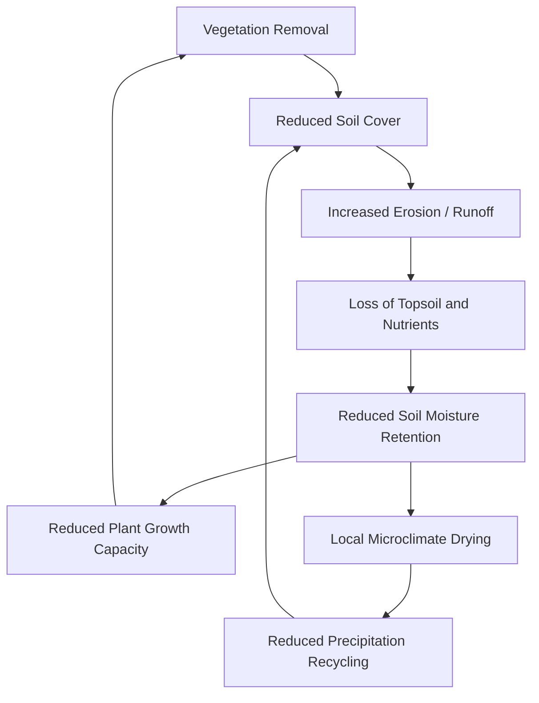

## Land Degradation and Desertification

### Definitions and Conceptual Framework

**Land degradation** is the reduction or loss of the biological or economic productivity of land, arising from land uses or processes acting on the land, including those from human activities. It manifests as declines in soil fertility, vegetative cover, water availability, and biodiversity.

**Desertification**, as defined by the United Nations Convention to Combat Desertification (UNCCD), is land degradation specifically occurring in arid, semi-arid, and dry sub-humid areas (collectively termed "drylands"), resulting from various factors including climatic variations and human activities. Desertification does not refer to the literal expansion of existing deserts, but rather the *desert-like conditions* emerging in previously productive drylands.

Key distinction: all desertification is land degradation, but not all land degradation is desertification — degradation in humid or temperate zones (e.g., deforested tropical soils, degraded temperate cropland) falls outside the UNCCD's technical definition, though it shares mechanisms.

### Global Extent and Significance

Drylands cover approximately 41% of Earth's terrestrial surface and are home to over 2 billion people. [Unverified] Estimates of the proportion of drylands affected by desertification vary considerably across sources (ranging roughly from 10-20% under conservative measures to over 70% under broader assessments), reflecting differences in methodology, remote-sensing baselines, and definitions of degradation severity — figures should be treated as order-of-magnitude indicators rather than precise measurements.

Affected regions include the Sahel (sub-Saharan Africa), the Loess Plateau (China), the Aral Sea basin (Central Asia), parts of the Australian Outback, the American Dust Bowl region (historically), and the Thar Desert margins (India-Pakistan).

### Causes: Natural Drivers

**Climatic variability**

- Prolonged drought cycles reduce vegetation cover, exposing soil to erosive forces
- Shifts in precipitation patterns (timing, intensity, distribution) disrupt plant establishment
- Increased evapotranspiration rates in warming climates accelerate soil moisture deficits

**Geomorphological and edaphic factors**

- Naturally erodible soils (e.g., loose sandy soils, loess deposits) are inherently more vulnerable
- Steep slopes increase susceptibility to water erosion
- Low organic matter content in arid soils limits structural stability

### Causes: Anthropogenic Drivers

**Overgrazing**

Excessive livestock density removes vegetative cover faster than regeneration rates permit, compacts soil (reducing infiltration), and disrupts seed banks. This is frequently cited as the single largest contributor to dryland degradation globally.

**Deforestation and vegetation clearance**

Removal of woody vegetation for fuelwood, agriculture, or settlement eliminates root systems that stabilize soil and reduces the canopy's function of moderating microclimate (wind speed, evaporation).

**Unsustainable agricultural practices**

- Monocropping without fallow periods depletes soil nutrients
- Excessive tillage breaks down soil aggregate structure, increasing erodibility
- Improper irrigation causes **salinization** and **waterlogging** (see below)
- Cultivation of marginal lands unsuited to cropping

**Salinization**

Irrigation in arid climates without adequate drainage causes water to evaporate at the surface, leaving dissolved salts behind. Over time, salt concentration in the root zone rises to levels toxic to most crops. This is a major degradation pathway in irrigated drylands (e.g., the Indus Basin, Mesopotamian Plain, Central Valley of California).

**Overexploitation of groundwater and surface water**

Diversion of rivers for irrigation (e.g., the Aral Sea case) or groundwater mining beyond recharge rates lowers water tables, dries wetlands, and reduces vegetation dependent on shallow water access.

**Urbanization and infrastructure expansion**

Soil sealing (paving, construction) permanently removes land from biological production and alters local hydrology.

### Mechanisms of Degradation

**Key Points**

- **Wind erosion**: Removal of topsoil by aeolian processes once vegetative cover is lost; can produce dust storms and dune formation in previously stable areas
- **Water erosion**: Sheet, rill, and gully erosion accelerated by loss of vegetative interception and soil structure degradation
- **Soil compaction**: Reduces pore space, infiltration capacity, and root penetration
- **Loss of soil organic matter**: Reduces water-holding capacity, nutrient cycling, and microbial activity
- **Salinization/sodification**: Chemical degradation reducing osmotic water availability to plants
- **Biological degradation**: Loss of soil biota, reduced biodiversity, decline in seed bank viability

### The Desertification Feedback Loop

This positive feedback loop illustrates why desertification, once initiated, can be self-reinforcing: degraded land supports less vegetation, which further reduces the land's capacity for moisture retention and local precipitation recycling, compounding the initial disturbance.

### Quantitative Assessment Approaches

Land degradation is measured through several indicator frameworks:

$$\text{NDVI} = \frac{NIR - Red}{NIR + Red}$$

The **Normalized Difference Vegetation Index (NDVI)**, derived from satellite reflectance data, is widely used as a proxy for vegetative health and cover. Sustained downward trends in NDVI time series over drylands are commonly used as an early indicator of degradation, though [Inference] NDVI alone cannot distinguish degradation from drought-driven, potentially reversible vegetation stress without complementary rainfall-use efficiency analysis.

**Rain-Use Efficiency (RUE)** is often computed as:

$$RUE = \frac{NPP}{P}$$

where $NPP$ is net primary productivity and $P$ is precipitation. A declining RUE trend, independent of rainfall variability, is a stronger indicator of true land degradation than NDVI decline alone, since it controls for climatic drought.

Other assessment metrics include the **Soil Adjusted Vegetation Index (SAVI)**, soil organic carbon (SOC) stock changes, and the **Land Degradation Neutrality (LDN)** indicator framework adopted under UNCCD Sustainable Development Goal target 15.3, which combines land cover change, land productivity dynamics, and soil organic carbon into a composite assessment.

### Consequences

**Environmental**

- Biodiversity loss through habitat degradation
- Reduced carbon sequestration capacity; degraded soils can become net carbon sources as organic matter oxidizes
- Increased dust emission affecting regional air quality and, in some cases, distant ecosystems (e.g., Saharan dust deposition in the Amazon and Caribbean)
- Disrupted hydrological cycles

**Socioeconomic**

- Reduced agricultural yields threatening food security
- Rural livelihoods dependent on pastoralism or subsistence farming become unviable
- Environmental migration ("climate refugees" or "environmental migrants") — [Inference] the causal attribution of specific migration events to desertification alone is often contested in the literature, since economic and political factors are typically intertwined
- Increased vulnerability to famine during drought periods due to eroded resilience capacity
- Conflict over shrinking arable/grazing land, notably documented in parts of the Sahel

### Case Study: The Sahel

The Sahel region experienced severe drought and famine cycles in the 1970s-1980s, historically attributed heavily to desertification driven by overgrazing and deforestation. Subsequent research using long-term NDVI records revealed a more nuanced picture: parts of the Sahel exhibited a "re-greening" trend from the 1990s onward, attributed to a combination of increased rainfall, farmer-managed natural regeneration (FMNR) practices, and adaptive land management. [Inference] This case is frequently cited in the scientific literature as a caution against over-attributing dryland vegetation change purely to anthropogenic desertification without accounting for climatic variability and adaptive human responses.

### Case Study: The Aral Sea

Soviet-era diversion of the Amu Darya and Syr Darya rivers for cotton irrigation (beginning in the 1960s) caused the Aral Sea to shrink to a fraction of its original volume by the 2000s. Consequences included exposed lakebed becoming a source of salt-and-pesticide-laden dust storms, regional climate alteration (loss of the lake's moderating thermal effect), collapse of the local fishing industry, and significant salinization of surrounding agricultural land. This remains one of the most cited examples of anthropogenically driven water diversion causing cascading land degradation.

### Mitigation and Restoration Strategies

**Key Points**

- **Sustainable grazing management**: Rotational grazing, stocking rate limits aligned with carrying capacity
- **Agroforestry and shelterbelts**: Tree planting to reduce wind erosion and stabilize microclimate (e.g., Africa's **Great Green Wall** initiative)
- **Farmer-Managed Natural Regeneration (FMNR)**: Low-cost technique of pruning and protecting naturally occurring tree stumps/roots to regenerate woodland
- **Terracing and contour farming**: Reduces water erosion on sloped terrain
- **Windbreaks and shelterbelts**: Rows of trees/shrubs reducing wind velocity at ground level
- **Improved irrigation management**: Drip irrigation, adequate drainage design to prevent salinization
- **Soil conservation tillage**: No-till or reduced-till practices preserving soil structure and organic matter
- **Reforestation and afforestation**: Restoring vegetative cover, though species selection must match local hydrology to avoid exacerbating water stress
- **Land Degradation Neutrality (LDN) policy frameworks**: National commitments under UNCCD to balance degradation with restoration ("avoid, reduce, reverse" hierarchy)

### The Great Green Wall Initiative

An African Union-led initiative launched in 2007, aiming to restore a mosaic of vegetation across the Sahel from Senegal to Djibouti, spanning roughly 8,000 km. Rather than a literal continuous wall of trees, current implementation emphasizes a mosaic of sustainable land management practices. [Unverified] Progress reporting varies substantially by source; overall completion percentages relative to original 2030 targets are contested, with some assessments citing significant shortfalls in funding and implementation relative to initial goals.

### Policy Frameworks

- **UNCCD (1994)**: The primary international treaty addressing desertification, one of the three "Rio Conventions" alongside the UNFCCC (climate) and CBD (biodiversity)
- **SDG Target 15.3**: Commits signatory nations to achieve Land Degradation Neutrality by 2030
- **National Action Programmes (NAPs)**: Country-level implementation plans under UNCCD

### Diagram: Degradation Severity Assessment Zones (svg_diagram)

<svg xmlns="http://www.w3.org/2000/svg" viewBox="0 0 640 300">
<text x="320" y="24" text-anchor="middle" font-size="16" font-weight="bold" fill="#222">Land Degradation Severity Gradient (svg_diagram)</text>
<rect x="40" y="60" width="560" height="40" fill="#8bc48a" />
<rect x="40" y="100" width="560" height="40" fill="#d9c96a" />
<rect x="40" y="140" width="560" height="40" fill="#d99a4e" />
<rect x="40" y="180" width="560" height="40" fill="#b96b3c" />
<rect x="40" y="220" width="560" height="40" fill="#7a4a30" />
<text x="30" y="85" text-anchor="end" font-size="12" fill="#222">Stable</text>
<text x="30" y="125" text-anchor="end" font-size="12" fill="#222">Early</text>
<text x="30" y="165" text-anchor="end" font-size="12" fill="#222">Moderate</text>
<text x="30" y="205" text-anchor="end" font-size="12" fill="#222">Severe</text>
<text x="30" y="245" text-anchor="end" font-size="12" fill="#222">Critical</text>
<text x="320" y="85" text-anchor="middle" font-size="11" fill="#222">Full vegetative cover, stable NDVI trend</text>
<text x="320" y="125" text-anchor="middle" font-size="11" fill="#222">Declining RUE, patchy vegetation loss</text>
<text x="320" y="165" text-anchor="middle" font-size="11" fill="#222">Visible erosion, reduced SOC</text>
<text x="320" y="205" text-anchor="middle" font-size="11" fill="#222">Gully erosion, salinization, crusting</text>
<text x="320" y="245" text-anchor="middle" font-size="11" fill="#222" fill-opacity="1">Bare soil/rock, irreversible without major intervention</text>
</svg>

### Common Misconceptions

**Key Points**

- Desertification is *not* the literal geographic advance of desert boundaries (a persistent but technically inaccurate popular framing)
- Desertification is reversible in many early-to-moderate stages through management intervention; it is not inherently a permanent end-state, though severe cases involving lost topsoil can be effectively irreversible on human timescales
- Drought alone does not equal desertification; desertification refers to a *sustained decline in land productive capacity*, of which drought may be a contributing but not sole cause

### Conclusion

Land degradation and desertification represent a convergence of climatic pressures and unsustainable land management practices, disproportionately affecting drylands that support a substantial share of the global population, particularly in economically vulnerable regions. Effective response requires integrated approaches combining ecological restoration techniques, adaptive land-use policy, and monitoring frameworks capable of distinguishing anthropogenic degradation from natural climatic variability.

**Related Topics**

- Soil erosion mechanics (wind vs. water processes)
- Soil salinization and sodic soil reclamation
- Carrying capacity and rangeland management
- Remote sensing applications in land degradation monitoring (NDVI, SAVI, LDN)
- Drought and climate variability in arid ecosystems
- Sustainable Development Goal 15 (Life on Land)
- Agroforestry systems and silvopasture
- Soil organic carbon dynamics and sequestration
- Water resource management in arid and semi-arid basins
- Climate-induced migration and environmental justice