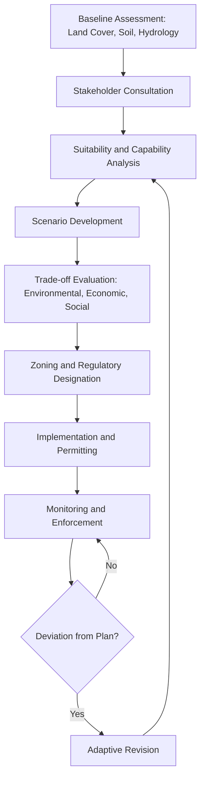

## Land Use Change and Planning

### Definitions and Conceptual Framework

**Land use** refers to the human purpose or economic activity applied to a parcel of land (e.g., agriculture, residential, industrial, conservation), as distinct from **land cover**, which describes the physical/biophysical material present on the surface (e.g., forest, grassland, impervious surface, water). A single land cover type can support multiple land uses, and land use change frequently drives land cover change, though the two are not synonymous.

**Land use change (LUC)** refers to the conversion of land from one use category to another over time, driven by demographic, economic, policy, and environmental pressures. **Land use planning** is the systematic assessment of land and water resources to select and adopt land-use options that maximize benefits while minimizing negative environmental, social, and economic outcomes.

A related distinction in emissions accounting: **direct land use change (dLUC)** refers to conversion occurring on the specific parcel in question, while **indirect land use change (iLUC)** refers to displacement effects, where converting land for one purpose (e.g., biofuel crops) displaces existing production (e.g., food crops) onto previously uncultivated land elsewhere.

### Drivers of Land Use Change

**Key Points**

- **Population growth and urbanization**: Expanding settlements convert agricultural and natural land to residential/commercial use
- **Agricultural expansion and intensification**: Growing food demand drives conversion of forests and grasslands to cropland, or intensifies existing agricultural land
- **Economic development and industrialization**: Infrastructure, mining, and industrial siting decisions
- **Policy and subsidy structures**: Agricultural subsidies, zoning regulations, and tax incentives shape land allocation
- **Climate change feedbacks**: Shifting climatic suitability zones alter viable agricultural and settlement patterns
- **Transportation infrastructure**: Road and rail development enables access to previously remote land, often triggering secondary deforestation (particularly documented along Amazonian road corridors)
- **Globalization of supply chains**: Demand for commodities (palm oil, soy, beef, timber) in one region driving land conversion in distant producer regions (a key iLUC mechanism)

### Categories of Land Use

Standard classification systems (e.g., FAO Land Cover Classification System, USGS Anderson Land Use/Land Cover Classification) typically distinguish:

- **Agricultural land**: Cropland, pasture, orchards, aquaculture
- **Forest land**: Managed and unmanaged forest, including plantation forestry
- **Settlement/built-up land**: Urban, suburban, and rural residential/commercial/industrial areas
- **Wetlands**: Marshes, swamps, peatlands
- **Rangeland/grassland**: Natural and semi-natural grazing land
- **Barren/other land**: Deserts, rock, ice
- **Water bodies**: Rivers, lakes, reservoirs

### Land Use Change Assessment Methods

Land use change is monitored primarily through:

**Remote sensing and GIS analysis**

Multi-temporal satellite imagery (Landsat, Sentinel-2, MODIS) enables classification of land cover at different time points, with change detection performed through image differencing, post-classification comparison, or machine learning classifiers (random forest, support vector machines, convolutional neural networks for higher-resolution analysis).

**Land use change matrices**

A standard tabular method cross-tabulating land use categories between two time periods ($t_1$ and $t_2$), showing the area transitioning from each category to every other category. The diagonal represents unchanged land; off-diagonal cells represent transitions.

$$P_{ij} = \frac{A_{ij}}{\sum_{j} A_{ij}}$$

where $P_{ij}$ is the transition probability from land use class $i$ to class $j$, and $A_{ij}$ is the area converted. This forms the basis of **Markov chain models** used to project future land use scenarios, under the assumption that historical transition probabilities remain approximately stable — an assumption that [Inference] often breaks down under rapid policy shifts or climatic disruption, limiting long-horizon projection reliability.

**Cellular automata models**

Combine Markov transition probabilities with spatial suitability criteria (proximity to roads, existing urban areas, slope, soil quality) to project *where* land use change is likely to occur, not just *how much*. Common implementations include the CA-Markov and Land Change Modeler (LCM) frameworks.

### Land Use Planning Principles

**Key Points**

- **Suitability analysis**: Matching land capability (soil quality, slope, drainage, climate) to appropriate use, often via multi-criteria decision analysis (MCDA) combining weighted GIS layers
- **Zoning**: Legal designation of permitted land uses within defined geographic boundaries, forming the primary regulatory tool in most jurisdictions
- **Carrying capacity assessment**: Determining the maximum land use intensity sustainable without long-term resource degradation
- **Participatory planning**: Incorporating stakeholder input, particularly from indigenous and local communities with customary land tenure claims
- **Integrated land use planning**: Coordinating across sectors (agriculture, forestry, urban development, conservation) rather than siloed sectoral decisions
- **Land tenure security**: Clear property rights are frequently identified in the literature as a precondition for sustainable long-term land management, since insecure tenure disincentivizes conservation investment

### The Land Use Planning Process

### Environmental Consequences of Land Use Change

**Deforestation and habitat fragmentation**

Conversion of forest to agricultural or urban use remains the dominant driver of terrestrial biodiversity loss globally, and a major contributor to greenhouse gas emissions through both biomass loss and subsequent soil carbon oxidation.

**Soil degradation**

Conversion of natural vegetation to cropland typically reduces soil organic carbon stocks over time, particularly under conventional tillage without residue retention (linked closely to the land degradation mechanisms discussed under desertification).

**Hydrological alteration**

Impervious surface expansion (urbanization) increases surface runoff and reduces groundwater recharge, elevating flood risk and altering local water tables. Agricultural conversion can alter evapotranspiration regimes and downstream water availability.

**Urban heat island effects**

Replacement of vegetated surfaces with asphalt and concrete alters local energy balance, increasing near-surface air temperatures relative to surrounding rural areas — a well-documented urban climatology phenomenon.

**Carbon flux implications**

$$\Delta C = C_{t2} - C_{t1}$$

Land use change carbon accounting (used in national greenhouse gas inventories under IPCC guidelines) estimates net carbon flux as the difference in carbon stock between land use states, incorporating above-ground biomass, below-ground biomass, dead organic matter, and soil organic carbon pools. The **LULUCF (Land Use, Land-Use Change, and Forestry)** sector is a required reporting category under the UNFCCC.

### Urban Land Use Planning Specifics

**Smart growth and compact development**

Planning strategies aiming to reduce urban sprawl by concentrating development, mixing land uses, and prioritizing transit-oriented development, intended to reduce per-capita infrastructure and transportation emissions.

**Green infrastructure integration**

Incorporation of parks, urban forests, and permeable surfaces into urban planning to manage stormwater, mitigate heat island effects, and preserve ecosystem services within built environments.

**Brownfield redevelopment**

Prioritizing reuse of previously developed, often contaminated, industrial land over conversion of undeveloped ("greenfield") land, reducing net land use footprint expansion.

### Agricultural Land Use Planning

**Land capability classification**

Systems such as the USDA Land Capability Classification (Classes I-VIII) rank land based on limitations for sustained agricultural use (erosion risk, drainage, climate, soil depth), guiding appropriate use allocation (e.g., Class I-IV suitable for cultivation, Class VI-VIII restricted to grazing, forestry, or conservation).

**Agricultural zoning and farmland preservation**

Policy tools (e.g., agricultural conservation easements, Purchase of Development Rights programs) designed to prevent conversion of productive farmland to non-agricultural use under urban expansion pressure.

### Case Study: Amazon Deforestation Arc

The "Arc of Deforestation" along the southern and eastern edges of the Brazilian Amazon illustrates land use change driven by cattle ranching expansion, soybean cultivation, and road infrastructure development. Government policy interventions (e.g., Brazil's Forest Code, satellite-based deforestation monitoring via PRODES/DETER systems) have produced fluctuating rates of deforestation over time, correlating with shifts in enforcement intensity and commodity price incentives. [Unverified] Precise current annual deforestation rates should be checked against the most recent INPE (Instituto Nacional de Pesquisas Espaciais) monitoring releases, as figures shift year to year with policy and enforcement changes.

### Case Study: European Common Agricultural Policy (CAP) Land Use Effects

The EU's CAP has historically influenced land use patterns through production subsidies and, since reforms beginning in the 2000s, increasingly through cross-compliance and greening requirements tied to environmental land management practices. This illustrates how policy design directly shapes aggregate land use outcomes independent of direct regulatory zoning.

### Policy and Governance Frameworks

- **National land use policies**: Vary widely by governance structure; some countries maintain centralized national land use plans (e.g., Netherlands), while others delegate primarily to sub-national/municipal zoning authority (e.g., United States)
- **Strategic Environmental Assessment (SEA)**: Applied to land use plans and policies (as distinct from Environmental Impact Assessment, applied to individual projects)
- **REDD+ (Reducing Emissions from Deforestation and Forest Degradation)**: UN-backed framework providing financial incentives to developing nations for maintaining forest land use rather than converting to alternative uses
- **Land Degradation Neutrality and SDG 15.3**: Intersects directly with land use planning through the "avoid" hierarchy principle, prioritizing prevention of degrading conversions over post-hoc restoration

### Diagram: Land Use Suitability Analysis Overlay (svg_diagram)

<svg xmlns="http://www.w3.org/2000/svg" viewBox="0 0 640 320">
<text x="320" y="24" text-anchor="middle" font-size="16" font-weight="bold" fill="#222">GIS Multi-Criteria Suitability Overlay (svg_diagram)</text>
<rect x="40" y="50" width="140" height="90" fill="#a8d5a2" stroke="#333" />
<text x="110" y="100" text-anchor="middle" font-size="12" fill="#222">Soil Quality Layer</text>
<rect x="250" y="50" width="140" height="90" fill="#a2c4d5" stroke="#333" />
<text x="320" y="100" text-anchor="middle" font-size="12" fill="#222">Slope Layer</text>
<rect x="460" y="50" width="140" height="90" fill="#d5c9a2" stroke="#333" />
<text x="530" y="100" text-anchor="middle" font-size="12" fill="#222">Proximity to Roads</text>
<line x1="110" y1="140" x2="320" y2="220" stroke="#666" stroke-width="2" />
<line x1="320" y1="140" x2="320" y2="220" stroke="#666" stroke-width="2" />
<line x1="530" y1="140" x2="320" y2="220" stroke="#666" stroke-width="2" />
<rect x="220" y="220" width="200" height="70" fill="#e8b566" stroke="#333" />
<text x="320" y="250" text-anchor="middle" font-size="12" fill="#222">Weighted Overlay</text>
<text x="320" y="268" text-anchor="middle" font-size="12" fill="#222">Composite Suitability Score</text>
</svg>

### Common Misconceptions

**Key Points**

- Land use and land cover are frequently conflated in casual usage but are distinct analytical categories with different measurement methods
- Land use planning is not solely a regulatory/legal exercise; it fundamentally depends on integrated biophysical suitability data, without which zoning decisions can produce maladaptive outcomes
- Zoning alone does not guarantee sustainable outcomes; enforcement capacity and monitoring are equally critical determinants of planning effectiveness

### Conclusion

Land use change reflects the aggregate outcome of demographic, economic, and policy forces acting on finite land resources, with consequences spanning biodiversity, carbon cycling, hydrology, and soil health. Effective land use planning requires integration of biophysical suitability analysis, stakeholder participation, and adaptive regulatory frameworks capable of responding to both anticipated and unanticipated land use pressures over time.

**Related Topics**

- Land degradation and desertification mechanisms
- Geographic Information Systems (GIS) applications in environmental planning
- Environmental Impact Assessment (EIA) and Strategic Environmental Assessment (SEA)
- Urban ecology and green infrastructure design
- REDD+ and forest carbon policy mechanisms
- Agricultural land capability classification systems
- Indigenous land tenure and customary rights frameworks
- Remote sensing change detection methodologies