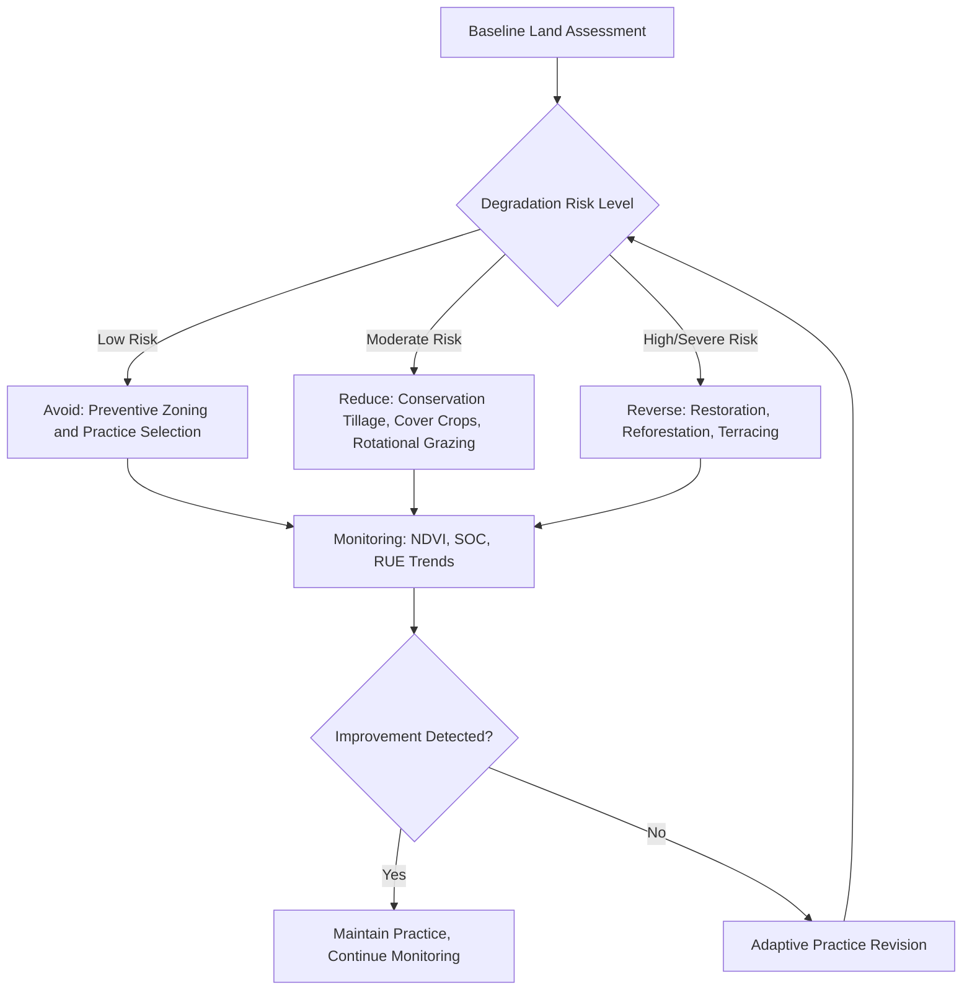

## Sustainable Land Management Practices

### Definitions and Conceptual Framework

**Sustainable Land Management (SLM)** is defined by the World Bank/UNCCD as the adoption of land use systems that, through appropriate management practices, enable land users to maximize the economic and social benefits from land while maintaining or enhancing the ecological support functions of land resources. SLM integrates three core pillars: **productivity** (maintaining or improving yield/output), **resilience** (capacity to withstand and recover from stress), and **ecosystem service provision** (water regulation, carbon sequestration, biodiversity support).

SLM is distinct from purely conservation-oriented land management in that it explicitly incorporates continued productive use of the land, rather than withdrawal from use. It is the practical implementation counterpart to the policy concept of Land Degradation Neutrality (LDN) discussed under land degradation.

### The SLM Response Hierarchy

The UNCCD/LDN framework organizes SLM interventions into a three-tier hierarchy, generally applied in order of preference:

1. **Avoid**: Preventing degradation before it occurs through proactive planning and appropriate land use allocation
2. **Reduce**: Minimizing the rate or extent of degradation on land already under some level of pressure
3. **Reverse**: Actively restoring degraded land to recover lost productivity and ecosystem function

[Inference] This hierarchy reflects a general principle in the literature that prevention is more cost-effective than restoration, though comparative cost-benefit figures vary substantially by ecosystem type and degradation severity, and should not be treated as a universal fixed ratio.

### Soil-Focused SLM Practices

**Key Points**

- **Conservation tillage / no-till farming**: Minimizes soil disturbance, preserving soil structure, organic matter, and reducing erosion exposure; crop residue is left on the surface rather than incorporated or removed
- **Cover cropping**: Planting non-cash crops (legumes, grasses) during fallow periods to protect soil surface, fix nitrogen (in the case of legumes), and add organic matter upon incorporation
- **Crop rotation**: Alternating crop species across seasons to disrupt pest/disease cycles, balance nutrient uptake/return, and improve soil structure diversity
- **Contour farming and terracing**: Aligning cultivation with land contours or constructing terraces on sloped land to reduce water erosion and runoff velocity
- **Organic matter amendment**: Application of compost, manure, or biochar to improve soil structure, water-holding capacity, and nutrient availability
- **Agroforestry**: Integrating trees/shrubs with crops or livestock systems, providing windbreak function, root stabilization, and additional productive output (timber, fruit, fodder)
- **Integrated Nutrient Management (INM)**: Balancing synthetic fertilizer inputs with organic amendments to optimize nutrient use efficiency and reduce runoff-driven eutrophication

### Water-Focused SLM Practices

- **Drip and micro-irrigation**: Delivers water directly to root zones, substantially reducing evaporative loss compared to flood irrigation and mitigating salinization risk
- **Rainwater harvesting**: Structures (check dams, contour bunds, percolation ponds) capturing and storing precipitation runoff for productive use and groundwater recharge
- **Water-efficient crop selection**: Matching crop water requirements to local precipitation/irrigation capacity, reducing reliance on unsustainable groundwater extraction
- **Watershed management approaches**: Coordinating land management across an entire drainage basin rather than at individual parcel scale, since hydrological processes operate at catchment scale

### Grazing and Rangeland SLM Practices

**Rotational and adaptive grazing management**

Moving livestock between paddocks on a planned schedule allows grazed vegetation recovery time, preventing the sustained defoliation pressure associated with overgrazing. Stocking rates are calibrated to estimated carrying capacity, which itself varies with precipitation and requires adaptive (rather than fixed) management in variable climates.

**Holistic Planned Grazing**

A specific rotational grazing methodology (associated with Allan Savory's work) that plans livestock movement to mimic historical patterns of wild grazing herds, intended to stimulate grassland productivity through controlled disturbance and rest cycles. [Speculation] Claims regarding this method's capacity to reverse desertification at scale remain a subject of active scientific debate, with some peer-reviewed assessments finding limited supporting evidence relative to the method's public claims — this should be treated as a contested area rather than settled practice.

### Forest and Vegetation-Focused SLM Practices

- **Farmer-Managed Natural Regeneration (FMNR)**: Low-cost technique of protecting and pruning naturally sprouting tree stumps and root systems rather than planting new seedlings, widely credited with vegetation recovery across parts of the Sahel (Niger in particular)
- **Assisted natural regeneration**: Combining minimal interventions (fire protection, invasive species removal, fencing) with natural forest succession processes
- **Silvopasture**: Integration of trees, forage, and livestock grazing within a single managed system, providing shade, windbreak, and diversified income streams
- **Sustainable forest management certification**: Frameworks such as FSC (Forest Stewardship Council) certifying timber harvest practices that maintain forest regeneration capacity

### SLM Decision Framework

### Economic and Policy Instruments Supporting SLM

**Payments for Ecosystem Services (PES)**

Financial compensation schemes rewarding land managers for maintaining practices that generate off-site ecosystem service benefits (carbon sequestration, watershed protection, biodiversity conservation), internalizing externalities that market prices typically do not capture.

**Conservation easements and land tenure security**

Legal instruments restricting future land use change in exchange for compensation or tax benefits, alongside secure land tenure, which the literature broadly identifies as a precondition for farmers' willingness to make long-term SLM investments (since benefits of practices like agroforestry accrue over years to decades).

**Agricultural extension services**

Government or NGO-provided technical training and advisory support, frequently identified as a limiting factor in SLM adoption rates in smallholder farming contexts, independent of practice availability or cost.

**Carbon credit and soil carbon markets**

Emerging (and evolving) mechanisms compensating land managers for verified increases in soil organic carbon or avoided emissions, though [Unverified] methodological standards for soil carbon measurement, reporting, and verification (MRV) remain an active area of development, with accuracy and cost-effectiveness of current MRV protocols varying by provider and geography.

### Quantitative SLM Impact Indicators

Soil organic carbon (SOC) sequestration potential under improved management is commonly estimated as:

$$\Delta SOC = SOC_{t2} - SOC_{t1}$$

measured typically to a standardized depth (often 30 cm) for comparability across studies. Reported SOC accrual rates under practices such as no-till and cover cropping vary considerably by climate, soil type, and baseline degradation status; [Inference] general ranges cited in agronomic literature should be treated as context-dependent rather than universally applicable figures, since soil carbon response to management change is strongly mediated by local temperature, moisture, and clay mineralogy.

**Water Use Efficiency (WUE)** for irrigation SLM assessment:

$$WUE = \frac{\text{Crop Yield}}{\text{Water Applied}}$$

Improvements in WUE under drip irrigation relative to flood irrigation are well-documented directionally, though magnitude varies by crop type and soil texture.

### Case Study: Niger's Farmer-Managed Natural Regeneration

Beginning in the 1980s, farmers in Niger's Maradi and Zinder regions began systematically protecting and pruning naturally regenerating tree stumps within cropland rather than clearing them, reversing decades of deforestation-driven degradation. Over subsequent decades, this practice reportedly contributed to the "re-greening" of millions of hectares, improving soil fertility, wind erosion protection, and fodder/fuelwood availability, largely without external funding or formal government programs, driven instead by farmer-to-farmer knowledge transfer. This is frequently cited as one of the most successful low-cost, farmer-driven SLM interventions documented at scale.

### Case Study: China's Loess Plateau Rehabilitation

A large-scale, internationally funded (World Bank-supported) watershed rehabilitation program beginning in the 1990s combined terracing, check dams, reforestation, and grazing restrictions (including livestock stall-feeding to remove grazing pressure from slopes) across a severely eroded region. The program is widely cited in development literature as a demonstration that severely degraded land can achieve substantial productivity and vegetation cover recovery through coordinated, well-resourced intervention, though [Unverified] the specific replicability of its scale of external funding and centralized coordination to other contexts with different governance capacity is a point of ongoing discussion among practitioners.

### Barriers to SLM Adoption

**Key Points**

- **Upfront costs and delayed returns**: Many SLM practices (agroforestry, terracing) require significant initial investment with benefits materializing over multi-year timeframes, creating adoption barriers for cash-constrained smallholders
- **Insecure land tenure**: Reduces incentive for long-term investment when land access is uncertain
- **Knowledge and extension gaps**: Limited access to technical training on practice implementation
- **Labor requirements**: Some practices (manual terracing, FMNR pruning) are labor-intensive, competing with other livelihood activities
- **Market access constraints**: Limited access to markets for diversified or organic products can reduce the economic incentive for practice adoption
- **Policy misalignment**: Existing subsidy structures (e.g., fertilizer or fuel subsidies favoring conventional practices) can inadvertently disincentivize SLM adoption

### Diagram: SLM Practice Selection by Land Constraint (svg_diagram)

<svg xmlns="http://www.w3.org/2000/svg" viewBox="0 0 640 300">
<text x="320" y="24" text-anchor="middle" font-size="16" font-weight="bold" fill="#222">SLM Practice Matching by Constraint Type (svg_diagram)</text>
<rect x="30" y="50" width="170" height="60" fill="#c9e4b5" stroke="#333" />
<text x="115" y="75" text-anchor="middle" font-size="12" fill="#222">Erosion-Prone</text>
<text x="115" y="95" text-anchor="middle" font-size="11" fill="#222">Terracing, Cover Crops</text>
<rect x="235" y="50" width="170" height="60" fill="#b5d8e4" stroke="#333" />
<text x="320" y="75" text-anchor="middle" font-size="12" fill="#222">Water-Scarce</text>
<text x="320" y="95" text-anchor="middle" font-size="11" fill="#222">Drip Irrigation, Rainwater Harvesting</text>
<rect x="440" y="50" width="170" height="60" fill="#e4d3b5" stroke="#333" />
<text x="525" y="75" text-anchor="middle" font-size="12" fill="#222">Overgrazed</text>
<text x="525" y="95" text-anchor="middle" font-size="11" fill="#222">Rotational Grazing, FMNR</text>
<rect x="130" y="160" width="170" height="60" fill="#e4b5c9" stroke="#333" />
<text x="215" y="185" text-anchor="middle" font-size="12" fill="#222">Nutrient-Depleted</text>
<text x="215" y="205" text-anchor="middle" font-size="11" fill="#222">INM, Compost, Crop Rotation</text>
<rect x="340" y="160" width="170" height="60" fill="#d3b5e4" stroke="#333" />
<text x="425" y="185" text-anchor="middle" font-size="12" fill="#222">Salinized</text>
<text x="425" y="205" text-anchor="middle" font-size="11" fill="#222">Drainage Design, Salt-Tolerant Crops</text>
</svg>

### Common Misconceptions

**Key Points**

- SLM is not a single fixed practice or technology; it is a context-dependent framework requiring practice selection matched to specific local degradation drivers and constraints
- Organic/traditional practices are not inherently more sustainable than modern practices by default; sustainability depends on site-specific management outcomes (e.g., traditional shifting cultivation can be sustainable at low population density but degrading at high density)
- SLM adoption barriers are frequently economic and institutional rather than purely technical or knowledge-based, meaning technology transfer alone is often insufficient without addressing tenure, credit, and market access factors

### Conclusion

Sustainable Land Management provides an integrative framework for maintaining land productivity while safeguarding ecological function, spanning soil, water, grazing, and forest management domains. Effective SLM implementation requires matching specific practices to local degradation drivers, alongside supporting policy, tenure, and economic instruments that address the structural barriers to adoption beyond technical knowledge alone.

**Related Topics**

- Land degradation and desertification mechanisms
- Land use change and planning frameworks
- Soil organic carbon dynamics and sequestration
- Payments for Ecosystem Services (PES) mechanisms
- Agroforestry and silvopasture system design
- Watershed management and integrated water resources management
- Land Degradation Neutrality (LDN) and SDG 15.3 implementation
- Climate-smart agriculture