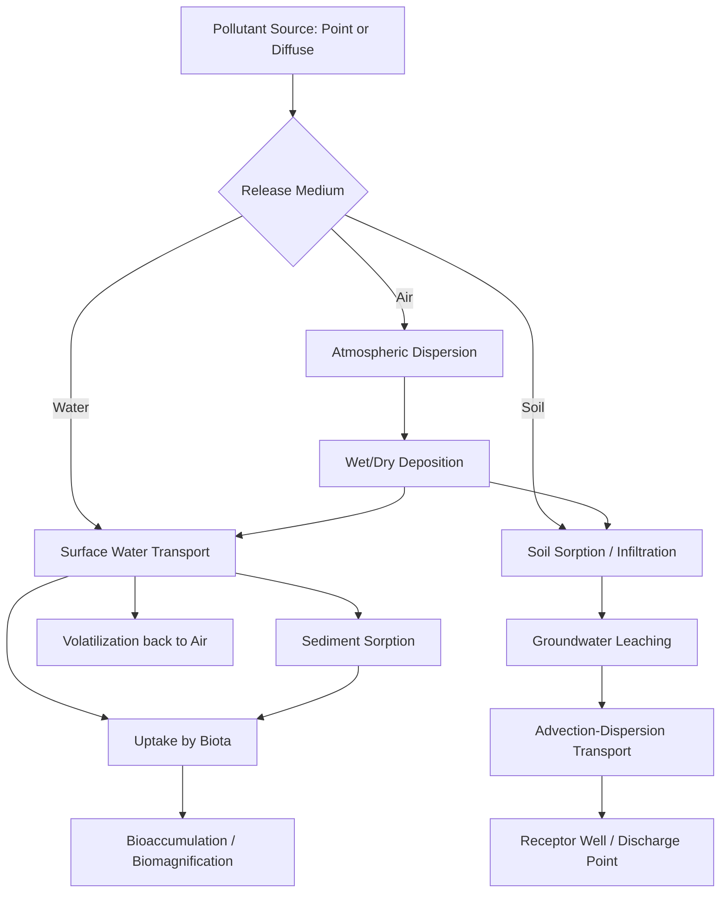

## Fate and Transport of Pollutants

### Conceptual Framework

**Fate and transport** describes the combined set of physical, chemical, and biological processes that determine where a pollutant goes after release into the environment, how its concentration changes over time and space, and what form (species) it ultimately takes. **Transport** refers to physical movement of a contaminant between and within environmental media (air, water, soil, biota); **fate** refers to the transformation, degradation, or partitioning processes altering the pollutant's chemical identity or phase distribution. These processes are typically analyzed jointly because transport pathways determine exposure to transformation conditions, and transformation products can themselves have different transport behavior than the parent compound.

### Environmental Media and Multimedia Partitioning

Pollutants distribute across four principal environmental compartments: **atmosphere**, **surface water**, **groundwater/soil**, and **biota**. The **fugacity approach** (developed by Mackay) provides a standardized framework for modeling multimedia partitioning, treating each compartment's capacity to "hold" a chemical as an equilibrium criterion analogous to chemical potential:

$$f = \frac{C}{Z}$$

where $f$ is fugacity, $C$ is concentration, and $Z$ is the fugacity capacity of the medium (compound- and medium-specific). At equilibrium, fugacity is equal across all compartments, allowing prediction of relative distribution based on compound properties (vapor pressure, water solubility, partition coefficients) even without full kinetic data.

### Key Physicochemical Properties Governing Fate

**Key Points**

- **Vapor pressure**: Determines volatilization tendency from water/soil surfaces to the atmosphere; higher vapor pressure favors atmospheric partitioning
- **Water solubility**: Governs aqueous mobility; higher solubility generally favors transport in surface water and groundwater, and reduces sorption to soil/sediment
- **Octanol-water partition coefficient ($K_{ow}$)**: Predicts bioaccumulation potential and affinity for organic matter/lipids; typically expressed as $\log K_{ow}$, with values above ~3-4 generally associated with significant bioaccumulation potential
- **Organic carbon-water partition coefficient ($K_{oc}$)**: Predicts sorption to soil/sediment organic matter, a primary control on contaminant mobility in subsurface systems
- **Henry's Law constant ($K_H$)**: Governs air-water partitioning; $K_H = C_{air}/C_{water}$ at equilibrium, with higher values indicating greater volatilization tendency from water
- **Degradation half-life**: Combines all transformation pathways (biodegradation, hydrolysis, photolysis) into a single persistence metric, directly determining how far a compound can be transported before significant degradation occurs

### Transport Processes

**Advection**

Bulk movement of a contaminant with the flow of its carrier medium (wind-driven atmospheric transport, water current transport, groundwater flow along the hydraulic gradient). Advective transport velocity in groundwater is described by Darcy's Law:

$$v = -K\frac{dh}{dl}$$

where $K$ is hydraulic conductivity and $dh/dl$ is the hydraulic gradient.

**Diffusion and dispersion**

- **Molecular diffusion**: Movement driven by concentration gradients, following Fick's First Law:

$$J = -D\frac{dC}{dx}$$

- **Mechanical dispersion**: Spreading caused by variation in flow velocity at the pore or turbulent-eddy scale, typically dominating over molecular diffusion in most groundwater and surface water transport scenarios except at very low flow velocities

**Volatilization**

Transfer of a compound from liquid or solid phase to the gas phase, governed by Henry's Law constant, temperature, wind speed (for surface water), and soil moisture/porosity (for soil surfaces).

**Sorption and desorption**

Partitioning between dissolved (mobile) and sorbed (immobile, associated with solid particles) phases, commonly described by a linear sorption isotherm:

$$C_s = K_d \times C_w$$

where $C_s$ is sorbed concentration, $C_w$ is dissolved concentration, and $K_d$ is the distribution coefficient. Sorption reduces the effective transport velocity of a contaminant relative to the bulk water flow, an effect quantified by the **retardation factor**:

$$R = 1 + \frac{\rho_b K_d}{n}$$

where $\rho_b$ is bulk density and $n$ is porosity. Higher $R$ values indicate greater retardation (slower contaminant movement relative to groundwater flow).

**Bioturbation and biotic transport**

Movement of contaminants via biological vectors — sediment mixing by benthic organisms, uptake and translocation by plants (phytoremediation-relevant), and trophic transfer through food webs (relevant to biomagnification, discussed below).

### Transformation (Fate) Processes

**Key Points**

- **Biodegradation**: Microbial metabolism of organic contaminants, occurring under aerobic or anaerobic conditions depending on the compound and available electron acceptors (see redox sequence from chemical fundamentals); rate strongly dependent on microbial community composition, nutrient availability, and temperature
- **Hydrolysis**: Reaction with water, commonly affecting esters, amides, and certain organophosphate/organochlorine pesticides, often pH-dependent
- **Photolysis**: Direct or indirect (via reactive intermediates such as hydroxyl radicals) breakdown driven by solar UV radiation, primarily relevant to surface water and atmospheric compartments where light penetration is significant
- **Oxidation-reduction reactions**: Transformation via electron transfer, relevant to redox-sensitive contaminants (e.g., chromium Cr(VI)/Cr(III), arsenic As(V)/As(III))
- **Precipitation/dissolution**: Phase change between dissolved and solid mineral forms, governed by solubility product equilibria, relevant to metal contaminant mobility

### Contaminant Transport in Groundwater: The Advection-Dispersion-Reaction Equation

The governing equation for one-dimensional solute transport in groundwater, incorporating advection, dispersion, sorption (retardation), and first-order decay, is:

$$R\frac{\partial C}{\partial t} = D\frac{\partial^2 C}{\partial x^2} - v\frac{\partial C}{\partial x} - \lambda C$$

where $D$ is the dispersion coefficient, $v$ is average linear groundwater velocity, and $\lambda$ is the first-order decay constant. This equation forms the basis of most analytical and numerical groundwater contaminant transport models (e.g., MODFLOW/MT3DMS-based simulations), producing the characteristic elongated, attenuating "plume" shape observed in field-monitored groundwater contamination.

### Atmospheric Transport and Dispersion

Atmospheric pollutant dispersion from point sources is commonly modeled using the **Gaussian plume model**:

$$C(x,y,z) = \frac{Q}{2\pi u \sigma_y \sigma_z} \exp\left(-\frac{y^2}{2\sigma_y^2}\right)\left[\exp\left(-\frac{(z-H)^2}{2\sigma_z^2}\right) + \exp\left(-\frac{(z+H)^2}{2\sigma_z^2}\right)\right]$$

where $Q$ is emission rate, $u$ is wind speed, $\sigma_y$ and $\sigma_z$ are horizontal/vertical dispersion coefficients (dependent on atmospheric stability class), and $H$ is effective stack height. [Inference] This model's accuracy degrades under complex terrain, highly variable meteorology, or very short averaging times, contexts where more computationally intensive dispersion models (e.g., AERMOD, CALPUFF) are typically preferred in regulatory practice.

**Long-range atmospheric transport**

Semi-volatile persistent organic pollutants can undergo repeated volatilization-deposition cycling (the "grasshopper effect"), enabling transport from source regions to remote areas (notably documented for POPs reaching Arctic ecosystems far from industrial emission sources).

### Bioaccumulation and Biomagnification

**Bioaccumulation** refers to the net accumulation of a contaminant within an organism from all exposure routes (water, food, sediment contact) exceeding elimination rate, typically expressed via the **Bioaccumulation Factor (BAF)**:

$$BAF = \frac{C_{organism}}{C_{water}}$$

**Biomagnification** refers to the increase in tissue concentration at successive trophic levels within a food web, occurring for compounds with high $\log K_{ow}$ (typically >5) and resistance to metabolic breakdown, most classically documented for organochlorine pesticides (DDT/DDE), PCBs, mercury (as methylmercury), and certain PFAS compounds. This process explains disproportionately high contaminant burdens observed in apex predators relative to ambient environmental concentrations.

### Multimedia Fate and Transport Pathway Diagram

### Modeling Approaches in Fate and Transport Assessment

**Compartmental (box) models**: Treat each environmental medium as a well-mixed compartment, tracking mass flux between compartments; suitable for regional or screening-level assessment where spatial resolution within a compartment is not required.

**Analytical solute transport models**: Closed-form solutions to the advection-dispersion-reaction equation under simplified geometry and boundary conditions, useful for preliminary groundwater plume assessment.

**Numerical/spatially distributed models**: Finite-difference or finite-element models (e.g., MODFLOW for groundwater flow, coupled with MT3DMS or RT3D for transport and reactive transport) capable of representing heterogeneous subsurface properties and complex boundary conditions, standard in regulatory site investigation and remediation design contexts.

**Fugacity-based multimedia models**: Level I-IV fugacity models (following Mackay's framework) of increasing complexity, from simple equilibrium partitioning (Level I) to full non-equilibrium, non-steady-state multimedia mass balance (Level IV), used in chemical screening and regulatory risk assessment (e.g., informing EPI Suite and similar exposure assessment tools).

### Regulatory and Risk Assessment Context

Fate and transport analysis directly informs:

- **Exposure assessment** within human health and ecological risk assessment frameworks, determining contaminant concentrations at receptor points (drinking water wells, fish tissue, ambient air)
- **Remediation design**: Understanding of retardation, degradation rate, and plume geometry directly informs remedy selection (pump-and-treat, permeable reactive barriers, monitored natural attenuation)
- **Total Maximum Daily Load (TMDL) development**: Under the U.S. Clean Water Act, requiring fate and transport understanding to allocate pollutant loading across a watershed while meeting water quality standards
- **Air quality permitting**: Dispersion modeling required to demonstrate compliance with National Ambient Air Quality Standards (NAAQS) at facility boundaries and beyond

### Case Study: MTBE Groundwater Contamination

Methyl tert-butyl ether (MTBE), formerly used as a gasoline oxygenate, illustrates fate and transport principles distinctly from other petroleum constituents: its low $K_{oc}$ (poor sorption to soil organic matter) and low biodegradability under typical subsurface conditions resulted in MTBE plumes migrating substantially faster and farther than co-released benzene, toluene, ethylbenzene, and xylenes (BTEX) from the same leaking underground storage tank sources, despite MTBE's lower overall usage volume relative to base gasoline. This case is frequently cited to illustrate how physicochemical properties, not release volume alone, determine relative transport risk.

### Diagram: Retardation Factor Effect on Plume Migration (svg_diagram)

<svg xmlns="http://www.w3.org/2000/svg" viewBox="0 0 640 260">
<text x="320" y="24" text-anchor="middle" font-size="15" font-weight="bold" fill="#222">Retardation Effect on Relative Plume Position (svg_diagram)</text>
<line x1="40" y1="80" x2="600" y2="80" stroke="#333" stroke-width="1" />
<text x="40" y="70" font-size="11" fill="#222">Source</text>
<circle cx="60" cy="80" r="6" fill="#333" />
<circle cx="480" cy="80" r="10" fill="#4a90d9" />
<text x="480" y="60" text-anchor="middle" font-size="11" fill="#222">Groundwater (Conservative Tracer, R=1)</text>
<line x1="40" y1="150" x2="600" y2="150" stroke="#333" stroke-width="1" />
<circle cx="60" cy="150" r="6" fill="#333" />
<circle cx="220" cy="150" r="10" fill="#d9884a" />
<text x="220" y="130" text-anchor="middle" font-size="11" fill="#222">Sorbing Contaminant (R=3)</text>
<line x1="40" y1="220" x2="600" y2="220" stroke="#333" stroke-width="1" />
<circle cx="60" cy="220" r="6" fill="#333" />
<circle cx="110" cy="220" r="10" fill="#c94a4a" />
<text x="110" y="200" text-anchor="middle" font-size="11" fill="#222">Strongly Sorbing Contaminant (R=8)</text>
</svg>

### Common Misconceptions

**Key Points**

- Dilution is not equivalent to degradation; a pollutant that becomes undetectable through dispersion may still exist as mass elsewhere in the environment, whereas true transformation (biodegradation, hydrolysis) changes its chemical identity
- High $K_{ow}$ compounds are not "safely immobile" simply because they resist dissolution in water; they instead partition preferentially into biota and organic matter, creating a distinct (and in some cases greater) long-term exposure pathway via bioaccumulation
- Groundwater contaminant plumes do not move at the same velocity as groundwater flow itself for sorbing compounds; retardation must be explicitly accounted for, or transport predictions will substantially overestimate contaminant migration distance

### Conclusion

Fate and transport analysis integrates physicochemical property data with media-specific transport and transformation mechanisms to predict contaminant distribution, persistence, and exposure potential across environmental compartments. This framework underlies practical applications spanning groundwater remediation design, air quality permitting, and ecological/human health risk assessment, and depends fundamentally on the chemical principles (equilibrium, kinetics, redox) established in environmental chemistry fundamentals.

**Related Topics**

- Chemical fundamentals for environmental systems (thermodynamics, kinetics, equilibrium)
- Groundwater hydrology and aquifer characterization
- Persistent Organic Pollutants (POPs) and bioaccumulation
- Risk assessment methodology (exposure and hazard characterization)
- Remediation technologies (pump-and-treat, bioremediation, permeable reactive barriers)
- Air quality dispersion modeling and regulatory standards
- Total Maximum Daily Load (TMDL) and watershed management