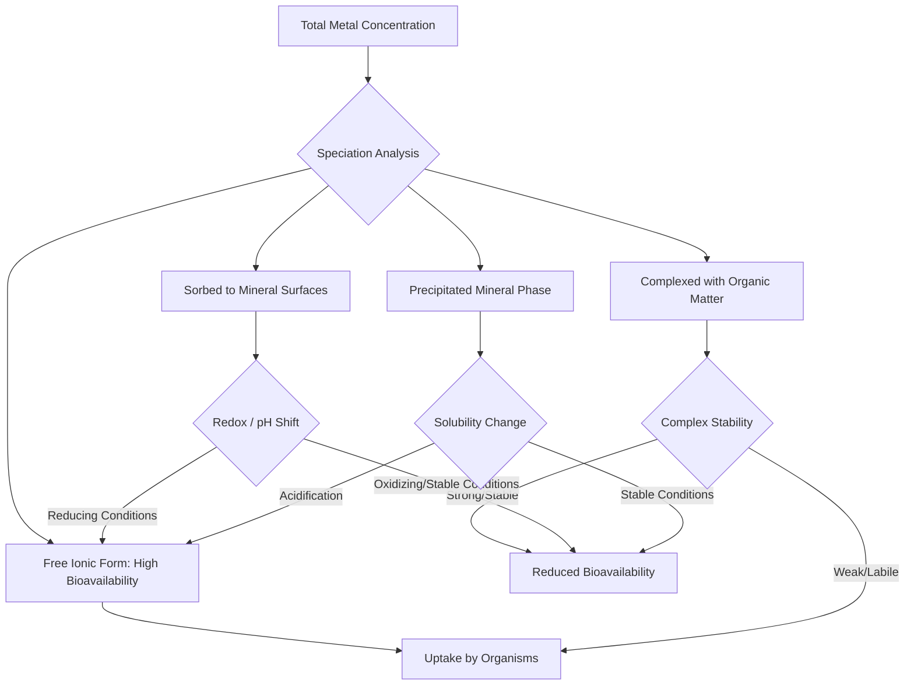

## Heavy Metals and Toxic Elements

### Definitions and Conceptual Framework

**Heavy metals** are conventionally defined as metallic elements with relatively high density (typically >5 g/cm³) that are toxic or ecotoxic even at low concentrations, though this density-based definition is chemically imprecise. [Inference] Much of the environmental chemistry and toxicology literature increasingly favors the term "**toxic trace elements**" or "**potentially toxic elements (PTEs)**," since the category of environmental concern includes metalloids (arsenic, antimony) and lighter elements (beryllium) that do not meet a strict density criterion, while some conventionally classified "heavy metals" (e.g., iron) are essential micronutrients at low concentrations. Both terms remain in wide use, and this material uses "heavy metals" as the more commonly recognized umbrella term while noting the definitional imprecision.

A key distinguishing feature of heavy metals relative to organic pollutants: metals are **elements** and therefore do not biodegrade. Environmental "removal" of a metal contaminant refers to change in speciation, phase, or location — not destruction of the element itself.

### Essential vs. Non-Essential Trace Elements

**Essential trace metals** (e.g., iron, zinc, copper, manganese, molybdenum, cobalt, selenium) are required in small quantities for biological function (enzyme cofactors, oxygen transport, redox catalysis) but become toxic above a threshold concentration — a **dose-response relationship** sometimes described by the "essentiality curve," where both deficiency and excess produce adverse effects.

**Non-essential toxic elements** (e.g., lead, cadmium, mercury, arsenic) have no known beneficial biological function at any exposure level and exhibit toxicity even at trace concentrations, though threshold vs. non-threshold dose-response models remain debated for specific compounds and endpoints (particularly for carcinogenic effects of arsenic and certain metal compounds).

### Major Heavy Metals of Environmental Concern

**Key Points**

- **Lead (Pb)**: Historically from leaded gasoline, lead paint, and industrial emissions; neurotoxic, particularly to developing nervous systems in children, with no established safe blood lead threshold in current toxicological consensus
- **Mercury (Hg)**: Exists in elemental, inorganic, and organic (methylmercury) forms; methylmercury is the primary human/ecological health concern due to efficient biomagnification through aquatic food webs, sourced from coal combustion, artisanal small-scale gold mining, and legacy industrial discharge
- **Cadmium (Cd)**: Associated with zinc ore processing, phosphate fertilizer application, and battery manufacturing; accumulates in kidney tissue, associated with bone and renal toxicity (notably documented in Japan's itai-itai disease)
- **Arsenic (As)**: A metalloid rather than a true metal; naturally occurring in certain aquifer geologies (notably parts of Bangladesh and West Bengal) as well as from historical pesticide and wood preservative use; associated with skin lesions, multiple cancer types, and cardiovascular effects
- **Chromium (Cr)**: Cr(III) is an essential trace nutrient (glucose metabolism cofactor) while Cr(VI) is a recognized human carcinogen; the toxicologically critical distinction lies in oxidation state, not merely elemental presence
- **Nickel (Ni)**, **zinc (Zn)**, **copper (Cu)**: Essential at trace levels, associated with industrial emissions and mining; ecotoxicity concerns typically center on aquatic organisms at elevated concentrations

### Speciation and Bioavailability

The environmental and toxicological behavior of a metal is governed not simply by total concentration but by **chemical speciation** — the specific molecular/ionic form present. Speciation determines:

- **Bioavailability**: Free ionic forms (e.g., $Cd^{2+}$) are generally more bioavailable than metal bound in mineral lattices or strongly complexed with organic matter
- **Toxicity**: As noted above, oxidation state dramatically alters toxicity (Cr(III) vs. Cr(VI); As(III) generally more toxic and mobile than As(V) under most conditions; inorganic mercury vs. methylmercury)
- **Mobility**: Speciation controls solubility and sorption behavior, governing transport potential in soil and water systems

Speciation is influenced by pH, redox potential ($E_h$), presence of complexing ligands (organic matter, chloride, sulfide), and competing ions — the same equilibrium and redox principles established in environmental chemistry fundamentals apply directly here.

### Redox Control of Metal Mobility

Redox conditions exert first-order control over the mobility of several environmentally significant metals/metalloids:

**Arsenic mobilization** in reducing groundwater environments occurs primarily through reductive dissolution of iron oxyhydroxides, to which arsenic is strongly sorbed under oxidizing conditions:

$$Fe(OH)_3 \cdot As(V)_{(sorbed)} \xrightarrow{\text{reducing conditions}} Fe^{2+} + As(III)_{(aq)}$$

This mechanism underlies the well-documented natural arsenic contamination of shallow tube-well groundwater across parts of South and Southeast Asia, a case frequently cited as one of the largest natural mass poisoning events in documented history, arising from geogenic (naturally occurring) rather than anthropogenic sources.

**Chromium redox behavior**: Cr(VI) as chromate ($CrO_4^{2-}$) is highly soluble and mobile under oxidizing, alkaline conditions, while reduction to Cr(III) (favored under reducing, acidic-to-neutral conditions, often mediated by ferrous iron or organic matter) produces much less soluble, less mobile, and less toxic species — a relationship directly exploited in Cr(VI) remediation strategies (chemical reduction treatment).

**Mercury methylation**: Conversion of inorganic mercury to the more bioaccumulative methylmercury is predominantly mediated by sulfate-reducing and iron-reducing bacteria under anaerobic conditions, explaining why methylmercury production is often enhanced in wetlands, reservoirs, and anoxic sediment/water interfaces relative to well-oxygenated systems.

### Sources of Heavy Metal Contamination

**Anthropogenic sources**

- Mining and ore processing (acid mine drainage, tailings)
- Fossil fuel combustion (coal-associated trace metal emissions, particularly mercury, arsenic, selenium)
- Industrial manufacturing (electroplating, battery production, metal finishing)
- Agricultural inputs (phosphate fertilizers containing cadmium impurities, historical arsenical pesticides)
- Waste disposal (improperly managed landfills, e-waste processing)
- Legacy contamination (leaded gasoline residues, lead paint, historical industrial sites)

**Natural (geogenic) sources**

- Weathering of metal-bearing bedrock and mineral deposits
- Volcanic emissions
- Naturally elevated groundwater arsenic in specific sedimentary aquifer settings

### Fate and Transport Considerations Specific to Metals

Because metals are non-degradable elements, their environmental fate is governed entirely by **partitioning and transport processes** rather than transformation to non-toxic products (contrast with organic pollutant fate, where biodegradation can achieve genuine mass reduction of the toxic parent compound). Relevant processes include:

- **Sorption to soil/sediment**: Governed by cation exchange capacity, organic matter content, clay mineralogy, and pH; generally, sorption increases with pH for cationic metals (Pb²⁺, Cd²⁺, Cu²⁺) due to reduced competition from H⁺ ions and increased surface charge on hydrous oxides
- **Precipitation as mineral phases**: Formation of sulfide, carbonate, hydroxide, or phosphate mineral precipitates under appropriate geochemical conditions, a primary mechanism in both natural attenuation and engineered remediation (e.g., sulfate-reducing bioreactors precipitating metal sulfides)
- **Complexation with organic matter**: Humic and fulvic acids can bind metals, altering solubility and bioavailability in either direction depending on the specific metal-ligand system
- **Colloidal transport**: Metals sorbed to fine colloidal particles (clay, iron oxide nanoparticles) can be transported through porous media at rates exceeding predictions based on dissolved-phase transport alone, a mechanism [Inference] increasingly recognized in subsurface contaminant transport research as significant for otherwise poorly-soluble metals, though its quantitative significance is site- and particle-specific

### Bioaccumulation and Biomagnification of Metals

Unlike many organic POPs, most heavy metals do not biomagnify strongly up food chains — a common point of confusion. **Methylmercury** is the principal, well-documented exception, biomagnifying substantially through aquatic food webs from phytoplankton through predatory fish, explaining consumption advisories for high-trophic-level fish species (tuna, swordfish, certain freshwater predatory fish). Other metals (cadmium, lead, arsenic) generally show bioaccumulation (organism-to-environment enrichment) without strong biomagnification (further enrichment at each successive trophic level), though [Unverified] exceptions and degree of biomagnification vary by specific metal, organism, and ecosystem, and should not be generalized without species-specific data.

### Metal Toxicity Mechanisms

**Key Points**

- **Enzyme inhibition**: Many toxic metals bind to sulfhydryl (-SH) groups on enzymes, disrupting catalytic function (a mechanism relevant to lead, mercury, and cadmium toxicity)
- **Oxidative stress**: Several metals (iron, copper, chromium) catalyze formation of reactive oxygen species via Fenton-type reactions, causing cellular damage
- **Ionic mimicry**: Some toxic metals substitute for essential ions in biological systems (e.g., lead substituting for calcium in bone and neurological calcium-signaling pathways), disrupting normal physiological function
- **DNA damage and carcinogenicity**: Certain metal species (Cr(VI), arsenic compounds, cadmium) are recognized carcinogens through mechanisms including direct DNA adduct formation and epigenetic alteration

### Regulatory Frameworks and Standards

- **U.S. EPA National Primary Drinking Water Regulations**: Establish Maximum Contaminant Levels (MCLs) for lead, arsenic, cadmium, chromium, mercury, and other regulated metals
- **RCRA and CERCLA (Superfund)**: U.S. frameworks governing hazardous waste management and contaminated site remediation, frequently applied to metal-contaminated mining and industrial sites
- **Minamata Convention on Mercury**: International treaty (entered into force 2017) targeting reduction of anthropogenic mercury emissions and use, including artisanal small-scale gold mining practices
- **WHO Guidelines for Drinking-water Quality**: Provide international reference values for metal concentrations in drinking water

### Diagram: Metal Speciation and Mobility Pathway

### Remediation Approaches for Metal-Contaminated Media

**Key Points**

- **Soil washing**: Physical/chemical extraction of metals from contaminated soil using acids, chelating agents, or surfactants
- **Solidification/stabilization**: Immobilizing metals within a solid matrix (e.g., cement-based stabilization) to reduce leachability rather than removing the metal itself
- **Phytoremediation (phytoextraction)**: Use of hyperaccumulator plant species to extract metals from soil into harvestable biomass; effective for certain metals (nickel, zinc, cadmium) but generally slower than engineered removal methods
- **Permeable reactive barriers**: Subsurface barriers containing reactive media (zero-valent iron, for example) that promote in-situ precipitation or reduction of dissolved metal contaminants as groundwater passes through
- **Sulfate-reducing bioreactors**: Biologically mediated precipitation of metal sulfides, commonly applied to acid mine drainage treatment given the co-occurrence of low pH, high sulfate, and elevated dissolved metals in that context

### Case Study: Flint, Michigan Lead Contamination

The 2014-2016 Flint water crisis illustrates the interaction between water chemistry and infrastructure-derived metal contamination: a change in water source (from treated Detroit municipal supply to the more corrosive Flint River, without adequate corrosion control treatment) altered water chemistry sufficiently to destabilize protective mineral scale within lead service lines and plumbing, releasing lead into tap water. This case is widely cited in environmental engineering and public health literature as demonstrating that source water switching decisions require explicit corrosion control chemistry assessment, since lead exposure in this instance arose from distribution infrastructure interaction rather than source water contamination itself.

### Case Study: Bangladesh Groundwater Arsenic Crisis

Beginning in the 1970s-1980s, a large-scale tube-well drinking water program (intended to reduce microbial waterborne disease by shifting from surface water to groundwater sources) inadvertently exposed millions of people to naturally occurring geogenic arsenic mobilized under the reducing conditions of shallow Ganges-Brahmaputra delta aquifer sediments. [Unverified] Precise current exposed-population estimates vary across sources and should be checked against recent WHO/BGS (British Geological Survey) assessments, but this remains widely cited as among the most significant unintended public health consequences arising from a well-intentioned water infrastructure intervention, illustrating the necessity of geochemical site characterization prior to large-scale groundwater development.

### Common Misconceptions

**Key Points**

- Heavy metals do not biodegrade; remediation approaches change their form, location, or bioavailability, not their elemental identity — a fundamental distinction from organic pollutant remediation
- Not all "heavy metals" biomagnify up food chains; methylmercury is the primary well-documented biomagnifying case among commonly regulated metals, and this behavior should not be generalized to all metals without specific evidence
- Total metal concentration alone is an insufficient basis for risk assessment; speciation and bioavailability determine actual toxicological and ecological significance, meaning two samples with identical total concentration can pose substantially different risk

### Conclusion

Heavy metals and toxic trace elements present a distinct environmental chemistry challenge relative to organic pollutants due to their non-degradable, elemental nature, with speciation — governed by pH, redox conditions, and complexation — serving as the central determinant of mobility, bioavailability, and toxicity. Understanding source attribution, redox-driven mobilization mechanisms, and speciation-dependent behavior is essential for accurate risk assessment and effective remediation design in metal-contaminated systems.

**Related Topics**

- Chemical fundamentals for environmental systems (redox, equilibrium, speciation)
- Fate and transport of pollutants
- Persistent Organic Pollutants (POPs) and bioaccumulation
- Acid mine drainage chemistry and remediation
- Drinking water quality standards and treatment
- Risk assessment methodology for environmental contaminants
- Soil and groundwater remediation technologies