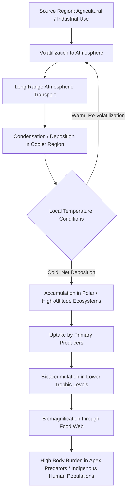

## Persistent Organic Pollutants

### Definitions and Conceptual Framework

**Persistent Organic Pollutants (POPs)** are organic chemical substances defined by four characteristic properties occurring in combination: **persistence** (resistance to environmental degradation), **bioaccumulation** (accumulation in fatty tissue of organisms), **long-range environmental transport** (capacity to travel far from their emission source via air and water), and **toxicity** to humans or ecosystems. This four-property definition, formalized under the **Stockholm Convention on Persistent Organic Pollutants** (adopted 2001, entered into force 2004), distinguishes POPs from the broader category of persistent organic chemicals or bioaccumulative substances individually.

The combination of properties — rather than any single property alone — is what makes POPs a distinct regulatory and scientific category: a chemical that is merely persistent but non-bioaccumulative (e.g., some inert fluorinated compounds) or bioaccumulative but readily degraded is not classified as a POP under this framework.

### The Stockholm Convention Framework

The Stockholm Convention originally listed twelve POPs at its adoption (sometimes termed the "dirty dozen"), later expanded through subsequent Conference of the Parties amendments to include additional substances. Listed substances are grouped into three annexes:

- **Annex A (Elimination)**: Substances requiring parties to eliminate production and use, subject to specific exemptions
- **Annex B (Restriction)**: Substances subject to restricted use for acceptable purposes (notably DDT, restricted rather than fully eliminated due to its continued role in vector-borne disease control in some regions)
- **Annex C (Unintentional production)**: Substances requiring measures to reduce releases from unintentional formation, primarily industrial and combustion byproducts (e.g., dioxins, furans)

[Unverified] The current complete list of Convention-covered substances has been amended multiple times since 2001 (including additions such as certain PFAS compounds, PBDEs, and other flame retardants in more recent COP decisions); the precise current list should be verified against the Stockholm Convention Secretariat's official substance registry, as this material's coverage of specific listed compounds may not reflect the most recent amendments.

### The Original "Dirty Dozen" POPs

**Organochlorine pesticides**

- **DDT** (dichlorodiphenyltrichloroethane): Historically used for agricultural pest control and malaria vector control; famously documented (Rachel Carson's *Silent Spring*) for eggshell-thinning effects in raptor populations via disruption of calcium metabolism
- **Aldrin, Dieldrin, Endrin**: Cyclodiene insecticides, largely phased out in most jurisdictions
- **Chlordane, Heptachlor**: Soil insecticides, associated with persistence in agricultural soils
- **Hexachlorobenzene (HCB)**: Fungicide and industrial byproduct
- **Mirex, Toxaphene**: Insecticides with documented aquatic ecotoxicity

**Industrial chemicals**

- **Polychlorinated Biphenyls (PCBs)**: Used extensively in electrical transformers/capacitors (dielectric fluid) and as heat transfer fluids until phase-out beginning in the late 1970s; comprise 209 possible congeners with varying toxicity and persistence profiles

**Unintentional byproducts**

- **Dioxins** (polychlorinated dibenzo-p-dioxins, PCDDs) and **Furans** (polychlorinated dibenzofurans, PCDFs): Formed unintentionally during combustion processes (waste incineration, industrial chlorine chemistry), with 2,3,7,8-TCDD being the most toxicologically studied and potent congener

### Chemical Basis of Persistence

**Key Points**

- **Carbon-halogen bonds** (particularly C-Cl bonds prevalent in organochlorines): High bond dissociation energy confers resistance to hydrolysis and many oxidative degradation pathways
- **Aromatic ring structures**: Resist microbial enzymatic attack more effectively than aliphatic chains, particularly when heavily halogenated
- **Steric hindrance from halogen substitution**: Bulky halogen substituents can physically obstruct enzymatic access to reactive sites, reducing biodegradation rate
- **Low water solubility / high lipophilicity**: Reduces bioavailability to degrading microorganisms in aqueous environments while simultaneously promoting partitioning into organic matter and lipid tissue (the same property driving bioaccumulation)

These structural features connect directly to the organic chemistry fundamentals (functional groups, bond polarity) and fate/transport principles ($K_{ow}$, degradation half-life) established earlier in this chapter.

### Long-Range Transport: The Global Distillation / Grasshopper Effect

POPs undergo a distinctive transport pattern driven by temperature-dependent partitioning between air and surface media:

$$K_H \propto e^{-\Delta H_{vap}/RT}$$

In warmer source regions, semi-volatile POPs volatilize into the atmosphere; upon atmospheric transport to colder regions (particularly polar and high-altitude environments), reduced temperature favors condensation/deposition back to surface media. Repeated cycles of this volatilization-deposition process — termed the **"grasshopper effect"** — result in net poleward transport and progressive fractionation by volatility, explaining the well-documented presence of POPs in Arctic biota and indigenous populations far removed from any local industrial or agricultural source. This mechanism represents a specific, empirically well-supported application of the general multimedia fate and transport principles (fugacity, Henry's Law partitioning) discussed previously in this chapter.

### Bioaccumulation and Biomagnification Mechanisms

POPs' high $\log K_{ow}$ values (frequently >5-6) drive strong partitioning into lipid tissue upon uptake, while resistance to metabolic biotransformation (a consequence of the same structural persistence features discussed above) prevents efficient elimination. The combination produces the characteristic biomagnification pattern through aquatic and terrestrial food webs:

$$BMF = \frac{C_{predator}}{C_{prey}}$$

where a Biomagnification Factor (BMF) greater than 1 indicates trophic-level enrichment. This process explains disproportionate POP body burdens documented in apex predators (polar bears, orcas, birds of prey) relative to ambient environmental concentrations several orders of magnitude lower.

### POP Cycling and Global Transport Diagram

### Toxicological Effects of POPs

**Key Points**

- **Endocrine disruption**: Many POPs (particularly PCBs, dioxins, DDT metabolites) interfere with hormone signaling pathways, associated with reproductive and developmental effects across multiple species
- **Carcinogenicity**: 2,3,7,8-TCDD is classified by IARC as a known human carcinogen (Group 1); several PCB congeners and other POPs carry varying carcinogenicity classifications
- **Immunotoxicity**: Documented immune suppression effects in wildlife (notably marine mammals) and evidence in human epidemiological studies
- **Neurodevelopmental effects**: Associated particularly with prenatal and early childhood exposure to certain POPs (PCBs, some organochlorine pesticides)
- **Reproductive toxicity**: DDT/DDE's calcium metabolism disruption in birds (eggshell thinning) remains a foundational case study in environmental toxicology; broader reproductive effects documented across multiple POP classes and species

[Inference] Dose-response relationships for endocrine-disrupting POPs are an area of active scientific investigation, with some research suggesting non-monotonic dose-response curves (effects not simply increasing linearly with dose) for certain compounds — this remains a more actively debated area of toxicology than the acute toxicity endpoints for many other contaminant classes, and should be treated as an evolving area of the science rather than settled consensus.

### Emerging and Newer POPs

Substances added to the Stockholm Convention in subsequent amendments after the original 2001 listing include various brominated flame retardants (e.g., certain polybrominated diphenyl ethers, PBDEs) and per- and polyfluoroalkyl substances (certain PFAS, e.g., PFOS and its salts). PFAS compounds present a notable case of continued scientific and regulatory discussion: their carbon-fluorine bonds are exceptionally stable (among the strongest single bonds in organic chemistry), conferring extreme persistence — leading to the informal designation "forever chemicals" — while exhibiting somewhat different bioaccumulation and transport behavior than classical organochlorine POPs (e.g., some PFAS partition more readily to protein than lipid tissue, and some shorter-chain variants show greater water mobility than classical POPs). [Unverified] The regulatory and scientific classification status of specific PFAS compounds continues to evolve rapidly; current Stockholm Convention listing status and national regulatory limits for specific PFAS congeners should be verified against current sources rather than assumed static.

### Case Study: DDT and the Stockholm Convention's Public Health Exemption

DDT's continued Annex B (restricted, not eliminated) status illustrates a recurring tension in POPs policy between environmental/ecological harm and public health benefit: DDT remains among the most effective and affordable tools for indoor residual spraying in malaria vector control in some malaria-endemic regions, per WHO guidance, even as its ecological persistence and bioaccumulation profile justify severe restriction of agricultural use. This case is frequently cited in environmental policy literature as a paradigmatic example of weighing acute, well-quantified public health benefits against diffuse, long-term ecological and potential chronic health costs within a single regulatory framework.

### Analytical and Monitoring Approaches

POP monitoring commonly employs:

- **Gas chromatography coupled with mass spectrometry (GC-MS)** or **high-resolution GC-MS**: Standard analytical method for most classical organochlorine POPs, given their volatility and thermal stability suited to GC separation
- **Biomonitoring programs**: Measurement in human tissue (blood serum, breast milk) and biota (fish, marine mammal blubber, bird eggs) to track temporal trends and geographic distribution, including long-term programs such as the Arctic Monitoring and Assessment Programme (AMAP)
- **Passive air samplers**: Used in global and regional atmospheric POP monitoring networks (e.g., the Global Atmospheric Passive Sampling network) to characterize long-range transport patterns

### Common Misconceptions

**Key Points**

- POPs are not defined by high acute toxicity alone; a chemical must exhibit the combined profile of persistence, bioaccumulation, long-range transport potential, and toxicity to meet the formal Stockholm Convention definition — high toxicity with rapid degradation does not qualify a substance as a POP
- Banning or restricting a POP does not immediately eliminate environmental presence; due to persistence, "legacy" contamination from historical use (e.g., PCBs, DDT) continues to be detected in environmental media and biota decades after regulatory restriction
- Not all persistent chemicals biomagnify; biomagnification specifically requires sufficient lipophilicity (high $K_{ow}$) combined with metabolic resistance — persistence in the environment and persistence within an organism's metabolism are related but distinct properties

### Conclusion

Persistent Organic Pollutants represent a chemically and regulatorily distinct category defined by the combined properties of environmental persistence, bioaccumulation potential, long-range transport capacity, and toxicity, formalized internationally under the Stockholm Convention. Their characteristic global distillation transport pattern and food-web biomagnification behavior connect directly to the fate/transport and organic chemistry principles established earlier in this chapter, while their regulatory history illustrates the ongoing challenge of balancing ecological/health risks against specific beneficial uses (as in the DDT malaria control case).

**Related Topics**

- Fate and transport of pollutants (multimedia partitioning, bioaccumulation)
- Heavy metals and toxic elements (contrast: non-degradable vs. persistent-but-organic contaminants)
- Chemical fundamentals for environmental systems (organic chemistry, functional groups)
- Endocrine disruption and reproductive toxicology
- Pesticide regulation and integrated pest management
- PFAS ("forever chemicals") regulatory developments
- International environmental treaties and the Stockholm Convention framework
- Biomonitoring and environmental health surveillance programs