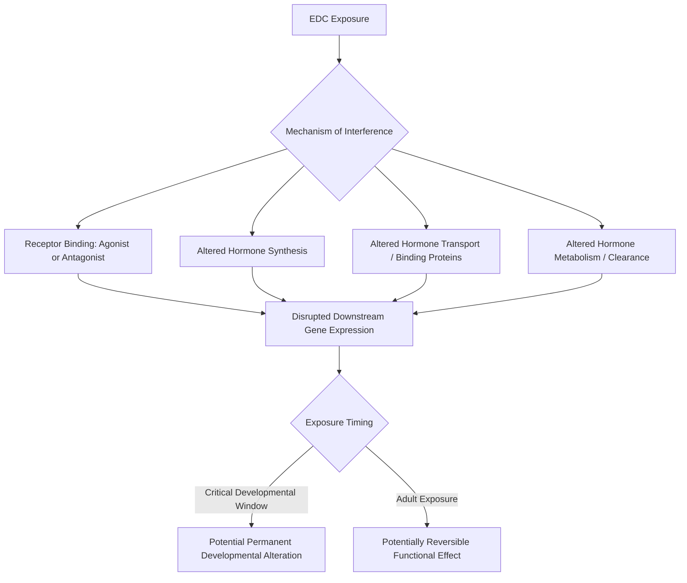

## Endocrine Disrupting Chemicals

### Definitions and Conceptual Framework

**Endocrine Disrupting Chemicals (EDCs)** are exogenous substances or mixtures that alter function(s) of the endocrine system and consequently cause adverse health effects in an intact organism, its progeny, or (sub)populations — a definition consistent with the World Health Organization/International Programme on Chemical Safety framing widely used in the field. EDCs interfere with the endocrine system's normal operation, which relies on hormones acting as chemical messengers synthesized, secreted, transported, and received in precise, often low-concentration signaling pathways regulating development, reproduction, metabolism, and behavior.

EDCs represent a **mechanism-based category** rather than a chemical-structure-based category (contrast with POPs, defined partly by structural persistence properties): a highly diverse range of chemical classes — including certain pesticides, plasticizers, industrial chemicals, and pharmaceuticals — can qualify as EDCs if they interfere with hormonal signaling, regardless of shared structural features.

### Mechanisms of Endocrine Disruption

**Key Points**

- **Receptor agonism/antagonism**: EDCs can bind to hormone receptors (estrogen receptor, androgen receptor, thyroid hormone receptor) and either mimic the natural hormone (agonism) or block the receptor without triggering the normal response (antagonism)
- **Alteration of hormone synthesis**: Some EDCs interfere with enzymes involved in steroidogenesis (e.g., aromatase inhibition, affecting the conversion of androgens to estrogens)
- **Alteration of hormone transport**: Interference with binding proteins (e.g., thyroid-binding globulin, sex hormone-binding globulin) that regulate the fraction of circulating "free" (bioactive) hormone
- **Alteration of hormone metabolism/clearance**: Some EDCs affect hepatic metabolism pathways, altering the rate of hormone breakdown and clearance from circulation
- **Epigenetic modification**: A subject of substantial ongoing research; some EDCs are hypothesized to induce heritable changes in gene expression patterns (via DNA methylation or histone modification) without altering the underlying DNA sequence

### Key Chemical Classes Exhibiting Endocrine-Disrupting Activity

**Bisphenol A (BPA) and structural analogs**

Used extensively in polycarbonate plastics and epoxy resin can linings; exhibits weak estrogen receptor agonist activity. Regulatory restriction in specific applications (e.g., baby bottles in multiple jurisdictions) has driven substitution with structural analogs (BPS, BPF), for which [Unverified] the endocrine activity profile relative to BPA itself remains an area of ongoing research, with some studies suggesting these substitutes may exhibit comparable rather than reduced endocrine activity — the "regrettable substitution" pattern discussed further below.

**Phthalates**

Used as plasticizers to increase flexibility in PVC plastics and as solvents/fixatives in personal care products; associated primarily with anti-androgenic activity, implicated in male reproductive developmental effects in laboratory animal studies.

**Organochlorine pesticides (overlapping with the POPs category)**

DDT and its metabolite DDE exhibit estrogenic and anti-androgenic activity respectively; this endocrine mechanism underlies the eggshell-thinning effect (via disrupted calcium metabolism, itself hormonally regulated) discussed in the POPs material.

**Polychlorinated Biphenyls (PCBs)**

Certain congeners exhibit thyroid hormone-disrupting activity via structural similarity to thyroxine (T4), interfering with thyroid hormone transport and receptor binding.

**Per- and polyfluoroalkyl substances (PFAS)**

Increasingly documented endocrine-disrupting activity, particularly relating to thyroid function and, in some studies, metabolic/lipid regulation pathways; this represents an actively evolving area of the toxicological literature.

**Parabens and certain UV filters**

Used as preservatives and sunscreen ingredients respectively; some compounds within these classes exhibit weak estrogenic activity, though [Inference] the toxicological and regulatory significance of this weak activity at typical human exposure levels remains a debated question distinct from whether the activity itself is detectable in laboratory assays.

**Natural and synthetic hormones**

Estrogenic compounds from pharmaceutical sources (synthetic estrogens in oral contraceptives) and natural sources (phytoestrogens, livestock-excreted natural hormones) also contribute to environmental EDC loading, particularly in wastewater-influenced surface waters, illustrating that EDCs are not exclusively synthetic industrial chemicals.

### The Non-Monotonic Dose-Response Debate

Conventional toxicology generally assumes a **monotonic dose-response relationship**, where effect magnitude increases (or decreases) consistently with dose — underlying the traditional toxicological principle "the dose makes the poison." A substantial body of EDC research has proposed that some endocrine-active substances exhibit **non-monotonic dose-response curves (NMDRs)**, where effects at low doses may differ qualitatively (not just in magnitude) from effects at high doses, sometimes attributed to mechanisms such as receptor downregulation at high concentrations or the involvement of multiple receptor subtypes with different sensitivities.

[Speculation] The prevalence, mechanistic basis, and regulatory implications of non-monotonic dose-response relationships remain genuinely contested within the toxicological and regulatory science community; this is not a settled area of consensus, and readers should treat NMDR claims for specific compounds as requiring case-by-case evaluation against the primary literature rather than as an established general principle applicable across all EDCs.

### Critical/Sensitive Windows of Exposure

**Key Points**

- **Prenatal development**: Widely recognized in developmental toxicology as a period of heightened vulnerability to endocrine disruption, given the role of precisely timed hormonal signaling in organ system differentiation
- **Early postnatal period**: Continued organ system maturation (particularly neurological and reproductive systems) creates ongoing sensitivity
- **Puberty**: Hormonally-driven developmental transition representing another recognized window of potential heightened sensitivity
- **The "fetal basis of adult disease" / Developmental Origins of Health and Disease (DOHaD) framework**: A conceptual model in which early-life exposures (including to EDCs) are hypothesized to program disease susceptibility manifesting later in adulthood — an active and evolving area of epidemiological research

This concept of exposure timing mattering independently of, or in addition to, dose magnitude represents a distinguishing feature of endocrine toxicology relative to classical acute/chronic toxicology paradigms focused primarily on dose and duration.

### Endocrine Disruption Mechanism Diagram

### Documented and Studied Effects Across Species

**Wildlife observations**

- Intersex characteristics documented in fish populations downstream of wastewater treatment discharge, associated with estrogenic compound exposure
- Reproductive abnormalities in alligator populations exposed to organochlorine pesticide-contaminated sites (notably studied at Lake Apopka, Florida)
- Imposex (development of male sexual characteristics in female gastropods) linked to tributyltin exposure from antifouling ship paints, a well-established and mechanistically clear case of endocrine disruption in marine invertebrates

**Human health research areas**

Research has investigated potential associations between EDC exposure and reproductive health outcomes, certain cancers (particularly hormonally-mediated cancers), metabolic effects, and neurodevelopmental outcomes. [Inference] Human epidemiological evidence for many of these associations is generally considered less definitive than the mechanistic and animal-model evidence base, given the challenges of exposure assessment (typically involving complex mixtures rather than single compounds), confounding factors, and the long latency periods relevant to some hypothesized outcomes — this is an area where mechanistic plausibility and epidemiological certainty should be distinguished rather than conflated.

### The "Cocktail Effect" and Mixture Toxicity

A significant methodological challenge in EDC science is that real-world exposure occurs to complex mixtures of multiple EDCs simultaneously, rather than to single compounds as typically tested in regulatory toxicology studies. Research on **combination/cocktail effects** has examined whether mixtures of individually sub-threshold EDC doses can produce measurable combined effects — a concept with some experimental support in specific studied mixtures, though [Unverified] the general quantitative predictability of mixture effects across the full range of environmentally relevant EDC combinations remains an area of active methodological development, and current regulatory frameworks in most jurisdictions still substantially rely on single-substance risk assessment approaches.

### Regulatory Approaches

- **EU REACH regulation and EDC identification criteria**: The European Union has developed specific scientific criteria for formal identification of substances as endocrine disruptors, informing restriction decisions under REACH and the Biocidal Products/Plant Protection Products Regulations
- **U.S. EPA Endocrine Disruptor Screening Program (EDSP)**: A tiered testing framework for screening pesticide and certain other chemicals for potential endocrine activity
- **Precautionary principle application**: EDC regulation is frequently cited as an area where the precautionary principle (acting on plausible risk before full mechanistic/epidemiological certainty is established) is more explicitly invoked than in some other areas of chemical regulation, reflecting the specific challenges of non-monotonic dose-response hypotheses and low-dose/developmental-timing sensitivity discussed above

### Case Study: Tributyltin and Marine Gastropod Imposex

Tributyltin (TBT), used historically as an antifouling agent in marine ship paints, provides one of the most mechanistically well-characterized cases of endocrine disruption: TBT inhibits aromatase (the enzyme converting testosterone to estrogen), causing testosterone accumulation in female gastropods and subsequent development of male reproductive structures (imposex), in some severely affected populations leading to reproductive sterility and localized population decline. This case is frequently cited in environmental toxicology curricula both for its clear causal mechanism and because it directly informed subsequent international regulatory action (IMO restrictions on TBT-based antifouling paints).

### Case Study: "Regrettable Substitution" and Bisphenol Analogs

Following regulatory restriction of BPA in specific consumer product categories in several jurisdictions, manufacturers substituted structurally similar compounds (BPS, BPF) not covered by the original restrictions. Subsequent research has investigated whether these substitutes exhibit comparable endocrine activity to BPA itself. This pattern — termed "**regrettable substitution**" in the chemical policy literature — illustrates a recurring challenge in EDC (and broader chemical) regulation: structure-specific restrictions can incentivize substitution with closely related, insufficiently tested analogs rather than genuine hazard reduction, a consideration increasingly informing calls for class-based rather than single-substance regulatory approaches.

### Analytical and Screening Methods

- **In vitro receptor binding/reporter gene assays**: High-throughput screening methods assessing a chemical's capacity to bind and activate/inhibit specific hormone receptors
- **In vivo assays**: Standardized animal testing protocols (e.g., uterotrophic assay for estrogenic activity, Hershberger assay for androgenic activity) within tiered regulatory screening programs
- **Biomarker-based human/wildlife monitoring**: Measurement of hormone levels, reproductive endpoints, or specific EDC biomarkers in exposed populations
- **High-resolution mass spectrometry**: Increasingly applied for non-targeted analysis of complex environmental and biological samples to characterize the full range of EDC exposure beyond pre-selected target compound lists

### Common Misconceptions

**Key Points**

- "Natural" hormone-active compounds (phytoestrogens, natural steroid hormones from livestock waste) are not automatically safer than synthetic EDCs; endocrine activity is a function of molecular interaction with receptors, not chemical origin
- EDC concern is not limited to reproductive/fertility effects alone; documented and hypothesized effects span metabolic, neurodevelopmental, immune, and thyroid function domains
- Regulatory restriction of one specific compound does not guarantee elimination of endocrine-disrupting exposure from that product category, given the regrettable substitution pattern discussed above — compound-specific bans require follow-up assessment of replacement chemicals

### Conclusion

Endocrine Disrupting Chemicals constitute a mechanism-defined category spanning diverse chemical classes, unified by their capacity to interfere with hormonal signaling pathways governing development, reproduction, and metabolism. Key areas of ongoing scientific development include non-monotonic dose-response relationships, mixture/cocktail effects, and the translation of mechanistic and animal-model findings into human epidemiological certainty — areas where the material distinguishes established mechanistic understanding from more actively contested or evolving research questions.

**Related Topics**

- Persistent Organic Pollutants (POPs) and structural/mechanistic overlap with EDCs
- Heavy metals and toxic elements (contrast in toxicity mechanism)
- Reproductive and developmental toxicology
- Chemical risk assessment methodology and regulatory frameworks
- PFAS regulatory developments
- Wastewater treatment and micropollutant removal
- Developmental Origins of Health and Disease (DOHaD) framework