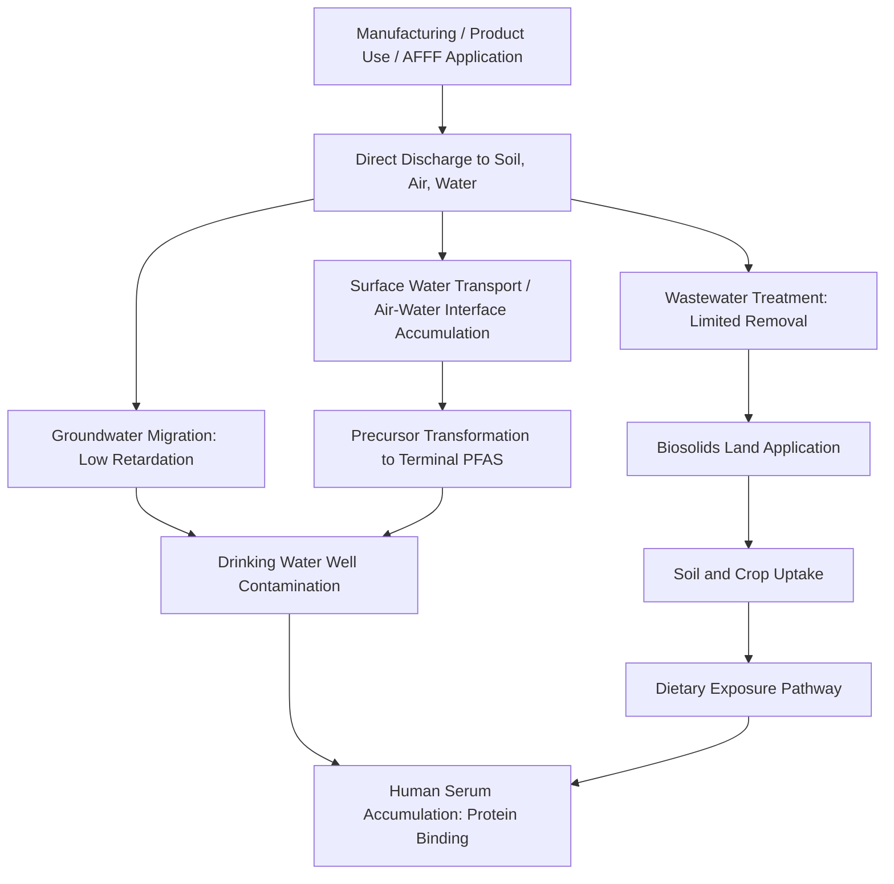

## PFAS and Emerging Persistent Contaminants

### Definitions and Conceptual Framework

**Per- and polyfluoroalkyl substances (PFAS)** are a large class of synthetic organofluorine compounds characterized by chains of carbon atoms fully or partially bonded to fluorine atoms. "Perfluoroalkyl" substances have every hydrogen on the carbon backbone replaced by fluorine; "polyfluoroalkyl" substances retain at least one carbon-hydrogen bond. The class encompasses several thousand distinct compounds, spanning legacy long-chain substances, their shorter-chain replacements, and structurally diverse fluoropolymers and precursor compounds.

PFAS are frequently grouped with, but are chemically distinct from, the classical organochlorine POPs discussed earlier in this chapter. Both categories share the defining properties of persistence and (for many PFAS) bioaccumulation potential, but the underlying chemical bond responsible for persistence differs fundamentally, with direct consequences for environmental behavior discussed below.

### Chemical Basis of Extreme Persistence

**Key Points**

- **Carbon-fluorine (C-F) bond strength**: Among the strongest single covalent bonds in organic chemistry, with bond dissociation energy substantially exceeding that of the carbon-chlorine bonds underlying classical organochlorine POP persistence
- **Resistance to hydrolysis, photolysis, and biodegradation**: The C-F bond's strength and the shielding effect of surrounding fluorine atoms confer resistance to essentially all natural environmental degradation pathways operating on relevant timescales, giving rise to the informal designation "**forever chemicals**"
- **Functional head groups**: Most PFAS of regulatory concern (e.g., PFOA, PFOS) combine a fluorinated carbon chain (hydrophobic/lipophobic) with a charged functional head group (carboxylate or sulfonate), conferring surfactant properties (simultaneous water- and oil-repellency) that underlie their widespread industrial utility

### Key PFAS Compounds and Historical Use

**Long-chain legacy PFAS**

- **PFOA (perfluorooctanoic acid)**: Historically used in fluoropolymer manufacturing (e.g., as a processing aid) and present in some older stain-resistant and non-stick coatings
- **PFOS (perfluorooctane sulfonate)**: Historically used in firefighting foams (aqueous film-forming foam, AFFF), stain repellents, and various industrial applications

Both PFOA and PFOS were subject to voluntary phase-out commitments by major U.S. manufacturers in the 2000s-2010s, though legacy environmental contamination and continued global production in some regions persist.

**Short-chain and alternative PFAS**

Following long-chain PFAS phase-outs, industry substitution produced shorter-chain alternatives (e.g., GenX/HFPO-DA, PFBS) intended to retain functional performance with reduced bioaccumulation potential. [Inference] The relative safety of these substitutes remains an active area of scientific and regulatory evaluation; shorter-chain compounds generally show reduced bioaccumulation but in some cases exhibit greater environmental mobility and comparable persistence, illustrating a "regrettable substitution" pattern structurally similar to that discussed for bisphenol analogs under endocrine disruptors.

**Fluoropolymers**

High molecular weight polymers (e.g., PTFE/Teflon) fall within the broad PFAS structural definition under most current regulatory classifications, though their environmental mobility and bioavailability differ substantially from smaller PFAS molecules; [Unverified] the appropriate regulatory treatment of fluoropolymers as a PFAS subcategory remains a point of active technical and policy discussion.

### Environmental Sources and Pathways

**Key Points**

- **Aqueous film-forming foam (AFFF)**: Firefighting foam use at military installations, airports, and industrial fire training sites represents one of the most concentrated and well-documented PFAS groundwater contamination source categories
- **Industrial manufacturing and fluoropolymer production facilities**: Direct point-source discharge to air and water
- **Consumer products**: Stain- and water-resistant textiles, non-stick cookware coatings, food packaging (grease-resistant papers), and cosmetics
- **Wastewater treatment plants and biosolids**: Municipal wastewater treatment does not effectively remove most PFAS; land application of PFAS-containing biosolids as agricultural fertilizer has been identified as a contributing pathway to soil and crop contamination
- **Landfill leachate**: PFAS-containing consumer products disposed in landfills contribute to leachate contamination over long timescales given the compounds' persistence

### Distinctive Fate and Transport Behavior

PFAS exhibit fate and transport characteristics that diverge from classical lipophilic POPs in ways directly relevant to the multimedia partitioning framework established earlier in this chapter:

- **Protein rather than lipid partitioning**: Many PFAS, particularly perfluorinated sulfonates and carboxylates, partition preferentially to protein-rich tissue (blood serum, liver) rather than adipose/lipid tissue, distinguishing their bioaccumulation mechanism from classical lipophilic POPs despite comparable persistence
- **High water solubility and mobility for many PFAS**: Certain PFAS, particularly shorter-chain variants, exhibit substantially greater aqueous mobility than classical organochlorine POPs, resulting in more extensive groundwater plume migration and reduced retardation (lower effective $K_{oc}$) relative to what the fate/transport framework would predict for a comparably persistent organochlorine compound
- **Air-water interfacial accumulation**: PFAS's surfactant properties cause preferential accumulation at air-water interfaces (foam formation), a behavior with implications for surface water sampling and natural attenuation assessment distinct from typical hydrophobic organic contaminant behavior
- **Precursor transformation**: Certain PFAS precursor compounds can transform in the environment or within biological systems into terminal, highly persistent perfluorinated acids (e.g., certain fluorotelomer compounds degrading to PFOA), meaning total PFAS burden can increase over time even without new direct releases of the terminal compound

### PFAS Environmental Pathway Diagram

### Toxicological and Health Considerations

**Key Points**

- **Immunotoxicity**: Some of the more consistently replicated findings in the epidemiological literature relate to reduced vaccine antibody response associated with elevated PFAS serum levels
- **Lipid and metabolic effects**: Associations documented between certain PFAS and altered cholesterol levels in epidemiological studies
- **Endocrine effects, particularly thyroid function**: Connects directly to the endocrine disruption mechanisms discussed in the preceding topic
- **Carcinogenicity**: Regulatory and scientific bodies have classified specific PFAS compounds (notably PFOA) with varying carcinogenicity designations; [Unverified] specific current classification status by IARC, U.S. EPA, and other bodies should be verified against current sources given the pace of ongoing evaluation
- **Reproductive and developmental effects**: An active area of ongoing epidemiological research, connecting to the critical exposure window concepts discussed under endocrine disruption

[Inference] As with other EDCs discussed previously, translating mechanistic and animal toxicology findings for PFAS into precise human dose-response relationships remains genuinely challenging given near-universal background human exposure (complicating identification of unexposed comparison populations) and the compounds' extremely long biological half-lives in humans, which are themselves compound-specific and not uniform across the PFAS class.

### Current U.S. Regulatory Status (as of 2026)

Regulatory status for PFAS is unusually dynamic relative to most other contaminant classes covered in this chapter, and the following reflects status as of mid-2026 specifically:

The U.S. EPA finalized the first legally enforceable federal drinking water Maximum Contaminant Levels (MCLs) for six PFAS compounds in April 2024, including a **4 parts-per-trillion (ppt)** MCL for PFOA and PFOS individually. This 2024 rule required public drinking water providers nationwide to monitor supplies for six PFAS compounds, with detections above the MCLs triggering treatment requirements. [Kaplan Kirsch LLP](https://www.kaplankirsch.com/resources-and-news/environmental-law-alert-epa-proposes-new-pfas-rules-to-limit-2024-nationwide-drinking-water-standards-for-pfas/)

Subsequent developments substantially altered this framework. In May 2026, EPA's Comprehensive PFAS Strategy retained the 4 ppt drinking water standards for PFOA and PFOS but proposed rescinding standards for four other PFAS (PFHxS, PFNA, HFPO-DA, and Hazard Index mixtures), while extending compliance deadlines to 2031. One proposed rule upholds the PFOA/PFOS standard while allowing water systems to request an additional two years (to 2031) for compliance, while a separate proposed rule would rescind the drinking water regulations for PFHxS, PFNA, HFPO-DA (GenX), and the Hazard Index mixture of these three plus PFBS. [Ballard Spahr](https://www.ballardspahr.com/insights/alerts-and-articles/2026/06/epa-rolls-back-pfas-regulations-states-fill-the-gap)[US EPA](https://www.epa.gov/sdwa/and-polyfluoroalkyl-substances-pfas)

As of the most recent available reporting, EPA had not yet submitted a final rule changing the drinking water regulations, and a federal district court denied EPA's proposal to vacate the existing drinking water limits in January 2026, preserving the status quo pending further litigation. The CERCLA hazardous substance designation for certain PFAS has been retained separately from the drinking water standard proceedings. Separately, EPA released updated PFAS destruction and disposal guidance in April 2026, and multiple states (including Maine and Minnesota) are pursuing near-total product bans on timelines extending to 2032, with numerous states independently regulating AFFF and developing their own soil remediation standards. [BCLP](https://www.bclplaw.com/en-US/events-insights-news/federal-pfas-regulation-2025-activities-and-2026-anticipated-actions.html)[Ballard Spahr](https://www.ballardspahr.com/insights/alerts-and-articles/2026/06/epa-rolls-back-pfas-regulations-states-fill-the-gap)

[Unverified] Given the pace of ongoing litigation and rulemaking, the precise regulatory status described here should be re-verified against current EPA sources at time of use, as this is an area where the practical enforceable standard may change again before this material's next revision.

### Analytical and Monitoring Challenges

PFAS analysis presents distinct methodological challenges relative to classical POPs:

- **Non-targeted analysis needs**: Given the thousands of structurally distinct PFAS compounds, targeted analytical methods (typically liquid chromatography-tandem mass spectrometry, LC-MS/MS) can only quantify a pre-selected subset of known compounds, leaving a substantial fraction of "unknown" total organofluorine burden uncharacterized by routine testing
- **Total Organic Fluorine (TOF) and Adsorbable Organic Fluorine (AOF) methods**: Aggregate measurement approaches developed to estimate total PFAS-attributable fluorine burden without requiring identification of every individual compound present
- **Background contamination control**: PFAS's ubiquity in laboratory materials (Teflon labware, certain sampling equipment) requires specialized quality control protocols to avoid false-positive detection from the sampling and analytical process itself

### Treatment and Remediation Technologies

**Key Points**

- **Granular activated carbon (GAC) adsorption**: Widely deployed drinking water treatment technology, though effectiveness varies by specific PFAS compound (generally more effective for longer-chain than shorter-chain PFAS)
- **Ion exchange resins**: Effective for many PFAS, particularly certain anion exchange resin formulations, often used alongside or as an alternative to GAC
- **High-pressure membrane filtration (reverse osmosis, nanofiltration)**: Effective removal but generates a concentrated reject stream requiring further management
- **Destruction technologies**: Emerging approaches (supercritical water oxidation, electrochemical oxidation, certain thermal treatment methods) aim to break the C-F bond directly rather than merely transferring PFAS between media; [Unverified] the completeness and byproduct profile of various destruction technologies remains an active area of technical evaluation, which is consistent with regulatory guidance continuing to be updated on this specific point
- **Incineration**: A historically used disposal approach for PFAS-containing waste, though concerns regarding incomplete destruction and potential atmospheric PFAS or precursor release have prompted regulatory scrutiny and evolving guidance

### Case Study: AFFF Contamination at Military and Airport Sites

Firefighting foam use for fire training and emergency response at military bases and airports represents one of the most extensively documented and litigated PFAS contamination pathways in the United States, given the foam's high PFOS/PFOA content and typically concentrated, repeated application at fixed training locations over decades. This case illustrates several fate and transport principles specific to PFAS: high aqueous mobility has produced extensive groundwater plumes at many such sites, often substantially exceeding the migration distance that would be predicted for a comparably persistent but more strongly sorbing organochlorine contaminant, directly reflecting the low-retardation behavior discussed above.

### Common Misconceptions

**Key Points**

- PFAS is not a single chemical but a structurally diverse class of thousands of compounds; regulatory and toxicological conclusions about specific well-studied compounds (PFOA, PFOS) do not automatically generalize to the entire class
- Persistence in the environment (extreme resistance to degradation) and bioaccumulation mechanism are related but distinct properties; unlike classical lipophilic POPs, many PFAS partition preferentially to protein rather than lipid tissue, meaning "low fat solubility" does not indicate low bioaccumulation potential for this chemical class
- Regulatory drinking water standards for PFAS are not static reference points; given continued rulemaking, litigation, and scientific evaluation, current numeric standards should be verified against up-to-date regulatory sources rather than treated as fixed

### Conclusion

PFAS represent a chemically distinct extension of the persistence and bioaccumulation concepts established for classical POPs, driven by the exceptional stability of the carbon-fluorine bond, while diverging in key fate, transport, and bioaccumulation mechanisms from lipophilic organochlorine predecessors. The regulatory landscape for PFAS remains unusually dynamic, with federal, state, and international standards continuing to evolve, making this a contaminant class requiring particular attention to currency of source information in both scientific and regulatory contexts.

**Related Topics**

- Persistent Organic Pollutants (POPs) — structural and mechanistic contrasts with PFAS
- Endocrine Disrupting Chemicals — overlapping toxicological mechanisms
- Fate and transport of pollutants — multimedia partitioning and retardation concepts
- Drinking water treatment technologies and regulatory standards
- Chemical risk assessment methodology under regulatory uncertainty
- Biosolids management and agricultural contamination pathways
- Emerging contaminant analytical methods (non-targeted mass spectrometry)