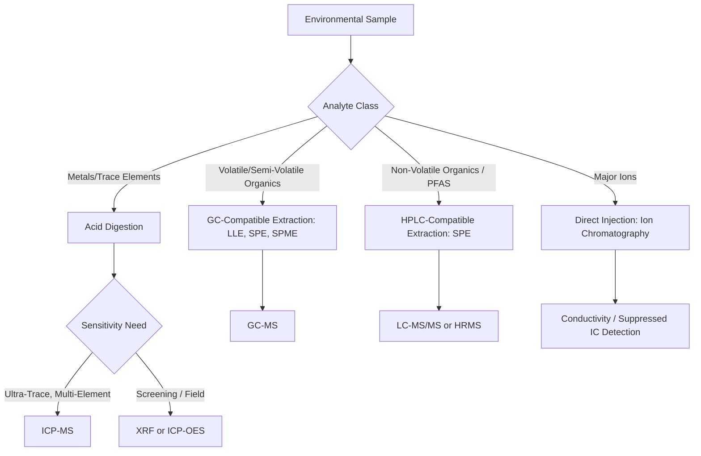

## Environmental Analytical Techniques

### Conceptual Framework

Environmental analytical chemistry provides the measurement foundation underlying every preceding topic in this chapter: fate and transport modeling, heavy metal speciation assessment, POP monitoring, and PFAS characterization all depend on accurate, reproducible analytical methods. This topic surveys the principal instrumental and methodological approaches used to detect, identify, and quantify environmental contaminants across air, water, soil, and biological matrices, along with the sampling and quality assurance frameworks that determine data reliability.

### Sampling Design and Quality Assurance Fundamentals

**Key Points**

- **Representative sampling**: Sample location, timing, depth, and frequency must be designed to reflect the population or medium being characterized, not merely convenience of access; poor sampling design can invalidate even highly accurate analytical results
- **Chain of custody**: Documented tracking of sample handling from collection through analysis, essential for legal defensibility in regulatory and enforcement contexts
- **Field blanks, trip blanks, and equipment blanks**: Quality control samples designed to detect contamination introduced during sampling, transport, or equipment cleaning, distinct from contamination present in the actual environmental medium
- **Method detection limit (MDL) and reporting limit**: The MDL is the statistically-derived minimum concentration a method can distinguish from zero with defined confidence; the reporting limit (often set above the MDL) is the concentration above which results are reported with quantitative confidence
- **Precision and accuracy**: Precision (reproducibility, often assessed via duplicate samples) and accuracy (closeness to true value, assessed via spiked samples/certified reference materials) are distinct quality metrics both required for defensible data

### Sample Preparation Techniques

Prior to instrumental analysis, most environmental samples require preparation to isolate and concentrate target analytes while removing matrix interferences:

- **Liquid-liquid extraction (LLE)**: Partitioning analytes between two immiscible liquid phases (e.g., water and an organic solvent), exploiting differential solubility — directly connected to the $K_{ow}$ partitioning concepts established in the fate and transport topic
- **Solid-phase extraction (SPE)**: Passing a liquid sample through a solid sorbent material that selectively retains target analytes, which are subsequently eluted with a small volume of solvent, achieving analyte concentration and cleanup simultaneously
- **Soxhlet extraction**: Continuous solvent extraction of solid samples (soil, sediment, biological tissue) using refluxing solvent, a traditional method for semi-volatile organic compound extraction, increasingly supplemented or replaced by faster techniques
- **Accelerated solvent extraction (ASE) / pressurized liquid extraction**: Uses elevated temperature and pressure to accelerate solvent extraction of solid matrices, reducing solvent volume and extraction time relative to Soxhlet methods
- **Solid-phase microextraction (SPME)**: A solvent-free technique using a coated fiber to adsorb analytes directly from a sample or its headspace, particularly suited to volatile and semi-volatile organic compound analysis
- **Acid digestion**: Required for total metals analysis, using strong acid (often nitric acid, sometimes combined with hydrochloric or hydrofluoric acid) to dissolve the sample matrix and release metals into solution for subsequent instrumental analysis

### Chromatographic Separation Techniques

**Gas Chromatography (GC)**

Separates volatile and semi-volatile compounds based on differential partitioning between a mobile gas phase and a stationary phase coating a capillary column, with separation driven primarily by boiling point and polarity interactions. GC is the standard separation technique for classical organochlorine pesticides, PCBs, dioxins/furans, and volatile organic compounds (VOCs), connecting directly to the POPs analytical methods discussed previously.

**High-Performance Liquid Chromatography (HPLC)**

Separates compounds dissolved in a liquid mobile phase as they pass through a column packed with stationary phase material, suited to analytes that are non-volatile, thermally labile, or otherwise unsuited to GC's high-temperature vaporization requirement. HPLC (particularly its high-resolution variant, UHPLC) is the standard front-end separation technique for PFAS analysis, given these compounds' typically low volatility.

**Ion Chromatography (IC)**

A specialized liquid chromatography variant optimized for separation of inorganic ions (e.g., chloride, sulfate, nitrate, phosphate), widely used in water quality analysis for major anions and cations.

### Mass Spectrometric Detection

Mass spectrometry (MS), typically coupled to a chromatographic separation technique, provides both compound identification (via characteristic fragmentation patterns) and highly sensitive quantification:

- **GC-MS**: The standard configuration for classical persistent organic pollutant analysis, exploiting these compounds' volatility and thermal stability
- **LC-MS/MS (tandem mass spectrometry)**: The standard configuration for PFAS and many pharmaceutical/personal care product contaminants, providing the sensitivity and selectivity needed to quantify compounds at part-per-trillion concentrations in complex environmental matrices
- **High-resolution mass spectrometry (HRMS)**: Instruments (e.g., time-of-flight, Orbitrap) providing sufficient mass accuracy to support non-targeted analysis — identifying and tentatively characterizing compounds not included in a pre-selected target list, an approach of growing importance for characterizing the full range of PFAS and other emerging contaminants beyond routinely monitored compounds
- **Inductively Coupled Plasma Mass Spectrometry (ICP-MS)**: The standard technique for trace metal quantification, using a high-temperature argon plasma to ionize sample constituents prior to mass-based separation and detection, capable of simultaneous multi-element analysis at part-per-trillion sensitivity for many elements

### Atomic Spectroscopy for Metals Analysis

**Atomic Absorption Spectroscopy (AAS)**

Measures absorption of element-specific wavelength light by ground-state atoms produced via flame or graphite furnace atomization; graphite furnace AAS (GFAAS) provides substantially greater sensitivity than flame AAS, suited to trace metal quantification in environmental samples.

**Inductively Coupled Plasma - Optical Emission Spectroscopy (ICP-OES)**

Measures characteristic light emission from plasma-excited atoms, providing simultaneous multi-element analysis with generally lower sensitivity than ICP-MS but often sufficient for many regulatory applications and at lower instrumentation cost.

**X-ray Fluorescence (XRF)**

Measures characteristic X-ray emission following sample excitation, notable for enabling non-destructive analysis and field-portable instrumentation, widely used for rapid screening of metal contamination in soil (e.g., lead paint or contaminated site screening) though generally with higher detection limits than laboratory-based ICP methods.

### Analytical Technique Selection Pathway

### Spectroscopic Techniques for Water Quality Parameters

- **UV-Visible spectrophotometry**: Widely used for colorimetric water quality parameters (e.g., nitrate, phosphate, ammonia via specific reagent-based color development reactions), forming the basis of many standard water quality test kit and laboratory methods
- **Fluorescence spectroscopy**: Applied to dissolved organic matter characterization and certain trace organic contaminant screening, exploiting compound-specific fluorescence emission properties
- **Infrared (IR) spectroscopy**: Used for functional group identification in organic compound characterization and for specific applications such as total petroleum hydrocarbon quantification in some regulatory methods

### Biological and Immunoassay Screening Methods

**Enzyme-Linked Immunosorbent Assay (ELISA)**

Antibody-based screening methods providing rapid, relatively low-cost detection of specific target compounds or compound classes (e.g., certain pesticides, some PFAS), typically used for field screening or high-throughput preliminary assessment rather than definitive regulatory quantification, given generally lower specificity and higher potential for cross-reactivity relative to instrumental methods.

**Bioassays and biomarker-based methods**

In vitro receptor binding and reporter gene assays (discussed under endocrine disrupting chemicals) provide a complementary screening approach assessing biological activity directly, capturing the aggregate effect of complex mixtures rather than requiring pre-identification of specific target compounds — a distinct analytical philosophy from targeted instrumental chemical analysis.

### Field and Continuous Monitoring Technologies

**Key Points**

- **Portable/field-deployable instruments**: Field GC-MS, portable XRF, and handheld water quality meters (pH, dissolved oxygen, conductivity, turbidity probes) enable real-time or near-real-time screening, valuable for site characterization and emergency response despite generally reduced sensitivity/specificity relative to laboratory methods
- **Passive sampling devices**: Time-integrated sampling methods (e.g., polyethylene passive samplers for organic contaminants, diffusive gradients in thin films for metals) that accumulate contaminants over a deployment period, providing time-weighted average concentration data particularly valuable for characterizing episodic or low-concentration exposure that discrete grab sampling might miss
- **Continuous emissions monitoring systems (CEMS)**: Required under many air quality regulatory programs for large stationary sources, providing real-time measurement of specific pollutants (e.g., $SO_2$, $NO_x$, particulate matter surrogates) in stack emissions
- **Remote sensing and satellite-based monitoring**: Increasingly applied to atmospheric pollutant column measurement (e.g., satellite-based $NO_2$, $CH_4$, and aerosol monitoring) and surface water quality parameter estimation (e.g., chlorophyll-a as a eutrophication indicator), providing spatial coverage impossible to achieve through point-based sampling alone

### Quality Assurance/Quality Control (QA/QC) Framework

Rigorous environmental analysis requires a structured QA/QC program encompassing:

- **Calibration standards and calibration curves**: Establishing the quantitative relationship between instrument response and known analyte concentration, typically requiring demonstrated linearity across the relevant concentration range
- **Surrogate standards**: Compounds chemically similar to target analytes, added to samples prior to extraction to monitor extraction efficiency and method performance on a per-sample basis
- **Internal standards**: Compounds added immediately before instrumental analysis to correct for injection volume variability and instrument response drift, particularly standard practice in mass spectrometric methods (often using isotopically labeled analogs of target compounds)
- **Matrix spikes and matrix spike duplicates**: Samples spiked with known analyte concentrations to assess accuracy (percent recovery) and precision within the specific sample matrix being analyzed, since matrix effects can differ substantially between sample types
- **Certified reference materials (CRMs)**: Samples with independently verified analyte concentrations, used to validate overall method accuracy against an external, traceable standard

### Data Quality Objectives and Method Selection

Selection of an appropriate analytical method depends on the specific **data quality objective (DQO)** of the investigation — a formal planning framework (widely used in U.S. EPA-guided site investigations) that defines the required detection limit, acceptable precision/accuracy, and analyte list based on the decision the data will inform. [Inference] A common practical principle in environmental analytical chemistry is that method selection should be driven by the regulatory or risk-based threshold of concern relevant to the specific investigation, since applying an unnecessarily sensitive (and costly) method beyond what a decision requires represents inefficient resource allocation, while an insufficiently sensitive method risks failing to detect contamination at levels of genuine concern.

### Case Study: Analytical Evolution in PFAS Detection

The analytical trajectory of PFAS measurement illustrates several principles discussed throughout this topic: early PFAS detection relied on adapting existing LC-MS/MS methods developed for pharmaceutical residue analysis, initially targeting only a small number of well-known compounds (PFOA, PFOS). As regulatory and scientific attention expanded to the broader PFAS class, targeted method lists grew to encompass dozens of specific compounds (as reflected in expanded drinking water monitoring requirements), while parallel development of Total Organic Fluorine (TOF) and non-targeted high-resolution mass spectrometry approaches emerged specifically to address the acknowledged limitation that targeted analysis alone cannot characterize the full universe of thousands of structurally distinct PFAS compounds — directly connecting to the analytical challenges discussed under the PFAS topic.

### Common Misconceptions

**Key Points**

- A "non-detect" result does not necessarily mean an analyte is absent; it means the analyte was not detected above the specific method's detection or reporting limit, which varies by method and matrix
- Field screening methods (ELISA, portable XRF, field GC) are appropriately used for preliminary characterization and decision support, but generally should not be treated as equivalent in accuracy or legal defensibility to standard laboratory-validated methods for final regulatory compliance determinations
- Higher analytical sensitivity is not universally "better" from a data quality perspective; method selection should match the data quality objective of the specific investigation, since unnecessarily low detection limits can complicate data interpretation and increase cost without improving decision-relevant information

### Conclusion

Environmental analytical techniques provide the empirical foundation for every contaminant class and process discussed throughout this chapter, from metal speciation to POP and PFAS quantification. Sound environmental chemistry practice requires matching sampling design, extraction technique, and instrumental method to the specific analyte class and data quality objective at hand, supported by a rigorous QA/QC framework ensuring that reported results are both accurate and defensible for their intended regulatory, scientific, or risk assessment application.

**Related Topics**

- Heavy metals and toxic elements (ICP-MS, AAS applications)
- Persistent Organic Pollutants and PFAS (GC-MS, LC-MS/MS applications)
- Fate and transport of pollutants (partition coefficient measurement methods)
- Water quality monitoring and regulatory standards
- Risk assessment methodology and data quality objectives
- Remote sensing applications in environmental monitoring
- Quality assurance project plans (QAPPs) in environmental site investigation