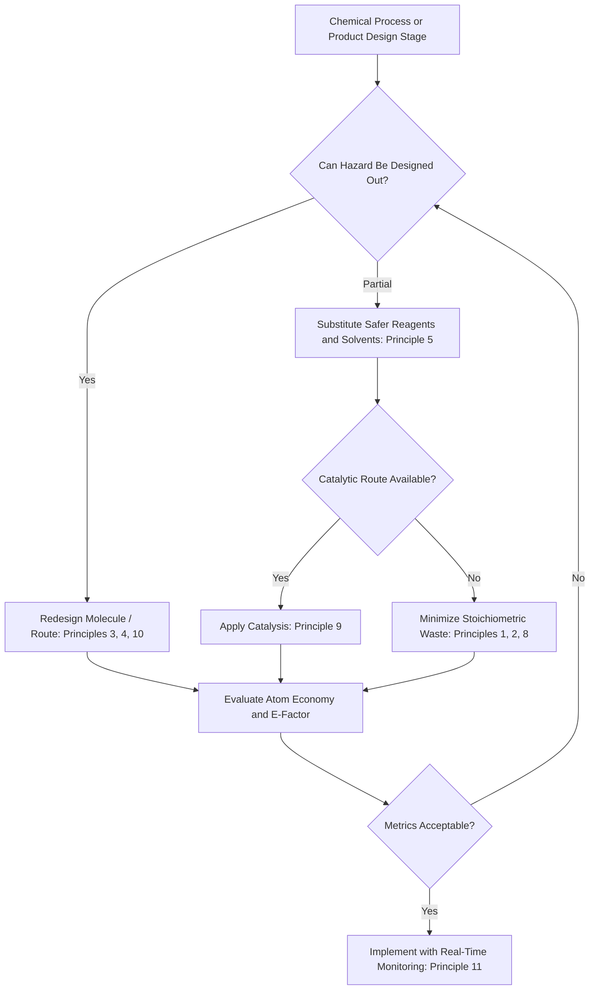

## Principles of Green Chemistry

### Definitions and Conceptual Framework

**Green chemistry** is the design of chemical products and processes that reduce or eliminate the use and generation of hazardous substances, as formalized by Paul Anastas and John Warner in their widely cited **Twelve Principles of Green Chemistry** (1998). Green chemistry is distinguished conceptually from environmental remediation and pollution control (the reactive, end-of-pipe approaches implicit in much of this chapter's preceding material on fate, transport, and contaminant treatment): rather than managing pollutants after they are generated, green chemistry aims to prevent hazardous substances from being produced or used in the first place, operating at the molecular design and process engineering stage.

This distinction reflects a broader hierarchy of environmental management preference — prevention over control, control over remediation — that recurs across environmental science disciplines (paralleling, for instance, the "avoid, reduce, reverse" hierarchy discussed under sustainable land management).

### The Twelve Principles of Green Chemistry

**Key Points**

1. **Prevention**: It is better to prevent waste than to treat or clean up waste after it is formed
2. **Atom economy**: Synthetic methods should maximize incorporation of all materials used in the process into the final product, minimizing wasted starting material
3. **Less hazardous chemical syntheses**: Design synthetic methods to use and generate substances with little or no toxicity to human health and the environment
4. **Designing safer chemicals**: Design chemical products to affect their desired function while minimizing toxicity
5. **Safer solvents and auxiliaries**: Minimize use of auxiliary substances (solvents, separation agents) and make them as innocuous as possible when used
6. **Design for energy efficiency**: Recognize energy requirements' environmental and economic impacts; minimize energy use, conducting synthesis at ambient temperature and pressure where feasible
7. **Use of renewable feedstocks**: Prefer renewable raw materials over depleting ones, where technically and economically practicable
8. **Reduce derivatives**: Minimize unnecessary derivatization (blocking groups, protection/deprotection) which requires additional reagents and generates waste
9. **Catalysis**: Prefer catalytic reagents (as selective as possible) over stoichiometric reagents
10. **Design for degradation**: Design chemical products to break down into innocuous degradation products at the end of their function, avoiding environmental persistence
11. **Real-time analysis for pollution prevention**: Develop analytical methodologies enabling real-time, in-process monitoring and control prior to formation of hazardous substances
12. **Inherently safer chemistry for accident prevention**: Choose substances and forms used in a process to minimize potential for chemical accidents, including releases, explosions, and fires

### Atom Economy: A Quantitative Green Chemistry Metric

**Atom economy** provides a quantitative measure of principle 2, calculated as:

$$\text{Atom Economy} = \frac{\text{Molecular weight of desired product}}{\text{Sum of molecular weights of all reactants}} \times 100\%$$

This metric differs fundamentally from traditional **percent yield**, which measures how much of the theoretically possible product was actually obtained but says nothing about how much of the starting material mass ends up as waste byproduct rather than product. A reaction can have high percent yield while still exhibiting poor atom economy if the reaction stoichiometry inherently generates substantial byproduct mass — meaning atom economy provides a complementary rather than redundant assessment of synthetic efficiency.

### Distinguishing Related Sustainability Metrics

**Key Points**

- **E-factor (Environmental factor)**: Calculated as the mass ratio of total waste to desired product ($E = \text{mass waste}/\text{mass product}$); unlike atom economy (a theoretical, reaction-stoichiometry-based metric), E-factor is empirically measured from actual process data and includes solvents, workup materials, and other process-related waste beyond the core reaction stoichiometry
- **Process Mass Intensity (PMI)**: Total mass of materials used in a process divided by mass of product obtained, providing a comprehensive process-level (rather than purely reaction-level) sustainability metric increasingly used in pharmaceutical and fine chemical industry green chemistry assessment
- **Life Cycle Assessment (LCA)**: A broader analytical framework (addressed more fully in a dedicated LCA topic where present in the curriculum) evaluating environmental impacts across a product's entire life cycle from raw material extraction through disposal, of which green chemistry principles inform specific life-cycle stages (particularly the manufacturing/synthesis stage) rather than constituting a complete LCA in themselves

### Catalysis as a Green Chemistry Strategy

Catalysts enable reactions to proceed via lower-energy pathways without being consumed in the overall reaction, connecting directly to the kinetics and thermodynamics principles established in the chemical fundamentals topic (recall that thermodynamic favorability does not guarantee reaction rate, and catalysis addresses precisely this kinetic barrier). Green chemistry particularly emphasizes:

- **Heterogeneous catalysis**: Solid-phase catalysts (e.g., zeolites, supported metal catalysts) offering the practical advantage of straightforward separation and reuse, reducing both waste generation and reagent consumption relative to stoichiometric or homogeneous catalytic approaches
- **Biocatalysis**: Use of enzymes or whole-cell microbial systems to catalyze transformations, often achieving high selectivity under mild aqueous conditions (connecting to the enzymatic catalysis concepts discussed under environmental kinetics), avoiding the harsh reaction conditions and toxic reagents sometimes required by conventional synthetic routes
- **Asymmetric catalysis**: Catalysts producing a single desired stereoisomer rather than a racemic mixture, of particular relevance to pharmaceutical synthesis where only one stereoisomer may be biologically active, avoiding the waste and potential toxicity/environmental burden of an unwanted, non-functional stereoisomer byproduct

### Green Solvent Selection

**Key Points**

- **Water**: The theoretically ideal green solvent in terms of toxicity and cost, though its utility is constrained by solubility limitations for many organic reactants and products
- **Supercritical carbon dioxide ($scCO_2$)**: Exhibits liquid-like solvating properties above its critical point, is non-toxic and non-flammable, and can be readily removed from products by simple pressure reduction, though requires specialized high-pressure equipment
- **Ionic liquids**: Salts that are liquid at or near room temperature, generally exhibiting negligible vapor pressure (eliminating volatile organic compound emission concerns), though [Inference] the environmental persistence, toxicity, and biodegradability of specific ionic liquid formulations vary substantially by structure and remain an active area of assessment — "green" status should not be assumed uniformly across the ionic liquid class without compound-specific evaluation
- **Bio-based solvents**: Solvents derived from renewable feedstocks (e.g., ethyl lactate, 2-methyltetrahydrofuran derived from biomass), connecting to principle 7's renewable feedstock preference
- **Solvent-free reactions**: Where technically feasible, eliminating solvent entirely (e.g., via mechanochemical/ball-milling synthesis, or neat reaction conditions) represents the most direct application of principle 5

### Green Chemistry Decision Framework

### Industrial Applications and Case Examples

**Ibuprofen synthesis process redesign**

A frequently cited green chemistry case study: the original six-step commercial synthesis of ibuprofen generated substantial stoichiometric waste and achieved relatively low atom economy. A redesigned catalytic process (developed by BHC Company, recognized with a Presidential Green Chemistry Challenge Award) reduced the synthesis to three catalytic steps, substantially improving atom economy by recovering and recycling a key reagent (acetic anhydride byproduct) rather than discarding it as waste, illustrating principles 1, 2, and 9 in combination.

**Supercritical CO2 dry cleaning**

Development of $scCO_2$-based dry cleaning technology as an alternative to conventional perchloroethylene (a volatile, environmentally persistent chlorinated solvent with documented groundwater contamination concerns), illustrating direct application of green solvent selection principles to an established industrial process.

**Enzymatic and biocatalytic industrial processes**

Increasing industrial adoption of enzymatic catalysis for pharmaceutical intermediate synthesis and other fine chemical manufacturing, often achieving improved stereoselectivity and reduced hazardous reagent use relative to traditional synthetic routes, connecting the biocatalysis principle to practical manufacturing implementation.

### Green Chemistry Metrics Comparison

| Metric | What It Measures | Scope |
| --- | --- | --- |
| **Percent yield** | Actual vs. theoretical product obtained | Single reaction step |
| **Atom economy** | Theoretical mass efficiency from stoichiometry | Single reaction step, theoretical |
| **E-factor** | Actual mass ratio of waste to product | Empirical, process-level |
| **Process Mass Intensity** | Total material input per unit product | Full process, empirical |
| **Life Cycle Assessment** | Cumulative environmental impact | Entire product life cycle |

### Relationship to Regulatory and Policy Frameworks

Green chemistry principles inform, but are distinct from, regulatory hazard-reduction frameworks discussed elsewhere in this chapter (e.g., REACH, Stockholm Convention, PFAS regulation). While regulation typically operates reactively — restricting or banning substances after hazard identification — green chemistry aims to prevent hazardous substance design and use proactively at the research and development stage, before a substance reaches the point of requiring regulatory restriction. [Inference] Some environmental policy analysts argue that broader industrial adoption of green chemistry principles could reduce the frequency of "regrettable substitution" patterns (discussed under both PFAS and endocrine disrupting chemicals), since principle 4's explicit design-for-safety criterion addresses the underlying issue of structure-based rather than hazard-based chemical substitution — though the extent of green chemistry's practical influence on this pattern relative to regulatory and market forces remains a matter of ongoing discussion rather than settled consensus.

### Barriers to Green Chemistry Adoption

**Key Points**

- **Economic factors**: Redesigning established, capital-intensive industrial processes carries substantial upfront cost, even where a greener alternative exists and may offer long-term savings
- **Technical performance trade-offs**: Substitute solvents, catalysts, or synthetic routes must match the functional performance of established methods, which is not always readily achievable
- **Regulatory and validation requirements**: Particularly in pharmaceutical manufacturing, process changes require extensive regulatory revalidation, creating inertia favoring established (even if less green) synthetic routes
- **Information and training gaps**: Green chemistry principles require integration into chemistry education and industrial R&D practice, a gradual process relative to the pace of chemical innovation more broadly

### Common Misconceptions

**Key Points**

- Green chemistry is not synonymous with "natural" or "organic" (in the consumer product sense) chemistry; it is defined by hazard-reduction and waste-minimization design criteria applicable to any chemical process, synthetic or naturally derived
- High percent yield does not indicate a green process; a reaction can achieve near-quantitative yield while still exhibiting poor atom economy and generating substantial hazardous waste, since these are distinct metrics measuring different aspects of process efficiency
- Green chemistry is not limited to solvent substitution; the twelve principles span molecular design, synthetic route selection, energy use, feedstock sourcing, and accident prevention as a comprehensive framework, of which solvent choice is only one component

### Conclusion

Green chemistry provides a proactive, design-stage framework for reducing chemical hazard and waste generation, complementing the reactive fate-and-transport, remediation, and regulatory frameworks discussed throughout this chapter. Its twelve guiding principles and associated quantitative metrics (atom economy, E-factor, PMI) offer both a conceptual philosophy and practical toolkit for evaluating and redesigning chemical processes, with the ibuprofen synthesis and $scCO_2$ solvent cases illustrating successful translation of these principles into industrial practice.

**Related Topics**

- Chemical fundamentals for environmental systems (kinetics, catalysis, thermodynamics)
- Persistent Organic Pollutants and PFAS (design-for-degradation contrast)
- Endocrine Disrupting Chemicals (regrettable substitution parallels)
- Life Cycle Assessment methodology
- Industrial ecology and circular economy principles
- Renewable feedstock chemistry and biomass conversion
- Environmental analytical techniques (real-time process monitoring)