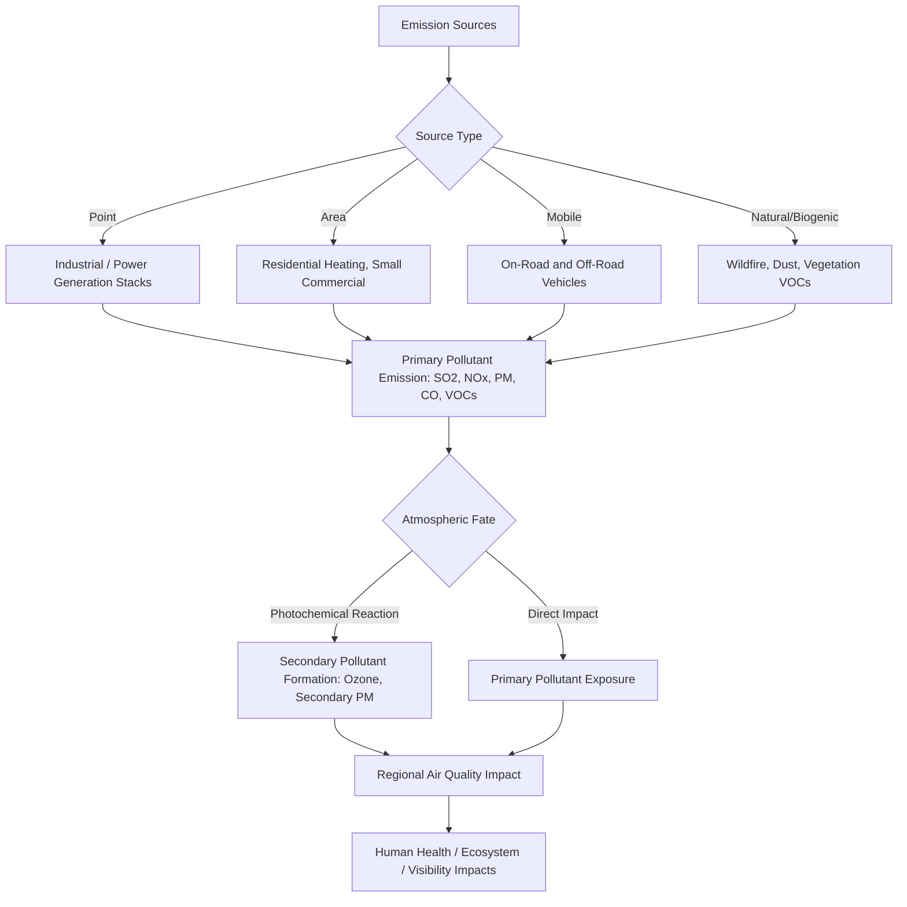

## Sources and Types of Air Pollution

### Definitions and Conceptual Framework

**Air pollution** refers to the presence of substances in ambient air, at concentrations sufficient to cause harm to human health, ecosystems, materials, or climate, arising from either natural or anthropogenic sources. This topic establishes the classification systems, source categories, and pollutant chemistry used throughout the Pollution and Waste Management chapter, building on the chemical fundamentals (atmospheric reactions, thermodynamics of oxidation), fate and transport principles (atmospheric dispersion, deposition), and specific contaminant chemistry (acid rain formation) already established in the Environmental Chemistry chapter.

### Primary vs. Secondary Pollutants

**Primary pollutants** are emitted directly from a source into the atmosphere in the chemical form in which they cause harm (e.g., carbon monoxide, sulfur dioxide, most particulate matter, and directly emitted volatile organic compounds).

**Secondary pollutants** are not directly emitted but form through atmospheric chemical reactions between primary pollutants and other atmospheric constituents, often driven by sunlight (photochemistry). Ground-level ozone and much of fine particulate matter (secondary aerosol) are the most significant secondary pollutants from a regulatory and health perspective. This distinction is important because controlling secondary pollutant concentrations requires controlling precursor emissions rather than the secondary pollutant itself, often complicating regulatory strategy relative to primary pollutant control.

### Source Classification: Point, Area, Mobile, and Natural/Biogenic

**Key Points**

- **Point sources**: Identifiable, stationary emission sources with a discrete location (e.g., power plant stacks, industrial facility exhausts), typically subject to individual permitting requirements under air quality regulatory frameworks
- **Area sources**: Aggregations of numerous small, individually minor emission sources distributed across a geographic area (e.g., residential heating, small commercial operations, dry cleaners), regulated collectively rather than through individual permits given the impracticality of source-by-source permitting at this scale
- **Mobile sources**: On-road vehicles (cars, trucks, buses) and off-road/non-road sources (aircraft, marine vessels, construction and agricultural equipment, locomotives), regulated primarily through vehicle/engine emission standards rather than facility-based permitting
- **Natural and biogenic sources**: Wildfires, volcanic emissions, windblown dust, sea spray aerosol, and biogenic volatile organic compound emissions from vegetation (e.g., isoprene, terpenes), which contribute to ambient pollutant loading independent of human activity and complicate attribution of measured air quality to anthropogenic versus natural causes in specific locations and time periods

### Criteria Air Pollutants

The U.S. Clean Air Act framework (and broadly analogous frameworks internationally) designates specific "criteria pollutants" subject to health-based National Ambient Air Quality Standards, given their widespread occurrence and well-documented health/environmental effects:

**Particulate Matter (PM)**

Classified by aerodynamic diameter: $PM_{10}$ (particles ≤10 micrometers) and $PM_{2.5}$ (particles ≤2.5 micrometers, "fine particulate matter"). $PM_{2.5}$ penetrates more deeply into the respiratory tract and is generally associated with more significant health effects per unit mass than coarser particles, given its capacity to reach the alveolar region of the lungs and, for the smallest size fractions, potentially translocate into systemic circulation. Sources span combustion (vehicle exhaust, power generation, wildfire smoke), secondary formation from gaseous precursors, and mechanical processes (construction, unpaved roads, agricultural operations).

**Ground-level Ozone ($O_3$)**

A secondary pollutant formed through photochemical reactions between nitrogen oxides ($NO_x$) and volatile organic compounds (VOCs) in the presence of sunlight, discussed in detail under the photochemical smog mechanism below. Distinct from stratospheric ozone (which provides beneficial UV shielding), ground-level ozone is a respiratory irritant and phytotoxic to vegetation.

**Carbon Monoxide (CO)**

A colorless, odorless gas produced by incomplete combustion, primarily from mobile sources and residential/commercial fuel combustion; binds preferentially to hemoglobin (forming carboxyhemoglobin), reducing the blood's oxygen-carrying capacity.

**Sulfur Dioxide ($SO_2$)**

Produced primarily from combustion of sulfur-containing fossil fuels (particularly coal and certain fuel oils) and specific industrial processes (metal smelting); the key precursor to sulfate secondary aerosol and acid rain formation as detailed in the chemical fundamentals topic.

**Nitrogen Oxides ($NO_x$, comprising primarily NO and $NO_2$)**

Formed during high-temperature combustion through two principal mechanisms: **thermal $NO_x$** (oxidation of atmospheric nitrogen at high combustion temperatures) and **fuel $NO_x$** (oxidation of nitrogen compounds present within the fuel itself). $NO_x$ serves as a critical precursor to both ground-level ozone and nitrate secondary aerosol, in addition to contributing to acid rain formation.

**Lead (Pb)**

Historically a criteria pollutant primarily from leaded gasoline combustion; current emissions in most jurisdictions with leaded gasoline phase-outs derive predominantly from specific industrial sources (metal processing, certain aircraft fuel use in piston-engine aviation), connecting to the heavy metals topic discussed in the Environmental Chemistry chapter.

### Photochemical Smog Formation Mechanism

Ground-level ozone and photochemical smog formation proceed through a well-characterized (though kinetically complex) reaction sequence:

$$NO_2 + h\nu \rightarrow NO + O$$

$$O + O_2 \rightarrow O_3$$

$$O_3 + NO \rightarrow NO_2 + O_2$$

In the absence of other reactants, this cycle reaches a photostationary equilibrium without net ozone accumulation. However, reactive volatile organic compounds, when oxidized, generate peroxy radicals capable of converting NO to $NO_2$ without consuming ozone, disrupting the equilibrium and permitting net ozone accumulation:

$$RO_2 + NO \rightarrow RO + NO_2$$

This VOC-mediated pathway explains why ground-level ozone formation is fundamentally a joint function of both $NO_x$ and VOC emissions, and why ozone control strategies must consider the relative abundance of each precursor class in a given airshed — a phenomenon captured in the concept of **$NO_x$-limited** versus **VOC-limited** ozone formation regimes, which can differ by location and time of day, complicating uniform regulatory precursor control strategy design.

### Hazardous Air Pollutants (Air Toxics)

Beyond the criteria pollutants, regulatory frameworks (e.g., the U.S. Clean Air Act's list of Hazardous Air Pollutants, HAPs) address a broader category of toxic air contaminants, including:

- Volatile organic compounds with specific toxicity concerns (benzene, formaldehyde, various chlorinated solvents)
- Trace metals (mercury, arsenic, cadmium, chromium) — connecting directly to the heavy metals topic, with air emission representing one of several transport pathways for metals subsequently deposited to soil and water
- Dioxins and furans, formed as unintentional combustion byproducts, connecting to the POPs topic

### Air Pollution Source-to-Impact Pathway

### Indoor Air Pollution

**Key Points**

- **Combustion sources**: Solid fuel cooking and heating (biomass, coal) remains a globally significant indoor air pollution source, particularly in regions with limited access to cleaner cooking fuels, associated with substantial fine particulate matter and carbon monoxide exposure in affected households
- **Building material off-gassing**: Formaldehyde and other VOCs from certain construction materials, furnishings, and adhesives
- **Radon**: A naturally occurring radioactive gas from uranium decay in soil and rock, capable of accumulating in enclosed spaces (particularly basements) and representing a well-documented lung cancer risk factor, illustrating that indoor air pollution sources are not exclusively anthropogenic
- **Secondhand tobacco smoke**: A well-established indoor particulate and VOC source with documented health effects on non-smoking occupants
- [Inference] Indoor air quality is frequently under-addressed relative to ambient (outdoor) air quality in general environmental science curricula, despite substantial evidence that many individuals spend the majority of their time in indoor environments, making indoor exposure a significant, though methodologically distinct, component of total pollutant exposure assessment

### Regional and Global-Scale Air Pollution Phenomena

**Urban smog and temperature inversions**

Atmospheric temperature inversions (where a warm air layer traps cooler air, and associated pollutants, near the surface) can substantially elevate ground-level pollutant concentrations by suppressing normal vertical atmospheric mixing, a mechanism historically associated with severe urban air pollution episodes.

**Transboundary and long-range transport**

Air pollutants, particularly fine particulate matter and ozone precursors, can be transported substantial distances across political boundaries, complicating single-jurisdiction regulatory approaches and requiring international or regional cooperative frameworks in some documented cases (e.g., transboundary haze events associated with agricultural burning in parts of Southeast Asia, and historically significant transboundary acid deposition disputes in North America and Europe that informed early international air pollution treaties).

**Wildfire smoke as an increasingly significant source category**

[Unverified] The relative contribution of wildfire smoke to regional and even continental-scale particulate matter concentrations has been the subject of increasing scientific and regulatory attention in recent years; specific current-year statistics on wildfire's contribution to regional air quality trends should be verified against current monitoring data given significant year-to-year variability driven by fire season severity.

### Emission Inventory Methodology

Air quality management relies on **emission inventories** — systematic accounting of pollutant emissions by source category, geographic area, and time period — developed through a combination of:

- **Direct emission measurement**: Continuous emissions monitoring at major point sources (connecting to the CEMS technology discussed in the analytical techniques topic)
- **Emission factors**: Standardized ratios relating activity level (e.g., fuel combusted, vehicle miles traveled, industrial production volume) to expected emissions, applied where direct measurement is impractical (particularly for area and mobile sources)
- **Activity data**: Statistical data on the scale of emission-generating activities (fuel sales, traffic counts, industrial output) used in conjunction with emission factors to estimate aggregate emissions

### Case Study: The 1952 London Smog Event

A historically significant air pollution episode in which a temperature inversion trapped coal-combustion-derived sulfur dioxide and particulate matter over London for several days, producing a severe, sustained air quality degradation associated with a substantial and well-documented spike in mortality over the following weeks. This event is widely credited as a primary catalyst for subsequent UK Clean Air Act legislation and remains a foundational case study illustrating both the acute health impact potential of severe air pollution episodes and the specific mechanistic role of meteorological conditions (temperature inversion) in concentrating ground-level pollutant exposure.

### Common Misconceptions

**Key Points**

- Reducing a single precursor pollutant does not guarantee proportional reduction in secondary pollutant concentrations; ozone formation chemistry in particular can respond non-linearly (and in some $NO_x$-limited vs. VOC-limited regimes, counter-intuitively) to precursor emission changes, meaning effective control strategy requires airshed-specific chemical understanding rather than uniform assumptions
- Air pollution is not exclusively an outdoor, industrial-source phenomenon; indoor air pollution from combustion, building materials, and radon represents a substantial and distinct exposure pathway requiring separate assessment approaches
- Natural sources (wildfire, dust, biogenic VOCs) are not negligible relative to anthropogenic sources in all contexts; accurately attributing measured air quality to specific source categories requires source apportionment analysis rather than assuming anthropogenic dominance by default

### Conclusion

Air pollution encompasses a diverse set of primary and secondary pollutants arising from point, area, mobile, and natural source categories, with photochemical secondary pollutant formation (particularly ground-level ozone) introducing atmospheric chemistry complexity beyond simple source-to-concentration relationships. This foundational source and pollutant classification framework underlies subsequent topics addressing air quality management strategies, regulatory standards, and specific pollution control technologies within this chapter.

**Related Topics**

- Acid rain chemistry and ecosystem impacts (Environmental Chemistry chapter)
- Air quality management and control technologies
- Climate change and greenhouse gas emissions
- Heavy metals and toxic elements (air deposition pathway)
- Persistent Organic Pollutants (combustion byproduct formation)
- Environmental analytical techniques (continuous emissions monitoring, remote sensing)
- Indoor air quality and building science