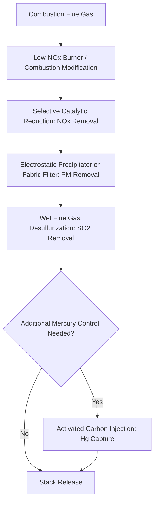

## Air Pollution Control Technologies

### Conceptual Framework

Air pollution control technologies address the emission sources and pollutant classes established in the preceding topic, applying engineering controls at three general intervention points: **pre-combustion/pre-process** (fuel or feedstock modification before pollutant formation), **in-process/combustion modification** (altering the reaction conditions during pollutant formation), and **post-combustion/end-of-pipe** (capturing or converting pollutants after formation but before atmospheric release). This intervention hierarchy parallels the prevention-over-control principle established under green chemistry, applied specifically to air emission management.

### Particulate Matter Control Technologies

**Key Points**

- **Cyclone separators**: Use centrifugal force (induced by tangential gas flow entry into a conical chamber) to separate larger particles from a gas stream; effective for coarse particles but generally poor at capturing fine ($PM_{2.5}$) particulate matter, often used as a pre-treatment stage ahead of higher-efficiency devices
- **Electrostatic precipitators (ESPs)**: Impart electrical charge to particles via a high-voltage discharge electrode, then collect the charged particles on oppositely charged collection plates; capable of high removal efficiency (often exceeding 99% by mass) across a wide particle size range, standard at large coal-fired power plants and many industrial combustion sources
- **Fabric filters (baghouses)**: Force particle-laden gas through fabric filter media, physically capturing particles as a filter cake builds on the fabric surface; generally achieve very high removal efficiency including for fine particulate matter, though associated with greater pressure drop (energy cost) than ESPs and requiring periodic filter cleaning/replacement
- **Wet scrubbers (for particulates)**: Use liquid droplets to capture particles via impaction and diffusion mechanisms; particularly effective for larger particles and can be combined with gas-phase pollutant absorption in a single unit

### Sulfur Dioxide Control: Flue Gas Desulfurization

**Wet scrubbing (limestone/lime slurry)**

The dominant $SO_2$ control technology at large combustion sources, using an alkaline sorbent slurry (typically limestone, $CaCO_3$) to react with and neutralize $SO_2$:

$$CaCO_3 + SO_2 \rightarrow CaSO_3 + CO_2$$

Subsequent oxidation (often intentionally forced) converts calcium sulfite to calcium sulfate (gypsum), which in many modern facilities is recovered as a marketable byproduct for wallboard manufacturing rather than disposed of as waste — an example of pollution control technology incorporating a resource recovery/circular economy element.

**Dry sorbent injection and spray dry absorption**

Alternative approaches injecting dry or semi-dry alkaline sorbent (e.g., hydrated lime) directly into the flue gas stream, generally suited to smaller sources or situations where wet scrubbing's capital cost and wastewater generation are less favorable, typically achieving somewhat lower removal efficiency than wet scrubbing systems.

**Pre-combustion sulfur reduction**

Fuel switching to lower-sulfur coal or fuel oil, and coal cleaning/washing processes that physically remove pyritic sulfur before combustion, represent pre-combustion alternatives (or complements) to post-combustion flue gas desulfurization.

### Nitrogen Oxide Control Technologies

**Combustion modification (in-process controls)**

- **Low-$NO_x$ burners**: Redesign combustion air/fuel mixing and staging to reduce peak flame temperature and localized oxygen availability, directly targeting the thermal $NO_x$ formation mechanism established in the previous topic
- **Flue gas recirculation**: Redirects a portion of cooler flue gas back into the combustion zone, reducing peak flame temperature and thus thermal $NO_x$ formation
- **Staged combustion**: Deliberately creates fuel-rich and fuel-lean combustion zones in sequence, reducing both thermal and fuel $NO_x$ formation pathways relative to single-stage combustion

**Post-combustion controls**

**Selective Catalytic Reduction (SCR)**

Injects ammonia or urea into the flue gas upstream of a catalyst bed, promoting the reaction:

$$4NO + 4NH_3 + O_2 \xrightarrow{\text{catalyst}} 4N_2 + 6H_2O$$

SCR typically achieves high $NO_x$ removal efficiency (often 80-90%+) and is standard at many large power plants and industrial sources, though the catalyst (commonly vanadium/titanium-based) requires operation within a specific temperature window and can be susceptible to poisoning by certain flue gas constituents.

**Selective Non-Catalytic Reduction (SNCR)**

Injects ammonia or urea directly into a higher-temperature combustion zone without a catalyst, achieving the same fundamental reduction reaction but generally with lower removal efficiency than SCR, representing a lower-capital-cost alternative suited to sources where SCR's efficiency is not required or economically justified.

### Volatile Organic Compound and Air Toxics Control

**Key Points**

- **Thermal oxidation (incineration)**: Combusts VOC-laden exhaust streams at sufficiently high temperature and residence time to achieve near-complete oxidation to $CO_2$ and water; **regenerative thermal oxidizers (RTOs)** improve energy efficiency by recovering heat from treated exhaust to preheat incoming untreated gas
- **Catalytic oxidation**: Achieves VOC destruction at substantially lower temperature than thermal oxidation by employing a catalyst, reducing fuel/energy requirements though introducing catalyst cost and potential poisoning susceptibility
- **Activated carbon adsorption**: Captures VOCs on porous activated carbon media, suited to lower-concentration streams and applications where solvent recovery (via subsequent desorption) is economically valuable
- **Biofiltration**: Passes VOC-laden air through a biologically active filter medium (compost, wood chips, or specialized packing material colonized by degrading microorganisms), achieving VOC destruction through biodegradation; generally suited to lower-concentration, more readily biodegradable VOC streams and offers lower energy input than thermal methods

### Multi-Pollutant Control Technology: Combined Systems

Many modern facilities integrate control technologies to address multiple pollutant classes simultaneously:

This sequencing reflects both the temperature sensitivity of specific technologies (SCR catalysts require a specific temperature window typically found earlier in the flue gas train, before significant cooling) and the interactive effects between control stages (e.g., activated carbon injection for mercury capture is often integrated immediately upstream of particulate control, since the carbon-mercury complex must itself be captured as a particulate).

### Mercury-Specific Control Technologies

**Activated carbon injection (ACI)**

Injects powdered activated carbon (sometimes chemically treated/brominated to enhance mercury capture) into the flue gas stream upstream of particulate control equipment, allowing subsequent capture of the mercury-laden carbon along with fly ash. This technology connects directly to the redox and speciation principles established under heavy metals: elemental mercury vapor is generally more difficult to capture than oxidized mercury species, meaning co-benefit mercury capture can occur incidentally through SCR catalysts (which promote mercury oxidation) even when SCR is installed primarily for $NO_x$ control.

### Mobile Source Emission Control

**Catalytic converters**

Standard on gasoline-powered vehicles, employing a three-way catalyst (typically platinum, palladium, and rhodium) to simultaneously promote:

$$2CO + O_2 \rightarrow 2CO_2$$

$$\text{Hydrocarbons} + O_2 \rightarrow CO_2 + H_2O$$

$$2NO + 2CO \rightarrow N_2 + 2CO_2$$

Effective three-way catalyst operation requires precise air-fuel ratio control near stoichiometric conditions, achieved through electronic engine management and oxygen sensor feedback.

**Diesel emission controls**

- **Diesel particulate filters (DPFs)**: Physically trap particulate matter from diesel exhaust, periodically regenerated (burned off) to prevent excessive backpressure buildup
- **Selective catalytic reduction for diesel (urea-based SCR)**: Applies the same fundamental $NO_x$ reduction chemistry as stationary source SCR, using a urea-water solution ("diesel exhaust fluid") injected into the exhaust stream, now standard on many modern diesel vehicles and equipment to meet contemporary $NO_x$ emission standards

**Evaporative emission controls**

Capture fuel vapor (VOC) emissions from fuel systems and refueling operations via activated carbon canisters, preventing direct atmospheric release of evaporative hydrocarbon emissions independent of tailpipe combustion emissions.

### Vehicle Electrification as an Emission Control Strategy

[Inference] Battery electric vehicle adoption represents a fundamentally different control strategy category than the exhaust treatment technologies discussed above — eliminating tailpipe emissions entirely rather than treating them — though the net air quality and climate benefit depends substantially on the emissions profile of the electricity generation mix used for charging, meaning its effectiveness as an air pollution control strategy is regionally and temporally variable rather than uniformly applicable, and is more properly analyzed as an energy systems and climate policy question than a discrete air pollution control technology in the traditional sense.

### Regulatory Frameworks Driving Technology Deployment

- **New Source Performance Standards (NSPS)** and **Best Available Control Technology (BACT)** requirements under the U.S. Clean Air Act: Establish technology-forcing emission limits for new or substantially modified stationary sources, driving adoption of the control technologies discussed above
- **Maximum Achievable Control Technology (MACT) standards**: Apply specifically to hazardous air pollutant emissions, requiring control technology performance comparable to the best-performing similar sources already in operation
- **Vehicle emission standards** (e.g., U.S. EPA Tier standards, EU Euro standards): Progressively tightened numeric emission limits driving the mobile source control technology adoption sequence described above, from basic catalytic converters through increasingly sophisticated diesel aftertreatment systems

### Technology Selection Considerations

**Key Points**

- **Pollutant-specific targeting**: No single control technology addresses all pollutant classes simultaneously; effective facility-level air pollution control typically requires a combination of technologies as illustrated in the multi-pollutant control diagram above
- **Capital versus operating cost trade-offs**: Higher-efficiency technologies (SCR, fabric filters) generally carry higher capital and/or operating costs than lower-efficiency alternatives (SNCR, cyclones), requiring cost-effectiveness analysis against the specific regulatory removal efficiency requirement
- **Co-benefits and cross-pollutant interactions**: As illustrated by SCR's incidental mercury oxidation co-benefit, control technology selection can sometimes achieve multi-pollutant benefits beyond the primary design target, an increasingly important consideration in integrated air quality management planning
- **Waste stream generation**: End-of-pipe controls frequently transfer pollutants from air to another medium (e.g., fly ash and flue gas desulfurization gypsum/sludge requiring solid waste management) rather than achieving true destruction, connecting directly to the waste management topics elsewhere in this chapter and underscoring why source reduction (paralleling the green chemistry prevention principle) remains preferable to end-of-pipe control where feasible

### Case Study: U.S. Coal Power Plant Retrofit Trajectory

The historical trajectory of U.S. coal-fired power plant emission control retrofits illustrates the multi-pollutant control sequencing discussed above: facilities initially installed electrostatic precipitators primarily for particulate control (often for basic visible emission and nuisance reasons predating comprehensive health-based regulation), followed by wet flue gas desulfurization for $SO_2$ control (driven substantially by acid rain-focused regulatory programs), followed by SCR installation for $NO_x$ control (driven by ozone non-attainment and later multi-pollutant regulatory programs), with activated carbon injection for mercury control added at many facilities as a comparatively recent addition. [Unverified] The current extent of specific control technology deployment across the U.S. coal fleet continues to shift given ongoing plant retirements and regulatory developments, and should be verified against current EPA or industry data for precise current statistics.

### Common Misconceptions

**Key Points**

- End-of-pipe air pollution control does not eliminate the pollutant mass; it typically transfers the contaminant to a solid or liquid waste stream (fly ash, scrubber sludge, spent activated carbon) requiring separate management, rather than achieving true destruction in most cases except VOC oxidation technologies which do achieve genuine chemical conversion to less harmful products
- A single control technology installation does not address all regulated pollutants from a given source; comprehensive compliance typically requires a combination of technologies targeting different pollutant classes, as no universal "one size fits all" control device exists
- Vehicle electrification is not a pollution control technology in the same sense as exhaust treatment devices; it eliminates the tailpipe emission point entirely, shifting the relevant emissions question to the electricity generation source rather than removing pollutants from a combustion exhaust stream

### Conclusion

Air pollution control technologies span pre-combustion, in-process, and post-combustion intervention strategies targeting the specific pollutant classes and formation mechanisms established in the sources and types topic, with modern facilities typically integrating multiple technologies to achieve comprehensive multi-pollutant compliance. Understanding the mechanistic basis of each technology — physical separation, chemical conversion, or biological degradation — clarifies both their targeted effectiveness and their tendency to generate secondary waste streams requiring management under the broader waste management framework of this chapter.

**Related Topics**

- Sources and types of air pollution
- Heavy metals and toxic elements (mercury capture co-benefits)
- Green chemistry principles (prevention versus control hierarchy)
- Solid and hazardous waste management (control technology byproduct disposal)
- Vehicle emission standards and transportation policy
- Climate change mitigation and energy systems transition
- Regulatory frameworks: Clean Air Act, NSPS, and MACT standards