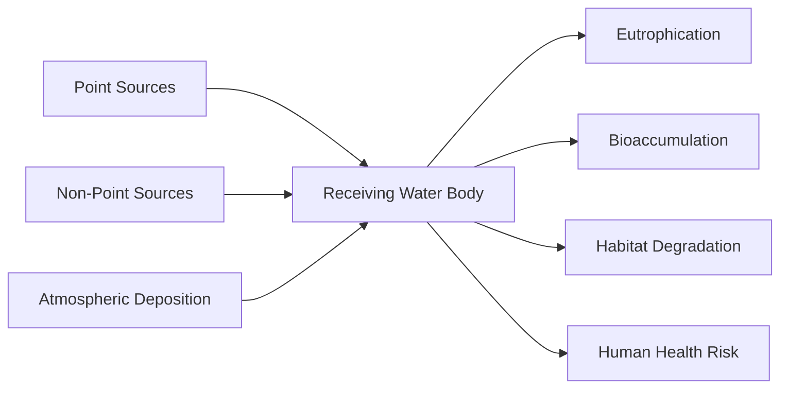

## Sources and Types of Water Pollution

### Definition and Scope

Water pollution refers to the contamination of water bodies—surface water (rivers, lakes, oceans) and groundwater—when pollutants are introduced directly or indirectly, degrading water quality and rendering it harmful to ecosystems, human health, or intended uses. Contamination is typically assessed relative to baseline or regulatory water quality standards (e.g., dissolved oxygen levels, pH, turbidity, contaminant concentrations).

### Classification by Source

#### Point Source Pollution

Point source pollution originates from a single, identifiable location where pollutants enter a water body.

- **Key Points**
  - Discharged through discrete conveyances: pipes, ditches, outfalls, or channels
  - Traceable to a specific origin, making it easier to regulate and monitor
  - Typically subject to permitting systems (e.g., the U.S. NPDES — National Pollutant Discharge Elimination System)
- **Common Examples**
  - Industrial effluent discharge pipes (chemical manufacturing, textile dyeing, paper mills)
  - Municipal wastewater treatment plant outfalls
  - Oil spills from tankers or pipelines
  - Combined sewer overflows (CSOs) during storm events

#### Non-Point Source Pollution

Non-point source (NPS) pollution arises from diffuse origins that are not traceable to a single discharge point, making it substantially harder to regulate.

- **Key Points**
  - Accumulates as water moves across land (runoff) or infiltrates soil
  - Aggregates contributions from many small, dispersed sources
  - Considered the leading cause of water quality impairment in many countries [Unverified — varies by region and monitoring methodology]
- **Common Examples**
  - Agricultural runoff carrying fertilizers, pesticides, and animal waste
  - Urban stormwater runoff (oil, road salt, litter, sediment)
  - Atmospheric deposition of pollutants (acid rain, airborne particulates settling into water)
  - Failing septic systems

### Classification by Type of Pollutant

#### Organic Pollutants

Biodegradable organic matter that depletes dissolved oxygen (DO) during microbial decomposition.

- **Sources**: sewage, food processing waste, agricultural runoff (manure)
- **Key Metric**: Biochemical Oxygen Demand (BOD) — the amount of oxygen microorganisms consume while breaking down organic matter over a fixed period (commonly 5 days, denoted $BOD_5$)
- **Effect**: oxygen depletion leads to hypoxic conditions, causing fish kills and disrupting aquatic food webs

#### Pathogenic Contamination

Disease-causing microorganisms introduced primarily through fecal contamination.

- **Sources**: untreated or inadequately treated sewage, livestock waste, wildlife
- **Key Organisms**: bacteria (*E. coli*, *Salmonella*, *Vibrio cholerae*), viruses (norovirus, hepatitis A), protozoa (*Giardia*, *Cryptosporidium*)
- **Indicator Metric**: fecal coliform / *E. coli* counts, used as a proxy for pathogen presence rather than direct pathogen testing

#### Nutrient Pollution (Eutrophication Drivers)

Excess nitrogen (N) and phosphorus (P) compounds that overstimulate aquatic plant and algal growth.

- **Sources**: agricultural fertilizers, animal feedlots, wastewater treatment discharge, detergents (historically, phosphate-based)
- **Mechanism**:
  1. Nutrient loading stimulates algal blooms
  2. Algal biomass dies and is decomposed by bacteria
  3. Decomposition consumes dissolved oxygen, producing hypoxic or anoxic "dead zones"
- **Example**: the seasonal hypoxic zone in the Gulf of Mexico, linked to nutrient loading from the Mississippi River watershed

#### Chemical/Toxic Pollutants

Synthetic or naturally occurring chemicals that are toxic even at low concentrations.

- **Heavy Metals**: mercury (Hg), lead (Pb), cadmium (Cd), arsenic (As) — sourced from mining, industrial discharge, and coal combustion byproducts; these bioaccumulate and biomagnify up the food chain
- **Pesticides and Herbicides**: organochlorines (e.g., DDT — largely banned but persistent), organophosphates, glyphosate-based products
- **Industrial Chemicals**: polychlorinated biphenyls (PCBs), per- and polyfluoroalkyl substances (PFAS, "forever chemicals" due to their resistance to environmental degradation)
- **Pharmaceuticals and Personal Care Products (PPCPs)**: antibiotics, hormones, and other compounds passing through wastewater treatment incompletely

#### Sediment Pollution

Excessive suspended solids that increase turbidity and disrupt aquatic habitats.

- **Sources**: construction sites, deforestation, agricultural tillage, streambank erosion
- **Effects**: reduces light penetration (impairing photosynthesis in submerged plants), smothers benthic habitats and fish spawning grounds, transports adsorbed pollutants (metals, pesticides bind to sediment particles)

#### Thermal Pollution

Artificial elevation of water temperature, most commonly from industrial cooling processes.

- **Sources**: power plant cooling water discharge, industrial processes
- **Mechanism**: warmer water holds less dissolved oxygen (an inverse relationship), while simultaneously increasing the metabolic oxygen demand of aquatic organisms — a compounding stress
- **Effect**: shifts species composition toward thermally tolerant organisms, can trigger fish kills during rapid discharge events

#### Plastic and Marine Debris

Persistent solid waste, particularly plastics, that accumulates in aquatic and marine environments.

- **Macroplastics**: bottles, bags, packaging — cause physical entanglement and ingestion hazards
- **Microplastics**: particles <5mm, arising from macroplastic degradation or primary sources like synthetic textile fibers and microbeads (historically in cosmetics)
- **Concern**: microplastics act as vectors for adsorbed toxic chemicals and are detected across virtually all aquatic environments studied to date [Unverified — detection extent depends on sampling methodology and region]

#### Radioactive Pollution

Contamination with radioactive isotopes.

- **Sources**: nuclear power plant discharge or accidents, uranium mining runoff, medical/industrial radioactive waste
- **Effect**: bioaccumulation of isotopes (e.g., cesium-137, strontium-90) in aquatic organisms, long-term ecological and health risks

### Comparative Summary Table

| Pollutant Type | Primary Source Category | Key Indicator/Metric | Primary Ecological Effect |
| --- | --- | --- | --- |
| Organic matter | Point (sewage) / Non-point (runoff) | $BOD_5$ | Oxygen depletion |
| Pathogens | Point / Non-point | Fecal coliform count | Waterborne disease |
| Nutrients (N, P) | Non-point (agriculture) | Total N, Total P | Eutrophication |
| Heavy metals | Point (industrial) | Concentration (mg/L) | Bioaccumulation, toxicity |
| Sediment | Non-point (erosion) | Turbidity (NTU) | Habitat smothering |
| Thermal | Point (power plants) | Temperature delta (Δ°C) | Reduced dissolved oxygen |
| Plastics | Non-point (diffuse) | Particle count/volume | Ingestion, chemical vector |

### Pollution Pathway Diagram (svg_diagram)

<svg xmlns="http://www.w3.org/2000/svg" viewBox="0 0 900 480">
<text x="450" y="30" font-size="20" font-weight="bold" text-anchor="middle" fill="#1a202c">Water Pollution Sources and Pathways (svg_diagram)</text>
<rect x="30" y="70" width="220" height="90" rx="8" fill="#fde8e8" stroke="#c53030" stroke-width="2" />
<text x="140" y="100" font-size="15" font-weight="bold" text-anchor="middle" fill="#742a2a">Point Sources</text>
<text x="140" y="122" font-size="12" text-anchor="middle" fill="#742a2a">Industrial outfalls</text>
<text x="140" y="140" font-size="12" text-anchor="middle" fill="#742a2a">Sewage treatment plants</text>
<rect x="30" y="190" width="220" height="90" rx="8" fill="#fefcbf" stroke="#b7791f" stroke-width="2" />
<text x="140" y="220" font-size="15" font-weight="bold" text-anchor="middle" fill="#744210">Non-Point Sources</text>
<text x="140" y="242" font-size="12" text-anchor="middle" fill="#744210">Agricultural runoff</text>
<text x="140" y="260" font-size="12" text-anchor="middle" fill="#744210">Urban stormwater</text>
<rect x="30" y="310" width="220" height="90" rx="8" fill="#e9d8fd" stroke="#6b46c1" stroke-width="2" />
<text x="140" y="340" font-size="15" font-weight="bold" text-anchor="middle" fill="#44337a">Atmospheric Deposition</text>
<text x="140" y="362" font-size="12" text-anchor="middle" fill="#44337a">Acid rain, particulates</text>
<rect x="360" y="190" width="200" height="90" rx="8" fill="#c3dafe" stroke="#3c366b" stroke-width="2" />
<text x="460" y="225" font-size="15" font-weight="bold" text-anchor="middle" fill="#1a202c">Receiving</text>
<text x="460" y="248" font-size="15" font-weight="bold" text-anchor="middle" fill="#1a202c">Water Body</text>
<rect x="650" y="70" width="220" height="70" rx="8" fill="#c6f6d5" stroke="#276749" stroke-width="2" />
<text x="760" y="100" font-size="13" font-weight="bold" text-anchor="middle" fill="#22543d">Eutrophication</text>
<text x="760" y="120" font-size="11" text-anchor="middle" fill="#22543d">Algal blooms, hypoxia</text>
<rect x="650" y="160" width="220" height="70" rx="8" fill="#c6f6d5" stroke="#276749" stroke-width="2" />
<text x="760" y="190" font-size="13" font-weight="bold" text-anchor="middle" fill="#22543d">Bioaccumulation</text>
<text x="760" y="210" font-size="11" text-anchor="middle" fill="#22543d">Toxins in food chain</text>
<rect x="650" y="250" width="220" height="70" rx="8" fill="#c6f6d5" stroke="#276749" stroke-width="2" />
<text x="760" y="280" font-size="13" font-weight="bold" text-anchor="middle" fill="#22543d">Habitat Degradation</text>
<text x="760" y="300" font-size="11" text-anchor="middle" fill="#22543d">Sedimentation, turbidity</text>
<rect x="650" y="340" width="220" height="70" rx="8" fill="#c6f6d5" stroke="#276749" stroke-width="2" />
<text x="760" y="370" font-size="13" font-weight="bold" text-anchor="middle" fill="#22543d">Human Health Risk</text>
<text x="760" y="390" font-size="11" text-anchor="middle" fill="#22543d">Pathogens, toxics</text>
<line x1="250" y1="115" x2="360" y2="220" stroke="#4a5568" stroke-width="2" marker-end="url(#arrow)" />
<line x1="250" y1="235" x2="360" y2="235" stroke="#4a5568" stroke-width="2" marker-end="url(#arrow)" />
<line x1="250" y1="355" x2="360" y2="250" stroke="#4a5568" stroke-width="2" marker-end="url(#arrow)" />
<line x1="560" y1="215" x2="650" y2="110" stroke="#4a5568" stroke-width="2" marker-end="url(#arrow)" />
<line x1="560" y1="225" x2="650" y2="195" stroke="#4a5568" stroke-width="2" marker-end="url(#arrow)" />
<line x1="560" y1="245" x2="650" y2="285" stroke="#4a5568" stroke-width="2" marker-end="url(#arrow)" />
<line x1="560" y1="260" x2="650" y2="370" stroke="#4a5568" stroke-width="2" marker-end="url(#arrow)" />
</svg>

### Source-to-Effect Flow (Mermaid)

### Worked Example: Estimating Oxygen Depletion Risk

A river receives organic effluent with a $BOD_5$ of 25 mg/L at a discharge rate mixing with river flow at a 1:9 ratio (effluent:river).

Resulting downstream $BOD_5$ concentration (simple mass balance, ignoring decay and reaeration):

$$C_{mix} = \frac{(Q_e \times C_e) + (Q_r \times C_r)}{Q_e + Q_r}$$

Where $Q_e$ = effluent flow, $C_e$ = effluent BOD (25 mg/L), $Q_r$ = river flow, $C_r$ = ambient river BOD (assume 2 mg/L):

$$C_{mix} = \frac{(1 \times 25) + (9 \times 2)}{10} = \frac{25 + 18}{10} = 4.3 \text{ mg/L}$$

- **Interpretation**: a resulting downstream $BOD_5$ of 4.3 mg/L indicates moderate organic loading; typical unpolluted streams have $BOD_5$ below 3 mg/L, while values above 5 mg/L generally indicate pollution stress [Inference — thresholds vary by regulatory jurisdiction and stream classification]. This simplified model excludes reaeration and biodegradation kinetics that would occur over distance/time in a real system.

### Monitoring and Measurement Approaches

- **Physical parameters**: temperature, turbidity, total suspended solids (TSS)
- **Chemical parameters**: dissolved oxygen (DO), pH, $BOD_5$, chemical oxygen demand (COD), nutrient concentrations (nitrate, phosphate)
- **Biological indicators**: macroinvertebrate community indices (e.g., EPT taxa richness — Ephemeroptera, Plecoptera, Trichoptera), fecal coliform counts
- **Remote sensing**: satellite-based chlorophyll-a detection for algal bloom monitoring, thermal imaging for thermal plume tracking

### Related Topics

- Eutrophication and algal bloom dynamics
- Wastewater treatment processes (primary, secondary, tertiary)
- Groundwater contamination and aquifer vulnerability
- Persistent organic pollutants (POPs) and bioaccumulation pathways
- Watershed management and best management practices (BMPs)
- Water quality standards and regulatory frameworks (Clean Water Act, EU Water Framework Directive)
- Microplastic pollution and detection methodologies
- Acid mine drainage and heavy metal contamination