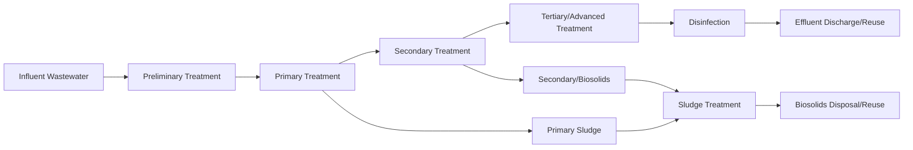

## Wastewater Treatment Processes

### Definition and Scope

Wastewater treatment is the physical, chemical, and biological process of removing contaminants from water that has been used domestically, industrially, or commercially, rendering it safe for discharge into the environment or for reuse. Treatment is typically organized into sequential stages of increasing refinement: preliminary, primary, secondary, and tertiary/advanced treatment, followed by disinfection and residuals (sludge) management.

### Treatment Train Overview

### Preliminary Treatment

Removes large solids and debris that could damage or clog downstream equipment.

- **Key Points**
  - First stage; purely physical, no chemical or biological action
  - Protects pumps, pipes, and mechanical equipment from abrasion and blockage
  - Not intended to remove dissolved or fine suspended contaminants
- **Unit Processes**
  - **Screening**: bar screens (coarse, 6–150 mm spacing) and fine screens remove rags, plastics, and large debris
  - **Grit removal**: grit chambers (velocity-controlled channels or aerated/vortex chambers) settle out sand, gravel, and inorganic grit that would otherwise abrade pumps
  - **Flow equalization** (optional): buffers hydraulic and organic load fluctuations to stabilize downstream process performance

### Primary Treatment

Physical separation of settleable and floatable solids from wastewater via gravity.

- **Key Points**
  - Reduces total suspended solids (TSS) by approximately 50–70% [Inference — varies by wastewater characteristics and clarifier design]
  - Reduces $BOD_5$ by approximately 25–40% [Inference — varies with influent composition]
  - Produces "primary sludge," which requires further treatment
- **Unit Processes**
  - **Primary clarifiers**: large circular or rectangular sedimentation tanks where gravity settles heavier solids to the bottom (forming sludge) while lighter materials (grease, oils) float to the surface and are skimmed off
  - **Chemically enhanced primary treatment (CEPT)**: coagulants (e.g., ferric chloride, alum) and flocculants added to improve settling efficiency, useful where secondary capacity is limited

### Secondary Treatment

Biological process that degrades dissolved and colloidal organic matter using microorganisms.

- **Key Points**
  - Achieves substantial $BOD_5$ and TSS removal, commonly cited around 85% or higher for conventional activated sludge systems [Inference — performance is plant- and design-specific]
  - Relies on aerobic (oxygen-requiring) or, in some configurations, anaerobic microbial metabolism
  - Requires careful control of dissolved oxygen, hydraulic retention time (HRT), and solids retention time (SRT) for stable operation

#### Activated Sludge Process

The most widely used secondary treatment method.

- **Mechanism**:
  1. Wastewater enters an aeration tank where a mixed culture of microorganisms ("activated sludge" or "mixed liquor") consumes organic matter using dissolved oxygen supplied by diffusers or mechanical aerators
  2. The mixture flows to a secondary clarifier where microbial biomass (floc) settles by gravity
  3. A portion of settled biomass is returned to the aeration tank (return activated sludge, RAS) to maintain microbial population
  4. Excess biomass is removed as "waste activated sludge" (WAS) to control SRT
- **Key Design Parameters**:
  - **F/M ratio** (food-to-microorganism ratio): ratio of organic loading to biomass mass, governs process stability and effluent quality
  - **SRT** (solids retention time / sludge age): average time microorganisms remain in the system, controls nitrification capability and sludge settling characteristics
  - **MLSS** (mixed liquor suspended solids): concentration of biomass in the aeration tank

#### Fixed-Film Systems

Alternative secondary treatment where microorganisms grow attached to a solid medium rather than suspended in the liquid.

- **Trickling filters**: wastewater is distributed over a bed of rock or plastic media; a biofilm on the media surface degrades organic matter as water trickles through
- **Rotating biological contactors (RBCs)**: partially submerged rotating discs coated with biofilm alternately contact wastewater and air

#### Lagoon Systems

Large, shallow earthen basins relying on natural biological processes with long retention times (days to weeks); lower energy input than mechanical systems but require substantially more land area.

### Tertiary/Advanced Treatment

Additional polishing to remove nutrients, pathogens, or specific contaminants not adequately addressed by secondary treatment.

- **Key Points**
  - Required where effluent discharges to sensitive water bodies (eutrophication-prone lakes, drinking water sources) or where water reuse is intended
  - Selection of process depends on the specific target contaminant
- **Common Processes**
  - **Nutrient removal**:
    - Biological nutrient removal (BNR) uses anoxic/anaerobic zones combined with aerobic zones to achieve denitrification (converting nitrate, $NO_3^-$, to nitrogen gas, $N_2$) and enhanced biological phosphorus removal (EBPR)
    - Chemical phosphorus precipitation using metal salts (alum, ferric chloride) to form insoluble phosphate compounds
  - **Filtration**: sand filters or membrane filtration (microfiltration, ultrafiltration) remove residual suspended solids
  - **Activated carbon adsorption**: removes dissolved organic compounds, taste/odor compounds, and some trace contaminants
  - **Reverse osmosis (RO)**: membrane process removing dissolved salts and micropollutants, commonly used in potable water reuse schemes
  - **Advanced oxidation processes (AOPs)**: combinations such as ozone/UV or hydrogen peroxide/UV generate hydroxyl radicals to break down persistent organic contaminants, including certain pharmaceuticals and PFAS precursors [Inference — PFAS destruction efficacy is compound- and process-specific]

### Disinfection

Final step to inactivate pathogenic microorganisms before discharge or reuse.

| Method | Mechanism | Key Considerations |
| --- | --- | --- |
| Chlorination | Oxidizes cell components of pathogens | Effective and low-cost; can form disinfection byproducts (DBPs) such as trihalomethanes; requires dechlorination before discharge in some jurisdictions |
| UV irradiation | Damages microbial DNA/RNA, preventing replication | No chemical residual or DBPs; requires low turbidity for effectiveness; no residual protection downstream |
| Ozonation | Strong oxidizer disrupts cell walls | Effective against resistant pathogens; energy-intensive; requires on-site generation |

### Sludge/Biosolids Treatment

Residual solids from primary and secondary treatment require stabilization before disposal or reuse.

- **Thickening**: gravity or dissolved air flotation (DAF) concentrates sludge, reducing volume for downstream processing
- **Anaerobic digestion**: microorganisms break down organic solids in the absence of oxygen, producing biogas (primarily methane, $CH_4$, and carbon dioxide, $CO_2$) that can be captured for energy recovery
- **Dewatering**: centrifuges, belt filter presses, or drying beds reduce water content for handling and transport
- **Disposal/reuse pathways**: land application as fertilizer (subject to regulatory pathogen and metals standards), incineration, or landfilling

### Process Selection Diagram (svg_diagram)

<svg xmlns="http://www.w3.org/2000/svg" viewBox="0 0 900 380">
<text x="450" y="30" font-size="20" font-weight="bold" text-anchor="middle" fill="#1a202c">Wastewater Treatment Train (svg_diagram)</text>
<rect x="20" y="80" width="140" height="70" rx="8" fill="#e2e8f0" stroke="#2d3748" stroke-width="2" />
<text x="90" y="120" font-size="13" font-weight="bold" text-anchor="middle" fill="#1a202c">Preliminary</text>
<text x="90" y="138" font-size="10" text-anchor="middle" fill="#1a202c">Screening, Grit</text>
<rect x="190" y="80" width="140" height="70" rx="8" fill="#fed7d7" stroke="#c53030" stroke-width="2" />
<text x="260" y="120" font-size="13" font-weight="bold" text-anchor="middle" fill="#742a2a">Primary</text>
<text x="260" y="138" font-size="10" text-anchor="middle" fill="#742a2a">Clarification</text>
<rect x="360" y="80" width="150" height="70" rx="8" fill="#c6f6d5" stroke="#276749" stroke-width="2" />
<text x="435" y="115" font-size="13" font-weight="bold" text-anchor="middle" fill="#22543d">Secondary</text>
<text x="435" y="133" font-size="10" text-anchor="middle" fill="#22543d">Activated Sludge</text>
<text x="435" y="146" font-size="9" text-anchor="middle" fill="#22543d">/ Fixed-Film</text>
<rect x="540" y="80" width="150" height="70" rx="8" fill="#bee3f8" stroke="#2c5282" stroke-width="2" />
<text x="615" y="115" font-size="13" font-weight="bold" text-anchor="middle" fill="#2a4365">Tertiary</text>
<text x="615" y="133" font-size="10" text-anchor="middle" fill="#2a4365">Nutrient/Filter</text>
<text x="615" y="146" font-size="9" text-anchor="middle" fill="#2a4365">Removal</text>
<rect x="720" y="80" width="150" height="70" rx="8" fill="#feebc8" stroke="#c05621" stroke-width="2" />
<text x="795" y="115" font-size="13" font-weight="bold" text-anchor="middle" fill="#7b341e">Disinfection</text>
<text x="795" y="133" font-size="10" text-anchor="middle" fill="#7b341e">UV/Cl2/Ozone</text>
<line x1="160" y1="115" x2="190" y2="115" stroke="#4a5568" stroke-width="2" marker-end="url(#arrow2)" />
<line x1="330" y1="115" x2="360" y2="115" stroke="#4a5568" stroke-width="2" marker-end="url(#arrow2)" />
<line x1="510" y1="115" x2="540" y2="115" stroke="#4a5568" stroke-width="2" marker-end="url(#arrow2)" />
<line x1="690" y1="115" x2="720" y2="115" stroke="#4a5568" stroke-width="2" marker-end="url(#arrow2)" />
<rect x="260" y="230" width="380" height="90" rx="8" fill="#e9d8fd" stroke="#6b46c1" stroke-width="2" />
<text x="450" y="260" font-size="14" font-weight="bold" text-anchor="middle" fill="#44337a">Sludge/Biosolids Line</text>
<text x="450" y="282" font-size="11" text-anchor="middle" fill="#44337a">Thickening → Anaerobic Digestion → Dewatering</text>
<text x="450" y="300" font-size="11" text-anchor="middle" fill="#44337a">→ Land Application / Incineration</text>
<line x1="260" y1="150" x2="335" y2="230" stroke="#4a5568" stroke-width="2" stroke-dasharray="4,3" marker-end="url(#arrow2)" />
<line x1="435" y1="150" x2="435" y2="230" stroke="#4a5568" stroke-width="2" stroke-dasharray="4,3" marker-end="url(#arrow2)" />
</svg>

### Worked Example: Activated Sludge F/M Ratio Calculation

A treatment plant has an aeration tank volume of 5,000 m³, an MLSS concentration of 3,000 mg/L, and receives an influent BOD load of 4,500 kg/day.

The F/M ratio is calculated as:

$$\text{F/M} = \frac{\text{BOD load (kg/day)}}{\text{MLSS} \times \text{Tank Volume}}$$

Converting MLSS to consistent units (3,000 mg/L = 3,000 g/m³ = 3 kg/m³):

$$\text{Biomass mass} = 3 \text{ kg/m}^3 \times 5{,}000 \text{ m}^3 = 15{,}000 \text{ kg}$$

$$\text{F/M} = \frac{4{,}500 \text{ kg/day}}{15{,}000 \text{ kg}} = 0.3 \text{ day}^{-1}$$

- **Interpretation**: an F/M ratio of 0.3 day⁻¹ falls within the conventional activated sludge design range (typically cited as 0.2–0.4 day⁻¹) [Inference — acceptable ranges vary by process configuration and design standard], indicating a moderately loaded, stable system suitable for consistent BOD removal without excessive sludge bulking risk.

### Emerging and Advanced Approaches

- **Membrane bioreactors (MBRs)**: combine activated sludge biology with membrane filtration (microfiltration/ultrafiltration) in place of secondary clarifiers, producing high-quality effluent with a smaller footprint, though at higher energy and membrane maintenance cost
- **Moving bed biofilm reactors (MBBRs)**: plastic biofilm carriers suspended in aeration tanks increase available surface area for biomass growth without a separate clarifier stage for biofilm
- **Anaerobic membrane bioreactors (AnMBRs)**: combine anaerobic digestion with membrane separation for energy-positive treatment of certain high-strength wastewaters [Inference — application is more established for industrial/high-strength streams than municipal wastewater at scale]
- **Constructed wetlands**: engineered systems using vegetation, soil, and microbial communities to treat wastewater passively, often used for smaller communities or as a tertiary polishing step

### Related Topics

- Nutrient removal chemistry (nitrification-denitrification, EBPR)
- Sludge digestion and biogas energy recovery
- Water reuse and potable reuse regulatory frameworks
- Membrane technologies in water treatment
- Combined sewer overflow (CSO) management
- Disinfection byproduct formation and control
- Decentralized and nature-based treatment systems