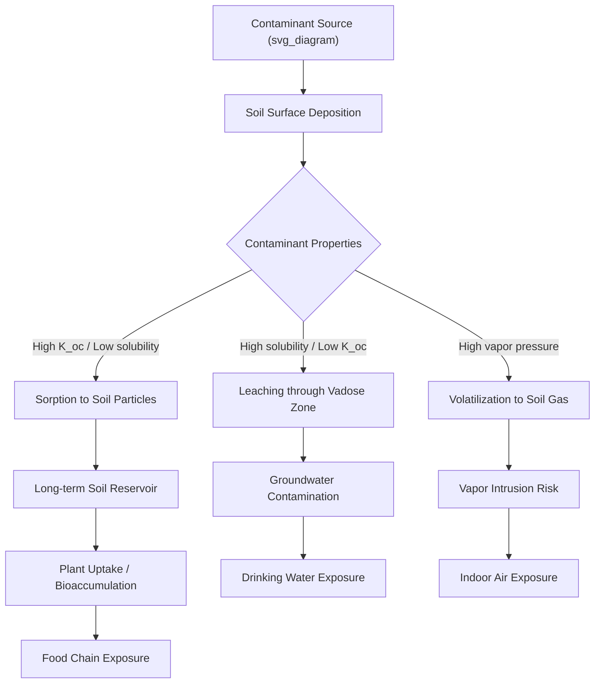
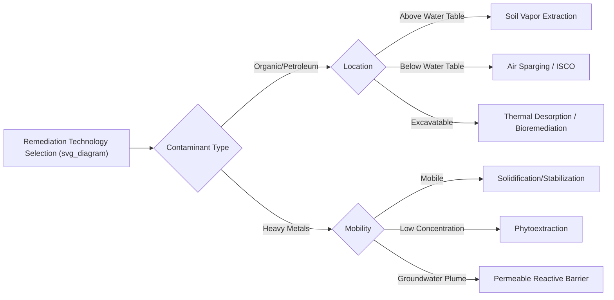

## Soil and Land Contamination

### Definition and Scope

Soil contamination refers to the presence of chemicals, heavy metals, pathogens, or radioactive materials in soil at concentrations that pose a risk to human health, ecosystems, or land usability. Land contamination is the broader term, encompassing soil, subsurface strata, and sometimes associated groundwater. Contamination is typically defined relative to a background concentration (the naturally occurring level of a substance in uncontaminated soil) and a regulatory threshold (a legally defined limit above which remediation or restricted use is triggered).

Contaminated land is distinguished conceptually from "polluted" land in some regulatory frameworks (e.g., UK Environmental Protection Act 1990, Part IIA) by requiring an established **pollutant linkage**: a source, a pathway, and a receptor. Without all three, land may be chemically altered but not legally "contaminated."

### Sources of Soil Contamination

**Key Points**

- **Industrial activity**: Mining, smelting, petroleum refining, chemical manufacturing, and metal plating deposit heavy metals (lead, cadmium, arsenic, mercury, chromium) and organic solvents into soil.
- **Agricultural practices**: Overuse of synthetic fertilizers, pesticides (organochlorines like DDT, organophosphates), herbicides, and manure application introduces nutrients, persistent organic pollutants (POPs), and pathogens.
- **Improper waste disposal**: Illegal dumping, unlined landfills, and leachate migration introduce a heterogeneous mix of contaminants including heavy metals, leachate organics, and emerging contaminants (e.g., PFAS from consumer products).
- **Underground storage tank (UST) leaks**: Petroleum hydrocarbons (BTEX compounds — benzene, toluene, ethylbenzene, xylene) from fuel stations.
- **Atmospheric deposition**: Airborne particulates from combustion (vehicle exhaust, coal burning) settle onto soil, contributing lead, polycyclic aromatic hydrocarbons (PAHs), and soot.
- **Mine tailings and acid mine drainage (AMD)**: Exposed sulfide minerals oxidize to form sulfuric acid, mobilizing heavy metals into surrounding soil and waterways.
- **Military and munitions activity**: Unexploded ordnance sites and firing ranges contribute perchlorates, TNT residues, and heavy metals.
- **Radioactive contamination**: Nuclear accidents (e.g., Chernobyl, Fukushima) or improper disposal of radioactive waste introduce isotopes like cesium-137 and strontium-90.

### Major Classes of Contaminants

| Contaminant Class | Examples | Primary Sources | Persistence |
| --- | --- | --- | --- |
| Heavy metals/metalloids | Pb, Cd, As, Hg, Cr(VI), Ni | Mining, industry, pesticides | Effectively permanent (non-degradable) |
| Petroleum hydrocarbons | BTEX, PAHs, TPH | Fuel spills, refining | Moderate; some PAHs highly persistent |
| Persistent organic pollutants (POPs) | DDT, PCBs, dioxins | Pesticides, industrial fluids | Very high (years to decades) |
| Per- and polyfluoroalkyl substances (PFAS) | PFOA, PFOS | Firefighting foam, textiles, packaging | Extremely high ("forever chemicals") |
| Radionuclides | Cs-137, Sr-90, U-238 | Nuclear accidents, mining, waste | Governed by half-life (years to millennia) |
| Pathogens | E. coli, Salmonella, helminth eggs | Sewage sludge, manure | Low to moderate (weeks to months) |
| Nutrients (excess) | Nitrate, phosphate | Fertilizer runoff, manure | Mobile; leaches to groundwater |

### Fate and Transport Mechanisms

Contaminant behavior in soil depends on physicochemical properties of both the pollutant and the soil matrix.

- **Sorption/desorption**: Governed by soil organic matter content, clay mineralogy, and cation exchange capacity (CEC). The soil-water partition coefficient, $K_d$, describes the ratio of sorbed to dissolved contaminant concentration:

$$K_d = \frac{C_s}{C_w}$$

where $C_s$ is the concentration sorbed to soil (mg/kg) and $C_w$ is the concentration in soil water (mg/L). Organic contaminants are often normalized to organic carbon content using $K_{oc}$.

- **Leaching**: Downward migration of dissolved contaminants through the vadose zone toward groundwater, influenced by hydraulic conductivity, rainfall infiltration, and contaminant solubility.
- **Volatilization**: Loss of volatile organic compounds (VOCs) to soil gas and ambient air, relevant to vapor intrusion risk in buildings.
- **Bioaccumulation and biomagnification**: Lipophilic contaminants (e.g., PCBs, some pesticides) accumulate in soil biota and move up the food chain.
- **Redox transformations**: Changes in oxidation state (e.g., Cr(VI) to less toxic Cr(III), or reductive dissolution of iron/manganese oxides releasing bound metals) alter mobility and toxicity.
- **Speciation**: The chemical form of an element (e.g., inorganic arsenic species arsenite As(III) vs. arsenate As(V)) strongly affects toxicity and mobility; As(III) is generally more mobile and toxic than As(V).

### Environmental and Health Impacts

**Key Points**

- **Human health**: Heavy metal exposure causes neurological damage (Pb), carcinogenesis (As, Cr(VI), benzene), kidney damage (Cd), and endocrine disruption (PFAS, some pesticides). Exposure pathways include direct ingestion (especially in children via soil-to-hand-to-mouth behavior), dermal contact, inhalation of dust, and consumption of contaminated crops or groundwater.
- **Soil ecosystem function**: Contamination reduces microbial diversity and activity, impairing nutrient cycling (nitrogen fixation, decomposition), and can eliminate sensitive soil fauna (earthworms, arthropods) that serve as bioindicators.
- **Agricultural productivity**: Phytotoxicity from metals or salinity reduces crop yield; contaminated produce creates food safety hazards.
- **Ecosystem services loss**: Degraded soils lose water filtration capacity, carbon sequestration potential, and structural stability, increasing erosion risk.
- **Groundwater degradation**: Soil acts as a pathway; contaminated soil is a long-term diffuse source ("secondary source") that continues leaching pollutants into aquifers for decades after the original release.

### Site Assessment Methodology

Standard contaminated land assessment follows a phased approach, closely mirrored across regulatory systems (e.g., US EPA, ASTM standards):

**Phase I – Preliminary Assessment (Desk Study)**

- Historical land-use review (aerial photos, ownership records, prior industrial permits)
- Site walkover and visual inspection
- Identification of potential contaminant sources and receptors
- No sampling; output is a conceptual site model (CSM) identifying suspected pollutant linkages

**Phase II – Intrusive Investigation**

- Soil borings, test pits, and monitoring well installation
- Systematic or judgmental sampling grids
- Laboratory analysis: ICP-MS/ICP-OES for metals, GC-MS for organics, XRF for rapid field metal screening
- Comparison against generic assessment criteria (GAC) or site-specific target levels (SSTL)

**Phase III – Detailed Quantitative Risk Assessment (DQRA)**

- Human health risk assessment (HHRA) using exposure modeling
- Ecological risk assessment (ERA)
- Refinement of the conceptual site model with site-specific exposure parameters

### Risk Assessment Framework

Human health risk from soil contaminants is typically quantified using a hazard quotient (for non-carcinogens) or incremental lifetime cancer risk (for carcinogens).

For non-carcinogenic effects:

$$HQ = \frac{CDI}{RfD}$$

where $CDI$ is the chronic daily intake (mg/kg-day) and $RfD$ is the reference dose. An $HQ > 1$ indicates potential adverse effects.

For carcinogenic effects:

$$ILCR = CDI \times SF$$

where $SF$ is the cancer slope factor. Regulatory acceptable risk thresholds are commonly set between $1 \times 10^{-6}$ and $1 \times 10^{-4}$.

Chronic daily intake via soil ingestion is estimated as:

$$CDI = \frac{C \times IR \times EF \times ED \times CF}{BW \times AT}$$

where $C$ = contaminant concentration in soil (mg/kg), $IR$ = ingestion rate (mg/day), $EF$ = exposure frequency (days/year), $ED$ = exposure duration (years), $CF$ = unit conversion factor, $BW$ = body weight (kg), $AT$ = averaging time (days).

[Inference] Specific default values for $IR$, $EF$, and $BW$ vary by regulatory jurisdiction and receptor scenario (child vs. adult, residential vs. commercial), so practitioners should consult the applicable national guidance document rather than universal constants.

### Remediation Technologies

**Ex Situ (Excavation-Based) Methods**

- **Landfilling**: Excavation and disposal at a permitted hazardous or non-hazardous waste facility; simplest but merely relocates contamination and carries long-term liability.
- **Soil washing**: Physical/chemical separation of contaminants from soil particles using water, surfactants, or chelating agents, exploiting the tendency of contaminants to concentrate in finer particle size fractions.
- **Thermal desorption**: Heating excavated soil (typically 100–560°C) to volatilize organic contaminants, which are then captured and treated separately.
- **Incineration**: High-temperature (>850°C) destruction of organic contaminants; effective but energy-intensive and requires air emissions control.

**In Situ Methods**

- **Soil vapor extraction (SVE)**: Applies vacuum to unsaturated soil to volatilize and extract VOCs; effective for petroleum hydrocarbons and chlorinated solvents above the water table.
- **Air sparging**: Injects air below the water table to volatilize dissolved contaminants, often paired with SVE.
- **Bioremediation**: Uses indigenous or introduced microorganisms to degrade organic contaminants; can be enhanced via biostimulation (nutrient addition) or bioaugmentation (adding specialized microbial strains).
- **Phytoremediation**: Uses plants to extract (phytoextraction), stabilize (phytostabilization), or degrade (phytodegradation) contaminants. Hyperaccumulator species (e.g., *Thlaspi caerulescens* for zinc/cadmium, *Pteris vittata* for arsenic) are notable for metal uptake.
- **Chemical oxidation (ISCO)**: Injection of oxidants (permanganate, persulfate, Fenton's reagent) to degrade organic contaminants in place.
- **Solidification/stabilization (S/S)**: Mixing soil with binders (cement, lime, fly ash) to immobilize contaminants physically and chemically, reducing leachability without removing mass.
- **Permeable reactive barriers (PRBs)**: Subsurface walls of reactive material (e.g., zero-valent iron) installed to intercept and treat contaminated groundwater plumes as they pass through.
- **Monitored natural attenuation (MNA)**: Reliance on natural biodegradation, dispersion, and sorption processes, coupled with long-term monitoring, used when contaminant levels and risk are low and timelines are acceptable.

[Inference] Selection among these technologies in practice depends on site-specific factors such as depth to groundwater, soil permeability, contaminant concentration, cost constraints, and regulatory cleanup timelines; no single technology is universally superior.

### Regulatory and Policy Frameworks

- **United States**: The Comprehensive Environmental Response, Compensation, and Liability Act (CERCLA/"Superfund," 1980) governs remediation of abandoned hazardous sites, funded partly through the National Priorities List (NPL) process. The Resource Conservation and Recovery Act (RCRA) governs active hazardous waste management "from cradle to grave."
- **European Union**: No single EU-wide contaminated land directive exists; member states apply national frameworks, though the Industrial Emissions Directive and Soil Thematic Strategy provide overarching guidance.
- **United Kingdom**: Part IIA of the Environmental Protection Act 1990 establishes the source-pathway-receptor model as the legal basis for defining "contaminated land."
- **International**: The Basel Convention governs transboundary movement of hazardous waste, indirectly relevant to land contamination from illegal waste dumping.

### Case Illustration: Brownfield Redevelopment

A "brownfield" is a previously developed site where redevelopment is complicated by real or perceived contamination. Typical workflow:

1. Phase I ESA (Environmental Site Assessment) identifies historical use (e.g., former dry cleaner — likely tetrachloroethylene/PCE contamination).
2. Phase II confirms PCE in soil and groundwater above regulatory thresholds.
3. Risk-based remediation is selected (e.g., SVE for vadose zone PCE plus MNA for the dissolved plume).
4. A "no further action" or "closure" letter is issued by the regulator once cleanup goals or institutional controls (land use restrictions, deed notices) are in place.
5. Redevelopment proceeds, often with engineering controls (vapor barriers, capping) as a permanent risk management measure.

### Prevention and Best Management Practices

**Key Points**

- Secondary containment and regular integrity testing for storage tanks and industrial process areas
- Integrated pest management (IPM) to reduce pesticide loading
- Nutrient management planning to match fertilizer application to crop uptake, reducing excess mobile nitrate
- Proper lined landfill design with leachate collection systems and groundwater monitoring wells
- Brownfield redevelopment incentives to discourage greenfield conversion
- Extended producer responsibility (EPR) schemes to reduce persistent contaminants (e.g., PFAS) entering the waste stream at the source

### Soil Contamination Indicator Diagram

<svg xmlns="http://www.w3.org/2000/svg" viewBox="0 0 640 300">
<text x="320" y="24" font-size="16" text-anchor="middle" font-family="sans-serif" font-weight="bold">Soil Contaminant Depth Profile (svg_diagram)</text>
<line x1="80" y1="50" x2="80" y2="270" stroke="black" stroke-width="2" />
<line x1="80" y1="270" x2="600" y2="270" stroke="black" stroke-width="2" />
<text x="40" y="55" font-size="11" font-family="sans-serif">Depth</text>
<rect x="80" y="50" width="520" height="40" fill="#c2b280" stroke="black" />
<text x="90" y="75" font-size="11" font-family="sans-serif">Topsoil / Organic Layer (highest sorption, biological activity)</text>
<rect x="80" y="90" width="520" height="60" fill="#d9c48a" stroke="black" />
<text x="90" y="115" font-size="11" font-family="sans-serif">Vadose (Unsaturated) Zone</text>
<text x="90" y="132" font-size="10" font-family="sans-serif">Sorbed &amp; volatilized contaminants; SVE effective here</text>
<line x1="80" y1="150" x2="600" y2="150" stroke="#2266cc" stroke-width="2" stroke-dasharray="6,3" />
<text x="490" y="145" font-size="10" fill="#2266cc" font-family="sans-serif">Water Table</text>
<rect x="80" y="150" width="520" height="90" fill="#a9c9e8" stroke="black" />
<text x="90" y="175" font-size="11" font-family="sans-serif">Saturated Zone (Groundwater)</text>
<text x="90" y="192" font-size="10" font-family="sans-serif">Dissolved plume migration; PRB / MNA relevant</text>
<polygon points="150,50 165,150 135,150" fill="#8b4513" opacity="0.6" />
<text x="100" y="260" font-size="10" font-family="sans-serif">Source area (e.g., leaking tank)</text>
<line x1="157" y1="150" x2="400" y2="220" stroke="#8b4513" stroke-width="3" opacity="0.6" />
<text x="410" y="225" font-size="10" font-family="sans-serif">Contaminant plume direction</text>
</svg>

### Related Topics

- Groundwater contamination and aquifer remediation
- Heavy metal biogeochemistry and speciation
- Persistent organic pollutants (POPs) and the Stockholm Convention
- PFAS regulation and treatment technologies
- Municipal solid waste management and sanitary landfill engineering
- Environmental risk assessment methodologies
- Brownfield redevelopment and urban land reuse policy
- Soil microbiome and bioremediation engineering
- Acid mine drainage and mining waste management
- Radioactive waste disposal and nuclear site remediation