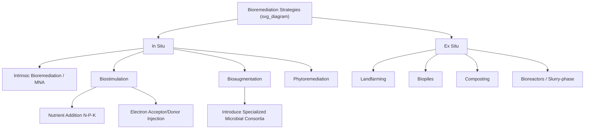

## Bioremediation and Environmental Microbiology

### Definition and Scope

Bioremediation is the application of biological agents — primarily microorganisms, but also fungi and plants — to degrade, transform, or immobilize environmental contaminants into less toxic or non-toxic forms. Environmental microbiology is the broader scientific discipline studying microbial diversity, metabolism, and community function in natural and engineered environments, providing the mechanistic foundation for bioremediation practice. Bioremediation exploits naturally occurring catabolic pathways in which microorganisms use contaminants as an energy source, electron donor, or electron acceptor.

### Microbial Metabolism Fundamentals

**Key Points**

- **Aerobic respiration**: Microorganisms use molecular oxygen ($O_2$) as the terminal electron acceptor, oxidizing organic contaminants (e.g., hydrocarbons) to $CO_2$ and $H_2O$. Generally the fastest and most complete degradation pathway.
- **Anaerobic respiration**: In oxygen-depleted environments, alternative electron acceptors are used in a thermodynamically predictable sequence: nitrate ($NO_3^-$) > manganese(IV) > iron(III) > sulfate ($SO_4^{2-}$) > carbon dioxide (methanogenesis).
- **Fermentation**: Organic substrates serve as both electron donor and acceptor in the absence of external acceptors, typically an intermediate step producing simpler compounds (e.g., fatty acids, hydrogen) for other microbial guilds.
- **Cometabolism**: A contaminant is fortuitously transformed by an enzyme whose primary substrate is a different compound, without the microorganism deriving energy or carbon from the contaminant itself. This is central to degradation of recalcitrant compounds like trichloroethylene (TCE) by methanotrophs expressing methane monooxygenase.
- **Reductive dechlorination**: Anaerobic process in which halogenated organic compounds serve as electron acceptors, sequentially replacing halogen atoms with hydrogen (e.g., PCE → TCE → DCE → vinyl chloride → ethene), mediated notably by *Dehalococcoides* species, which are uniquely capable of complete dechlorination to non-toxic ethene.

The generalized aerobic biodegradation reaction for a hydrocarbon can be represented as:

$$C_xH_y + \left(x + \frac{y}{4}\right)O_2 \rightarrow xCO_2 + \frac{y}{2}H_2O$$

### Key Microbial Taxa in Bioremediation

| Organism/Group | Contaminant Target | Mechanism |
| --- | --- | --- |
| *Pseudomonas* spp. | Petroleum hydrocarbons, PAHs | Aerobic oxidation via dioxygenase enzymes |
| *Dehalococcoides* spp. | Chlorinated solvents (PCE, TCE) | Organohalide respiration (anaerobic) |
| *Methylosinus*, *Methylococcus* (methanotrophs) | TCE, chlorinated ethenes | Cometabolism via methane monooxygenase |
| *Alcanivorax* spp. | Marine oil spills (alkanes) | Obligate hydrocarbonoclastic aerobic degradation |
| *Thiobacillus* spp. | Sulfide minerals, acid mine drainage | Chemolithotrophic sulfur/iron oxidation |
| *Geobacter*, *Shewanella* spp. | Heavy metals (U, Cr, Fe) | Dissimilatory metal reduction, bioelectrogenesis |
| White-rot fungi (*Phanerochaete chrysosporium*) | Lignin, PAHs, dyes, some pesticides | Extracellular ligninolytic enzymes (peroxidases, laccases) |
| *Rhodococcus* spp. | PCBs, herbicides, MTBE | Broad catabolic versatility |
| Mycorrhizal fungi | Metals, organics (rhizosphere) | Symbiotic enhancement of plant-associated remediation |

### Bioremediation Strategy Classification

**In Situ Approaches**

- **Intrinsic bioremediation / monitored natural attenuation (MNA)**: Relies on indigenous microbial populations and existing subsurface conditions without engineered intervention, paired with long-term monitoring to confirm the plume is stable or shrinking.
- **Biostimulation**: Enhances indigenous microbial activity by amending the subsurface with nutrients (nitrogen, phosphorus), electron acceptors (oxygen, nitrate, sulfate), or electron donors (lactate, vegetable oil, molasses for anaerobic dechlorination).
- **Bioaugmentation**: Introduces exogenous microbial cultures with specific catabolic capabilities absent from the native community — most notably commercial *Dehalococcoides*-containing cultures for sites lacking complete dechlorination potential.
- **Phytoremediation** (microbially-assisted): Plant roots and their associated rhizosphere microbiome jointly degrade or stabilize contaminants; plant growth-promoting rhizobacteria (PGPR) can enhance pollutant tolerance and uptake.

**Ex Situ Approaches**

- **Landfarming**: Excavated contaminated soil is spread in thin layers and periodically tilled to aerate and stimulate aerobic degradation; land- and time-intensive but low-cost.
- **Biopiles**: Excavated soil is mounded with forced aeration (via piping) and sometimes leachate recirculation, offering more controlled conditions than landfarming in a smaller footprint.
- **Composting**: Contaminated soil is mixed with bulking agents (straw, wood chips) and organic amendments to promote thermophilic microbial activity, effective for explosives residues and some pesticides.
- **Slurry-phase bioreactors**: Soil is mixed with water into a slurry within a controlled reactor, maximizing contaminant-microbe contact and allowing precise control of pH, temperature, oxygen, and nutrients; fastest ex situ option but highest cost.

### Environmental Factors Governing Bioremediation Efficacy

**Key Points**

- **Oxygen availability**: Determines whether aerobic or anaerobic pathways dominate; often the rate-limiting factor in subsurface bioremediation due to low oxygen solubility and diffusion rates in saturated soils.
- **Temperature**: Microbial metabolic rates generally follow a $Q_{10}$ relationship, roughly doubling with each 10°C increase within the mesophilic range (optimal often 20–35°C for most remediation-relevant organisms); rates decline sharply below ~10°C.
- **pH**: Most bioremediation-relevant bacteria function optimally near neutral pH (6–8); acid mine drainage sites require pH buffering before effective bioremediation.
- **Moisture content**: Affects microbial activity, oxygen diffusion, and nutrient transport; optimal soil moisture is typically 40–85% of water holding capacity for ex situ systems.
- **Nutrient availability**: Carbon:nitrogen:phosphorus (C:N:P) ratios around 100:10:1 are commonly cited as favorable for balanced microbial growth during hydrocarbon degradation, though this varies by contaminant and site conditions. [Inference] Optimal ratios are contaminant- and site-specific rather than universal.
- **Contaminant bioavailability**: Strong sorption to soil organic matter or entrapment in soil aggregates limits microbial access; aged/weathered contamination is generally less bioavailable and slower to degrade than fresh releases.
- **Toxicity thresholds**: High contaminant concentrations can inhibit or kill the degrading microbial community itself, requiring dilution or phased treatment.

### Molecular and Analytical Tools in Environmental Microbiology

- **16S rRNA gene sequencing**: Identifies and quantifies bacterial community composition via amplicon sequencing of this conserved phylogenetic marker gene.
- **qPCR (quantitative PCR)**: Quantifies specific functional or taxonomic genes (e.g., *Dehalococcoides* 16S rRNA gene copies, or functional genes like *bssA* for anaerobic toluene degradation) to assess degradative potential before and during remediation.
- **Metagenomics**: Shotgun sequencing of all genetic material in a sample, revealing functional gene potential across the entire microbial community without cultivation.
- **Compound-specific isotope analysis (CSIA)**: Measures shifts in stable isotope ratios (e.g., $^{13}C/^{12}C$, $^{37}Cl/^{35}Cl$) of contaminants to provide direct evidence of in situ biodegradation, since biological degradation preferentially breaks bonds with lighter isotopes, enriching the residual contaminant in heavier isotopes.
- **Microcosm studies**: Laboratory-scale simulations using site soil/groundwater to test degradation potential and optimize amendment strategies before field-scale implementation.

### Case Application: Petroleum Hydrocarbon Bioremediation

1. Site characterization confirms BTEX/TPH contamination in a shallow aquifer from a leaking underground storage tank.
2. Microcosm testing confirms native aerobic degraders are present but oxygen-limited.
3. Biostimulation is implemented via injection of oxygen-releasing compounds (e.g., calcium peroxide) or air sparging to elevate dissolved oxygen.
4. Groundwater monitoring tracks declining BTEX concentrations alongside increasing metabolic byproducts and declining dissolved oxygen/increasing $CO_2$ as evidence of active biodegradation.
5. Site closure is achieved once concentrations fall below regulatory target levels, often formalized through a monitored natural attenuation transition phase.

[Inference] Timeframes for bioremediation closure are highly site-specific, ranging from months (ex situ bioreactors) to many years (in situ MNA of dilute, dispersed plumes), and actual field performance may vary from bench-scale predictions due to heterogeneity in subsurface conditions.

### Bioaugmentation Culture Selection Workflow

<svg xmlns="http://www.w3.org/2000/svg" viewBox="0 0 640 260">
<text x="320" y="24" font-size="16" text-anchor="middle" font-family="sans-serif" font-weight="bold">Bioaugmentation Decision Workflow (svg_diagram)</text>
<rect x="20" y="50" width="160" height="50" rx="6" fill="#dfe8f5" stroke="black" />
<text x="100" y="70" font-size="11" text-anchor="middle" font-family="sans-serif">Site Characterization</text>
<text x="100" y="86" font-size="10" text-anchor="middle" font-family="sans-serif">(contaminant + geochemistry)</text>
<rect x="230" y="50" width="180" height="50" rx="6" fill="#dfe8f5" stroke="black" />
<text x="320" y="70" font-size="11" text-anchor="middle" font-family="sans-serif">Molecular Screening</text>
<text x="320" y="86" font-size="10" text-anchor="middle" font-family="sans-serif">(qPCR for key functional genes)</text>
<rect x="460" y="20" width="160" height="50" rx="6" fill="#d9f2d9" stroke="black" />
<text x="540" y="40" font-size="11" text-anchor="middle" font-family="sans-serif">Genes Present</text>
<text x="540" y="56" font-size="10" text-anchor="middle" font-family="sans-serif">→ Biostimulation only</text>
<rect x="460" y="90" width="160" height="50" rx="6" fill="#f5d9d9" stroke="black" />
<text x="540" y="110" font-size="11" text-anchor="middle" font-family="sans-serif">Genes Absent/Low</text>
<text x="540" y="126" font-size="10" text-anchor="middle" font-family="sans-serif">→ Bioaugmentation required</text>
<rect x="230" y="160" width="180" height="60" rx="6" fill="#fff3d6" stroke="black" />
<text x="320" y="180" font-size="11" text-anchor="middle" font-family="sans-serif">Culture Introduction +</text>
<text x="320" y="196" font-size="11" text-anchor="middle" font-family="sans-serif">Electron Donor Amendment</text>
<text x="320" y="212" font-size="10" text-anchor="middle" font-family="sans-serif">(e.g., lactate for Dehalococcoides)</text>
<line x1="180" y1="75" x2="230" y2="75" stroke="black" stroke-width="1.5" marker-end="url(#arrow)" />
<line x1="410" y1="65" x2="460" y2="45" stroke="black" stroke-width="1.5" marker-end="url(#arrow)" />
<line x1="410" y1="85" x2="460" y2="115" stroke="black" stroke-width="1.5" marker-end="url(#arrow)" />
<line x1="540" y1="140" x2="410" y2="175" stroke="black" stroke-width="1.5" marker-end="url(#arrow)" />
</svg>

### Limitations and Challenges

**Key Points**

- Recalcitrant compounds (highly chlorinated PCBs, certain PFAS, some pesticides) resist microbial degradation due to structural stability and lack of appropriate enzymatic pathways.
- Heavy metals cannot be biodegraded, only biologically transformed in oxidation state, sequestered, or mobilized differently (bioremediation of metals is fundamentally a stabilization/mobilization strategy, not destruction).
- Incomplete degradation pathways can generate more toxic intermediates (e.g., vinyl chloride, a known human carcinogen, as an intermediate of incomplete reductive dechlorination when *Dehalococcoides* is absent).
- Field-scale heterogeneity (preferential flow paths, varying redox zones) often causes slower or less uniform degradation than laboratory microcosms predict.
- Regulatory acceptance of bioremediation as a sole remedy typically requires a robust long-term monitoring program to demonstrate sustained performance.

### Next Steps

- Rhizosphere engineering and plant-microbe partnerships for phytoremediation
- Genetically engineered microorganisms (GEMs) for enhanced degradation pathways
- Mycoremediation using fungal enzymatic systems
- Microbial fuel cells and bioelectrochemical remediation of metals
- Anaerobic digestion and biogas recovery from organic waste
- Compound-specific isotope analysis for remediation performance verification
- PFAS biodegradation research and defluorination pathways
- Constructed wetlands as engineered microbial treatment systems