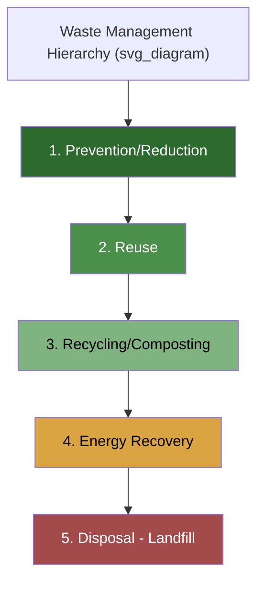
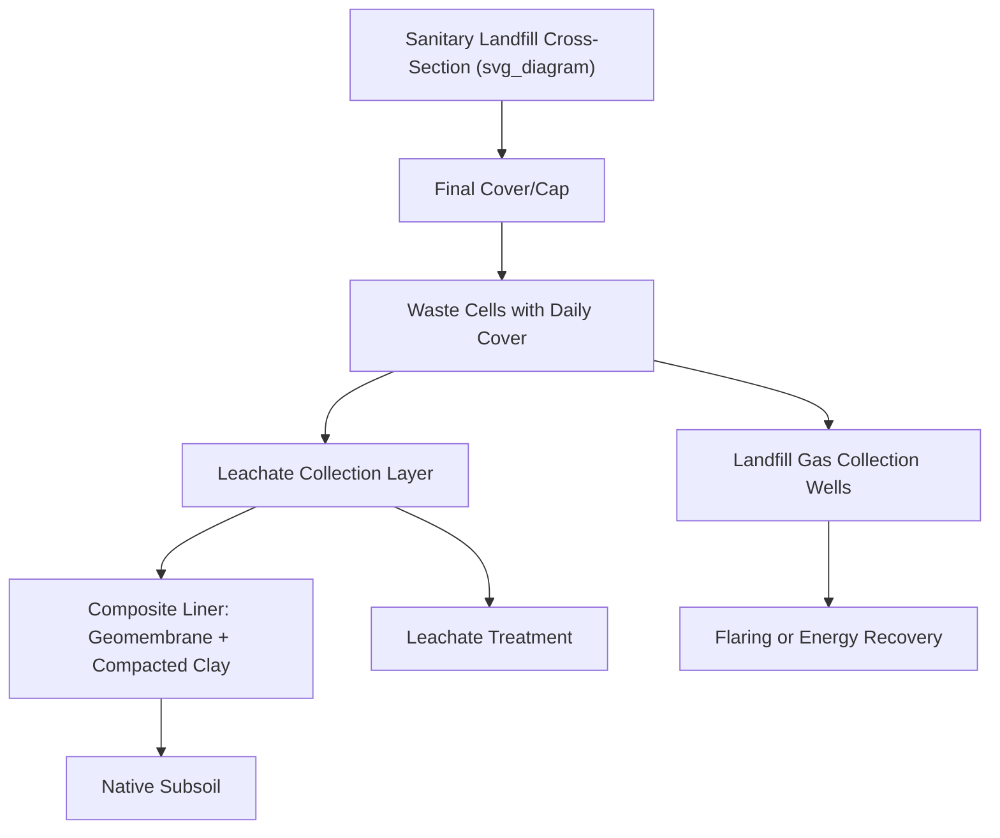

## Municipal Solid Waste Management

### Definition and Scope

Municipal solid waste (MSW) management encompasses the collection, transport, processing, recycling, and disposal of solid waste generated by households, commercial establishments, institutions, and municipal services. It excludes industrial process waste, hazardous waste (regulated separately), and construction/demolition debris in most regulatory frameworks, though these are sometimes co-managed at the municipal level. Effective MSW management integrates engineering, economics, and behavioral policy to minimize environmental and public health impacts while recovering material and energy value.

### Waste Composition and Characterization

**Key Points**

- **Organic/putrescible waste**: Food scraps, yard waste; typically the largest fraction by weight in many municipalities (often 30–50%), a major driver of landfill methane generation.
- **Paper and cardboard**: Highly recyclable; composition varies with digitalization trends and packaging demand (notably increased corrugated cardboard from e-commerce).
- **Plastics**: Categorized by resin identification codes (PET #1, HDPE #2, PVC #3, LDPE #4, PP #5, PS #6, other #7); recycling rates vary sharply by polymer type.
- **Glass**: Fully and infinitely recyclable without quality loss, though color-sorting requirements complicate collection.
- **Metals**: Ferrous (steel, iron) recoverable via magnetic separation; non-ferrous (aluminum) recoverable via eddy current separation; both have high recycling value.
- **Textiles, rubber, and composites**: Increasingly significant fraction due to fast fashion; difficult to recycle due to mixed-material construction.
- **Hazardous household waste**: Batteries, electronics (e-waste), paints, solvents — requires separate collection streams to avoid contaminating other waste fractions.

Waste composition is typically characterized through waste sort/audit studies, reported on a wet-weight percentage basis, and used to project material recovery potential.

### The Waste Management Hierarchy

This hierarchy (formalized in frameworks such as the EU Waste Framework Directive and US EPA's guidance) ranks strategies by environmental preference, prioritizing waste avoided over waste treated, and treatment over disposal. [Inference] The relative environmental benefit of each tier can vary by material and local context (e.g., transport distances for recycling can sometimes offset benefits), so life-cycle assessment is recommended for definitive comparisons rather than assuming the hierarchy strictly ranks every material in every situation.

### Collection and Transport Systems

- **Curbside collection**: Scheduled pickup from individual residences, often with source-separated bins (general waste, recyclables, organics — a "three-stream" or "multi-stream" system).
- **Communal collection points**: Shared bins/containers serving multiple households, common in dense urban or low-income settings with space or budget constraints.
- **Transfer stations**: Intermediate facilities where collection vehicles offload waste into larger transport vehicles (rail, barge, or larger trucks) for more efficient long-haul transport to distant disposal or processing sites, reducing per-unit hauling cost.
- **Route optimization**: Uses geographic information systems (GIS) and vehicle routing algorithms to minimize collection distance, fuel consumption, and labor time; increasingly incorporates fill-level sensors in bins for demand-responsive ("smart") collection scheduling.
- **Pneumatic waste collection systems**: Underground vacuum-tube networks transporting waste directly from building chutes to a central collection point, used in some dense urban developments to eliminate truck traffic.

### Material Recovery Facilities (MRFs)

A Material Recovery Facility sorts mixed or source-separated recyclables into clean, marketable material streams.

**Key Points**

- **Single-stream MRFs**: Accept all recyclables (paper, plastic, metal, glass) commingled in one bin, maximizing collection convenience but increasing cross-contamination and requiring more complex sorting.
- **Dual/multi-stream MRFs**: Accept recyclables pre-separated by category (e.g., fiber vs. containers), yielding higher-purity output streams with simpler processing.
- **Sorting technologies**:
  - Trommel screens and disc screens for initial size separation
  - Magnetic separators for ferrous metal recovery
  - Eddy current separators for non-ferrous (aluminum) recovery
  - Near-infrared (NIR) optical sorters for plastic resin identification and separation
  - Air classifiers/density separation for lightweight fraction (paper/film) separation
  - Manual picking stations for quality control and contaminant removal
- **Contamination management**: A critical operational and economic factor; high contamination rates (non-recyclables, food residue, "wishcycling") reduce bale quality, lower resale value, and can cause entire loads to be rejected or landfilled.

### Composting and Organics Processing

- **Aerobic composting**: Controlled biological decomposition of organic waste by aerobic microorganisms, producing a stable, humus-like soil amendment; requires proper carbon:nitrogen ratio (commonly cited around 25–30:1), moisture (40–60%), and periodic turning or forced aeration for oxygen supply.
- **Windrow composting**: Long, elongated piles turned mechanically on a schedule; low-cost, land-intensive, suited to larger municipal-scale operations.
- **In-vessel composting**: Enclosed systems providing tighter control of temperature, moisture, and airflow, enabling faster processing and better odor/leachate control, suited to space-constrained or regulation-sensitive sites.
- **Anaerobic digestion (AD)**: Organic waste is decomposed by anaerobic microbial consortia in an oxygen-free digester, producing biogas (methane-rich, usable for energy) and digestate (a nutrient-rich residual usable as fertilizer). AD is increasingly favored over composting for source-separated food waste due to energy recovery potential.

The general aerobic composting reaction can be represented conceptually as organic matter oxidation:

$$\text{Organic Matter} + O_2 \xrightarrow{\text{microbial}} CO_2 + H_2O + \text{Heat} + \text{Humus}$$

### Thermal Treatment: Waste-to-Energy (WtE)

- **Mass burn incineration**: Unprocessed MSW is combusted directly, generating heat used to produce steam for electricity generation; reduces waste volume by roughly 80–90% by volume [Inference: exact reduction depends on waste composition and combustion efficiency].
- **Refuse-derived fuel (RDF)**: MSW is processed (shredded, non-combustibles removed) into a more homogeneous fuel product before combustion, improving combustion efficiency and allowing use in cement kilns or dedicated RDF boilers.
- **Gasification and pyrolysis**: Thermal decomposition of waste under limited or absent oxygen, producing syngas or pyrolysis oil as an intermediate energy carrier rather than direct combustion; offers potentially cleaner emissions profiles but has seen mixed commercial-scale success for mixed MSW streams.
- **Air pollution control**: Modern WtE facilities require flue gas treatment trains including electrostatic precipitators or fabric filters (particulate removal), scrubbers (acid gas removal), and selective catalytic/non-catalytic reduction (NOx control) to meet emissions standards for dioxins, furans, heavy metals, particulates, and acid gases.
- **Ash management**: Bottom ash (larger residual solids) and fly ash (captured from flue gas, generally more contaminant-concentrated) require separate handling; fly ash is often classified as requiring more stringent disposal due to heavy metal and dioxin concentration.

### Landfilling — Engineering Fundamentals

Modern sanitary landfills are engineered systems, distinct from historical open dumps.

**Key Points**

- **Liner systems**: Composite liners (compacted clay plus geomembrane, commonly high-density polyethylene/HDPE) prevent leachate migration into underlying soil and groundwater.
- **Leachate collection**: Perforated pipe networks above the liner collect leachate (liquid percolating through waste, carrying dissolved organics, metals, and salts) for treatment, either on-site or via discharge to a municipal wastewater treatment plant.
- **Landfill gas (LFG) management**: Anaerobic decomposition of organic waste generates landfill gas (approximately 50% methane, 50% $CO_2$ by volume, with trace volatile organic compounds); collected via vertical or horizontal wells and either flared, or captured for energy recovery (LFG-to-energy).
- **Daily cover**: Soil or alternative cover material applied at the end of each operating day to control odor, vectors (rodents, birds), and litter, and to reduce fire risk.
- **Final cover/capping**: Multi-layer cap system (typically including a barrier layer, drainage layer, and vegetated topsoil) installed upon landfill closure to minimize infiltration and support post-closure land use.
- **Post-closure monitoring**: Groundwater and landfill gas monitoring required for an extended period after closure (commonly 30 years under US RCRA Subtitle D) to detect any liner failure or continued gas generation.

### Landfill Gas Generation Curve Concept

Landfill gas generation over time is commonly modeled using a first-order decay equation (as in the widely used LandGEM model framework):

$$Q_{CH_4} = \sum_{i=1}^{n} k L_0 \left(\frac{M_i}{10}\right) e^{-k t_i}$$

where $Q_{CH_4}$ is the annual methane generation, $k$ is the methane generation rate constant, $L_0$ is the potential methane generation capacity, $M_i$ is the mass of waste accepted in year $i$, and $t_i$ is the time since waste placement. [Inference] Model parameter values ($k$, $L_0$) are typically calibrated to regional climate and waste composition data and carry inherent uncertainty; actual field emissions may vary from model predictions due to moisture infiltration, cover integrity, and waste heterogeneity.

### Extended Producer Responsibility (EPR) and Policy Instruments

- **Extended Producer Responsibility**: Shifts financial and/or physical responsibility for end-of-life product management to producers, incentivizing eco-design (e.g., packaging take-back schemes, e-waste EPR programs).
- **Pay-as-you-throw (PAYT)**: Charges households based on the volume or weight of waste disposed, incentivizing waste reduction and diversion to recycling/composting streams.
- **Landfill taxes/levies**: Per-tonne fees on landfilled waste to internalize environmental costs and incentivize diversion, widely used across the EU.
- **Deposit-refund systems**: Refundable deposits on beverage containers to incentivize return and recycling, achieving notably high recovery rates where implemented (e.g., several Nordic and German bottle deposit systems).
- **Bans and restrictions**: Organics landfill bans, single-use plastic bans, and mandatory recycling ordinances used to force diversion where market incentives alone are insufficient.

### Waste Management in Developing vs. Developed Contexts

[Inference] Municipal waste systems vary substantially by income level and infrastructure maturity, though specific figures should be verified against current World Bank or UN-Habitat data for any given country.

- Lower-income municipalities often rely more heavily on open dumping and informal waste picking, with lower formal collection coverage, particularly in peri-urban areas.
- The informal recycling sector (waste pickers) plays a substantial material recovery role in many developing-country cities, though often without formal recognition, safety protections, or fair compensation — a subject of ongoing policy and labor-integration efforts.
- Higher-income municipalities generally have near-universal collection coverage and more diversified treatment portfolios (recycling, composting, WtE, engineered landfilling), though landfill remains dominant in many jurisdictions by tonnage.

### Life-Cycle and Environmental Considerations

- **Greenhouse gas accounting**: Landfilled organic waste is a significant source of anthropogenic methane, a potent greenhouse gas with a global warming potential considerably higher than $CO_2$ over a 20-year horizon, making organics diversion (composting/AD) a high-leverage climate mitigation strategy for the sector.
- **Life-cycle assessment (LCA)**: Used to compare the net environmental burden (energy, emissions, resource use) of competing waste management pathways (e.g., recycling vs. WtE vs. landfilling) for a given material, accounting for avoided virgin material production credits in recycling scenarios.
- **Marine plastic leakage**: Inadequately managed MSW, particularly in coastal areas with limited collection infrastructure, is a recognized major pathway for plastic entering marine environments.

### Case Illustration: Integrated Municipal System Design

1. Waste characterization study establishes local composition (e.g., 40% organics, 25% recyclables, 35% residual).
2. Source separation program introduced with three-bin curbside collection (organics, recyclables, residual).
3. Organics routed to a centralized anaerobic digestion facility, generating biogas for the municipal fleet and digestate for local agricultural use.
4. Recyclables routed to a single-stream MRF with NIR optical sorting for plastics.
5. Residual waste, after diversion, is reduced in volume, allowing a smaller WtE facility or reduced landfill airspace consumption than an undifferentiated collection system would require.
6. PAYT billing incentivizes continued household participation in source separation.

### Next Steps

- Landfill gas-to-energy system design and economics
- Anaerobic digestion reactor configurations and biogas upgrading
- Plastic recycling technologies and chemical recycling (pyrolysis, depolymerization)
- Extended producer responsibility policy design and case studies
- Electronic waste (e-waste) management and critical material recovery
- Waste-to-energy air emissions control engineering
- Informal waste sector integration and circular economy policy
- Marine plastic pollution and waste leakage pathways
- Life-cycle assessment methodology for waste management systems