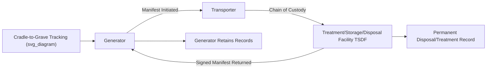

## Hazardous Waste Handling and Disposal

### Definition and Regulatory Classification

Hazardous waste is waste that, due to its quantity, concentration, or physical/chemical/infectious characteristics, poses a substantial present or potential threat to human health or the environment. Regulatory definitions vary by jurisdiction but converge on similar characteristic-based and listing-based classification approaches.

**Key Points**

- **Characteristic wastes** (US RCRA framework): Classified by hazard characteristic rather than specific listing.
  - **Ignitability**: Flash point below 60°C (140°F), or capable of causing fire through friction/spontaneous chemical change
  - **Corrosivity**: Aqueous waste with pH ≤ 2 or ≥ 12.5, or capable of corroding steel at a specified rate
  - **Reactivity**: Unstable, reacts violently with water, generates toxic gases, or is capable of detonation
  - **Toxicity**: Determined via the Toxicity Characteristic Leaching Procedure (TCLP), which simulates leaching under landfill conditions and compares extract concentrations against regulatory thresholds for specific metals, pesticides, and organics
- **Listed wastes**: Specifically named in regulation based on source or process (e.g., F-listed spent solvents, K-listed wastes from specific industrial processes, P- and U-listed discarded commercial chemical products).
- **Universal wastes**: A regulatory subcategory (batteries, pesticides, mercury-containing equipment, lamps) subject to streamlined management requirements due to high generation volume and lower relative risk when properly handled.
- **Biomedical/infectious waste**: Managed under separate but related frameworks due to pathogen risk (sharps, pathological waste, cultures).
- **Radioactive waste**: Governed by distinct regulatory regimes (e.g., under the Atomic Energy Act in the US) due to unique decay-based hazard properties, generally outside standard hazardous waste rules.

### Waste Generator Categories

Regulatory frameworks commonly tier obligations by generation volume:

- **Large Quantity Generators (LQG)**: Generate above a defined high-volume threshold per month; subject to the most stringent management, labeling, and reporting requirements.
- **Small Quantity Generators (SQG)**: Generate moderate volumes; subject to reduced but still substantive requirements.
- **Conditionally Exempt Small Quantity Generators (CESQG/VSQG)**: Generate minimal volumes (e.g., households, small businesses); subject to simplified management standards.

[Inference] Specific volume thresholds differ by country and are periodically revised, so current regulatory thresholds should be verified against the applicable national agency (e.g., US EPA, EU Waste Framework Directive annexes) rather than treated as fixed constants.

### Cradle-to-Grave Management: The Manifest System

The hazardous waste manifest is a legally required chain-of-custody document that accompanies waste from the point of generation through transport to final treatment, storage, or disposal. Each handler (generator, transporter, TSDF) signs the manifest, creating an auditable trail; discrepancies or non-receipt trigger regulatory investigation. This "cradle-to-grave" tracking is a defining feature distinguishing hazardous waste regulation from general solid waste management.

### Waste Minimization Hierarchy

Consistent with general waste hierarchy principles but with hazard-specific emphasis:

1. **Source reduction**: Process modification, substitution of less hazardous input chemicals, improved housekeeping to reduce generation at the source.
2. **Recycling/reclamation**: On-site or off-site recovery of solvents, metals, or other constituents for reuse (e.g., solvent distillation and recovery units).
3. **Treatment**: Physical, chemical, thermal, or biological processes to reduce volume, toxicity, or mobility prior to disposal.
4. **Disposal**: Final placement, reserved for waste or residuals that cannot be further reduced, recycled, or treated.

### Treatment Technologies

**Physical/Chemical Treatment**

- **Neutralization**: Adjusts pH of corrosive wastes using acids or bases to reach a manageable range before further treatment or disposal.
- **Precipitation**: Adds reagents (e.g., hydroxide, sulfide) to convert dissolved heavy metals into insoluble solid precipitates, which are then separated via clarification or filtration.
- **Oxidation-reduction (redox) treatment**: Chemically converts contaminants to less toxic or less mobile forms (e.g., reduction of hexavalent chromium Cr(VI), a known carcinogen, to trivalent Cr(III), which is far less toxic and mobile).
- **Solidification/stabilization (S/S)**: Mixes waste with binding agents (cement, lime, fly ash, or proprietary reagents) to physically encapsulate contaminants and/or chemically reduce their leachability, typically verified via TCLP testing on the treated product before land disposal is permitted.
- **Filtration and membrane separation**: Physically removes suspended solids or separates dissolved constituents (ultrafiltration, reverse osmosis) from aqueous hazardous waste streams.

**Thermal Treatment**

- **Incineration**: High-temperature (commonly 850–1200°C depending on waste type) combustion that destroys organic hazardous constituents; performance is regulated via destruction and removal efficiency (DRE), commonly required to meet or exceed 99.99% for most hazardous organics.
- **Rotary kiln incineration**: Handles heterogeneous solid, liquid, and sludge hazardous wastes via a rotating combustion chamber, widely used for mixed hazardous waste streams.
- **Plasma treatment**: Uses extremely high-temperature ionized gas to destroy or vitrify hazardous waste, including some difficult matrices; higher energy cost but effective for specific niche waste streams.

The destruction and removal efficiency for incineration is expressed as:

$$DRE = \left(\frac{W_{in} - W_{out}}{W_{in}}\right) \times 100\%$$

where $W_{in}$ is the mass feed rate of the target constituent and $W_{out}$ is the mass emission rate in the stack exhaust.

**Biological Treatment**

- Applicable to biodegradable hazardous organics (some spent solvents, certain pesticides) via engineered bioreactors or land treatment units, subject to the same microbial constraints discussed in bioremediation practice (see: Bioremediation and Environmental Microbiology).

### Disposal Methods

**Key Points**

- **Secure/hazardous waste landfills**: Engineered with more stringent double-composite liner systems, leak detection layers, and leachate collection compared to municipal solid waste landfills, reserved for treated residuals that meet land disposal restriction (LDR) treatment standards.
- **Deep well injection**: Injects liquid hazardous waste into deep, geologically isolated permeable rock formations below usable groundwater, confined by impermeable confining layers; used primarily for large-volume liquid industrial waste where suitable geology exists.
- **Land disposal restrictions (LDRs)**: Regulatory requirement (notably under US RCRA) that hazardous waste must be treated to meet specific concentration or technology-based standards before land disposal, preventing untreated hazardous waste from being placed directly in landfills.
- **Surface impoundments**: Engineered ponds used for storage or treatment (not typically final disposal) of liquid hazardous waste, requiring liner and monitoring systems comparable to landfills.

### Storage and Handling Requirements

**Key Points**

- **Container management**: Waste must be stored in compatible, labeled, closed containers; incompatible wastes (e.g., oxidizers and reducers, acids and cyanide-bearing waste) must be segregated to prevent violent reactions or toxic gas generation.
- **Accumulation time limits**: Regulatory frameworks typically impose maximum on-site accumulation periods before waste must be shipped to a permitted TSDF (treatment, storage, and disposal facility), varying by generator category.
- **Secondary containment**: Storage areas require containment structures (curbing, spill pallets) sized to contain a specified percentage of stored volume in the event of a container failure.
- **Personal protective equipment (PPE) and training**: Personnel handling hazardous waste require hazard communication training and appropriate PPE (chemical-resistant gloves, respirators, eye protection) matched to the specific waste hazards present.
- **Emergency preparedness**: Facilities must maintain spill response plans, emergency contact procedures, and, in many jurisdictions, formal contingency plans coordinated with local emergency responders.

### Hazardous Waste Compatibility Chart Concept

<svg xmlns="http://www.w3.org/2000/svg" viewBox="0 0 640 300">
<text x="320" y="24" font-size="16" text-anchor="middle" font-family="sans-serif" font-weight="bold">Waste Segregation Compatibility (svg_diagram)</text>
<rect x="20" y="50" width="100" height="100" fill="none" stroke="black" />
<rect x="130" y="50" width="100" height="100" fill="none" stroke="black" />
<rect x="240" y="50" width="100" height="100" fill="none" stroke="black" />
<rect x="350" y="50" width="100" height="100" fill="none" stroke="black" />
<rect x="460" y="50" width="150" height="100" fill="none" stroke="black" />
<text x="70" y="105" font-size="11" text-anchor="middle" font-family="sans-serif">Acids</text>
<text x="180" y="105" font-size="11" text-anchor="middle" font-family="sans-serif">Bases</text>
<text x="290" y="105" font-size="11" text-anchor="middle" font-family="sans-serif">Oxidizers</text>
<text x="400" y="105" font-size="11" text-anchor="middle" font-family="sans-serif">Reducers/</text>
<text x="400" y="118" font-size="11" text-anchor="middle" font-family="sans-serif">Flammables</text>
<text x="535" y="105" font-size="11" text-anchor="middle" font-family="sans-serif">Cyanide/Sulfide</text>
<text x="535" y="118" font-size="11" text-anchor="middle" font-family="sans-serif">bearing waste</text>
<line x1="70" y1="150" x2="180" y2="150" stroke="red" stroke-width="2" />
<text x="125" y="168" font-size="10" text-anchor="middle" fill="red" font-family="sans-serif">Incompatible: heat/violent reaction</text>
<line x1="290" y1="150" x2="400" y2="150" stroke="red" stroke-width="2" />
<text x="345" y="168" font-size="10" text-anchor="middle" fill="red" font-family="sans-serif">Incompatible: fire/explosion risk</text>
<line x1="70" y1="185" x2="535" y2="185" stroke="red" stroke-width="2" />
<text x="300" y="203" font-size="10" text-anchor="middle" fill="red" font-family="sans-serif">Incompatible: toxic gas generation (HCN, H2S)</text>
<text x="320" y="240" font-size="10" text-anchor="middle" font-family="sans-serif" font-style="italic">Segregation prevents unintended chemical reactions during storage</text>
</svg>

### Transboundary Movement and International Framework

- **Basel Convention (1989)**: International treaty regulating transboundary movements of hazardous waste, established primarily to prevent the transfer of hazardous waste from developed to developing nations without proper consent and disposal capacity. Requires prior informed consent (PIC) from the receiving country before shipment.
- **Basel Ban Amendment**: A subsequent amendment prohibiting export of hazardous waste from OECD to non-OECD countries entirely for parties that have ratified it, addressing gaps in the original consent-based system.
- **Rotterdam and Stockholm Conventions**: Related international frameworks governing hazardous chemicals trade (prior informed consent for certain pesticides/industrial chemicals) and persistent organic pollutants respectively, often discussed alongside Basel in an integrated chemicals-and-waste governance context.

### Site Remediation Context: Legacy Hazardous Waste Sites

Historic improper hazardous waste disposal (prior to modern regulation) created a legacy of contaminated sites requiring remediation, governed in the US by CERCLA/Superfund (see: Soil and Land Contamination). Liability under such frameworks is often strict, joint, and several — meaning any responsible party can be held liable for the full cleanup cost regardless of their proportional contribution, with cost recovery pursued among multiple potentially responsible parties (PRPs) afterward. [Inference] Liability allocation mechanisms and their practical application vary by case and jurisdiction.

### Case Illustration: Electroplating Facility Waste Stream

1. Electroplating operations generate F006 listed sludge (wastewater treatment sludge from electroplating) containing chromium, nickel, and cadmium.
2. Waste is characterized via TCLP, confirming toxicity characteristic for chromium.
3. On-site precipitation treatment (hydroxide precipitation) removes dissolved metals from rinse water, generating a metal hydroxide sludge.
4. Sludge is dewatered, then stabilized with a proprietary binder to reduce leachability below LDR treatment standards.
5. Treated, stabilized waste is manifested and transported to a permitted hazardous waste landfill for final disposal.
6. Treated effluent water, meeting discharge standards, is released to the sanitary sewer under a pretreatment permit or reused on-site.

### Related Topics

- Toxicity Characteristic Leaching Procedure (TCLP) methodology
- Superfund/CERCLA liability and legacy contaminated site remediation
- Electronic waste (e-waste) hazardous constituent management
- Basel Convention and transboundary hazardous waste governance
- Industrial wastewater pretreatment and heavy metal precipitation
- Radioactive waste classification and disposal (low-level vs. high-level)
- Chemical incompatibility and process safety management
- Solidification/stabilization binder chemistry