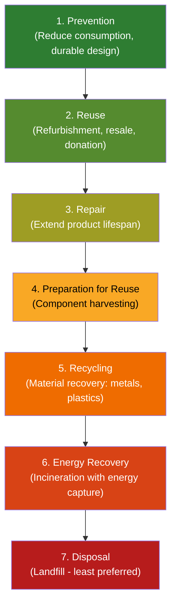
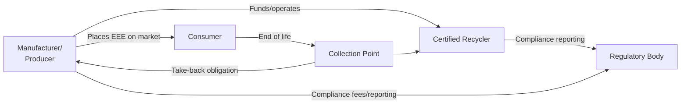

## Electronic Waste and Emerging Waste Streams

### Definition and Scope

Electronic waste (e-waste) refers to discarded electrical and electronic equipment (EEE) that has reached end-of-life, including devices with a plug, battery, or electronic component. The United Nations defines e-waste through the UN Kigali Amendment and Global E-waste Monitor frameworks as encompassing six categories per the Harmonized System (HS) classification used in the Global E-waste Statistics Partnership.

Emerging waste streams refer to newer or rapidly growing waste categories that traditional waste management systems were not originally designed to handle, driven by technological change and shifting consumption patterns.

### Classification Categories (UNITAR/ITU Framework)

1. **Temperature exchange equipment**: Refrigerators, freezers, air conditioners, heat pumps
2. **Screens and monitors**: TVs, monitors, laptops, tablets
3. **Lamps**: Fluorescent lamps, LED lamps, high-intensity discharge lamps
4. **Large equipment**: Washing machines, clothes dryers, dishwashers, large printing machines, photovoltaic panels
5. **Small equipment**: Vacuum cleaners, microwaves, toasters, cameras, small IT equipment
6. **Small IT and telecommunication equipment**: Mobile phones, GPS devices, routers, personal computers

### Composition of E-Waste

E-waste is a heterogeneous mixture with both valuable and hazardous constituent materials.

**Valuable/Recoverable Materials:**

- Precious metals: gold, silver, palladium, platinum
- Base metals: copper, aluminum, iron, tin
- Rare earth elements: neodymium, dysprosium (used in magnets, screens)
- Plastics: ABS, polycarbonate (potentially recyclable)

**Hazardous Constituents:**

- Heavy metals: lead (solder, CRT glass), mercury (lamps, switches), cadmium (batteries, semiconductors), hexavalent chromium
- Brominated flame retardants (BFRs) in plastics and circuit boards
- Polychlorinated biphenyls (PCBs) in older capacitors and transformers
- Beryllium in some connectors and springs

$$\text{E-waste value density} = \frac{\text{Mass of recoverable metals}}{\text{Total mass of unit}}$$

**Key Points**

- A metric tonne of circuit boards can contain higher gold concentrations than a metric tonne of mined gold ore, though this comparison depends heavily on ore grade and board type [Inference — commonly cited in industry literature but figures vary by source and equipment type].
- The hazard and value coexist in the same material stream, which is the central technical challenge of e-waste management.

### Global Scale and Growth Trends

According to the Global E-waste Monitor (UNITAR/ITU), global e-waste generation reached approximately 62 million tonnes in 2022, with growth outpacing the rate of formal recycling.

I'll verify current figures via search rather than relying on potentially outdated pre-training data.

Searched the webGlobal E-waste Monitor 2024 statistics million tonnes recycling rate

### Global Scale and Growth Trends (continued)

The most recent comprehensive data, per the UN's fourth Global E-waste Monitor (2024, covering 2022 data), confirms and updates the earlier figures:

- The world generated 62 million tonnes of e-waste in 2022, averaging 7.8 kg per person, an 82% surge from 34 million tonnes in 2010. [emew](https://emew.com/blog/global-e-waste-statistic)
- This is on track to rise another 32%, to 82 million tonnes, by 2030. [unitar](https://unitar.org/index.php/about/news-stories/press/global-e-waste-monitor-2024-electronic-waste-rising-five-times-faster-documented-e-waste-recycling)
- Just under one quarter (22.3%) of the year's e-waste mass was documented as having been properly collected and recycled in 2022, meaning most e-waste flows through informal, undocumented, or unknown channels. [unitar](https://unitar.org/index.php/about/news-stories/press/global-e-waste-monitor-2024-electronic-waste-rising-five-times-faster-documented-e-waste-recycling)
- The raw materials embedded in 2022 e-waste were valued at approximately $91 billion, including $19 billion in copper, $15 billion in gold, and $16 billion in iron, yet only about $19 billion was recovered through environmentally sound recycling. [wam](https://www.wam.ae/en/article/b2aeqes-electronic-waste-rising-five-times-faster-than)[emew](https://emew.com/blog/global-e-waste-statistic)
- Asia generated the most e-waste by volume in 2022 at 30 million tonnes, followed by the Americas (14.1 million tonnes) and Europe (13.1 million tonnes), though Europe leads in per-capita generation at 17.6 kg per person. [emew](https://emew.com/blog/global-e-waste-statistic)[emew](https://emew.com/blog/global-e-waste-statistic)
- China alone generated approximately 12 million tonnes in 2022, roughly 19.4% of the global total, largely due to concentrated EEE manufacturing and a large domestic consumer base. [emew](https://emew.com/blog/global-e-waste-statistic)[emew](https://emew.com/blog/global-e-waste-statistic)
- Recycling infrastructure disparity is stark: Europe's documented collection and recycling rate stood at 42.8%, while African countries recorded rates below 1%. [yandex](https://portal.yandex.com.tr/yaozet/science/global-e-waste-crisis-2024-id1-tR0unMzM)
- Only about 1% of global rare earth element demand is currently met through e-waste recycling, despite these elements being critical to renewable energy and electronics manufacturing. [unitar](https://unitar.org/index.php/about/news-stories/press/global-e-waste-monitor-2024-electronic-waste-rising-five-times-faster-documented-e-waste-recycling)
- The gap is projected to widen: the documented collection and recycling rate is forecast to actually drop from 22.3% in 2022 to 20% by 2030, since generation is growing far faster than recycling capacity. [polimi](https://www.mater.polimi.it/?p=9735)
- Contributing drivers include technological progress, higher consumption, limited repair options, shorter product life cycles, growing electronification of society, design shortcomings, and inadequate e-waste management infrastructure. [wam](https://www.wam.ae/en/article/b2aeqes-electronic-waste-rising-five-times-faster-than)

**Key Points**

- The "5x faster" framing (waste generation growth vs. recycling growth) is the headline finding of the 2024 report and a useful exam/quiz statistic.
- Only a minority of countries have binding targets: just 46 countries have collection rate targets and only 36 have recycling rate targets, indicating major policy gaps globally. [yandex](https://portal.yandex.com.tr/yaozet/science/global-e-waste-crisis-2024-id1-tR0unMzM)

### Environmental and Health Impacts

**Soil and Water Contamination**

Improper disposal (landfilling, open dumping) allows heavy metals to leach into soil and groundwater. Lead and cadmium are particularly mobile in acidic soil conditions and bioaccumulate in food chains.

**Air Pollution from Informal Processing**

Open burning of cables and circuit boards to recover copper releases:

- Dioxins and furans (from burning PVC-insulated wires)
- Polycyclic aromatic hydrocarbons (PAHs)
- Particulate matter containing heavy metal residues

**Human Health Effects (Informal Recycling Communities)**

Documented in e-waste processing hubs such as Agbogbloshie (Ghana) and Guiyu (China):

- Elevated blood lead levels in children, associated with neurodevelopmental deficits
- Respiratory illness linked to particulate and dioxin exposure
- Reproductive and endocrine effects from BFR and heavy metal exposure [Inference — causal mechanisms are supported by toxicological data, though epidemiological attribution in mixed-exposure communities carries confounding variables]

**Water Body Contamination**

Acid leaching used in informal gold recovery (using cyanide or nitric/hydrochloric acid baths) contaminates local waterways with both the metals of interest and process chemicals.

### E-Waste Management Hierarchy

Following the standard waste management hierarchy (adapted from the EPA/EU waste hierarchy), applied specifically to e-waste:

### Formal Recycling Process (Technical Workflow)

1. **Collection and Sorting**: Take-back programs, municipal drop-off, or extended producer responsibility (EPR) collection points
2. **Manual Disassembly**: Removal of batteries, hazardous components (CRTs, mercury lamps), and easily separable materials
3. **Mechanical Shredding**: Bulk shredding into smaller fragments for material liberation
4. **Separation Technologies**:
   - **Magnetic separation**: Recovers ferrous metals (iron, steel)
   - **Eddy current separation**: Recovers non-ferrous metals (aluminum, copper) using induced magnetic fields that repel conductive materials
   - **Density-based separation**: Air classification and float-sink methods separate plastics from metals
5. **Hydrometallurgical Processing**: Acid or cyanide leaching to dissolve and recover precious metals from circuit boards
6. **Pyrometallurgical Processing**: Smelting circuit board material at high temperature to recover copper and precious metals bound in a copper matrix

$$\text{Recovery efficiency} = \frac{\text{Mass of metal recovered}}{\text{Mass of metal present in input stream}} \times 100\%$$

**Example**

A formal e-waste facility processing 1,000 kg of mixed circuit boards might yield approximately:

- 200-300 g of gold (at typical concentrations of 200-300 ppm in high-grade boards) [Unverified — concentration varies significantly by device type, age, and manufacturer; commonly cited ranges in industry literature]
- Several kilograms of silver and palladium
- 100-200 kg of recoverable copper

### Informal Recycling Sector

In many Global South contexts, informal recycling dominates due to economic incentives (labor arbitrage, absence of regulation, immediate cash value of recovered metals) despite formal EPR systems existing on paper.

**Characteristics:**

- Manual disassembly without personal protective equipment (PPE)
- Open-air acid leaching and burning
- Concentration in specific geographic clusters (informal recycling hubs)
- Significant contribution to local employment and livelihoods, creating a policy tension between economic dependency and environmental/health harm

**Key Points**

- The informal sector often achieves higher material recovery rates for precious metals than formal facilities because acid leaching is more aggressive, but at severe environmental and occupational health cost.
- Formalization efforts (e.g., WEEE-certified processing, Basel Convention-compliant facilities) aim to capture this labor force into regulated systems with proper controls.

### Regulatory Frameworks

**Basel Convention (1989, amended)**

International treaty regulating transboundary movement of hazardous waste, including e-waste. The 2019 Basel Ban Amendment restricts export of hazardous e-waste from OECD to non-OECD countries.

**EU WEEE Directive (Waste Electrical and Electronic Equipment, 2012/19/EU)**

Establishes:

- Extended Producer Responsibility (EPR): manufacturers bear responsibility for end-of-life collection and recycling
- Collection targets (percentage of EEE placed on market)
- Recycling and recovery targets by equipment category

**EU RoHS Directive (Restriction of Hazardous Substances)**

Restricts use of specific hazardous materials (lead, mercury, cadmium, hexavalent chromium, certain BFRs) in new EEE manufacturing — a preventive, upstream complement to WEEE's downstream focus.

**R2 (Responsible Recycling) and e-Stewards Certifications**

Voluntary US-based certification standards for electronics recyclers, covering data security, worker safety, and environmentally sound material recovery.

**Philippine Context**

Republic Act No. 6969 (Toxic Substances and Hazardous and Nuclear Wastes Control Act) governs hazardous waste including e-waste in the Philippines, implemented through DENR Administrative Orders. E-waste is also addressed indirectly through RA 9003 (Ecological Solid Waste Management Act) for general waste stream diversion, though a dedicated national e-waste law comparable to WEEE has been proposed but not fully enacted as comprehensive binding legislation. [Unverified — legislative status should be checked against current DENR issuances, as policy status changes]

### Extended Producer Responsibility (EPR) Model

Under EPR, the financial and physical responsibility for end-of-life management shifts from municipalities/taxpayers to producers, internalizing the disposal cost into the product's economic lifecycle and creating a market incentive for eco-design (design for disassembly, material reduction, recyclability).

### Emerging Waste Streams

Beyond conventional e-waste, several newer waste categories are growing rapidly and pose distinct technical challenges.

#### Lithium-Ion Battery Waste

Driven by proliferation of electric vehicles (EVs), power tools, and consumer electronics.

**Technical Challenges:**

- Fire/thermal runaway risk during storage, transport, and processing (damaged cells can self-ignite via internal short circuit)
- Complex chemistry (NMC — nickel manganese cobalt, LFP — lithium iron phosphate, NCA — nickel cobalt aluminum) requiring different recovery processes
- Recovery methods: pyrometallurgical (smelting, lower recovery purity), hydrometallurgical (leaching, higher recovery purity but more complex), and direct recycling (cathode material regeneration, still largely at pilot/emerging stage)

$$\text{EV battery waste volume (projected)} \propto \text{EV sales}_{t-10 \text{ to } t-15}$$

(Reflecting typical EV battery service life before entering the waste/second-life stream — this is a simplified conceptual relationship, not a validated quantitative model)

#### Photovoltaic (Solar Panel) Waste

As first-generation solar installations from the 2000s-2010s reach end-of-life (typical warranty/service life 25-30 years), panel waste volumes are beginning to scale.

**Composition:** Glass (majority by mass), aluminum frame, silicon wafers, silver/copper conductive elements, EVA (ethylene-vinyl acetate) encapsulant, and in older/thin-film panels, cadmium telluride (CdTe) or copper indium gallium selenide (CIGS) — both requiring careful hazardous handling.

**Recycling Challenge:** Current recycling processes recover glass and aluminum readily, but efficient recovery of silicon and silver remains technically and economically difficult, resulting in most "recycled" panels currently achieving primarily downcycling rather than high-value material recovery. [Inference — reflects general industry consensus circa early-to-mid 2020s literature; specific recovery rates vary by technology and facility]

#### Wind Turbine Blade Waste

Composite materials (fiberglass or carbon fiber reinforced polymer) used in turbine blades are extremely difficult to recycle due to thermoset resin matrices that cannot be re-melted like thermoplastics. Common current disposal is landfilling of cut blade segments; emerging solutions include mechanical shredding for use as filler material, and cement co-processing (using ground composite as a cement kiln feedstock, where the resin serves as fuel value and glass fibers as raw material).

#### E-Cigarette and Vape Waste

A rapidly emerging micro-e-waste stream: disposable vape devices combine lithium-ion batteries, plastic housings, and residual nicotine liquid, and are frequently disposed of in general municipal waste rather than e-waste or battery collection streams, creating fire risk in waste collection vehicles and material recovery facilities (MRFs).

#### Textile and "Smart Textile" E-Waste

Wearable technology and smart textiles (embedded sensors, conductive threads, small batteries) blur the line between textile waste and e-waste, complicating sorting since standard textile recycling infrastructure is not designed to detect or safely remove embedded electronics.

**Next Steps**

- Battery-specific EPR schemes are an active area of regulatory development in multiple jurisdictions as EV adoption scales; verify jurisdiction-specific rules before citing as settled policy.
- Solar panel recycling mandates (e.g., under evolving EU and state-level US frameworks) are still maturing; treat specific regulatory deadlines as time-sensitive and subject to verification.

### Diagram: E-Waste Material Flow Pathways (svg_diagram)

<svg xmlns="http://www.w3.org/2000/svg" viewBox="0 0 900 480">
<text x="450" y="30" font-size="20" font-weight="bold" text-anchor="middle" fill="#1a1a1a">E-Waste Material Flow Pathways (svg_diagram)</text>
<rect x="370" y="55" width="160" height="50" rx="8" fill="#37474f" />
<text x="450" y="85" font-size="14" fill="#fff" text-anchor="middle">End-of-Life EEE</text>
<line x1="450" y1="105" x2="200" y2="150" stroke="#555" stroke-width="2" />
<line x1="450" y1="105" x2="450" y2="150" stroke="#555" stroke-width="2" />
<line x1="450" y1="105" x2="700" y2="150" stroke="#555" stroke-width="2" />
<rect x="110" y="150" width="180" height="50" rx="8" fill="#2e7d32" />
<text x="200" y="180" font-size="13" fill="#fff" text-anchor="middle">Formal Collection</text>
<rect x="360" y="150" width="180" height="50" rx="8" fill="#ef6c00" />
<text x="450" y="175" font-size="13" fill="#fff" text-anchor="middle">Informal Sector</text>
<text x="450" y="192" font-size="13" fill="#fff" text-anchor="middle">(unregulated)</text>
<rect x="610" y="150" width="180" height="50" rx="8" fill="#b71c1c" />
<text x="700" y="175" font-size="13" fill="#fff" text-anchor="middle">Municipal/General</text>
<text x="700" y="192" font-size="13" fill="#fff" text-anchor="middle">Waste (mismanaged)</text>
<line x1="200" y1="200" x2="200" y2="240" stroke="#555" stroke-width="2" />
<rect x="110" y="240" width="180" height="50" rx="8" fill="#1565c0" />
<text x="200" y="265" font-size="13" fill="#fff" text-anchor="middle">Certified Recycling</text>
<text x="200" y="280" font-size="12" fill="#fff" text-anchor="middle">Facility (WEEE/R2)</text>
<line x1="450" y1="200" x2="330" y2="240" stroke="#555" stroke-width="2" />
<line x1="450" y1="200" x2="450" y2="240" stroke="#555" stroke-width="2" />
<rect x="360" y="240" width="180" height="50" rx="8" fill="#f9a825" />
<text x="450" y="265" font-size="13" fill="#000" text-anchor="middle">Manual Dismantling</text>
<text x="450" y="280" font-size="12" fill="#000" text-anchor="middle">Acid Leaching/Burning</text>
<line x1="700" y1="200" x2="700" y2="240" stroke="#555" stroke-width="2" />
<rect x="610" y="240" width="180" height="50" rx="8" fill="#6d4c41" />
<text x="700" y="265" font-size="13" fill="#fff" text-anchor="middle">Landfill</text>
<line x1="200" y1="290" x2="200" y2="330" stroke="#555" stroke-width="2" />
<rect x="110" y="330" width="180" height="50" rx="8" fill="#1565c0" />
<text x="200" y="355" font-size="13" fill="#fff" text-anchor="middle">Recovered Metals</text>
<text x="200" y="370" font-size="12" fill="#fff" text-anchor="middle">Back to Supply Chain</text>
<line x1="450" y1="290" x2="450" y2="330" stroke="#555" stroke-width="2" />
<rect x="360" y="330" width="180" height="50" rx="8" fill="#f9a825" />
<text x="450" y="355" font-size="13" fill="#000" text-anchor="middle">Soil/Water/Air</text>
<text x="450" y="370" font-size="12" fill="#000" text-anchor="middle">Contamination</text>
<line x1="700" y1="290" x2="700" y2="330" stroke="#555" stroke-width="2" />
<rect x="610" y="330" width="180" height="50" rx="8" fill="#6d4c41" />
<text x="700" y="355" font-size="13" fill="#fff" text-anchor="middle">Leachate/</text>
<text x="700" y="370" font-size="12" fill="#fff" text-anchor="middle">Groundwater Risk</text>

<text x="450" y="430" font-size="12" fill="#555" text-anchor="middle">Green = preferred pathway | Amber/Red = environmental and health risk pathways</text>

</svg>

### Circular Economy Approaches

**Design for Disassembly (DfD)**: Product engineering that minimizes adhesives and mixed-material bonding, uses standardized fasteners instead of soldered/glued joints, and enables tool-free or low-tool disassembly.

**Urban Mining**: Treating waste electronics as an ore body — a deliberate reframing that recognizes e-waste's material concentration often exceeds virgin ore grades for certain metals.

**Modular Product Design**: Enables component-level repair and upgrade (e.g., replaceable batteries, modular smartphone components), extending product life and reducing waste generation at the source — the top tier of the waste hierarchy.

**Right to Repair Movement**: Policy and consumer advocacy pushing manufacturers to provide repair manuals, spare parts, and diagnostic tools, countering planned obsolescence and proprietary lock-in that historically discouraged repair.

**Conclusion**

Electronic waste represents a uniquely dual-natured waste stream — simultaneously one of the most environmentally hazardous and one of the most economically valuable categories in the modern waste hierarchy. The core structural problem, confirmed by the 2024 Global E-waste Monitor, is not a lack of technical recovery capability but an infrastructure and formalization gap: recycling systems are growing roughly five times slower than the waste stream itself. Emerging categories (lithium-ion batteries, solar panels, wind turbine composites, vape devices, smart textiles) are compounding this gap by introducing new material chemistries and hazard profiles faster than regulatory and recycling infrastructure can adapt. Effective management requires simultaneous action across the full hierarchy: upstream design reform (RoHS-style restriction, DfD, right-to-repair), midstream collection infrastructure (EPR schemes), and downstream formalization of recovery (certified recycling displacing informal, hazardous processing).

**Related Topics**

- Extended Producer Responsibility (EPR) policy design and economics
- Critical raw materials and rare earth element supply chain security
- Lithium-ion battery second-life applications (grid storage repurposing before recycling)
- Basel Convention and transboundary hazardous waste trade
- Life Cycle Assessment (LCA) methodology applied to electronics
- Informal sector formalization strategies and just transition frameworks
- Solid waste management systems and integrated waste hierarchies
- Hazardous waste identification, handling, and RA 6969 (Philippine context)