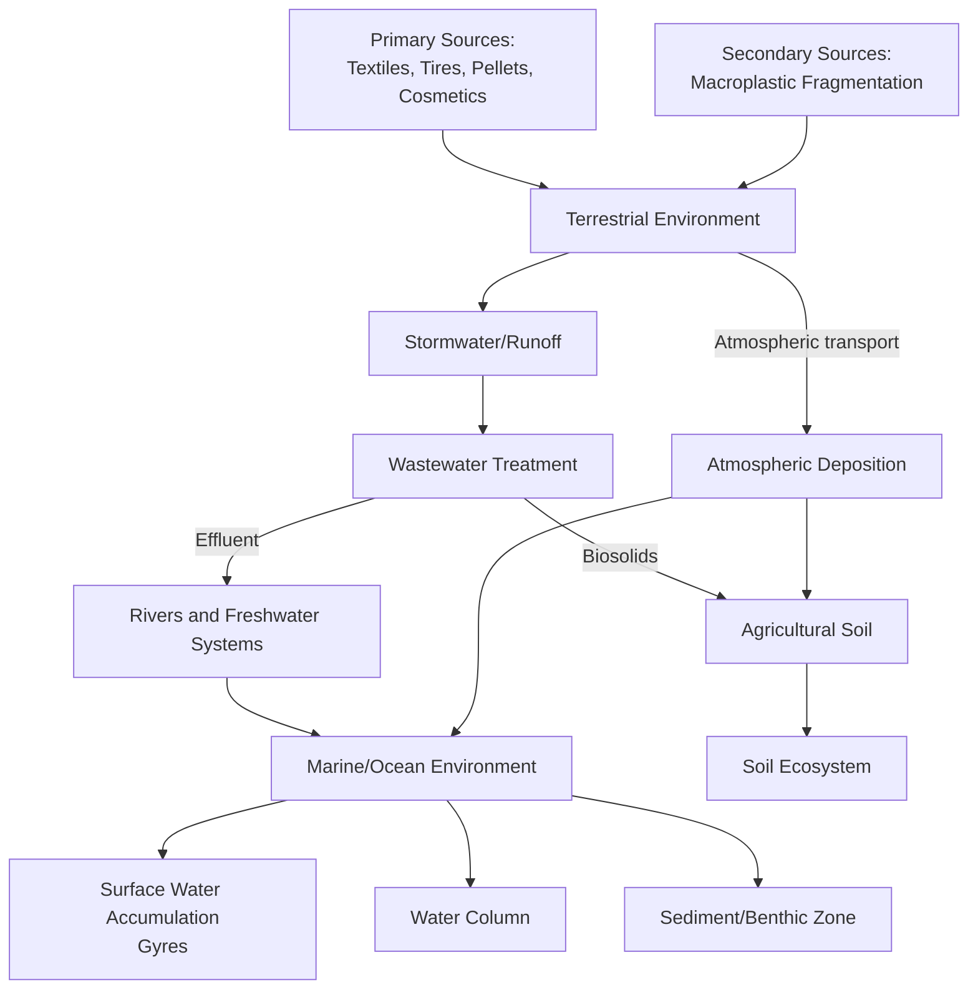

## Plastics Pollution and Microplastics

### Definition and Classification

Plastic pollution refers to the accumulation of synthetic polymer materials in the environment at scales and durations that cause ecological or human harm. Plastics are classified by size into a standard hierarchy used in environmental science and regulatory literature:

- **Macroplastics**: >25 mm (bottles, bags, packaging)
- **Mesoplastics**: 5-25 mm
- **Microplastics**: <5 mm (the EPA/NOAA operational threshold)
- **Nanoplastics**: <1 μm (1000 nm), a further subdivision gaining research attention due to distinct toxicological and transport behavior

### Polymer Types and Properties

| Polymer | Abbreviation | Common Uses | Density (g/cm³) |
| --- | --- | --- | --- |
| Polyethylene terephthalate | PET | Bottles, textiles (polyester) | ~1.38 |
| High-density polyethylene | HDPE | Containers, pipes | ~0.95 |
| Polyvinyl chloride | PVC | Pipes, packaging | ~1.38 |
| Low-density polyethylene | LDPE | Bags, films | ~0.92 |
| Polypropylene | PP | Bottle caps, textiles | ~0.90 |
| Polystyrene | PS | Foam packaging, disposable cutlery | ~1.05 |

**Key Points**

- Density relative to seawater (~1.025 g/cm³) determines whether a polymer floats or sinks, which directly affects environmental transport pathway and detection method (surface trawls vs. sediment sampling).
- PP and PE typically float; PET, PVC, and some PS variants tend to sink or become neutrally buoyant once biofouled (colonized by biofilm, which increases effective density).

### Primary vs. Secondary Microplastics

**Primary microplastics** are manufactured at microscopic size for direct use:

- Microbeads in cosmetics and personal care products (largely banned in several jurisdictions, e.g., US Microbead-Free Waters Act of 2015)
- Pre-production pellets ("nurdles") — the industrial feedstock form of plastic, frequently spilled during transport and manufacturing
- Synthetic textile fibers shed during use

**Secondary microplastics** form through fragmentation of larger plastic debris via:

- **Photodegradation**: UV radiation breaks polymer chains (photo-oxidation), embrittling the material
- **Mechanical abrasion**: Wave action, sediment friction, wind
- **Thermal degradation**: Heat exposure accelerating chain scission
- **Biodegradation** (partial): Microbial activity, though most conventional plastics degrade extremely slowly by this pathway

$$\text{Fragmentation rate} \propto f(\text{UV exposure}, \text{mechanical stress}, \text{polymer additive composition})$$

### Major Sources

1. **Synthetic textile laundering**: Washing machines release microfibers (primarily polyester, nylon, acrylic) into wastewater; a single laundry load can release a substantial number of fibers, with actual counts varying by fabric type, garment age, and washing conditions [Unverified — specific per-wash fiber counts cited in literature vary widely, e.g., hundreds of thousands to millions of fibers per wash depending on methodology].
2. **Tire wear particles**: Abrasion of vehicle tires releases particles containing synthetic rubber (styrene-butadiene) and other additives; increasingly recognized as one of the largest single contributors to microplastic loading in some road-adjacent and urban runoff studies.
3. **Plastic pellet (nurdle) spillage**: Occurs during manufacturing, transport, and loading at ports.
4. **Fragmentation of mismanaged macroplastic waste**: Packaging, fishing gear, single-use items degrading in the environment.
5. **Wastewater treatment plant effluent**: Many treatment plants remove a majority of microplastics from influent, but the sheer volume of wastewater processed still results in significant absolute discharge; treatment sludge (biosolids) itself can become a secondary source when applied to agricultural land.
6. **Agricultural plastic**: Mulch films, coated fertilizers (controlled-release coatings), greenhouse films.

### Environmental Distribution and Fate

**Ocean Gyres and Accumulation Zones**

Large-scale ocean circulation patterns concentrate floating plastic debris in five major subtropical gyres, the most studied being the Great Pacific Garbage Patch in the North Pacific Gyre. These are not solid "islands" of trash but zones of elevated concentration, including substantial microplastic fractions not visible from surface observation alone.

**Atmospheric Transport**

Research over the past decade has established that microplastics and fibers are transported via atmospheric processes and deposited in remote locations, including polar regions and high-altitude/remote terrestrial sites, indicating a genuinely global distribution pathway rather than one confined to aquatic systems. [Inference — the general phenomenon is well-established in peer-reviewed literature; specific quantitative deposition rates are actively being refined and vary substantially by location and study]

### Detection and Sampling Methodologies

**Surface Water Sampling**

- **Manta trawl / neuston net**: Fine-mesh nets (typically 300-333 μm) towed at the surface, standard for marine surface microplastic surveys
- Limitation: Only captures particles larger than mesh size, systematically undercounting smaller microplastics and nanoplastics

**Sediment and Soil Sampling**

- Core sampling followed by density separation (using saturated salt solutions like NaCl or NaI to float plastic particles away from denser sediment matrix)

**Identification and Characterization**

- **FTIR spectroscopy (Fourier-transform infrared spectroscopy)**: Identifies polymer type via characteristic absorption spectra
- **Raman spectroscopy**: Complementary technique, particularly effective for smaller particles and colored/pigmented plastics
- **Pyrolysis-GC/MS**: Thermally decomposes samples and analyzes breakdown products, useful for mass-based quantification and bulk polymer identification
- **Visual/microscopic sorting**: Prone to significant misidentification of non-plastic particles (natural fibers, minerals) without spectroscopic confirmation

**Key Points**

- A major methodological challenge across the field is lack of standardization — different studies use different size cutoffs, mesh sizes, and identification confirmation rates, making cross-study comparison difficult. This is a genuine, actively discussed limitation in the scientific literature.

### Ecological Impacts

**Ingestion Pathways**

Organisms across trophic levels ingest microplastics, from zooplankton to filter-feeding bivalves to fish and marine mammals, either through direct mistaken ingestion or indirect ingestion via prey.

**Physical Effects**

- Gut blockage and false satiation (reduced feeding, particularly documented in seabirds ingesting larger plastic fragments)
- Tissue abrasion and inflammation at ingestion or uptake sites

**Chemical Effects**

- **Additive leaching**: Plasticizers (phthalates), flame retardants, and stabilizers used in plastic manufacturing can leach out and exert endocrine-disrupting effects
- **Vector effect (Trojan horse hypothesis)**: Microplastics can adsorb persistent organic pollutants (POPs) such as PCBs and DDT from surrounding water due to their hydrophobic surface, potentially concentrating and transporting these contaminants into organisms upon ingestion. The magnitude of this vector effect relative to direct exposure pathways remains an area of active scientific investigation. [Inference — the adsorption mechanism itself is well-documented physical chemistry; the net contribution to organismal toxic load relative to other exposure routes is still debated in the literature]

**Trophic Transfer**

Evidence supports microplastic transfer up food chains (e.g., from prey to predator), though biomagnification (increasing concentration at higher trophic levels, analogous to mercury or DDT) is not consistently demonstrated for microplastics themselves — this differs from the biomagnification pattern seen in persistent lipophilic chemical pollutants. [Inference — reflects current scientific consensus, but this remains an active research question]

### Human Health Considerations

Microplastics have been detected in human blood, lung tissue, placenta, and other biological samples in emerging research over the past several years. As of current scientific understanding, the health implications of chronic low-dose human exposure remain under active investigation, with mechanistic and epidemiological data still developing. [Unverified — human health impact quantification is a rapidly evolving research area; specific dose-response relationships in humans are not yet firmly established]

I'll verify the most current state of this research area given its fast-moving nature.

Searched the webmicroplastics human health research 2025 findings blood brain

### Human Health Considerations (updated with current research)

Recent findings (2024-2025) have substantially advanced this rapidly evolving field:

- A University of New Mexico study, published in Nature Medicine (2025), analyzed postmortem brain, liver, and kidney tissue from individuals who died in 2016 versus 2024, and found microplastic concentrations in brain tissue were approximately 50% higher in the 2024 cohort. Brain tissue contained substantially higher concentrations than liver or kidney tissue in the same individuals.
- The same study found no correlation between microplastic levels and the age of the person at death, which researchers interpreted as evidence that the body clears nanoplastic particles over time rather than accumulating them indefinitely across a lifetime — an important nuance distinguishing this from classic bioaccumulation.
- Patients with diagnosed dementia showed three to five times higher microplastic concentrations in brain tissue compared to non-dementia patients in the same study, though researchers explicitly cautioned this is an association, not established causation, since dementia-related changes to the blood-brain barrier could plausibly increase particle influx independent of any causal role in disease onset.
- Separately, a 2025 University of Rhode Island study found mice with a genetic predisposition to Alzheimer's disease exposed to polystyrene microplastics showed memory impairment consistent with early-stage disease, while unexposed control mice did not — an animal-model finding suggestive of a mechanistic link but not directly transferable to confirmed human causation.
- Microplastics and nanoplastics have also been detected in carotid artery plaque, with one study linking their presence to elevated risk of heart attack, stroke, or death from any cause in affected patients.
- Microplastics have been documented in a wide range of human tissues and fluids beyond the brain, including blood, breast milk, semen, placenta, and bone marrow.

**Key Points**

- The brain-tissue mass estimate (approximately 0.5% microplastic by weight, framed in media coverage as "a plastic spoon's worth") has been specifically challenged by other researchers, who note that certain brain fat structures can be difficult to distinguish from plastic particles using the detection methods employed — this is a genuine open methodological dispute, not settled fact. [Unverified — disputed within the scientific community as of the most recent reporting]
- As of current evidence, organizations including the WHO and European Food Safety Authority continue to emphasize that human tissue presence has been established, but direct causal links to specific disease outcomes in humans have not yet been confirmed, and longitudinal dose-response data remains a research priority. This is an appropriately cautious characterization of where the science currently stands — treat any claim of confirmed human disease causation as premature.

### Regulatory and Policy Responses

**Microbead Bans**: Multiple jurisdictions (US Microbead-Free Waters Act 2015, EU restrictions under REACH) have prohibited intentionally added microplastics in rinse-off cosmetic products.

**Single-Use Plastics Directives**: The EU Single-Use Plastics Directive (2019/904) restricts specific single-use plastic items (cutlery, straws, plates) where alternatives exist, targeting a major macroplastic source that fragments into microplastics.

**Global Plastics Treaty Negotiations**: Ongoing UN-led negotiations (under UNEP, following UNEA Resolution 5/14) aim to establish a legally binding international instrument addressing plastic pollution across its full lifecycle, from production through disposal. Negotiations have been contentious regarding whether the treaty should cap virgin plastic production or focus primarily on waste management and recycling. [Unverified — treaty status is actively changing; verify current negotiation status and any adopted text against current UNEP sources before citing as finalized]

**Textile Filter Mandates**: France has implemented requirements for new washing machines to include microfiber filters (effective 2025), representing an emerging source-control regulatory approach targeting laundering as a primary microplastic pathway. [Unverified — verify current implementation status and scope]

**Philippine Context**

The Philippines has implemented Republic Act No. 11898 (Extended Producer Responsibility Act, amending RA 9003), which mandates EPR programs for plastic packaging waste among obligated enterprises, representing a source-reduction and producer-accountability approach to the broader plastic pollution problem rather than a microplastic-specific regulation.

### Analytical Framework: Mass Balance of Plastic Waste

$$M_{\text{produced}} = M_{\text{in use}} + M_{\text{landfilled}} + M_{\text{incinerated}} + M_{\text{recycled}} + M_{\text{mismanaged/environment}}$$

Where $M_{\text{mismanaged/environment}}$ represents the fraction entering terrestrial and aquatic ecosystems through inadequate collection or disposal infrastructure — the primary driver of new macroplastic (and eventually microplastic) pollution loading.

### Mitigation and Intervention Strategies

**Upstream (Production and Design)**

- Reduction in virgin plastic production growth
- Design for recyclability (mono-material packaging vs. multi-layer composites that are difficult to separate)
- Extended Producer Responsibility schemes shifting end-of-life cost to producers

**Midstream (Use and Consumption)**

- Substitution with reusable systems (refill models, deposit-return schemes)
- Textile design changes (reduced synthetic fiber shedding through fabric construction)

**Downstream (Capture and Remediation)**

- Wastewater treatment tertiary filtration upgrades (membrane bioreactors, advanced filtration) to increase microplastic capture rates
- Stormwater management interventions (tire particle capture systems in road runoff)
- Riverine and coastal cleanup technologies (passive collection systems in high-concentration river mouths, though these primarily address macroplastics before further fragmentation)

**Key Points**

- Downstream cleanup, while visible and often publicly popular, addresses a small fraction of total plastic flux compared to upstream production reduction and midstream capture; most environmental science and policy literature frames source reduction as substantially higher-leverage than remediation, though remediation still has value for preventing further fragmentation of already-mismanaged waste.

**Next Steps**

- The global plastics treaty outcome remains an active, unresolved policy question — track UNEP proceedings for the current negotiating text and adoption status rather than treating any specific provision as settled.
- Human health dose-response research is a fast-moving area; specific disease-causation claims should be checked against the most recent peer-reviewed literature rather than treated as established.

**Related Topics**

- Persistent Organic Pollutants (POPs) and the Stockholm Convention
- Extended Producer Responsibility (EPR) policy design (RA 11898, Philippine context)
- Wastewater treatment technology and tertiary filtration
- Marine debris and ocean gyre dynamics
- Endocrine-disrupting chemicals (phthalates, BPA)
- Circular economy models for packaging
- Bioplastics and biodegradable polymer alternatives (and their actual end-of-life performance)
- Solid waste management and integrated waste hierarchies