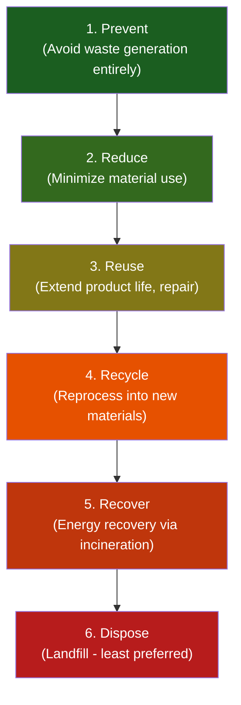
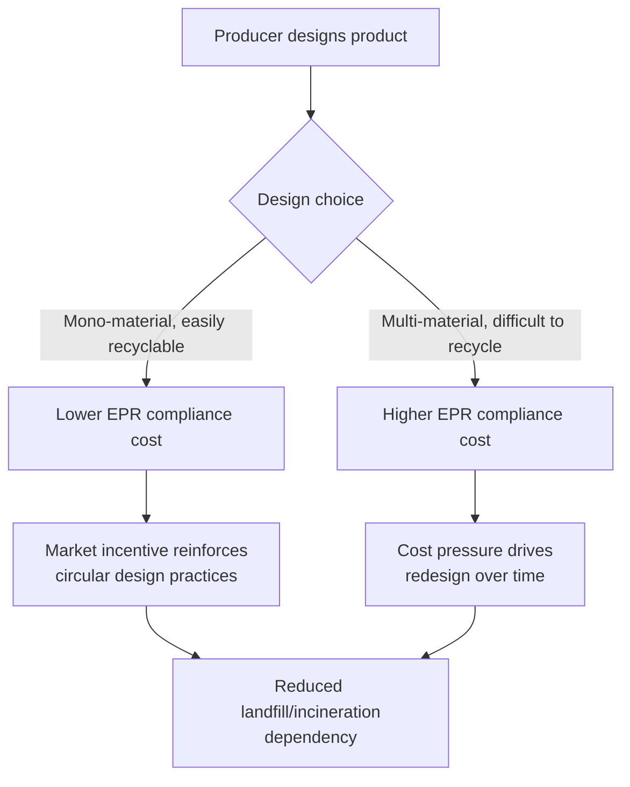

## Recycling Systems and Circular Waste Design

### Definition and Conceptual Framework

Recycling is the process of collecting, sorting, and reprocessing waste materials into new products, displacing the need for virgin raw material extraction. Circular waste design extends this concept upstream, treating waste prevention as a design parameter rather than an end-of-pipe problem — embedding material recovery, reuse, and regeneration into a product's conception rather than addressing waste only after generation.

This distinguishes two overlapping paradigms:

- **Linear economy**: Take → Make → Use → Dispose (single-pass material flow)
- **Circular economy**: A closed-loop system where materials are designed to re-enter production cycles, minimizing extraction and disposal

$$\text{Circularity rate} = \frac{\text{Material flowing back into the economy}}{\text{Total material input}} \times 100\%$$

### The Waste Hierarchy (Foundational Framework)

This hierarchy, formalized in frameworks such as the EU Waste Framework Directive (2008/98/EC) and widely adopted internationally, establishes recycling as preferable to disposal but subordinate to prevention, reduction, and reuse — a common source of confusion since recycling is often (incorrectly) treated as the primary solution rather than a mid-tier intervention.

### Types of Recycling Processes

**Mechanical Recycling**

Physical reprocessing without altering the polymer/material's chemical structure: sorting, shredding, washing, melting, and reforming. Dominant method for metals, glass, and many plastics (particularly PET and HDPE).

**Chemical (Feedstock) Recycling**

Breaks materials down to monomer or molecular building blocks via depolymerization, pyrolysis, or gasification, then rebuilds new polymers. Enables recycling of contaminated or mixed plastic waste that mechanical recycling cannot process, but is generally more energy- and capital-intensive, and currently operates at smaller commercial scale than mechanical recycling. [Inference — reflects general industry consensus as of recent years; scale-up trajectory and economic viability are actively evolving and vary by feedstock and technology provider]

**Organic Recycling (Composting/Anaerobic Digestion)**

Biological decomposition of organic waste (food scraps, yard waste) into compost (aerobic) or biogas plus digestate (anaerobic digestion), returning nutrients to soil or producing renewable energy.

**Downcycling vs. Upcycling vs. Closed-Loop Recycling**

- **Downcycling**: Material quality degrades with each recycling cycle (e.g., PET bottles → lower-grade fiber for carpet, which typically cannot be recycled again into food-grade packaging)
- **Upcycling**: Material is repurposed into a higher-value product than the original
- **Closed-loop recycling**: Material is recycled back into the same or equivalent product repeatedly without quality loss (aluminum and glass are the classic examples, as both can theoretically be recycled indefinitely without significant property degradation)

**Key Points**

- Glass and aluminum are frequently cited as the materials with the highest closed-loop recycling potential because their molecular/atomic structure does not degrade through the melt-reform cycle, unlike most polymers, whose chain length shortens with repeated heat processing.

### Material Recovery Facility (MRF) Architecture

A Material Recovery Facility is the industrial infrastructure that sorts commingled recyclables into distinct material streams for sale to reprocessors.

**Key Sorting Technologies:**

- **Trommel screens**: Rotating cylindrical screens separating material by size (typically separating fiber/paper from containers)
- **Magnetic separation**: Overhead magnets or magnetic pulleys extract ferrous (iron-containing) metals
- **Eddy current separators**: Rapidly alternating magnetic fields induce currents in non-ferrous conductive metals (aluminum), causing them to be repelled and physically ejected from the material stream
- **Near-infrared (NIR) optical sorting**: Spectroscopic identification of plastic resin type, triggering targeted air jets to sort individual items by polymer type at high speed
- **Ballistic separators**: Separate flat/2D materials (paper, film) from rolling/3D materials (bottles, containers) using an oscillating, inclined screen

$$\text{MRF sort purity} = \frac{\text{Mass of correctly sorted target material}}{\text{Total mass in output stream}} \times 100\%$$

**Contamination Impact**

Contamination (non-recyclable materials or incorrectly sorted items entering a recycling stream) is a major operational challenge. High contamination rates can render entire bales unmarketable, since reprocessors typically require minimum purity thresholds and reject contaminated bales, leading them to be diverted to landfill despite entering the recycling stream. "Wishcycling" (placing non-recyclable items in recycling bins with hopeful but incorrect assumptions about recyclability) is a commonly cited driver of contamination in municipal single-stream systems. [Inference — wishcycling as a contamination driver is widely discussed in waste management literature and industry sources, though its precise quantitative contribution varies by study and municipality]

### Collection System Models

**Single-Stream (Commingled) Collection**

All recyclables collected together in one bin; sorted at the MRF. Higher household participation due to convenience, but higher contamination rates and lower resulting sort purity compared to source-separated systems.

**Dual-Stream Collection**

Separates at minimum fiber (paper/cardboard) from containers (glass/metal/plastic) at the household level. Reduces some contamination (particularly paper contaminated by glass shards or liquid residue) relative to single-stream.

**Source-Separated Multi-Stream Collection**

Households sort into multiple distinct categories (glass, paper, plastic, metal) before collection. Produces the highest-purity output streams but requires greater household compliance effort and typically more complex collection logistics (multiple bins/trucks).

**Deposit-Return Schemes (DRS)**

Consumers pay a small deposit on beverage containers, refunded upon return to a collection point (reverse vending machine or manual redemption center). Consistently associated with substantially higher collection rates for the specific covered material streams (commonly cited as reaching high-80s to 90%+ collection rates in well-established systems) compared to curbside-only collection for the same material types. [Unverified — specific percentage figures vary by jurisdiction and should be verified against the specific system being referenced]

### Extended Producer Responsibility (EPR) as a Circular Design Driver

EPR policy shifts end-of-life financial and physical responsibility to producers, creating an economic incentive for circular design choices made at the product development stage rather than relying solely on downstream waste management.

This creates what is often termed "eco-modulated fees" — EPR fee structures where producers pay lower fees for packaging or products designed for easier recyclability, and higher fees for problematic material combinations (e.g., multi-layer laminates, PVC, non-detachable components).

**Philippine Context**: Republic Act No. 11898 (Extended Producer Responsibility Act of 2022, amending RA 9003) mandates that large enterprises establish EPR programs, requiring recovery of a percentage of plastic packaging footprint through recycling, composting, or diversion from disposal, with recovery targets scheduled to increase over subsequent years of implementation. [Unverified — specific percentage targets and implementation timelines should be verified against current DENR/National Solid Waste Management Commission issuances, as implementing rules and target schedules are subject to regulatory updates]

### Design for Circularity: Technical Principles

**Design for Disassembly (DfD)**

- Mechanical fasteners (screws, snap-fits) instead of permanent adhesives or welds
- Minimizing dissimilar material bonding that cannot be separated economically
- Standardized, accessible fastener types requiring common tools

**Mono-Material Design**

Using a single polymer or material type throughout a product (or its packaging) rather than composite/laminate structures, since mixed materials generally cannot be mechanically separated at MRF scale and are typically routed to disposal or lower-value processing regardless of individual material recyclability.

**Material Selection for Recyclability**

- Avoiding PVC in packaging (poor compatibility with PET recycling streams — PVC contamination can degrade entire PET recycling batches)
- Avoiding carbon black pigmentation in plastics intended for NIR optical sorting, since carbon black absorbs the infrared spectrum used for automated sorting, causing black plastic items to be systematically misidentified or unsortable by standard MRF equipment
- Using detachable labels/sleeves rather than full-body shrink sleeves that impede clean material separation

**Key Points**

- Black plastic's NIR-sorting incompatibility is a frequently cited, well-documented specific technical failure mode in circular design literature — a concrete illustration of how a seemingly minor design/aesthetic choice (pigment selection) can render an otherwise recyclable polymer effectively non-recyclable within standard automated sorting infrastructure.

### Product-as-Service and Circular Business Models

**Product-as-Service (PaaS)**: Retaining ownership of physical products while selling access/usage (e.g., leasing models for equipment, furniture, or appliances), creating a direct producer incentive for durability and end-of-life recovery since the producer retains asset ownership and recovery responsibility.

**Take-Back Programs**: Manufacturer-operated collection of end-of-life products for refurbishment, component harvesting, or material recycling, often paired with EPR compliance obligations.

**Industrial Symbiosis**: Waste output from one industrial process serves as feedstock input for another (e.g., fly ash from coal combustion used in cement production), a systems-level circular design principle applied at the facility/regional cluster scale rather than individual product scale.

### Life Cycle Assessment (LCA) as a Circular Design Tool

LCA quantifies environmental impacts across a product's full life cycle (raw material extraction, manufacturing, use, end-of-life) using standardized methodology (ISO 14040/14044), enabling comparison between design alternatives (e.g., recycled vs. virgin material input, or mechanical vs. chemical recycling pathway) on a consistent environmental impact basis (e.g., global warming potential, resource depletion).

$$\text{Net environmental benefit} = \text{Impact}_{\text{virgin production}} - \text{Impact}_{\text{recycled production + collection/processing}}$$

**Key Points**

- LCA results are highly sensitive to system boundary definitions and functional unit choice, meaning that headline comparative claims (e.g., "material X is more sustainable than material Y") should be evaluated against the specific LCA methodology and boundaries used, since differing methodological choices can produce different comparative outcomes for the same materials. This is a standard, well-recognized methodological caveat in LCA practice, not a criticism specific to any particular study.

### Economic and Market Challenges

**Recyclate Price Volatility**

Recycled material commodity prices fluctuate significantly with virgin material (petroleum-linked, for plastics) prices, since recycled material must generally compete economically with virgin material for reprocessor purchasing decisions. When virgin material prices fall, recycled material demand and pricing can weaken correspondingly, creating economic pressure that can undermine recycling program viability independent of collection volume or sorting quality.

**Export Market Disruption**

Historically, many higher-income countries exported significant volumes of recyclable material (particularly mixed plastics) to processing markets in other countries. Significant policy shifts by major importing countries restricting contaminated recyclable imports have required substantial restructuring of global recyclable material trade flows and domestic processing capacity in exporting countries over the past several years. [Inference — the general trend and its disruptive effect on global recycling markets is well-documented; specific current trade volumes and policy details should be verified as they continue to evolve]

**Recycling Rate Reporting Considerations**

Reported recycling rates vary by measurement methodology — some jurisdictions measure material collected for recycling, while others measure material actually reprocessed into new products, with the gap between these two figures representing material that enters the recycling stream but is ultimately rejected, contaminated, or exported without confirmed reprocessing. This methodological distinction is important context when comparing recycling rate statistics across jurisdictions or over time.

### Comparative Recyclability by Material

| Material | Recyclability | Key Constraint |
| --- | --- | --- |
| Aluminum | High (closed-loop) | Collection/sorting purity |
| Glass | High (closed-loop) | Color sorting, transport weight/cost |
| Steel | High (closed-loop) | Well-established magnetic separation infrastructure |
| PET (plastic #1) | Moderate-High | Contamination sensitivity, downcycling tendency |
| HDPE (plastic #2) | Moderate-High | Color sorting, contamination |
| PVC (plastic #3) | Low | Chlorine content complicates processing; contaminates PET streams |
| LDPE (plastic #4, films) | Low-Moderate | Difficult MRF sorting (flat/light material), requires specialized film collection |
| PP (plastic #5) | Moderate | Growing but historically limited market demand |
| PS (plastic #6) | Low | Low density (bulky, costly to transport), limited market demand |
| Multi-layer/laminate composites | Very Low | Cannot be mechanically separated into constituent materials |
| Paper/Cardboard | High | Fiber shortens with each cycle, limiting total reuse cycles (typically cited around 5-7 cycles) |

**Example**

A PET beverage bottle collected via a deposit-return scheme, sorted via NIR optical sorting at an MRF, and mechanically recycled into rPET (recycled PET) pellets can theoretically be reformed into a new food-grade bottle if processed through appropriate decontamination (e.g., a super-clean recycling process meeting food-contact safety standards), representing a genuine closed-loop pathway — though in practice a substantial share of collected PET is downcycled into fiber applications (textiles, carpet) rather than bottle-to-bottle recycling, depending on market demand, processing capacity, and quality requirements at the time of processing.

**Conclusion**

Effective recycling systems depend on the technical alignment of three interdependent layers: product/material design (upstream), collection and sorting infrastructure (midstream), and market demand for recycled output (downstream). A weakness at any single layer — poor material design incompatible with sorting technology, inadequate collection infrastructure, or insufficient reprocessor demand for recycled material — constrains the effectiveness of the entire system regardless of strength elsewhere. Circular waste design addresses this by treating end-of-life recoverability as a design-stage requirement rather than a downstream waste management problem, supported by policy mechanisms such as EPR and eco-modulated fees that create direct economic incentives for design choices compatible with existing (or emerging) recycling infrastructure.

**Related Topics**

- Extended Producer Responsibility (EPR) policy design and eco-modulation
- Life Cycle Assessment (LCA) methodology (ISO 14040/14044)
- Chemical/advanced recycling technology and scale-up economics
- Deposit-return scheme design and reverse vending infrastructure
- Bioplastics and compostable material end-of-life compatibility with existing infrastructure
- Industrial symbiosis and eco-industrial park design
- Plastics Pollution and Microplastics (upstream source connection)
- Electronic Waste and Emerging Waste Streams (material-specific circular design challenges)