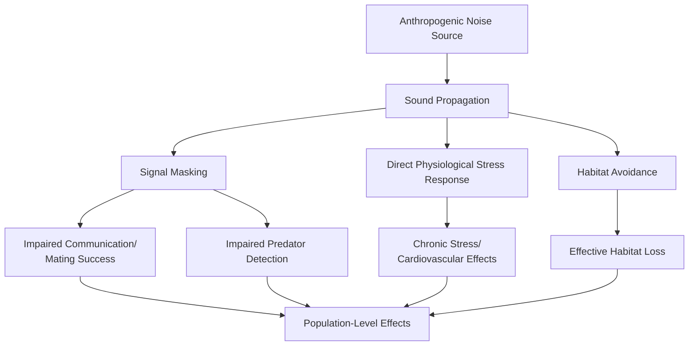
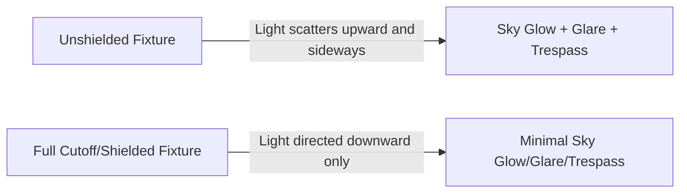

## Noise and Light Pollution

### Definition and Scope

Noise pollution and light pollution are both categorized as forms of "energy pollution" — anthropogenic emissions of sound or light energy at levels, timings, or spatial distributions that disrupt ecological processes, human health, or both. Unlike chemical pollutants, they do not persist as physical residues but exist only during the period of emission, making source control (rather than remediation) the primary and generally the only effective management approach.

### Part I: Noise Pollution

#### Physical Basis and Measurement

Sound intensity is measured on the decibel (dB) scale, a logarithmic unit reflecting the wide dynamic range of human hearing.

$$L_p = 20 \log_{10}\left(\frac{p}{p_0}\right) \text{ dB}$$

Where $p$ is the measured sound pressure and $p_0$ is the reference sound pressure (typically $20 \, \mu\text{Pa}$, the standard threshold of human hearing).

**Key Points**

- Because the decibel scale is logarithmic, a 10 dB increase represents a 10-fold increase in sound intensity (energy) but is perceived by the human ear as approximately a doubling of loudness — a common source of confusion, since linear-sounding differences (e.g., 70 dB vs. 80 dB) represent large underlying energy differences.
- The **A-weighted decibel (dBA)** scale adjusts raw sound pressure measurements to approximate human ear sensitivity across frequencies, and is the standard unit used in environmental noise regulation and occupational exposure limits.

#### Sources of Noise Pollution

**Transportation Noise** (typically the dominant contributor in urban environmental noise assessments):

- Road traffic (engine noise, tire-road interaction, aerodynamic noise at higher speeds)
- Aviation (aircraft takeoff/landing cycles, particularly affecting communities near flight paths)
- Rail (wheel-rail interaction, particularly at curves and worn track/wheel interfaces)

**Industrial and Construction Noise**: Machinery operation, pile driving, demolition — often characterized by high-intensity, intermittent noise events.

**Urban/Community Noise**: Commercial activity, entertainment venues, amplified sound systems.

**Underwater (Marine) Noise**: Shipping traffic, sonar systems, seismic surveys (used in offshore oil/gas exploration), pile driving for offshore wind infrastructure — an often-overlooked category with distinct and significant ecological consequences given how efficiently sound propagates through water relative to air.

#### Health Effects of Noise Pollution

**Auditory Effects**

- Noise-induced hearing loss (NIHL) from chronic exposure above occupational thresholds (commonly cited threshold around 85 dBA for extended exposure, consistent with OSHA and similar occupational standards)
- Tinnitus (perceived ringing/buzzing) associated with cumulative noise exposure

**Non-Auditory (Extra-Auditory) Effects**

- **Sleep disturbance**: Nighttime noise exposure is associated with fragmented sleep architecture, even at levels below conscious waking thresholds, since the auditory system remains partially responsive during sleep
- **Cardiovascular effects**: Chronic environmental noise exposure (particularly nighttime traffic and aircraft noise) has been associated in epidemiological research with elevated risk of hypertension and cardiovascular disease, hypothesized to operate through chronic stress-response pathway activation (elevated cortisol, sympathetic nervous system activation) [Inference — the epidemiological association is documented across multiple studies including WHO-commissioned reviews; the precise causal mechanism and dose-response relationship continue to be refined in ongoing research]
- **Cognitive effects**: Chronic noise exposure in children, particularly near airports and major roadways, has been associated with impaired reading comprehension and memory task performance in some epidemiological studies [Inference — documented association in specific study contexts; generalizability and causal mechanism remain areas of ongoing research]
- **Annoyance and psychological stress**: A well-documented, self-reported outcome used as a standard metric in noise impact assessment, distinct from but related to the physiological effects above

#### Ecological Effects of Noise Pollution

**Terrestrial Wildlife**

- Masking of communication signals (birdsong, mating calls) by anthropogenic noise, potentially forcing species to alter vocalization frequency, timing, or amplitude (the "Lombard effect" — organisms increasing vocal effort in noisy environments)
- Altered predator-avoidance behavior, since many species rely on acoustic cues to detect approaching threats
- Habitat avoidance near persistent noise sources (roads, industrial sites), effectively reducing usable habitat area even where physical habitat quality is otherwise suitable

**Marine Wildlife**

- Marine mammals (particularly cetaceans) rely heavily on echolocation and acoustic communication; anthropogenic underwater noise can mask communication, disrupt echolocation-based navigation and foraging, and in cases of high-intensity noise sources (naval sonar, seismic airguns), has been associated with stranding events and physiological injury in some documented cases [Inference — the general disruption mechanisms are well-established in marine bioacoustics literature; specific causal attribution in individual stranding events remains an area of case-by-case scientific investigation and is sometimes contested]
- Sound propagates significantly farther and faster in water than in air, meaning underwater noise sources can affect marine organisms across substantially larger spatial ranges than equivalent terrestrial noise sources

#### Noise Regulation and Management

**Regulatory Frameworks**

- WHO Environmental Noise Guidelines provide evidence-based recommended exposure thresholds for different noise sources (road, rail, aircraft, wind turbine noise) based on health outcome evidence
- Occupational exposure standards (e.g., OSHA in the US) regulate workplace noise exposure with time-weighted average limits
- Local/municipal noise ordinances typically regulate by zoning (residential vs. industrial), time of day (day/night differential limits), and source type

**Engineering and Design Mitigation**

- **Noise barriers**: Physical walls/berms along highways and rail lines that block direct line-of-sight sound transmission
- **Source-level engineering controls**: Quieter engine/tire technology, vibration damping, enclosure of noisy machinery
- **Land-use planning**: Buffer zones and setback distances between noise-generating infrastructure and sensitive receptors (residences, schools, hospitals)
- **Quiet pavement technology**: Porous or specially formulated road surfacing that reduces tire-road interaction noise

$$L_{p,\text{receiver}} = L_{p,\text{source}} - 20\log_{10}(r) - \alpha r$$

A simplified representation of sound attenuation with distance $r$ from a point source in free field conditions (inverse-square law), with $\alpha$ representing atmospheric/environmental absorption losses — actual attenuation in real environments is more complex due to reflection, diffraction, and ground effects. [Inference — this is a standard simplified acoustic propagation model used in introductory environmental acoustics; real-world propagation involves additional factors not captured in this simplified form]

### Part II: Light Pollution

#### Definition and Categories

Light pollution refers to excessive, misdirected, or obtrusive artificial light that alters natural light conditions, categorized into several recognized subtypes:

- **Sky glow**: Diffuse brightening of the night sky over inhabited areas, caused by light scattering off atmospheric particles and gases
- **Glare**: Excessive brightness causing visual discomfort or reduced visibility (distinct from general illumination)
- **Light trespass**: Unwanted light spilling into areas where it is not needed or wanted (e.g., streetlight illuminating a neighboring bedroom window)
- **Clutter**: Excessive grouping of light sources creating visual confusion, particularly relevant in dense urban commercial districts

#### Sources

- Outdoor lighting (street lighting, security lighting, commercial signage)
- Building illumination (architectural and decorative lighting)
- Vehicle lighting
- Agricultural and greenhouse lighting (increasingly relevant with supplemental horticultural lighting)

#### Ecological Effects

**Disruption of Circadian and Seasonal Cues**

Many organisms rely on natural light-dark cycles to regulate circadian rhythms, seasonal behavior (migration timing, reproduction), and physiological processes. Artificial light at night (ALAN) can disrupt these cues across a wide range of taxa.

**Documented Taxon-Specific Effects:**

- **Sea turtle hatchlings**: Naturally orient toward the brighter horizon (historically the reflection of moon/starlight on open ocean) to find their way to the sea after hatching; artificial coastal lighting can cause disorientation, drawing hatchlings inland toward roads and development instead of the ocean, a well-documented and specific mechanism in conservation literature
- **Migratory birds**: Many species navigate using celestial cues during nocturnal migration; artificial light (particularly from illuminated tall buildings and communication towers) can attract and disorient migrating birds, contributing to fatal collisions — a phenomenon well-documented in urban bird-collision monitoring programs
- **Insects**: Nocturnal insects exhibit well-documented positive phototaxis (attraction) to artificial light sources, disrupting normal foraging, mating, and predator-avoidance behavior; cumulative population-level effects on insect communities from widespread ALAN are an active area of ecological research [Inference — individual attraction behavior is extremely well-documented; population/community-level cumulative impact quantification is a more recent and still-developing area of research]
- **Plants**: Artificial light can disrupt photoperiod-dependent processes such as bud break timing and leaf senescence in trees near persistent light sources

#### Human Health Effects

**Circadian Rhythm Disruption**

Exposure to artificial light at night, particularly blue-wavelength-rich light, suppresses melatonin production (a hormone regulating sleep-wake cycles), with downstream associations to sleep quality disruption documented in sleep science literature.

**Associated Health Research**

Epidemiological research has explored associations between chronic nighttime light exposure (including outdoor light pollution affecting bedroom environments) and metabolic and other health outcomes; this remains an active research area with associations reported in some studies, while causal mechanisms and the relative contribution of outdoor light pollution specifically (versus screen use and indoor lighting) continue to be investigated. [Unverified — treat specific disease-association claims as preliminary and consult current epidemiological literature rather than treating as established causation]

#### Astronomical Impact

Sky glow significantly reduces the visibility of stars and astronomical phenomena, with measurable impact on both professional astronomical research (necessitating remote observatory siting in dark-sky locations) and amateur/public stargazing access — the latter increasingly discussed as a matter of equitable access to a historically universal human experience of the night sky, given that a large and growing proportion of the global population now lives under artificially brightened night skies. [Inference — the general trend of increasing sky glow extent is well-documented via satellite-based light pollution mapping; specific population percentage figures vary by source and year and should be verified against current data if cited precisely]

#### Measurement Tools

- **Bortle scale**: A standardized 9-level scale (1 = pristine dark sky, 9 = inner-city sky) used by astronomers to qualitatively characterize night sky darkness at a given location based on visual criteria (naked-eye star visibility, Milky Way visibility, sky glow intensity)
- **Sky Quality Meter (SQM)**: A handheld instrument providing quantitative sky brightness measurement in magnitudes per square arcsecond
- **Satellite-based light pollution mapping**: Uses nighttime satellite imagery (e.g., VIIRS Day/Night Band data) to map artificial light emission at regional to global scale, enabling trend analysis over time

#### Mitigation Strategies

**Fixture Design (Full Cutoff/Dark-Sky Compliant Fixtures)**

Directs light downward toward the intended illumination target, minimizing both upward light emission (a direct contributor to sky glow) and horizontal glare.

**Spectral Considerations**

Warmer color temperature lighting (lower correlated color temperature, amber/warm-white spectrum) scatters less in the atmosphere and is associated with reduced ecological disruption compared to cooler, blue-wavelength-rich lighting (common in some LED streetlight installations), since blue wavelengths scatter more efficiently in the atmosphere (contributing more to sky glow) and more strongly suppress melatonin production and disrupt circadian-cued wildlife behavior. [Inference — the physical scattering mechanism (Rayleigh scattering favoring shorter wavelengths) and the melatonin-suppression spectral sensitivity are both well-established; the overall framing that warm-spectrum lighting is generally preferable for minimizing ecological/sky glow impact reflects current lighting design and dark-sky advocacy guidance]

**Operational Controls**

- Motion-activated or timed lighting (illumination only when needed rather than continuous operation)
- Dimming schedules during low-activity nighttime hours
- Reduced overall lighting intensity to the minimum level meeting safety/functional requirements

**Policy and Designation Frameworks**

- Dark Sky Places programs (e.g., International Dark-Sky Association certifications) designate and support communities, parks, and reserves committed to dark-sky-compliant lighting practices
- Municipal outdoor lighting ordinances specifying maximum fixture output, required shielding, and curfew/dimming requirements

**Key Points**

- Light pollution mitigation is notable among pollution categories for being almost immediately reversible upon source correction — unlike persistent chemical or plastic pollution, turning off or properly shielding a light source eliminates the associated impact essentially instantaneously, making it one of the more tractable pollution categories from a pure engineering-intervention standpoint, even though political, economic, and safety-perception barriers to implementation remain significant in practice.

### Comparative Summary: Noise vs. Light Pollution

| Dimension | Noise Pollution | Light Pollution |
| --- | --- | --- |
| Primary measurement unit | Decibel (dBA) | Lux, magnitude/arcsec², Bortle scale |
| Persistence | None beyond emission period | None beyond emission period |
| Primary human health concern | Hearing loss, sleep disruption, cardiovascular stress | Circadian disruption, sleep quality |
| Primary ecological concern | Communication masking, habitat avoidance | Circadian/seasonal cue disruption, disorientation |
| Key mitigation approach | Source reduction, barriers, land-use buffers | Shielding, spectral tuning, operational timing |
| Reversibility upon source correction | Immediate | Immediate |

**Conclusion**

Noise and light pollution occupy a distinct category within pollution and waste management: both are forms of energy emission rather than persistent material waste, meaning neither accumulates in the environment in the way chemical contaminants or plastic debris do — impact exists only during active emission, and both are, in principle, fully reversible through source-level engineering and policy controls. This makes them comparatively tractable from an engineering standpoint relative to persistent pollutants, yet both remain significantly under-addressed in many regulatory frameworks relative to their documented health and ecological impacts, in part because their effects are often diffuse, cumulative, and less visually or viscerally apparent than solid waste or chemical contamination.

**Related Topics**

- WHO Environmental Noise Guidelines and health-based exposure thresholds
- Marine bioacoustics and underwater noise regulation for offshore energy development
- Circadian biology and melatonin suppression mechanisms
- Dark Sky Place certification and municipal lighting ordinances
- Urban land-use planning and buffer zone design
- Bird-building collision mitigation and migratory corridor lighting policy
- Environmental Impact Assessment (EIA) methodology for infrastructure noise/light modeling