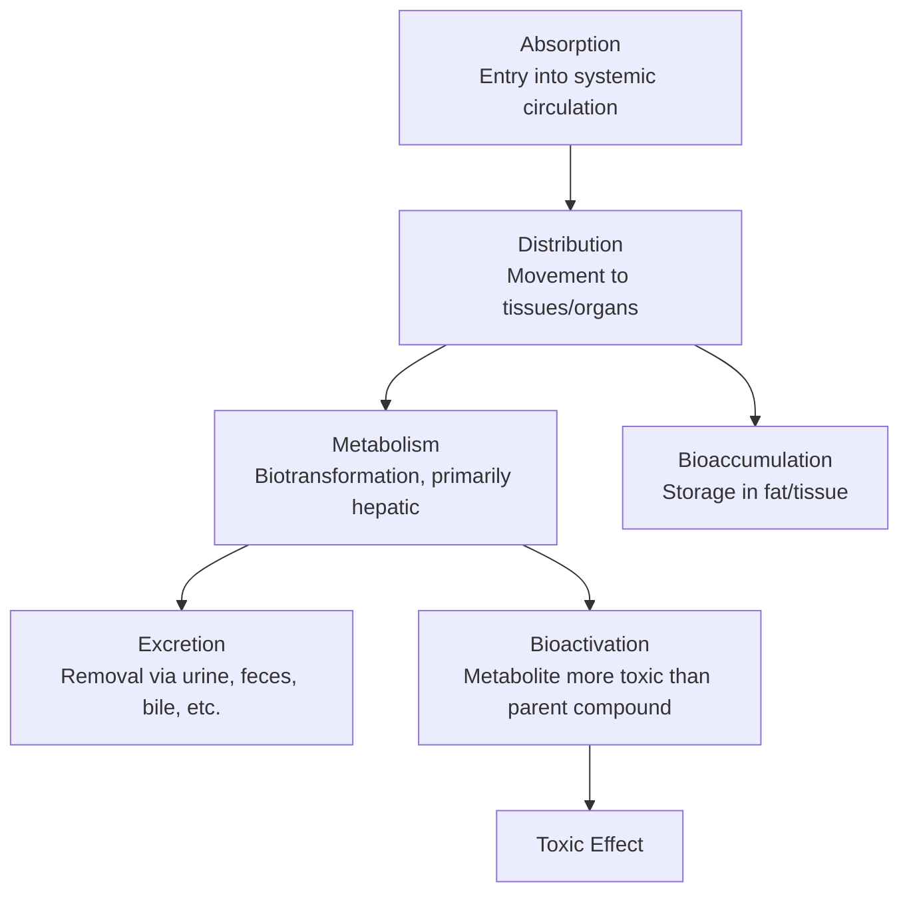
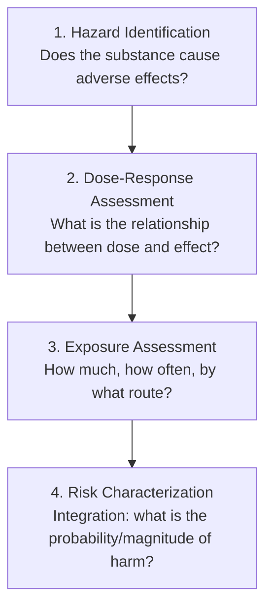

## Principles of Environmental Toxicology

### Definition and Scope

Environmental toxicology is the scientific discipline studying the effects of chemical, physical, and biological agents on living organisms, particularly focusing on adverse effects at the population, community, and ecosystem levels arising from environmental exposure to xenobiotics (substances foreign to a biological system). It integrates principles from pharmacology, ecology, chemistry, and epidemiology to characterize the relationship between exposure and biological effect.

### Foundational Principle: The Dose-Response Relationship

The central organizing principle of toxicology, often summarized by the Paracelsus dictum: "the dose makes the poison" — meaning virtually any substance can be toxic at sufficiently high exposure, and conversely, toxicity is fundamentally a function of exposure magnitude rather than an inherent, exposure-independent property of a substance.

$$\text{Response} = f(\text{Dose}, \text{Duration}, \text{Route}, \text{Organism susceptibility})$$

**Standard Dose-Response Curve Characteristics**

A typical dose-response curve is sigmoidal (S-shaped) when dose is plotted on a logarithmic scale, reflecting:

- A threshold or low-dose region with minimal observable effect
- A steep, roughly linear-appearing mid-region reflecting the range of individual variation in sensitivity within a population
- A plateau at high doses as the maximal biological response is reached

#### Key Dose-Response Metrics

- **LD50 (Lethal Dose, 50%)**: The dose at which 50% of a test population dies; a standard acute toxicity benchmark, lower LD50 indicating higher acute toxicity
- **LC50 (Lethal Concentration, 50%)**: Analogous metric for inhalation or aquatic exposure, expressed as environmental concentration rather than administered dose
- **NOAEL (No Observed Adverse Effect Level)**: The highest tested dose at which no statistically or biologically significant adverse effect is observed relative to controls
- **LOAEL (Lowest Observed Adverse Effect Level)**: The lowest tested dose at which an adverse effect is observed
- **EC50 (Effective Concentration, 50%)**: The concentration producing a defined sublethal effect (e.g., immobilization, growth inhibition) in 50% of test organisms, commonly used in aquatic toxicology

$$\text{Margin of Safety (MOS)} = \frac{\text{NOAEL}}{\text{Estimated Human Exposure}}$$

**Key Points**

- Regulatory reference doses (e.g., EPA Reference Dose, RfD) are typically derived by dividing the NOAEL (or a benchmark dose derived via statistical modeling) by uncertainty factors (commonly factors of 10 each for interspecies extrapolation, intraspecies variability, and sometimes additional factors for database incompleteness or use of a LOAEL instead of NOAEL), producing an exposure level considered protective with a substantial built-in safety margin.

#### Linear vs. Threshold Dose-Response Models

Toxicological dose-response modeling diverges based on mechanism, particularly relevant for regulatory risk assessment:

- **Threshold model**: Assumes a dose exists below which no adverse effect occurs, generally applied to non-carcinogenic (systemic) toxicants, reflecting the body's capacity for repair, detoxification, and homeostatic compensation at low exposure levels
- **Linear non-threshold (LNT) model**: Assumes any exposure carries some non-zero risk proportional to dose, with no safe threshold; conventionally applied to genotoxic carcinogens and ionizing radiation in regulatory risk assessment, based on the premise that a single molecular interaction (e.g., DNA mutation) can theoretically initiate a carcinogenic process

**Key Points**

- The LNT model's application, particularly to low-dose ionizing radiation risk assessment, remains a genuinely debated topic within radiation science and toxicology, with some researchers arguing for threshold or even hormetic (beneficial low-dose) responses at very low exposures; this is an actual, ongoing scientific and regulatory policy debate, not merely a settled textbook fact. [Unverified — reflects an acknowledged area of scientific debate rather than consensus; framing should not present LNT as either fully validated or fully discredited]

### Routes of Exposure

- **Ingestion**: Oral intake via food, water, or incidental soil/dust consumption; primary route for many persistent organic pollutants that bioaccumulate in food chains
- **Inhalation**: Respiratory uptake of gases, vapors, or particulate matter; efficiency of uptake depends heavily on particle size (finer particles penetrate deeper into the respiratory tract, with PM2.5 reaching alveolar regions)
- **Dermal (Percutaneous) Absorption**: Uptake through skin contact, generally less efficient than inhalation or ingestion for most substances but a significant route for certain lipophilic compounds and occupational exposures
- **Injection/Direct Introduction**: Less relevant environmentally but relevant in specific contexts (e.g., injection drug use in toxicology, though this falls more within clinical/forensic toxicology)

### Toxicokinetics: ADME Framework

The ADME framework describes the quantitative processes governing a substance's movement through and clearance from an organism:

- **Absorption**: Governed by chemical properties (lipophilicity, molecular size, ionization state) and exposure route
- **Distribution**: Determined by blood flow, tissue affinity (e.g., lipophilic compounds partition into adipose tissue), and ability to cross biological barriers (e.g., blood-brain barrier, placental barrier)
- **Metabolism (Biotransformation)**: Primarily hepatic, via Phase I reactions (oxidation, reduction, hydrolysis — often mediated by cytochrome P450 enzymes) and Phase II reactions (conjugation with glucuronide, sulfate, or glutathione, generally increasing water solubility for excretion)
- **Excretion**: Primarily renal (urine) or hepatobiliary (bile → feces), with additional minor routes (exhalation for volatile compounds, lactation for certain lipophilic persistent compounds)

**Key Points**

- Metabolism can be a double-edged process: while typically detoxifying (reducing toxicity and increasing excretability), some compounds undergo **bioactivation**, where a metabolite is more toxic than the parent compound — a well-established phenomenon in toxicology (e.g., certain pesticide and industrial chemical metabolites), distinct from and sometimes counterintuitive relative to the general assumption that metabolism always reduces toxicity.

### Bioaccumulation and Biomagnification

**Bioaccumulation**: The accumulation of a substance within an organism at a rate exceeding its elimination rate, resulting in tissue concentration exceeding ambient environmental concentration over time. Strongly favored by high lipophilicity (fat-solubility, commonly indexed by octanol-water partition coefficient, $K_{ow}$) and resistance to metabolic breakdown (persistence).

**Biomagnification**: The progressive increase in tissue concentration of a substance at successively higher trophic levels within a food web, since predators consume and retain accumulated body burden from multiple prey organisms over time.

$$\text{Biomagnification Factor (BMF)} = \frac{\text{Concentration in predator}}{\text{Concentration in prey}}$$

$$\log K_{ow} > 3 \text{ is commonly used as an approximate screening threshold suggesting bioaccumulation potential in regulatory chemical assessment frameworks}$$

**Classic Example**: DDT and its metabolite DDE biomagnify through aquatic food webs (phytoplankton → zooplankton → small fish → large fish → fish-eating birds), historically causing eggshell thinning in raptors (notably bald eagles and peregrine falcons) via interference with calcium metabolism/eggshell gland function — a foundational case study in environmental toxicology, prominently documented in Rachel Carson's "Silent Spring" (1962) and subsequently confirmed and elaborated through extensive scientific research leading to DDT's restriction in many countries.

**Key Points**

- Not all bioaccumulative substances biomagnify significantly (biomagnification specifically requires the substance to be retained and transferred efficiently across trophic transfers, not merely accumulated within a single organism), making these two related but technically distinct concepts that are sometimes conflated in less precise usage.

### Types of Toxicity Classification

**By Exposure Duration:**

- **Acute toxicity**: Effects from a single or short-term (typically <24 hour) high-dose exposure
- **Subacute/Subchronic toxicity**: Repeated exposure over an intermediate period (weeks to approximately 3 months in standard testing protocols)
- **Chronic toxicity**: Effects from prolonged, typically lower-dose exposure over an extended period (often a significant fraction of the organism's lifespan in test protocols)

**By Effect Mechanism/Target:**

- **Neurotoxicity**: Adverse effects on nervous system structure or function (e.g., organophosphate pesticides inhibiting acetylcholinesterase)
- **Carcinogenicity**: Induction of cancer, mechanistically subdivided into genotoxic (direct DNA damage) and non-genotoxic/epigenetic mechanisms
- **Mutagenicity**: Induction of heritable genetic mutations
- **Teratogenicity**: Induction of developmental malformations in an embryo/fetus following exposure during critical developmental windows (a well-established principle being that susceptibility is highly dependent on the specific timing of exposure relative to organ system development)
- **Endocrine Disruption**: Interference with hormone synthesis, signaling, or metabolism, notably including effects that may not follow classic monotonic dose-response patterns (some endocrine-disrupting compounds have been reported to show non-monotonic dose-response relationships, where effects at low doses differ qualitatively from effects at high doses, which is an active and somewhat contested area within toxicology given its departure from classical dose-response assumptions) [Unverified — non-monotonic dose-response for endocrine disruptors is a documented but scientifically debated phenomenon; treat as an area of ongoing scientific discussion rather than settled consensus]
- **Immunotoxicity**: Adverse effects on immune system function, potentially increasing susceptibility to infection or altering autoimmune/hypersensitivity responses
- **Reproductive Toxicity**: Adverse effects on reproductive function or fertility

### Ecotoxicology-Specific Concepts

**Species Sensitivity Distribution (SSD)**

A statistical approach used in ecological risk assessment that models the variation in toxicological sensitivity across multiple species to derive a concentration protective of a specified percentage of species in a community (e.g., HC5, the Hazardous Concentration protective of 95% of tested species), acknowledging that different species can vary substantially in sensitivity to the same substance.

**Indicator/Sentinel Species**

Certain organisms are used as biomonitoring tools due to their sensitivity to specific contaminants or their position in the food web (e.g., lichens for air quality monitoring due to sensitivity to sulfur dioxide, bivalves for aquatic heavy metal monitoring due to their filter-feeding physiology and tendency to bioaccumulate metals).

**Community and Ecosystem-Level Endpoints**

Ecotoxicology extends beyond individual organism effects to consider population-level (abundance, reproduction rate), community-level (species diversity, composition shifts), and ecosystem-level (nutrient cycling, primary productivity) endpoints, recognizing that effects observable only at higher levels of biological organization may not be predictable from individual-organism toxicity testing alone.

### Risk Assessment Framework

Standard environmental risk assessment (following frameworks such as the US EPA's four-step process) integrates toxicological dose-response data with exposure assessment:

$$\text{Risk} = \text{Hazard (toxicity)} \times \text{Exposure}$$

A simplified conceptual relationship illustrating the foundational risk assessment principle that risk requires both an inherently hazardous substance AND a pathway/magnitude of exposure — a highly hazardous substance with no exposure pathway poses negligible realized risk, while a substance of lower inherent hazard but very high or persistent exposure can pose substantial cumulative risk. [Inference — this is a standard conceptual/pedagogical framing used broadly in risk assessment education; actual regulatory risk characterization involves more complex quantitative and probabilistic methods beyond this simplified multiplicative representation]

**Key Points**

- This framework explains why toxicology and exposure science are treated as equally essential, complementary disciplines within environmental risk assessment — a substance's inherent toxicological hazard alone is insufficient to characterize real-world risk without corresponding exposure data.

### Toxicity Testing Approaches

**In Vivo Testing**: Whole-organism testing (traditionally including standardized rodent studies for mammalian toxicology, and standardized model organisms such as Daphnia, zebrafish, or algae for aquatic ecotoxicology), providing whole-system physiological context but raising ethical, cost, and time considerations.

**In Vitro Testing**: Cell culture-based assays testing specific mechanistic endpoints (e.g., cytotoxicity, genotoxicity, receptor-binding assays), offering higher throughput and reduced animal use, though results require careful extrapolation to predict whole-organism effects.

**In Silico/Computational Approaches**: Quantitative structure-activity relationship (QSAR) models predict toxicity based on chemical structure, increasingly used for prioritization and screening, particularly for the large number of chemicals lacking traditional toxicity testing data. [Inference — QSAR is an established and actively used regulatory screening tool, though its predictive reliability varies by chemical class and specific toxicological endpoint being modeled]

**Key Points**

- There is a well-documented, ongoing regulatory and scientific shift toward reducing reliance on traditional in vivo testing in favor of in vitro and in silico approaches (reflected in frameworks such as the US EPA's stated goals to reduce mammalian testing), driven by both ethical considerations and the practical need to screen the very large number of chemicals in commerce that currently lack comprehensive traditional toxicity data. [Inference — this policy direction is documented in regulatory strategy statements; the pace and specific implementation timeline of this transition is an evolving regulatory matter]

### Factors Modifying Toxicological Response

- **Species differences**: Interspecies variation in metabolic enzyme profiles, physiology, and target site sensitivity, necessitating uncertainty factors when extrapolating animal data to humans
- **Age**: Developing organisms (fetuses, infants, children) are frequently more sensitive to certain toxicants due to immature detoxification systems, higher relative exposure (e.g., higher food/water/air intake per unit body weight), and ongoing developmental processes vulnerable to disruption
- **Genetic polymorphism**: Individual genetic variation in metabolic enzymes (e.g., cytochrome P450 variants) can significantly affect individual susceptibility to specific toxicants
- **Nutritional status**: Can affect metabolic capacity and detoxification pathway function
- **Co-exposure/Mixture effects**: Simultaneous exposure to multiple substances can produce additive, synergistic (greater than additive), or antagonistic (less than additive) effects relative to single-substance exposure predictions — a significant real-world complexity given that environmental exposures rarely occur as single, isolated substances

**Key Points**

- Mixture toxicity and cumulative risk assessment represent a persistent methodological challenge in environmental toxicology, since most regulatory toxicity data is generated for single substances in controlled testing, while real-world environmental exposure typically involves complex mixtures whose combined effects are not always predictable from single-substance data alone. This is a genuine, actively researched limitation of current risk assessment practice.

### Conclusion

Environmental toxicology provides the scientific foundation connecting chemical/physical environmental hazards to measurable biological outcomes, structured around the core principle that toxicity is a quantitative, dose-dependent phenomenon rather than a binary property of a substance. Its core frameworks — dose-response relationships, toxicokinetics (ADME), bioaccumulation/biomagnification dynamics, and integrated risk assessment — provide the mechanistic and quantitative basis underlying environmental regulation, from setting safe exposure limits to classifying and restricting hazardous substances. Persistent challenges in the field, including mixture toxicity, non-monotonic dose-response for certain endocrine disruptors, and the ongoing transition toward alternative (non-animal) testing methods, remain active areas of scientific and regulatory development rather than fully settled science, underscoring that toxicological risk assessment is a continuously evolving discipline rather than a fixed body of static reference values.

**Related Topics**

- Persistent Organic Pollutants (POPs) and the Stockholm Convention
- Endocrine-disrupting chemicals and non-monotonic dose-response
- Heavy metal toxicology (lead, mercury, cadmium, arsenic)
- Ecological Risk Assessment methodology and Species Sensitivity Distributions
- Air Quality and Particulate Matter Health Effects
- Water Quality Standards and Contaminant Regulation
- Occupational and Industrial Toxicology
- Plastics Pollution and Microplastics (toxicological dimension)