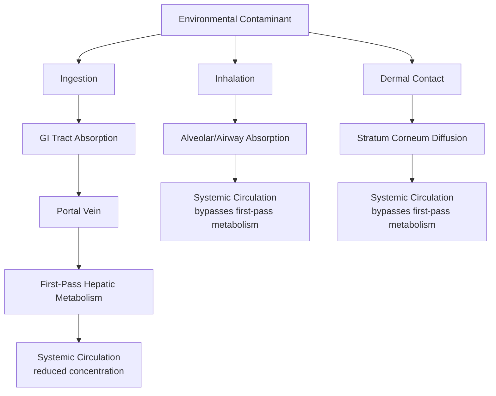
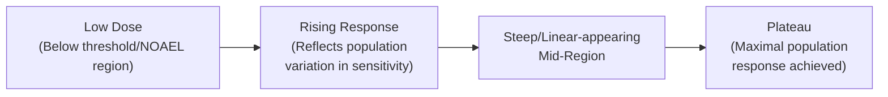
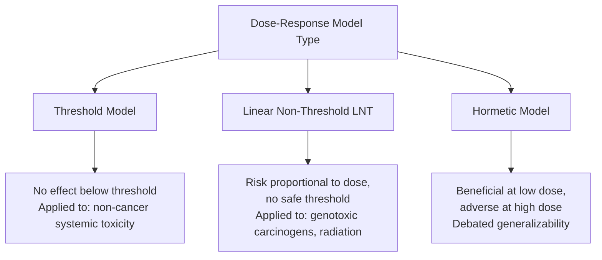

## Routes of Exposure and Dose Response Relationships

### Definition and Purpose

Exposure route and dose-response analysis together form the quantitative core of exposure science, describing (1) the pathway by which a xenobiotic substance enters an organism, and (2) the mathematical/biological relationship between the magnitude of that exposure and the resulting biological effect. These two elements are combined in risk assessment to characterize the probability and severity of adverse outcomes from real-world environmental exposures.

### Routes of Exposure: Detailed Mechanisms

#### Ingestion (Oral Route)

**Mechanism**: Substances enter via the gastrointestinal tract through contaminated food, water, or incidental soil/dust/hand-to-mouth transfer.

**Absorption Determinants**:

- Gastric pH and residence time affect ionization state and dissolution of the substance
- Intestinal absorption is favored by lipophilicity (passive diffusion across intestinal epithelium) for many organic compounds
- First-pass hepatic metabolism: substances absorbed from the GI tract travel via the portal vein directly to the liver before reaching systemic circulation, meaning a substantial fraction of some compounds is metabolized before ever reaching general circulation — a toxicokinetically significant feature distinguishing oral exposure from inhalation or dermal routes

**Key Environmental Contexts**: Drinking water contamination, food chain bioaccumulation (particularly relevant for lipophilic, persistent organic pollutants such as PCBs and organochlorine pesticides), soil ingestion (particularly significant in young children due to hand-to-mouth behavior, a recognized elevated-exposure pathway in pediatric risk assessment).

#### Inhalation (Respiratory Route)

**Mechanism**: Gases, vapors, and particulate matter enter via the respiratory tract.

**Absorption Determinants**:

- **Particle size** is the dominant factor for particulate matter deposition location:
  - Coarse particles (>10 μm) are largely filtered in the upper respiratory tract (nasal passages, pharynx)
  - PM10 (≤10 μm) can penetrate into the tracheobronchial region
  - PM2.5 (≤2.5 μm) can reach the alveolar (deep lung) region
  - Ultrafine particles (<0.1 μm / 100 nm) can potentially translocate across the alveolar-capillary membrane into systemic circulation, an area of particular research interest given nanoparticle and combustion-derived ultrafine particle exposure
- **Gas/vapor solubility**: Highly water-soluble gases (e.g., ammonia, sulfur dioxide) tend to be absorbed rapidly in the upper respiratory tract, while less soluble gases can penetrate to deeper lung regions
- **Direct systemic access**: Inhaled substances that cross the alveolar membrane enter systemic circulation directly, bypassing first-pass hepatic metabolism (unlike the oral route) — a toxicokinetically important distinction that can result in higher effective systemic dose per unit absorbed compared to an equivalent oral exposure for some compounds

$$\text{Deposition fraction} = f(\text{particle diameter, breathing rate, airway geometry})$$

#### Dermal (Percutaneous) Absorption

**Mechanism**: Substances cross the skin barrier, primarily via passive diffusion through the stratum corneum (outermost skin layer).

**Absorption Determinants**:

- Lipophilicity (log $K_{ow}$) strongly influences dermal permeability, since the stratum corneum's lipid-rich structure favors passage of moderately lipophilic compounds
- Skin integrity (intact vs. damaged/abraded skin significantly alters permeability)
- Exposure duration and surface area of contact
- Anatomical site (skin thickness and permeability vary across body regions)

**Key Environmental Contexts**: Occupational exposure (pesticide application, industrial solvent handling), recreational water exposure (contaminated swimming water), consumer product exposure.

**Key Points**

- Dermal absorption is generally the least efficient of the three primary environmental exposure routes for most substances, but represents a toxicologically significant pathway for specific compound classes (notably lipophilic pesticides and certain industrial solvents) and specific occupational scenarios where it may be the dominant route despite lower per-unit-area efficiency.

#### Comparative Route Summary

### Dose-Response Relationships: Core Principles

#### The Fundamental Toxicological Axiom

Attributed to Paracelsus (16th century): "All things are poison, and nothing is without poison; only the dose permits something not to be poisonous" — commonly paraphrased as "the dose makes the poison." This establishes toxicity as a quantitative, exposure-dependent continuum rather than an inherent binary property of a substance.

#### Types of Dose

Precision in dose terminology is important in toxicology:

- **Administered/Applied dose**: The amount of substance to which an organism is exposed (e.g., concentration in food or water, environmental concentration)
- **Absorbed (internal) dose**: The amount that actually crosses a biological barrier and enters systemic circulation — typically less than the administered dose due to incomplete absorption
- **Delivered/Target organ dose**: The amount reaching the specific tissue or organ where the toxic effect occurs, accounting for distribution and metabolism
- **Biologically effective dose**: The amount that actually interacts with a critical molecular target (e.g., DNA adduct formation, receptor binding) to initiate the toxic mechanism

**Key Points**

- These distinctions matter significantly for risk assessment accuracy: two substances with identical administered/environmental concentrations can produce very different biological effects if they differ substantially in absorption efficiency, distribution pattern, or metabolic activation/deactivation — administered dose alone is often an imprecise proxy for actual biological risk.

#### The Dose-Response Curve

Standard dose-response relationships, when dose is plotted on a logarithmic x-axis against response (typically percentage of population affected) on the y-axis, characteristically form a sigmoidal curve.

$$\text{Response}(\%) = \frac{100}{1 + e^{-k(\log(D) - \log(D_{50}))}}$$

A generalized logistic (sigmoidal) function commonly used to model dose-response curves, where $D_{50}$ represents the dose producing a 50% response (e.g., LD50/EC50) and $k$ represents the curve's steepness (slope) parameter — steeper curves indicate a narrower dose range separating minimal from maximal population response. [Inference — this is a standard mathematical model form used in toxicological dose-response modeling (e.g., in probit/logit analysis); actual curve fitting in practice involves statistical methods (probit or logit regression) applied to empirical bioassay data rather than assuming this exact functional form universally]

#### Threshold vs. Non-Threshold Response Models

**Threshold Model**

Posits that below a certain dose, no adverse effect occurs because the organism's homeostatic, repair, and detoxification mechanisms fully compensate for the exposure. Generally applied to:

- Non-carcinogenic systemic toxicants (organ toxicity, most acute and chronic non-cancer endpoints)
- The basis for NOAEL/LOAEL-derived reference doses (RfDs) in regulatory risk assessment

**Linear Non-Threshold (LNT) Model**

Posits that risk is proportional to dose at all exposure levels, with no exposure level considered entirely without risk. Conventionally applied to:

- Genotoxic carcinogens (where a single DNA-damaging molecular interaction is theoretically sufficient to initiate a carcinogenic process)
- Ionizing radiation, in most conventional regulatory frameworks

**Hormesis**

A distinct, more contested dose-response pattern in which low doses of a substance produce a beneficial or stimulatory effect, while higher doses produce the expected adverse/inhibitory effect — a biphasic (U-shaped or inverted U-shaped) response curve. Hormesis is documented for certain specific substances and biological endpoints in the toxicological literature, but its generalizability, underlying mechanisms, and relevance to regulatory risk assessment (particularly regarding whether it should influence low-dose radiation or chemical risk policy) remain genuinely debated topics within the field. [Unverified — hormesis is a real, published phenomenon for specific documented cases, but its broader theoretical and regulatory significance is an active area of scientific disagreement, not settled consensus]

#### Regulatory Dose-Response Benchmarks

| Metric | Definition | Primary Application |
| --- | --- | --- |
| NOAEL | Highest dose with no observed adverse effect | Basis for RfD derivation (non-cancer) |
| LOAEL | Lowest dose with observed adverse effect | Used when NOAEL unavailable (with added uncertainty factor) |
| Benchmark Dose (BMD) | Dose associated with a predefined, statistically modeled response level (e.g., 10% response) | Increasingly preferred over NOAEL/LOAEL as it uses full dose-response curve data rather than a single tested dose point |
| LD50/LC50 | Dose/concentration lethal to 50% of test population | Acute toxicity classification and comparison |
| ED50/EC50 | Dose/concentration producing defined effect in 50% of population | General pharmacological/toxicological potency comparison |
| RfD (Reference Dose) | Estimated daily exposure without appreciable risk over a lifetime | Regulatory exposure limit setting (non-cancer) |
| Slope Factor / Cancer Potency Factor | Quantifies increased cancer risk per unit dose | Regulatory exposure limit setting (cancer, typically LNT-based) |

$$\text{RfD} = \frac{\text{NOAEL (or BMD)}}{\text{UF}_{\text{composite}}}$$

Where $\text{UF}_{\text{composite}}$ is the product of individual uncertainty factors (commonly factors of 10 for interspecies extrapolation, intraspecies variability, and additional factors as needed for database limitations, subchronic-to-chronic extrapolation, or LOAEL-to-NOAEL extrapolation), typically yielding a composite uncertainty factor that can range from 10 to 3,000 or more depending on data quality and completeness. [Inference — the general uncertainty factor framework and typical individual factor values of 10 are standard and well-documented in EPA and similar regulatory risk assessment guidance; the specific composite range cited is illustrative of common practice rather than a fixed universal figure]

### Integration: Exposure Route Influences Dose-Response Interpretation

A critical principle connecting these two concepts is that dose-response relationships are route-specific — toxicity data derived from one exposure route cannot always be directly extrapolated to another without route-to-route extrapolation adjustments, because:

1. **Absorption efficiency differs by route** (e.g., a substance may be poorly absorbed orally but efficiently absorbed via inhalation, or vice versa)
2. **First-pass metabolism applies only to the oral route**, meaning identical absorbed doses via inhalation/dermal vs. oral routes can produce different systemic (target organ) doses
3. **Local (portal-of-entry) effects vs. systemic effects**: Some substances cause toxicity primarily at the site of entry (e.g., respiratory irritants causing local airway effects) rather than after systemic distribution, meaning the relevant "dose" metric for such substances is exposure concentration at the entry site rather than an absorbed systemic dose

**Key Points**

- Regulatory risk assessment frequently requires route-to-route extrapolation when toxicity data exists for one route (e.g., oral, from rodent feeding studies) but the exposure scenario of concern involves a different route (e.g., inhalation in an occupational or ambient air context); this extrapolation introduces additional uncertainty and is a recognized methodological challenge addressed through physiologically based pharmacokinetic (PBPK) modeling and toxicokinetic adjustment factors in more sophisticated risk assessments. [Inference — route-to-route extrapolation methodology and its associated uncertainty is well-documented in EPA and similar risk assessment guidance documents]

### Exposure Assessment: Combining Route and Dose for Risk Characterization

Real-world risk characterization requires integrating route-specific absorbed dose across all relevant exposure pathways for a given scenario:

$$\text{Aggregate Exposure} = \text{Dose}_{\text{ingestion}} + \text{Dose}_{\text{inhalation}} + \text{Dose}_{\text{dermal}}$$

This aggregate (multi-route) exposure assessment approach is standard practice in comprehensive human health risk assessment (e.g., for a contaminated site where a resident may be simultaneously exposed via contaminated groundwater ingestion, vapor intrusion inhalation, and soil dermal contact), since single-route assessment can substantially underestimate total risk in scenarios involving multiple concurrent exposure pathways.

**Example**

A child living near a site with soil lead contamination may experience aggregate lead exposure via: (1) incidental soil ingestion (hand-to-mouth behavior), (2) inhalation of resuspended contaminated dust, and (3) minor dermal contact — regulatory risk assessment models (such as the US EPA's Integrated Exposure Uptake Biokinetic model for lead) are specifically designed to aggregate these multiple pathways into a combined blood lead level prediction, since single-pathway assessment would substantially underestimate the child's total exposure and associated risk. [Unverified — specific model name/framework cited as an illustrative real-world example; verify against current EPA guidance if being used for a specific technical or regulatory application]

### Conclusion

Routes of exposure and dose-response relationships together form the quantitative backbone connecting environmental contamination to measurable biological harm. Exposure route determines not only how much of a substance enters the body (absorption efficiency) but fundamentally shapes the toxicokinetic fate of that substance — whether it undergoes first-pass hepatic metabolism, whether it produces local portal-of-entry effects versus systemic effects, and what internal target-organ dose ultimately results from a given environmental exposure level. Dose-response analysis then translates that internal dose into a probabilistic or quantitative measure of biological effect, using threshold models for most systemic toxicants and non-threshold (linear) models for genotoxic carcinogens as the standard regulatory default, while continuing to grapple with genuinely unresolved areas such as hormesis and non-monotonic responses at the frontier of current understanding. Sound environmental risk assessment requires precise attention to both dimensions simultaneously, since neither exposure route nor dose magnitude alone is sufficient to characterize real-world toxicological risk.

**Related Topics**

- Principles of Environmental Toxicology (foundational concepts)
- Physiologically Based Pharmacokinetic (PBPK) modeling
- Heavy metal toxicology and blood lead level risk models
- Ecological Risk Assessment and Species Sensitivity Distributions
- Air Quality and Particulate Matter Health Effects
- Regulatory toxicity testing frameworks (in vivo, in vitro, in silico approaches)
- Endocrine disruption and non-monotonic dose-response