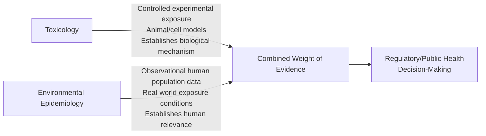
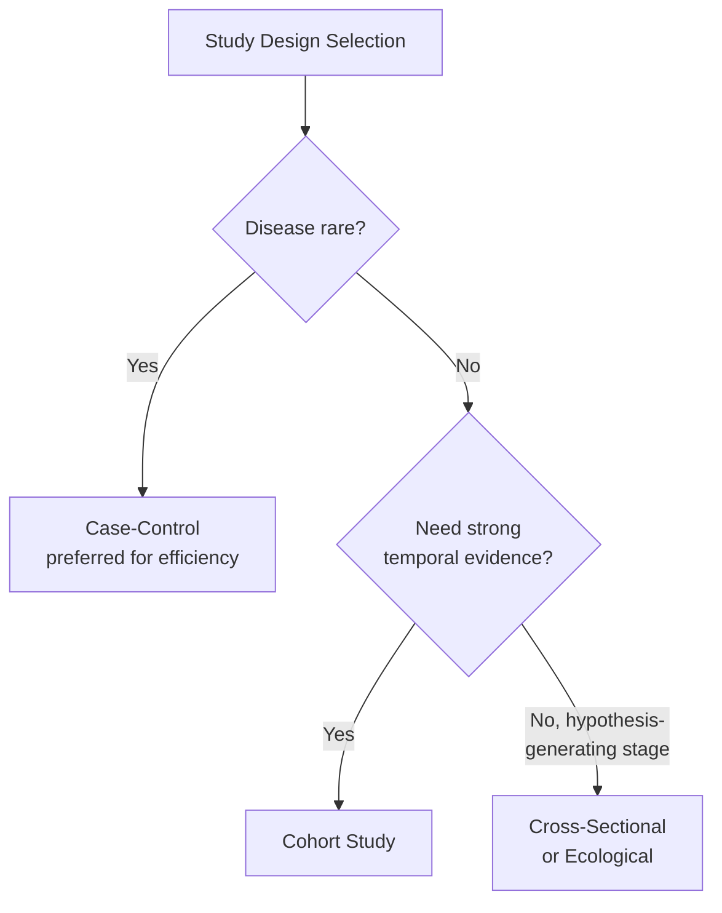
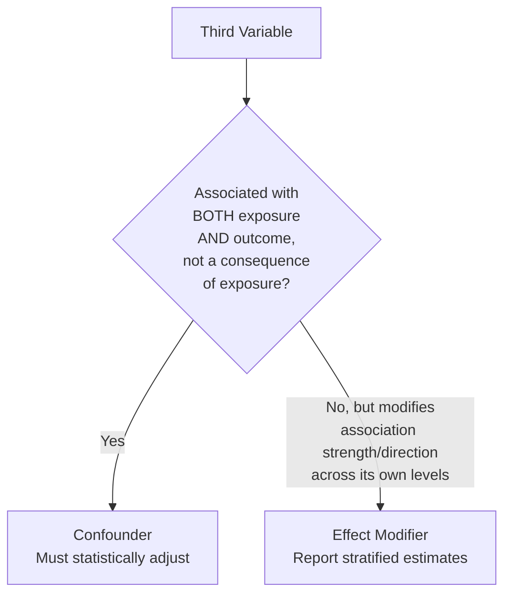

## Environmental Epidemiology

### Definition and Scope

Environmental epidemiology is the study of the distribution and determinants of health-related states or events in human populations as a function of environmental exposures — chemical, physical, and biological agents in air, water, soil, food, and the built environment. Unlike toxicology, which typically establishes exposure-effect relationships through controlled experimental studies (often in animal or cell models), environmental epidemiology observes exposure-outcome associations directly in human populations under real-world, uncontrolled conditions, making it the primary discipline for establishing human health evidence at the population level.

### Relationship to Toxicology

**Key Points**

- Toxicology and environmental epidemiology are complementary, not competing, disciplines: toxicology often provides plausible biological mechanism and dose-response data under controlled conditions, while epidemiology provides direct evidence of association (or its absence) in actual human populations, including exposure combinations, susceptibility factors, and real-world exposure patterns that controlled studies cannot fully replicate. Regulatory and public health conclusions are strongest when both lines of evidence converge (a principle formalized in causal inference frameworks such as the Bradford Hill criteria, discussed below).

### Core Study Designs

#### Ecological Studies

Compare exposure and outcome data aggregated at the population/group level (e.g., city, county, country) rather than at the individual level.

**Strengths**: Efficient use of existing aggregate data (e.g., regional air pollution monitoring data compared against regional disease registries); useful for generating hypotheses.

**Key Limitation — Ecological Fallacy**: Associations observed at the aggregate/group level do not necessarily hold at the individual level; an association between average pollution exposure and average disease rate across regions does not confirm that the specific individuals with higher personal exposure were the ones who developed disease. This is a well-recognized, fundamental methodological limitation of ecological study design.

#### Cross-Sectional Studies

Measure exposure and outcome simultaneously in a population at a single point in time.

**Strengths**: Relatively rapid and inexpensive to conduct; useful for estimating prevalence.

**Key Limitation**: Cannot establish temporal sequence (whether exposure preceded outcome), making causal inference substantially weaker than in designs with clear temporal separation between exposure measurement and outcome assessment.

#### Case-Control Studies

Compare exposure history between individuals with a health outcome of interest ("cases") and individuals without it ("controls"), working backward from outcome to exposure.

**Strengths**: Efficient for studying rare diseases (since cases are specifically recruited rather than awaited within a general cohort); relatively faster and less costly than prospective cohort studies.

**Key Limitations**:

- **Recall bias**: Cases (who have the disease) may recall or report past exposures differently than controls, particularly for exposures requiring self-report (occupational history, dietary recall, etc.)
- **Selection bias**: Challenges in selecting controls that are truly representative of the population from which cases arose

#### Cohort Studies

Follow a defined group of individuals (a cohort) over time, comparing outcome incidence between those with differing exposure levels, measured before outcome occurrence.

**Prospective cohort**: Exposure measured at baseline, cohort followed forward in time for outcome development.

**Retrospective cohort**: Uses historical exposure records for a cohort, with outcomes already having occurred by the time of study initiation, but exposure data predates outcome data (preserving temporal sequence).

**Strengths**: Establishes clear temporal sequence (exposure precedes outcome); can study multiple outcomes from a single exposure; avoids recall bias if exposure was measured prospectively/objectively.

**Key Limitations**: Resource-intensive and time-consuming (particularly prospective designs for diseases with long latency); loss to follow-up can introduce bias; generally less efficient for rare disease outcomes compared to case-control design.

#### Panel Studies

A specialized cohort design involving repeated measurements of exposure and often subclinical/physiological outcomes (e.g., lung function, heart rate variability) in the same individuals over relatively short time intervals, commonly used in air pollution epidemiology to link day-to-day exposure fluctuation to short-term physiological response.

#### Time-Series Studies

Analyze the association between day-to-day (or similar short-interval) fluctuations in an environmental exposure (commonly ambient air pollution) and day-to-day fluctuations in a population-level health outcome (commonly mortality or hospital admissions), using each time unit's population as its own comparison, which controls for time-invariant confounders (e.g., smoking prevalence, socioeconomic status) by design since these factors do not typically fluctuate meaningfully day-to-day within the same population. This design has been extensively used in air pollution epidemiology, notably in large multi-city studies establishing short-term mortality associations with particulate matter and other criteria pollutants.

### Measures of Association

$$\text{Relative Risk (RR)} = \frac{\text{Incidence in exposed group}}{\text{Incidence in unexposed group}}$$

$$\text{Odds Ratio (OR)} = \frac{\text{Odds of exposure in cases}}{\text{Odds of exposure in controls}}$$

$$\text{Attributable Risk} = \text{Incidence}_{\text{exposed}} - \text{Incidence}_{\text{unexposed}}$$

**Key Points**

- Relative Risk is the standard measure of association in cohort studies (where incidence can be directly calculated), while Odds Ratio is the standard measure in case-control studies (where true population incidence generally cannot be directly calculated due to the case-control sampling design) — the odds ratio approximates the relative risk reasonably well when the disease outcome is rare, a well-established statistical approximation (the "rare disease assumption") commonly invoked in interpreting case-control study results.
- Attributable risk (and population attributable risk, which further incorporates exposure prevalence in the population) is particularly useful for public health policy prioritization, since it quantifies the absolute disease burden attributable to a specific exposure, informing prioritization decisions distinct from relative risk magnitude alone.

### Exposure Assessment Methods in Epidemiology

**Personal Monitoring**: Individual-level exposure measurement devices (e.g., personal air samplers, biomarker sampling) — generally the most accurate approach but often impractical for large study populations due to cost and logistics.

**Ambient/Area Monitoring**: Fixed-site monitoring stations (e.g., regulatory air quality monitors) used as a proxy for individual exposure within a geographic area — practical for large populations but introduces exposure misclassification, since actual individual exposure varies based on time-activity patterns, indoor/outdoor time allocation, and microenvironmental variation not captured by a single area monitor.

**Modeled Exposure Estimates**: Statistical or physically-based models (e.g., land-use regression, dispersion modeling, satellite-derived estimates) that estimate exposure at finer spatial/temporal resolution than sparse monitoring networks allow, increasingly used in large-scale environmental epidemiology to reduce exposure misclassification relative to simple nearest-monitor assignment approaches.

**Biomarkers of Exposure**: Direct biological measurement of a substance or its metabolite in blood, urine, or other tissue, providing an integrated measure of actual absorbed dose across all exposure routes and sources, though typically reflecting only recent exposure for substances with short biological half-lives (limiting utility for characterizing chronic, long-term exposure history for some substances).

**Key Points**

- Exposure misclassification (the gap between estimated/assigned exposure and actual individual exposure) is one of the most significant and persistent methodological challenges in environmental epidemiology; non-differential misclassification (equally likely to occur regardless of outcome status) generally biases associations toward the null (i.e., tends to underestimate the true association), which is a widely recognized principle in epidemiological methodology, though this generalization has recognized exceptions in specific circumstances. [Inference — this is a standard, well-established epidemiological principle taught broadly in the field, though the specific direction and magnitude of bias from misclassification can depend on the particular exposure measurement error structure involved]

### Confounding and Bias

**Confounding**: A distortion of the true exposure-outcome association caused by a third variable that is associated with both the exposure and the outcome, but is not a consequence of the exposure. Classic environmental epidemiology example: socioeconomic status is often associated with both residential proximity to pollution sources (exposure) and access to healthcare/baseline health status (affecting outcome), requiring statistical adjustment to isolate the exposure's independent association with outcome.

**Effect Modification (Interaction)**: Distinct from confounding — occurs when the magnitude or direction of an exposure-outcome association genuinely differs across levels of a third variable (e.g., a pollutant's health effect may differ by age group or pre-existing respiratory disease status), representing a real biological or population phenomenon to be characterized and reported, rather than a bias to be statistically removed.

**Common Sources of Bias**:

- **Selection bias**: Systematic differences between those included in a study and the target population
- **Information bias**: Systematic error in exposure or outcome measurement (including recall bias and exposure misclassification, discussed above)
- **Publication bias**: Tendency for studies with statistically significant or "positive" findings to be more likely published than null-result studies, potentially skewing the overall published evidence base on a given exposure-outcome relationship

### Causal Inference: The Bradford Hill Considerations

Sir Austin Bradford Hill proposed a set of considerations (commonly termed "criteria," though Hill himself did not intend them as a rigid checklist) in 1965 to help evaluate whether an observed statistical association likely reflects a genuine causal relationship, still widely referenced in environmental epidemiology and regulatory causal determination:

1. **Strength of association**: Stronger associations (larger RR/OR) are less likely to be fully explained by unmeasured confounding or bias, though weak associations can still be causal
2. **Consistency**: Repeated observation of the association across different populations, study designs, and researchers strengthens causal inference
3. **Specificity**: An exposure associated with a specific outcome (rather than many disparate outcomes) somewhat strengthens causal plausibility, though this criterion is now considered less universally applicable given that many environmental exposures genuinely have multiple health effects
4. **Temporality**: Exposure must precede outcome — the only criterion considered by Hill and subsequent epidemiologists to be an absolute requirement for causation, rather than merely supportive evidence
5. **Biological gradient**: A dose-response relationship (increasing exposure associated with increasing effect) supports causality
6. **Plausibility**: Consistency with existing biological/mechanistic understanding (often supplied by toxicological evidence)
7. **Coherence**: Consistency between epidemiological findings and other lines of evidence (laboratory, toxicological, clinical)
8. **Experiment**: Where feasible (e.g., removal of an exposure leading to reduced disease incidence) provides stronger causal evidence
9. **Analogy**: Similarity to already-established causal relationships for structurally or mechanistically similar exposures

**Key Points**

- Temporality is the only one of Hill's considerations regarded as strictly necessary for causation; the remaining eight are supportive considerations that increase confidence in a causal interpretation but are not individually required, and Hill explicitly did not present them as a mechanical checklist to be scored — this nuance is frequently lost in simplified pedagogical presentations of the framework.

### Notable Historical and Foundational Case Studies

**London Smog Event (1952)**: A severe air pollution episode associated with a substantial spike in mortality over the following days/weeks, widely cited as a foundational event demonstrating acute health effects of severe air pollution and contributing to subsequent air quality legislation (UK Clean Air Act 1956).

**Minamata Disease**: Methylmercury poisoning in Minamata, Japan, resulting from industrial wastewater discharge contaminating fish consumed by the local population, establishing foundational understanding of methylmercury's neurotoxic effects and biomagnification through the aquatic food chain, and remaining a key reference case in both environmental toxicology and epidemiology curricula.

**Harvard Six Cities Study**: A prospective cohort study of adult mortality across six US cities with differing particulate air pollution levels, providing foundational evidence linking long-term fine particulate matter exposure to increased mortality risk, and influencing subsequent US ambient air quality standard-setting.

**Key Points**

- These historical cases are commonly used as pedagogical touchstones because they illustrate the full arc from acute observational signal to mechanistic confirmation to regulatory action, though specific quantitative details of each case (mortality figures, exact study parameters) should be verified against primary sources if cited precisely, since figures are sometimes imprecisely repeated across secondary/tertiary sources.

### Environmental Justice Dimension

Environmental epidemiology has increasingly documented and quantified disparities in environmental exposure burden across socioeconomic and demographic groups, a body of evidence foundational to the environmental justice framework — the observation that lower-income communities and communities of color frequently experience disproportionately higher exposure to environmental hazards (proximity to industrial facilities, major roadways, and other pollution sources), documented across numerous studies using geographic and demographic analysis methods. [Inference — the general pattern of disproportionate exposure burden documented across environmental justice literature is well-established across many specific studies and contexts; the magnitude and specific mechanisms vary by location and hazard type and should be evaluated on a case-specific basis rather than treated as a single universal quantitative finding]

### Systematic Review and Meta-Analysis in Environmental Epidemiology

Given that individual epidemiological studies vary in design, population, exposure assessment method, and statistical power, systematic reviews (structured, comprehensive literature synthesis following predefined methodology) and meta-analyses (statistical pooling of effect estimates across multiple studies) are commonly used to synthesize the overall body of evidence on a given exposure-outcome relationship, providing a more statistically powerful and generalizable estimate than any single study alone, and forming a key input to regulatory weight-of-evidence determinations (e.g., IARC carcinogen classifications, WHO air quality guideline derivation).

### Conclusion

Environmental epidemiology provides the essential human-population evidence base connecting environmental exposures to real-world health outcomes, complementing the mechanistic and dose-response foundations established by toxicology. Its core methodological toolkit — ecological, cross-sectional, case-control, cohort, and time-series study designs — each carries distinct strengths and inherent limitations regarding causal inference, exposure misclassification, and confounding control, meaning no single study design or study alone typically establishes definitive causation. The Bradford Hill considerations remain the field's standard (though explicitly non-mechanical) framework for evaluating whether an observed association reflects true causation, with temporality as the sole strict requirement. Given the inherent observational nature of human population data (as opposed to controlled experimentation), environmental epidemiology's conclusions are strongest and most policy-actionable when triangulated against toxicological mechanism, consistent replication across independent studies and populations, and systematic weight-of-evidence synthesis — a convergence-of-evidence approach reflected in major regulatory and public health causal determinations.

**Related Topics**

- Principles of Environmental Toxicology (mechanistic complement to epidemiological association)
- Routes of Exposure and Dose-Response Relationships (foundational exposure science concepts)
- Air Quality and Particulate Matter Health Effects
- Environmental Justice and disproportionate exposure burden
- Heavy Metal Toxicology (Minamata disease case study connection)
- Risk Assessment and Regulatory Standard-Setting
- Biostatistics methods for epidemiological study design